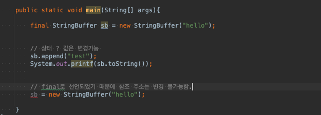
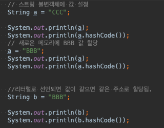
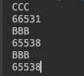
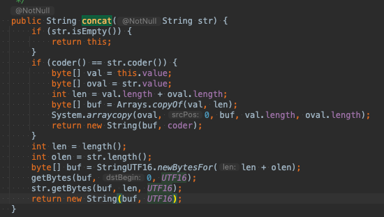
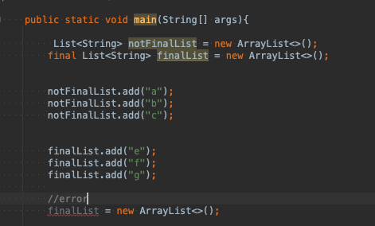
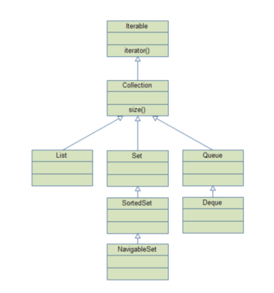
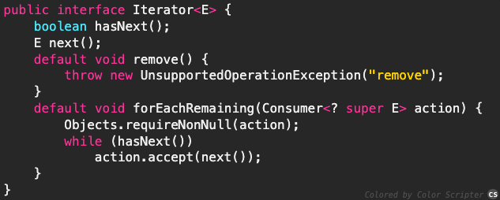

# f-lab 2주차

느슨했던 긴장감을 다시..불어넣기위해 하루하루 커밋하기 시작!

# final vs Immutable (final 클래스,변수,함수 등에 선언하는  키워드고  , Immutable은 패턴? 상태이다(변경불가능한))
## final 

 1. 메서드 및 변수에 사용되는 수정자. final 키워드 사용시 본질적으로 상수가 됨으로 수정이 안됀다.
 2. 변수의 참조주소는 변경될 수 없다
 3. 하지만 상태는 변경 할 수 있다 (setter)

## immutable
 1. 객체의 실제 값을 변경할 수 없지만, 참조주소는 변경 가능. 
 2. 대표적을 String , Integer , Boolean

++ 지식 String 자료를 찾아보면서.. 

String + 를 하면 새로운 주소로 할당됨 .
그리고 String은 참조 주소값이기 때문에 == 보단 equlas로 비교하는게 맞다.

*출처 https://aljjabaegi.tistory.com/465

# final List vs Not final List

 ## final List

 final을 선언함으로서 참조 주소는 변경이 불가능하다. 대신 상태를 바꿀수 있어 add ,remove 는 ! 가능
 상태 값마져 변경하고 싶지않다면 unmodifiableList를 이용하면 된다.
 

# iterable

계층 구조 

 iterable 구조 
 

 iterable > collection > List , set , Queue 상속 하고있다.
 
 멘토링에서 상속에대한 부분에 대해 생각하면 iterable에서 규격? 계약이된 메소드 등은 하위 클래스에서 무조건 구현해야됨.
 iterable 내부를보면 iterator 메소드가 추상메소드로 선언되었다. 그래서 하위 클래스들은 전부 iterator 메소드를 가지고 있음
 결론적으로 Iterable 인터페이스의 역할은 Iterator() 메소드를 하위 클래스에서 무조건 구현하게 만들기 위한 역할
 
  foreach문이 디폴트 메소드로 들어가 있음.

 ## Iterator
 e

 내부에는 hasNext , next  , remove 등 컬렉션 클래스의 데이터 하나씩 읽어올때 사용 .
 이런 공통 인터페이스(Iterator)를 정의해서 구현하도록 표준을 정하면서 코드의 일관성 유지및 재사용성 극대.

 
# 컬렉션

