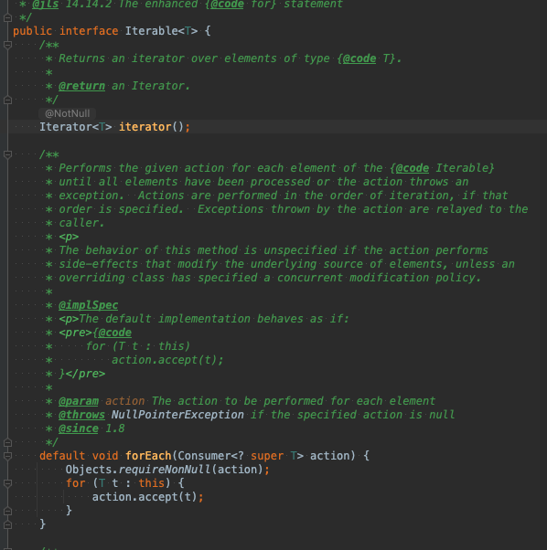
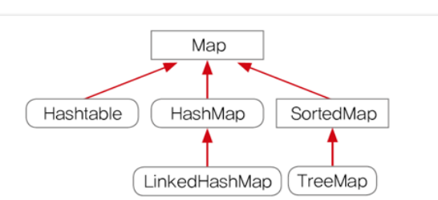
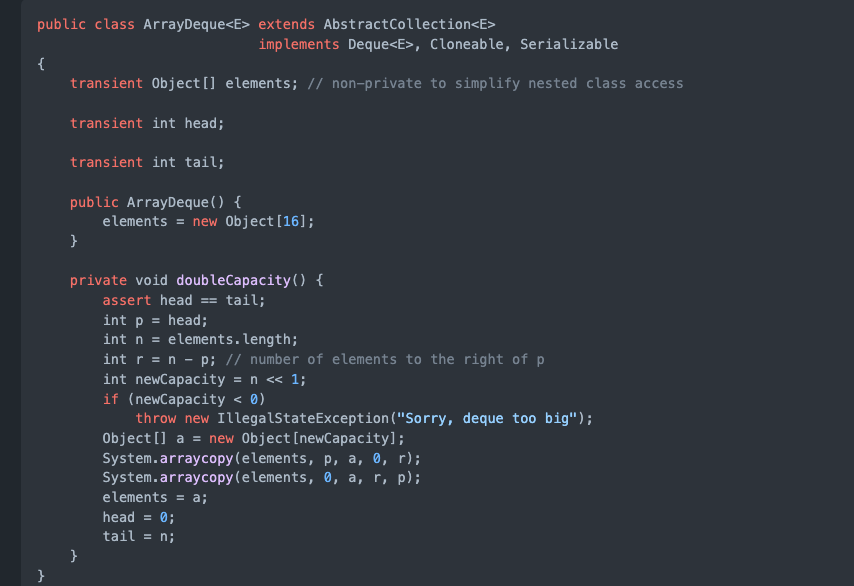

# f-lab 2주차

느슨했던 긴장감을 다시..불어넣기위해 하루하루 커밋하기 시작!

# final vs Immutable (final 클래스,변수,함수 등에 선언하는  키워드고  , Immutable은 패턴? 상태이다(변경불가능한))
## final 

 1. 메서드 및 변수에 사용되는 수정자. final 키워드 사용시 본질적으로 상수가 됨으로 수정이 안됀다.
 2. 변수의 참조주소는 변경될 수 없다
 3. 하지만 상태는 변경 할 수 있다 (setter)

## immutable
 1. 객체의 실제 값을 변경할 수 없지만, 참조주소는 변경 가능. 
 2. 대표적을 String , Integer , Boolean

++ 지식 String 자료를 찾아보면서.. 

String + 를 하면 새로운 주소로 할당됨 .
그리고 String은 참조 주소값이기 때문에 == 보단 equlas로 비교하는게 맞다.

*출처 https://aljjabaegi.tistory.com/465

# final List vs Not final List

 ## final List

 final을 선언함으로서 참조 주소는 변경이 불가능하다. 대신 상태를 바꿀수 있어 add ,remove 는 ! 가능
 상태 값마져 변경하고 싶지않다면 unmodifiableList를 이용하면 된다.
 

# iterable

계층 구조 

 iterable 구조 
 

 iterable > collection > List , set , Queue 상속 하고있다.
 
 멘토링에서 상속에대한 부분에 대해 생각하면 iterable에서 규격? 계약이된 메소드 등은 하위 클래스에서 무조건 구현해야됨.
 iterable 내부를보면 iterator 메소드가 추상메소드로 선언되었다. 그래서 하위 클래스들은 전부 iterator 메소드를 가지고 있음
 결론적으로 Iterable 인터페이스의 역할은 Iterator() 메소드를 하위 클래스에서 무조건 구현하게 만들기 위한 역할
 
  foreach문이 디폴트 메소드로 들어가 있음.

 ## Iterator
 e

 내부에는 hasNext , next  , remove 등 컬렉션 클래스의 데이터 하나씩 읽어올때 사용 .
 이런 공통 인터페이스(Iterator)를 정의해서 구현하도록 표준을 정하면서 코드의 일관성 유지및 재사용성 극대.

## ListIterrator

 Iterrator 상송받아서 기능을 추가 함 , 양방향으로 이동가능 - > ArrayList나 LinkedList와 같이 List인터페이스를 구현한 컬렉션에서만 사용 가능.

 
# 컬렉션

 

 ## 동기화된 컬렉션 vs 병렬 컬렉션

 동기화된 컬렉션 클래스는 내부 변수에 접근하는 통로를 일련화 Thread Safe But 동시사용시 상담 부분 손해 병렬 컬렉션은 이와 반대. (전체적인 성능 향상)
 이 클래스들은 모두 public으로 선언된 모든 메소드를 클래스 내부에 캡슐화해 내부의 값을 한 스레드만 사용하게함.

 병렬 컬렉션은 여러 스레드가 동시에 컬렉션에 접근 가능 

 ## 컬렉션 선택 기준

  * List : 중복을 허용하고 저장순서가 유지되는 컬렉션 구현

 1. ArrayList

  가장 많이 사용되는 컬렉션 Vector 클래스와 사용법 구조가 유사함. Thread Safe 하지 않음 (Vector는 Safe)

   1-1  LinkedList

   List 와 Queue 모두 구현한 구현체 데이터간의 연결관계 집중해서 저장. (ArrayList, Vector) 메모리관리 측면 유리
   여러 종류의 인터페이스를 구현하기 때문에 동일한 기능 제공하는 메소드들이 많다.

 2.Set
 
 사용하는 이유 :? 컬렉션 순서가 중요하지 않는 데이터 저장할때  , 중복 검사, 원하는 값이 존재하는지만 검사 할 때

  2-1 : HashSet : 순서가 필요가없는 데이터 헤시 테이블 저장 ( 성능 가장 우수)
  2-2 : TreeSet: 저장된 데이터의 값에 따라 정렬 , (성능 보통 )
  2-3 : LinkedHashSet : 연결된 목록타입으로 구현된 헤쉬셋  저장 순서에 따라 값 정렬 ( 성능 가장 나쁨 )

 성능을 나누는 가장 중요한 기준은 정렬 여부 / 중요한 부분은 데이터의 중복 여부

 3. Map

 
 키 , 값 쌍으로 묶어서 컬렉션 구현.
  
  3-1 : HashMap 
   
   key 와 value를 하나의 entry로 저장. , 해시 알고리즘으로 검색속도 빠룸 (멀티스레드에서는 HashTable 사용) 
   -> 기존 코드와 호환성을 위해 남아 있음 HashMap 사용하는게 낫다.
  
  3-2 : TreeMap
  
   이진 검색 트리 형태 저장, 데이터 추가나 제거 기본동작이 빠름  Key의 오름차순으로 저장.

  3-2 : LinkedHashMap
  
   입력된 순서대로 데이터를 저장하는 
 4. Stack 

 

   List 인터페이스를 구현한 클래스 (ArrayList,LinekdList)
   LIFO 구현한 리스트인 stack!  또다른 방법으론 ArrayDeque도 있지만 (속도빠름) 스레드세이브 하지 않다.
   
 특징 : 시스템 해킹에서 버퍼플로우 취약점을 이용한 공격 할 때 스택 메모리의 영역에서 함.
       인터럽트처리, 수식의 계산 ,서브루틴의 복귀 번지 저장등 쓰임  , 우선 탐색에 사용 , 재귀적 함수 호출 사용

 + 자바에서 잘못설계된듯, LIFO 구조 인대 Vector 클래스를 확장하면 중간에서 데이터 삽입 삭제를 하기 때문 , 초기용량 설정 불가능 
   그래서 ArrayDeque 사용하는게 더났다. 
   
 + 4-1: ArrayDeque
 
 stack 클래스보다 빠르고 , Queue 보다 빠름.

 synchronized 장식해 만들수 있다.

 5. Queue 

  FIFO  

 
 6. Deque 

  양쪽 끝 추가 / 삭제 가능
 

## hashcode /equals 차이점 .

   

