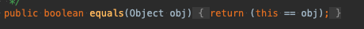

# f-lab 2주차

느슨했던 긴장감을 다시..불어넣기위해 하루하루 커밋하기 시작!

# final vs Immutable (final 클래스,변수,함수 등에 선언하는  키워드고  , Immutable은 패턴? 상태이다(변경불가능한))
## final 

 1. 메서드 및 변수에 사용되는 수정자. final 키워드 사용시 본질적으로 상수가 됨으로 수정이 안됀다.
 2. 변수의 참조주소는 변경될 수 없다
 3. 하지만 상태는 변경 할 수 있다 (setter)

## immutable
 1. 객체의 실제 값을 변경할 수 없지만, 참조주소는 변경 가능. 
 2. 대표적을 String , Integer , Boolean

++ 지식 String 자료를 찾아보면서.. 

String + 를 하면 새로운 주소로 할당됨 .
그리고 String은 참조 주소값이기 때문에 == 보단 equlas로 비교하는게 맞다.

*출처 https://aljjabaegi.tistory.com/465

# final List vs Not final List

 ## final List

 final을 선언함으로서 참조 주소는 변경이 불가능하다. 대신 상태를 바꿀수 있어 add ,remove 는 ! 가능
 상태 값마져 변경하고 싶지않다면 unmodifiableList를 이용하면 된다.
 

# iterable

계층 구조 

 iterable 구조 
 

 iterable > collection > List , set , Queue 상속 하고있다.
 
 멘토링에서 상속에대한 부분에 대해 생각하면 iterable에서 규격? 계약이된 메소드 등은 하위 클래스에서 무조건 구현해야됨.
 iterable 내부를보면 iterator 메소드가 추상메소드로 선언되었다. 그래서 하위 클래스들은 전부 iterator 메소드를 가지고 있음
 결론적으로 Iterable 인터페이스의 역할은 Iterator() 메소드를 하위 클래스에서 무조건 구현하게 만들기 위한 역할
 
  foreach문이 디폴트 메소드로 들어가 있음.

 ## Iterator
 e

 내부에는 hasNext , next  , remove 등 컬렉션 클래스의 데이터 하나씩 읽어올때 사용 .
 이런 공통 인터페이스(Iterator)를 정의해서 구현하도록 표준을 정하면서 코드의 일관성 유지및 재사용성 극대.

## ListIterrator

 Iterrator 상송받아서 기능을 추가 함 , 양방향으로 이동가능 - > ArrayList나 LinkedList와 같이 List인터페이스를 구현한 컬렉션에서만 사용 가능.

 
# 컬렉션

 

 ## 동기화된 컬렉션 vs 병렬 컬렉션

 동기화된 컬렉션 클래스는 내부 변수에 접근하는 통로를 일련화 Thread Safe But 동시사용시 상담 부분 손해 병렬 컬렉션은 이와 반대. (전체적인 성능 향상)
 이 클래스들은 모두 public으로 선언된 모든 메소드를 클래스 내부에 캡슐화해 내부의 값을 한 스레드만 사용하게함.

 병렬 컬렉션은 여러 스레드가 동시에 컬렉션에 접근 가능 

 ## 컬렉션 선택 기준

  * List : 중복을 허용하고 저장순서가 유지되는 컬렉션 구현 
  
 사용이유 ? : 

    * 배열의 단점 : 엘리먼트가 삭제되면 상제된 공간은 빈공간으로 남김 - > 메모리 낭비.
    * 배열 크기를 미리 정해야됨 , 컴파일 이후 배열의 크기를 변동 X

  List 는 ?  빈 엘리먼트 허용 X 
          , 인덱스 장점 버리고 빈틈없는 데이터 적재. (자바에서 허용하는 경우가 있음)
          , 리스트에서 인덱스는 데이터의 순서 정도의 의미
          , 순차성이 없어서 spacial locality 보장 X (cash hit) 어려움. (데이터 갯수가 정해지고 자주사용되면 배열이 더 효율적)
          , 불연속적 메모리 공간 차지 , 포인터로 접근.

  장점 : 포인트를 통해 데이터위치를 가르켜 삽입 , 삭제 용이, 
        동적이라 크기가 정해져 있지 않고 메모리의 재사용 편리.
        불연속적이므로 메모리 관리 편리.

  단점 : 검색 성능이 좋지 않다. / 포인터를 통해 다음 데이터를 카르키므로 추가적 메모리 공간 발생.
 
   2. ArrayList

  가장 많이 사용되는 컬렉션 Vector 클래스와 사용법 구조가 유사함. Thread Safe 하지 않음 (Vector는 Safe)
  배열과 마찬가지로 인덱스로 객체 관리, 하지만 동적으로 크기를 늘릴 수 있고 처음 저장 용량은 10 이다 -> 이후 더 많은 객체가 들어오면 1.5배 증가.
  객체 삭제가 일어나면 제거 객체부터 마지막 인덱스까지 모두 앞으로 쉬프트 일어남, 
  -> 따라서 잦은 삭제 이동이 발생할 경우 LinkedList 사용 ..하는게 더 효율적.
  

   1-1  LinkedList

  
   
   노드 간에 연결을 통해 리스트로 구현된 객체 . 순차접근만 가능. (탐색시 시간이 많이 소요된다.) randomAccess 불가능
   AbstractSequentialList를 상속함 .
 
   List 와 Queue 모두 구현한 구현체 데이터간의 연결관계 집중해서 저장. (ArrayList, Vector) 메모리관리 측면 유리
   여러 종류의 인터페이스를 구현하기 때문에 동일한 기능 제공하는 메소드들이 많다.

   삽입/ 삭제 시 다음 노드에대한 주소값만 변경됨 

 2.Set
 
 사용하는 이유 :? 컬렉션 순서가 중요하지 않는 데이터 저장할때  , 중복 검사, 원하는 값이 존재하는지만 검사 할 때

  2-1 : HashSet : 순서가 필요가없는 데이터 헤시 테이블 저장 ( 성능 가장 우수)
  2-2 : TreeSet: 저장된 데이터의 값에 따라 정렬 , (성능 보통 )
  2-3 : LinkedHashSet : 연결된 목록타입으로 구현된 헤쉬셋  저장 순서에 따라 값 정렬 ( 성능 가장 나쁨 )

 성능을 나누는 가장 중요한 기준은 정렬 여부 / 중요한 부분은 데이터의 중복 여부

 3. Map

 
 키 , 값 쌍으로 묶어서 컬렉션 구현.
  
  3-1 : HashMap 
   
   key 와 value를 하나의 entry로 저장. , 해시 알고리즘으로 검색속도 빠룸 (멀티스레드에서는 HashTable 사용) 
   -> 기존 코드와 호환성을 위해 남아 있음 HashMap 사용하는게 낫다.
  
  3-2 : TreeMap
  
   이진 검색 트리 형태 저장, 데이터 추가나 제거 기본동작이 빠름  Key의 오름차순으로 저장.

  3-2 : LinkedHashMap
  
   입력된 순서대로 데이터를 저장하는 

 

 4. Stack 

 

   List 인터페이스를 구현한 클래스 (ArrayList,LinekdList)
   LIFO 구현한 리스트인 stack!  또다른 방법으론 ArrayDeque도 있지만 (속도빠름) 스레드세이브 하지 않다.
   
 특징 : 시스템 해킹에서 버퍼플로우 취약점을 이용한 공격 할 때 스택 메모리의 영역에서 함.
       인터럽트처리, 수식의 계산 ,서브루틴의 복귀 번지 저장등 쓰임  , 우선 탐색에 사용 , 재귀적 함수 호출 사용

 + 자바에서 잘못설계된듯, LIFO 구조 인대 Vector 클래스를 확장하면 중간에서 데이터 삽입 삭제를 하기 때문 , 초기용량 설정 불가능 
   그래서 ArrayDeque 사용하는게 더났다. 
   
 + 4-1: ArrayDeque
 
 stack 클래스보다 빠르고 , Queue 보다 빠름.

 synchronized 장식해 만들수 있다.

 5. Queue 

  FIFO  

 
 6. Deque 

  양쪽 끝 추가 / 삭제 가능
 

## hashcode /equals 차이점 .

   

테스트 클래스를 만들어 equals 랑 hashCode 오버라이드

  

## equals

 Object 클래스에선  **비교연산자인 ==  참조 값이 같은지 결과적으로 동일 객체인지 확인함.**
 자바에선 두 객체를 비교할 때의 equals는 논리적으로 동등할 때 true를 하는데 참조가 다르더라도 내부 value가 같다는걸 의미함 .
 (오버라이드해서 클래스내 equals를 재정의)

 객체를 생성시 euqals 메소드를 만들어 줘서 객체 비교시 내부 값만 비교하도록 정의해 준다.

 여기서 동일성 vs 동등성이 나온다.
  
 동일성 : ==  객체 인스턴스의 주소 값 비교 (Primitive data type 의경우 == 값 비교 가능) 왜냐하면 primitive data는 값이 같으면 같은 주소값을 가지기 때문에.. 주소값 비교됨
 동등성 : equals 객체 내부 값 비교

 ## hashCode

  객체를 식별하는 하나의 정수 값. - >  객체의 메모리 번지를 이용해 객체 고유의 해시코드를 만들어 리턴
  같은 객체임을 나타내기위해선 동일한 hashcode를 가져야 함

 사용이유 ? : 
   객체를 비교할 때 드는 비용이 낮음. 
 
 두 객체가 hashcode가 다르면 두 객체는 같지 않다.  그러나 hashcode가 같다고 두 객체가 같거나 다를 수 있다.
 
 보통 클래스 구현시 equals , hashcode 같이 오버라이딩 구현,  컬렉션 프레임워크에선 hashSet, HashMap, HashTable에서도 사용됨.

 + hashCode()가 다른 객체라고 해서 무조건 다르지 않음 
   equals() 메서드가 false를 리턴하면 hashCode값이 같을 수도 있음 hashTable의 특징이며 서로 다른 hashCode를 가지면 성능을 향상시키는데 도움 됨.
 
 ### 순서 -> hashcode  -> 해시코드 값이 같은가? 다르면 false  -> equals 다시 동등성 비교,  해시코드값이 다르면 엔트리끼리 비교도 안함.

 
## hashTable

 작동원리 : 
   Key,value 형 태로 데이터를 저장함 . 이 때 해시함수를 이용해 key값 기준으로 고유식별값 해시값을 만듬, 이 값을 버킷에 저장.
   그러나 크기가 한정적이라 다른 객체라도 같은 해시값을 가질 수 있음 ,  이걸 해시 충돌이라고 한다.
   이런 경우 버킷을 LinkedList 형태로 객체를 추가 함. -> (자바 8~9 부턴 링크드리스트 아이템 갯수가 8개가 넘어가면 TreeMap 자료구조로 저장 됨)
   같은 해시값의 버킷 안에 다른 객체가 있는경우 equals 매서드 사용

   ++ 해시 충돌 
    hashing 된 값의 인덱스가 서로 같은 경우 key값이 중복되는 경우.

    해결법 -> Open Addressing (개방 주소 방법 )   /  (Separate Chaining ) 분리 연결 방법

 

           

+ euqlas / hashcode 같이 오버라이드 해야 되는 이유.
 
 -> hash 값을 사용하는 Collection(HashSet, HashMap, HashTable)을 사용할 때 문제가 발생한다.

 hashcode를 재정의 하지  않으면  같은 값 객체라도 해시 값이 다를 수 있음,   HashTable에서 해당 객체가 저장된 버킷 못찾음.
 equlas를 재정의 하지 않으면 해시값을 이용한 객체가 저장된 버킷을 찾을수 있지만, 해당 객체와 자신과 같은 객체인지 값을 비교못해 Null 리턴 

 

 *출처 https://jisooo.tistory.com/entry/java-hashcode%EC%99%80-equals-%EB%A9%94%EC%84%9C%EB%93%9C%EB%8A%94-%EC%96%B8%EC%A0%9C-%EC%82%AC%EC%9A%A9%ED%95%98%EA%B3%A0-%EC%99%9C-%EC%82%AC%EC%9A%A9%ED%95%A0%EA%B9%8C
 

