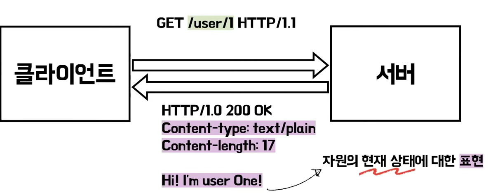
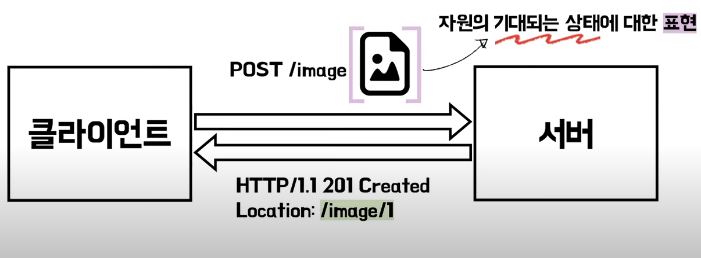
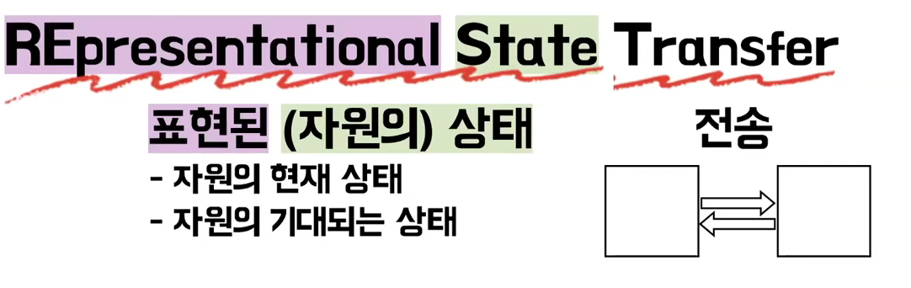

# restFul

# rest API?

 + URI를 통해 자원을 지정 
 + HTTP 메서드 : 자원에 대한 행위를 표현

 + CREATE POST /user
 + READ GET /user/1
 + UPDATE PUT /user/1
 + DELETE DELETE /user/1

 + 등록은 저거 조회는 저거 
 + 이런식으로 말하면 좀 아니다..?

# 로이필딩 REST 개념창시자

 + CRUD 내용 없어
 + 앞에는 본질이랑 차이가 있따 
 + HTTP 스펙에 정의한 방식대로 사용만하면 된다. REST는

# REST API?

 + REST 아키텍쳐 스타일에 부합하는 API

## UniformInterface

 + 자원의식별
 + 표현을 통한 자원의 조작
 + 자신 서술적인 메세지
 + HATEOAS

 + 4가지를 충족해야 REST API 다

### 자원에 대한 식별

 + 이름을 지닐 수 있는 모든 정보
 + 개념적인 대상 
 + eX) 문서 , 이미지, 자원들의 집합 , 실존하는 대상

#### 자원은 객체

 + 상태 변화 가능 -> 변하지않는 식별자 필요
 + 생성 -> 변화 > 파괴
 + URI를 통해 자원을 식별해야 한다
 + /user/1

### 표현을 통한 자원에 대한 조작

 + 표현 : 특정한 상태의 자원에 대한 표현
 + 자원은 다양한 방식 표현 가능 - > 문서 , 파일 HTTP 메시지 엔티티등 ..

 + 클라이언트에서는 user/1 
 + 서버에는 현재상태를 Hi i'm user one 표현 대답함

### 자기 서술적 메시지

 + 메시지는 스스로에 대해 설명해야 한다.
 + 클라이언트와 서버 사이의 컴포넌트들은 메세지의 내용을 참고하여 적절한 작업 수행
 + ex) host 헤더에 도메인명 기재 필요! HTTP/1.1 부터 헤더 필수화

### HATEOAS

 + HTML 하이퍼 미디어를 통해 상태를 변경하는 인터페이스 제공