# MVC

 + 기존 JSP파일로만 응답 요청 등 자바 코드도들어가고
 + JSP 안에서만 모든 뷰 비즈니스로직등을 처리했다
 + JSP에 이러한 여러책임들을 부과하면 너무 비효율적이고 유지보수하기 힘든 코드가 된다.
 + 그래서 Model-view- Controller로 분리해서 보다 효율적으로 만들 수 있다.
 + JSP는 목적에 맞게 view만 집중 

## Controller 

 + Http 요청을 받아서 파라미터 검증 및 비즈니스 로직 실행 
 + 그리고 뷰에 전달할 데이터를 조회에 모델에 담아서 넘긴다.
 + 비즈니스 로직은 Service라는 계층을 별도로 만들어 처리

## Model

 + 뷰에 출력하 ㄹ데이터 담아 둠.
 + 화면 렌더링 하는 일에만 집중 함.

## MVC 모델 진화 과정

### 초기

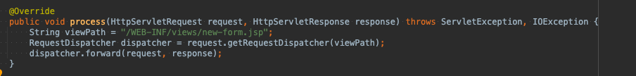

 + 초반기 MVC 패턴이다.
 + view 이동하는 코드가 항상 중복 호출...
 + viewPath란 변수도 중복으로 사용된다.
 + response도 사용되지않고 thymeleaf같은 뷰로 변경? 전체코드 다시 다 변경
 + 공통 처리도 어려워 진다. 기능이 많아지면서 컨트롤러도 더 무거워진다.

### MVC 업그레이드 

 + 프론트 컨트롤러를 도입하자!

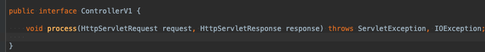
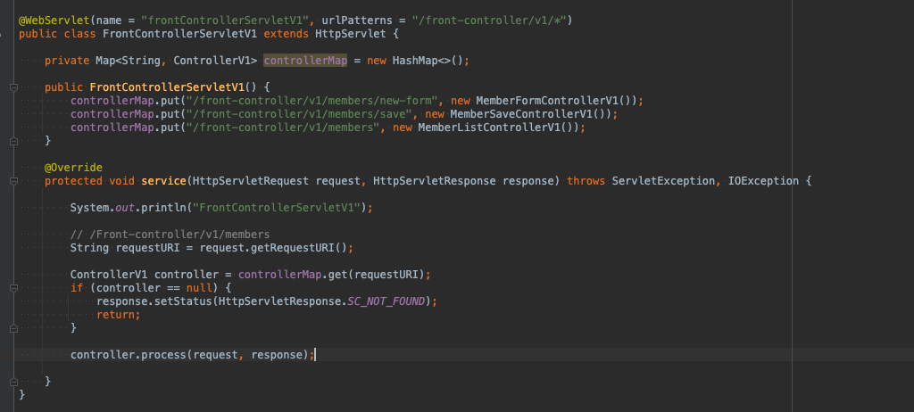

 + 클라이언으 요청을 받고 요청에 맞는 컨트롤러를 찾아 호출
 + 입구를 하나로..
 
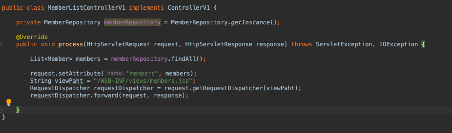

 + 이렇게 분리를 해놓고 나니 
 + 뷰로 이동하는 부분이 중복이 되어 있어서 다시 정리

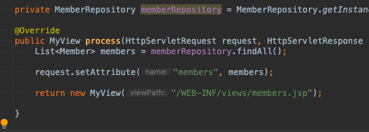
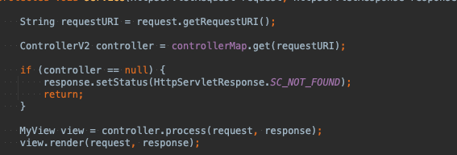
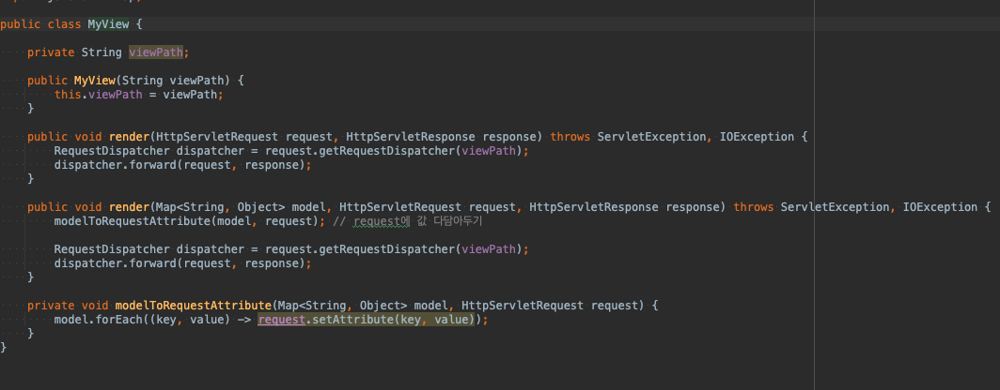

 + view 를 따로 분리해 준다.
 + Myview 객체를 생성하고 뷰이름만 넣고 변환.
 + 여기서도 문제가 하나 있는데.
 + 서블릿이 종속적이게 되는 것이다.
 + request 객체를 Model로 변환하면 굳이 서블릿을 쓸 필요가 없다.
 + 그리고 뷰 리졸버를 통해 뷰 이름 중복도 막아보자.

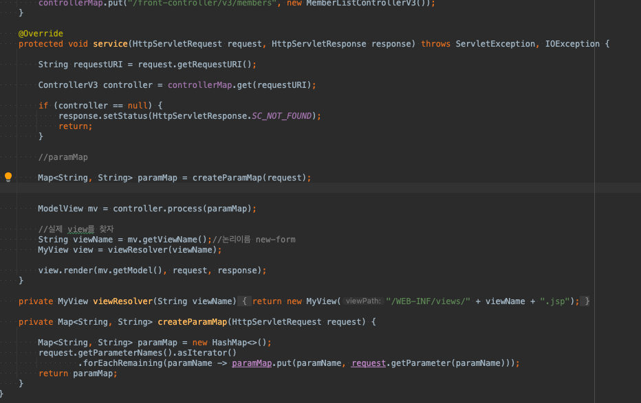
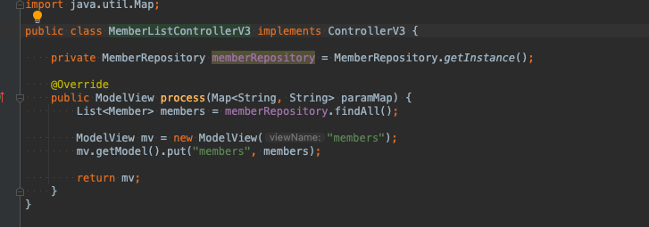

 + modelView 객체를 만들어 뷰 경로와 모델을 받는다.
 + 컨트롤러에서 모델뷰객체를생성해 (경로 적고 데이터를 모델에 담아서) 반환해주고
 + 뷰객체에서 다시 랜더링해서 넘겨준다,
 

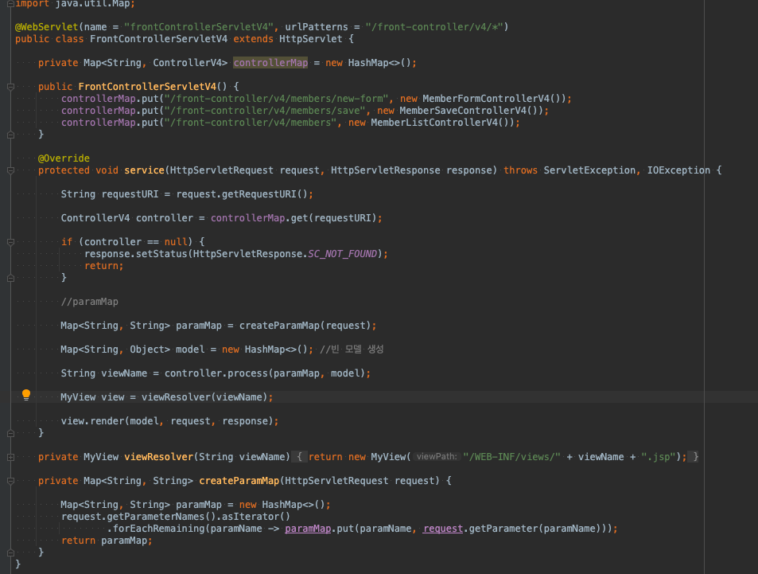
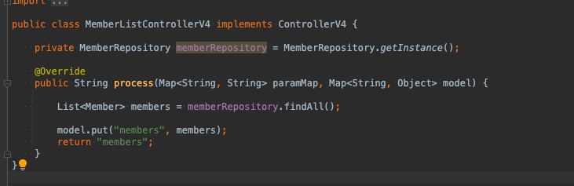

 + 모델을 직접 파라미터로 전달되기 때문에 직접 생성하지 않아도 된다.
 + 컨트롤러마다 뷰객체 생성대신 논리이름을 반환해서 뷰 리졸버로 물리 뷰를 찾을 수 있다.

