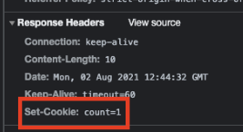
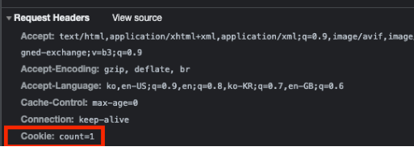

# session

 + 웹브라우저 1개당 1개의 세션을 사용함
 + 각 세션을 공유하기위해 고유한 세션 ID라는 것을 할당하는데
 + 어떤 세션을 사용하는지 알 수 있다.
 + 이때 JESSIONID쿠키가 세션 ID를 공유 할때 사용하는 쿠키이다.
 + 세션값을 저장할땐 setAttribute 메서드를 사용
 + 세션은 공유하지 않는다

## 세션 ?

 + 쿠키 기반을하고 있음
 + 사용자 정보파일을 서버측에서 관리함.
 + 클라이언트 구분을 위해 세션 ID를 부여하여 브라우저 종료시까지 인증유지 (설정가능)
 + 쿠키보다 보안에 좋지만 사용자가 많아질 경우 서버메모리 부하.
 + 클라이언트가 Request 보내면 서버 엔진이 클라이언트에게 유일한 ID 부여 이게 세션 ID

### 동작 방식

 + 클라이언트가 서버에 접속시 세션 ID 발급
 + 클라이언트는 세션 ID에 대해 쿠키를 사용해서 저장하고 가지고 있음
 + 클라이언트는 서버에 요청할때 이 쿠키의 세션 ID 같이 서버에 전달해서 요청ㅇ

## HTTP 쿠키

 + 서버가 사용자의 웹브라우저에 전송하는 작은 데이터.
 + 동일한 서버에서 재요청? 다시 저장된 데이터 전송
 + 쿠키란 -> 두 요청이 동일한 브라우저에서 들어왔는지 판단할때 사용
 + 로그인 상태 유지
 + 상태가 없는 (stateLess) 계속연결되있지않는 의미  HTTP 프로토콜에 상태 정보를 기억해주기 때문
 + HTTP는 비연결성 무상태 성이다. 서버와 클라이언트가 누군지 매번 확인 

## 동작 방식

 1. 클라이언트 페이지 요청 
 2. 서버에서 쿠키 생성
 3. Http Header에 쿠키를 포함시켜 Response
 4. 브라우저가 종료되어도 쿠키 만료기간동안 브라우저가 보관
 5. 같은 url요청이면 Request Header에 쿠키를 전송
 6. 서버에서 쿠키를 읽어 쿠키를 변경하면 변경된 쿠키가 Http Header에 포함되어 응답. 

  + 서버에서 셋팅해서 쿠키 값 보내주는 화면 
  + 쿠키를 응답하고 요청함 .

## 쿠키의 문제점

 + CSRF : 사용자의 권한을 이용한 공격 (비밀번호 변경 ,결제 요청 )
 + XSS : 사용자의 민감한 정보 탈취 (토큰)
 + 부족한 저장용량 (4kb)
 + HTTP 요청시 자동으로 모든 쿠키 전송 : 불필요한 트래픽 증가 

## 쿠키는 세가지 목적을 위해 사용 됨.

 + 세션 관리 : 서버에 저장해야할 로그인 ,장바구니 등..
 + 개인화 : 사용자 선호, 테마 세팅
 + 트래킹 : 사용자 행동 기록

## 쿠키 만들기

 + HTTP 요청 수신 때 서버는 응답과 함께 Set-Cookie 헤더에 전송.
 + 쿠키는 브라우저에 저장되며 -> 쿠키는 같은 서버에 의해 만들어진 요청 들의 Cookie HTTP 헤더안에  포함 되 전송

## Set-Cookie & Cookie Header

 + 주로 서버에서 사용하는 쿠기. headers에 실려서 전송 같은 도메인에서 만들어진 쿠키만 전송
 + Set-Cookie: <cookie-name>=<cookie-value> 이런식으로
 + 서버로 부터 사용자 에이전트로 전송 됨  서버에서 클라이언트로 쿠키전달(Response)

    
    HTTP/1.0 200 OK
    Content-type: text/html
    Set-Cookie: yummy_cookie=choco
    Set-Cookie: tasty_cookie=strawberry
    

 + 브라우저는 Cookie 헤더를 사용해 서버로 이전에 저장했던 모든 쿠키를 회신함

    GET /sample_page.html HTTP/1.1
    Host: www.example.org
    Cookie: yummy_cookie=choco; tasty_cookie=strawberry

 + 모든 요청에 자동으로 포함한다.

## 쿠키 스코프 

 + Domain / scope는 쿠키의 스코프 명시
 + 만약 명시가 되지않으면 현재 문서 위치를 호스트 일부 기본값으로 설정
 + 명시가 되어있으면 서브 도메인도 포함함.
 + ex) path=/docs 면
 + /docs
 + /docs/Web
 + /docs/Web/HTTP

## 퍼스트 파티 쿠키 서드 파티 쿠키

 + 설정된 도메인 기준으로 나뉨 .
 + 서드파티쿠키 : 사용자가 접속한 페이지와 다른 도메인으로 전송하는 쿠키 
 + 퍼스트파티쿠키 : 사용자가 접속한 페이지와 같은 도메인으로 전송되는 쿠키.

## 쿠키 CSRF(Cross Site Request Forgery) 문제 

 + 별도의 설정을 갖지않는 쿠키는, 크롬을 제외한 모든 브라우저에 HTTP요청에 대해 쿠키를 전송
 + 그 요청에는 HTML 문서요청 , 포함된 이미지 요청 , XHR , FORM을 이용한 HTTP 요청 포함
 + 이 문제를 노리고 CSFR 노린공격

### 순서

 + 공격대상 사이트는 쿠키로 사용자 인증 
 + 피해자는 공격 대상 사이트에 이미 로그인 되어 있어 브라우저에 쿠키가 있는 상태.
 + 공격자는 피해자에게 그럴듯한 사이트 링크 전송하고 누르게함 ( 공격 대상과 다른 도메인 )
 + 링크를 누르면 HTML 문서가 열림, 이 문서에는 공격 대상 사이트에 HTTP 요청 보냄.
 + 이 요청에는 쿠키가 포함(서드 파티 쿠키)되어 있음 공격자가 유도한 동작 실행.

## SameSite 쿠키
 
 + 서드 파티 쿠키의 보안적 문제를 해결하기 위해 만들어 짐.
 + 크로스 사이트 전송하는 요청의 경우 쿠키의 전송을 제한함.
 + 정책으론 None , Lax , Strict

 + None: 크로스 사이트 요청이 와도 항상 전송, 서드파티쿠키도 전송, 문제가 있는 전송 방식
 + Strict: 가장 보수적인 정책 . 크로스 사이트에 항상 전송하지 않음, 퍼스트 파티 쿠키만 전송 됨.
 + Lax: 스트릭트에 비해 느슨한 정책, 서드파티쿠키는 전송하지 않지만 몇 가지 예외적인 요청에 전송

 + 같은 웹사이트일때는 당연히 전송되고, 이 외 웹피이지 이동과, 안전한 HTTP 요청의 경우 전송 됨. (ex : get 메서드.)

 + Croos-site 요청 위조 공격에 대해 보호함 (CSRF). 모든 브라우저에 아직 제공되지 않음 아직 테스트 중..
 + XSFR 공격을 방지해 요청 도메인과 쿠키에 설정된 도메인이 같은경우만 쿠키 전송 

## Secure 필수 정책

 + SameSite 속성중 None 를 사용하여면 해당 쿠키는 Secure 쿠키여야 함.
 + Secure 쿠키는 HTTPS (암호화가적용된 )요청에만 전송되는 쿠키.
 + 현재는 크롬 밖에 이정책을 구현하지 않음.
 + 쿠키를 탈취해도 암호화가되있어 정보를 알아내기 힘듬 . 

## Secure & HttpOnly 쿠키

+ Secure 쿠키는 HTTPS 프로토콜상 암호화된 요청일 경우만 전송 됨.
+ Secure를 적용하면 Https인 경우만 전송함.
+ 암호화 되었을지라도 민감한 정보는 쿠키저장 X
+ 안전하지 않는 사이트느 쿠키에 Secure 설정 못함
+ XSS(en-us) 공격 방지를 위해 HttpOnly 쿠키는 자바스크립트 Documnet.cookie API 접근 금지 (HTTP 전송에만 사용 )

### HttpOnly Cookie

 + 쿠키는 클라이언트에서 자바스크립트로 조회 가능해서 위험함.
 + 가장 대표적인 공격 XSS(Cross Site Scripting) -> 게시판 제목 또는 이미지 src에 해커사이트 주소로 연결되게 작성하면
 + 쿠키를 탈취할 수 있게 함.
 + ex) 게시글 작성시.. 이렇게 하면..  
 + 브라우저에서 쿠키에 접근할 수 없도록 제한하는 옵션이 HttpOnly 옵션 !

 + Set-Cookie: 쿠키명=쿠키값; path=/; HttpOnly
 + 서버 단에서만 설정하는 옵션 .
 + 스니핑은 예방하지 못함 ..

# Cookie VS Session

 + 쿠키와 세션은 비슷한 역할 동작원리도 비슷 -> 세션도 쿠키 기반.
 + 차이점 1: 정보 저장 위치 
 + 쿠키 : 서버자원을 사용 X 브라우저에 저장 / 세션 : 서버에 저장
 + 보안면에선 세션이 승리 / 속도는 쿠키가 승리 (세션의 서버작업 때문에)
 + 쿠키는 스니핑 당할 우려가 있지만, 세션은 세션Id만 저장하기 때문에 보안성이 상대적 우수.
 + 라이프사이클 -> 쿠키는 만료시간  이있지만 브라우저 저장해도 계속 유지
 + -> 반면 세션은 브라우저종료되면 만료시간 상관없이 삭제,

## 굳이 쿠키를 왜 ?

 + 세션만 사용하면 서버의 메모리 부하가 오고 속도가 느려 질 수 있어 쿠키가 유리한 경우가 있다.
 + 

출처 : 

 + https://www.youtube.com/watch?v=-4ZsGy1LOiE
 + https://developer.mozilla.org/ko/docs/Web/HTTP/Cookies
 + https://interconnection.tistory.com/74
 + https://dev-monkey-dugi.tistory.com/56
 + https://interconnection.tistory.com/74