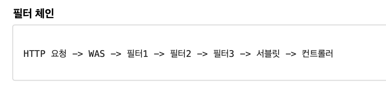
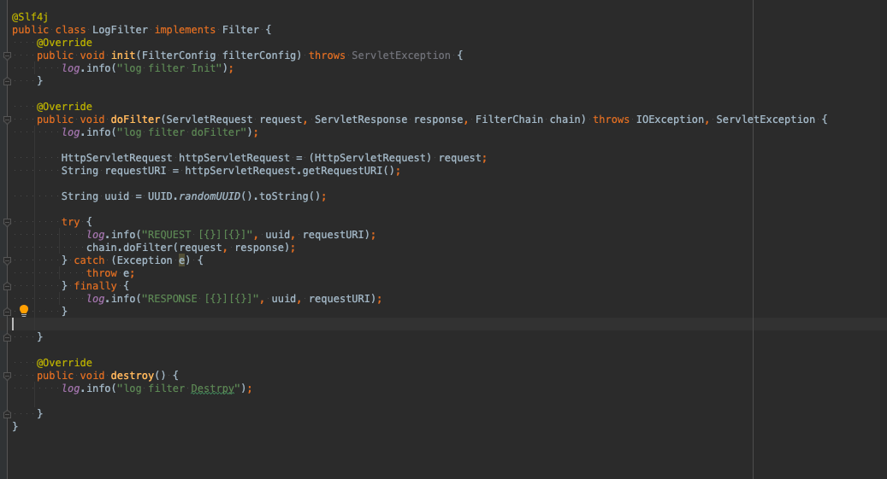
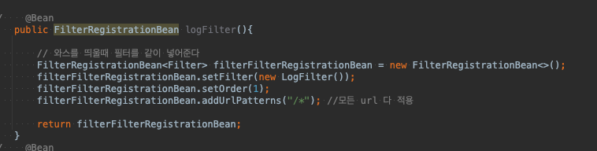

# filter

  + 로직에서 공통으로 관심 있는 것들에 대한 자원을 관리할때
  + filter를 사용함으로서 처리 할 수 있다.

## 특성

 + 필터는 체인으로 구성 되 있고 자유롭게 추가 가능
 + 필터 호출 -> 서블릿(스프링에선 디스패처 서블릿 OR 프론트 컨트롤러) -> 컨트롤러 
 + 특정 URL 패턴을 적용 가능함

 + 간단힌 예시 필터 코드
 + Init() : 필터의 초기화 메서드로 서블릿 컨테이너가 생성될 때 호출한다.
 + dofilter() : 고객이 요청(Http 요청)이 올때마다 호출 됨. 필터의 로직 구현부
 + destroy(): 필터의 종료메서드 서블릿 컨테이너가 종료될때 호출된다.
 + chanind.doFilter 가 중요한 부분인대 다음 필터가 있으면 호출하고 없으면 서블릿을 호출한다.

 + 이런식으로 사용 
 + FilterRegistrationBean (스프링) 에서 등록해서 사용한다.