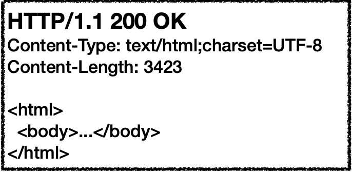
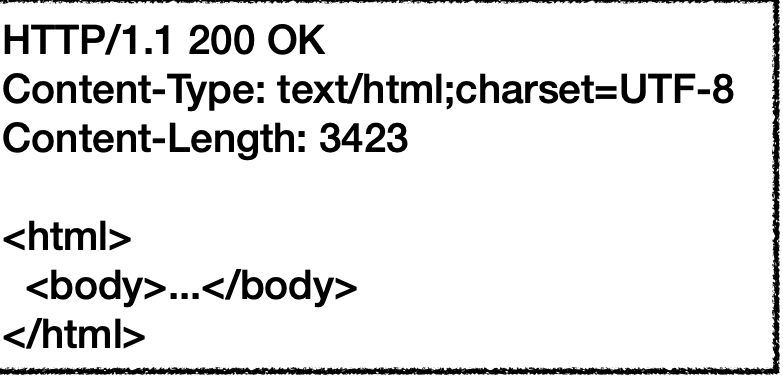
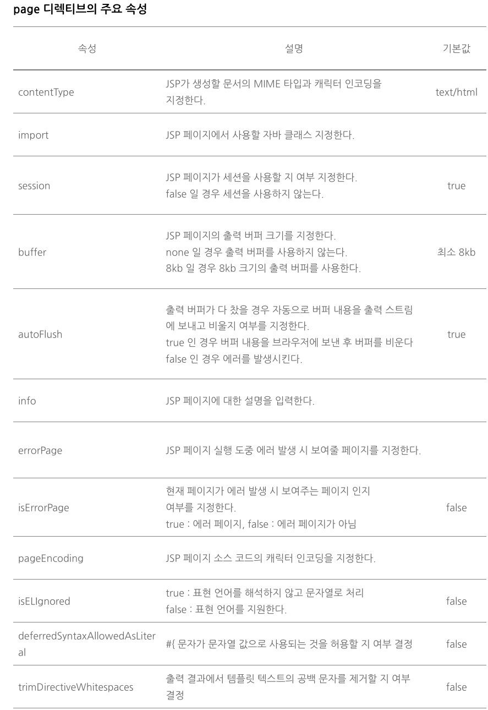

# webBasic

 #URL 주요 구성 요소

 + 프로토콜 : 웹 브라우저가 서버와 내용을 주고 받을때 사용되는 규칙!
 + 서버이름 : www.11st.co.kr 등..
 + 경로 : 페이지 상세 경로
 + 쿼리 문자열 : 서버에 보내는 데이터 등.
 

 # HTTP 요청/응답 뎅이터의 구성요소

## 요청 데이터

 + 요청줄 :GET , POST과 같은 HTTP 요청 방식과 요청하는 자원의 경로 지정
 + 헤더 : 서버가 응답을 생성하는데 참조할 수있는 정보 전송  ex) 브라우저의 종류나 언어 등 정보
 + 몸체 : 정보를 전송해야 할때 사용 파일 업로드 경우 파일을 몸체에 담아 전

## 응답 데이터

 + 응답 줄: 200 이나 404 같은 응답코드 전송
 + 헤더 : 응답에 대한 정보 전송 eX) 응답의 몸체는 어떤 데이터? 길이는? 대한 정보
 + 몸체 : 웹 브라우저가 요청한 내용 담음. 문서나 이미지 파일데이터 등..
 + 
 + 

# JSP 

 + 설정부분
 + <%@ page contentType="text/html; charset=UTF-8" %>
 + 생성할 문서는 Html , 캐릭터셋은 utf-8이다.

## 디렉티브

 + <%@ page %> 디렉티브라고 함. 
 + JSP 페이지에 대한 설정을 할 때 사용
 + taglib : 태그 라이브러리 지정
 + include : 페이지에 특정 영역에 다른 문서를 포함
 + page import="java.util.Date 등 .. 흠..

 + 디렉티브 주요 속성
 + 

## 스크립트 요소

 + 표현식 : 값 출력
 + 스크립트릿 : 자바코드 실행
 + 선언부 : 자바 메서드를 만듬..
 
## 기본 객체

 + request ,response , session, 각각 요청에 따라 파라미터 읽어오기 응답결과 전송하기 등.. 제공

## JSP 페이지 인코딩 속성

 + 웹 컨테이너는 JSP 파일을 읽을때 pageEncoding 속성과 contentType 속성을 사용해 인코딩을 결정

## Request  기본 객체

 + 클라이언트 (웹브라우저) 관련된 정보 일긱 기능
 + 서버와 관련된 정보 일긱기능.
 + 클라이언트가 전송한 요청 파라미터 및 헤더 쿠키 읽기 기능

## GET

 + 전송 방식의 차이
 + URL 파라미터를 붙여서 전송 
 + RFC 2396 규약에 정의된 규칙에 따라 인코딩 하기 때문에 이상한 문자가 출력됨
 + Form을 사용하지않고 전송함.

## POST

 + 데이터 영역을 이용해서 전송
 + 파라미터의 길이 제한이 없다

## 웹 어플리케이션 폴더 와 URL 관계

 + WEB-INF : WEB Application 설정 정보를 담고 있음 web.xml 위치
 + WEB-INF/classes : WEB Application 클래스 파일 위치
 + WEB=INF/lib : WEB Application 사용하는 jar 파일 위치
 + webapps/ROOT 라는 폴더도 존재하는대 보통 localhost:8080/ 이다 컨텍스트 경로 = "" 
 + 외 하위 경로는 context path라고 한다 ex)chap04
