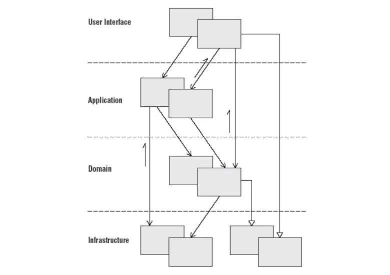

# 계층형 구조

## layerd Architecture ?

 + 관심사 분리에 따라 시스템을 유사한 책임(관심) 을 지닌 Layer로 분해
 + 각 Layer가 하위 layer에만 의존 하도록 구성하는 패턴이다.

### 목적

 + 각 레이어들이 특정 관심사와 관련된 개체만 포함하도록 만듬
 + 전체적인 시스템의 결합도를 낮추고  , 개발자의 인지 과부하 방지 
 + 재사용을 높이고 유지보수성 향상을 시키는 것 이다.

### 각 레이어의 역할

 + Presentation : 사용자의 요청 및 응답을 담당
 + Application :  어플리케이션 흐름 제어
 + Domain : 핵심 로직 포함
 + Infrastructure : 상위계층을 지원

### trade Off (현 프로젝트 상황 (unique Action))

 + 개발 리소스가 부족
 + 비즈니스 논리 단순
 + 다른 패턴들도 있지만 학습 비용이 높거나 / 잘못 적용되면 코드 품질이 낮아짐.

 + 직관적이고 , 학습비용이 높지 않으며
 + 적절한 수준의 코드 품질가능 한 계층형 아키텍쳐

### 단점 

 + 프로젝트 큰 규모는 확장성이 떨어짐.
 + 레이어로 분리된 관심사 외 다른 관심사? - > 패키지 분리 및 코드 배치 난감함.
 + 복잡한 비즈니스 로직 해결하고 성능적 이점은 어려움 

## 레이어간 역할 정의

### Presentation

 + HTTP요청 파라미터 / Body Validation
 + Application 레이어로 사용자의 요청을 위임 및 응답 반환하는 역할

### Application 

 + Service 부분.
 + 포현 영역과 도메인 영역을 연결하는 역할을 함.
 + 도메인 개체 간 흐름 제어만을 위해 존재함으로 단순한 형태를 갖는다.
 + Service 부분을 좀더 생각해 보면 될거 가다

### Domain 레이어

 + 추상적이어야 하며 다른 외부 의존성을 참조하지 않도록 하는게 중요.

### Infastructure 레이어

 + Data Access 기술 / IOC 컨테이너 등 모든 개체가 포함되있으며
 + 상위 계층 지원 역할 .

#### 분류

 + 환경 구성 (Spring Ioc)
 + 보안 (Sesseion , JWT)
 + Data Access (Hibernate , Mybatis )
 + 메시징 큐 / 메일

출처 : 

 + https://msolo021015.medium.com/layered-architecture-deep-dive-c0a5f5a9aa37
