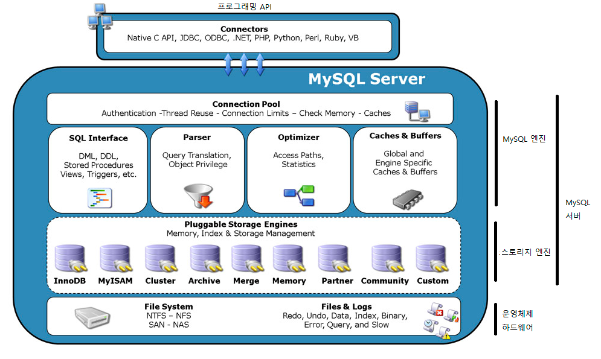

# MYSQL 

## MySQL 특징

## 전체적인 구조

 + 서버 엔진과 스토리 엔진 구분
 + 중간 부분이 서버 엔진 하단이 스토리지 엔진.

### 서버엔진

 + 클라이언트 요청 받아 SQL 처리하는 디비 자체적 기능

 + 사용자가 쿼리 날림 -> DB가 SQL 이해 가능하게 쿼리를 재구성하는 '쿼리파싱'
 + 디스크나 메모리 같은 물리적 저장장치와 통신하는 스토리엔진에 데이터를 요청 업무 담당 
 + 스토리 엔진에서 데이터 받아옴 -> 사용자 요청에 맞게 처리
 + 접근제어 / 쿼리 캐시/ 옵티마이저 역할 수행
 + 옵티 마이저는 SQL이 들어오면 연관된 데이터를 빠르게 찾기위해 최적의 실행을 유도하는 내부 기능 .

 + 스토리지에서 가져온 데이터를 처리하는 역할 담당.

 + ex) Table jon , Group By ,같은 일반적인 SQL 처리
 + Function/Prodecdure ,Trigger , Constraint 등과 같은 기능도 수행함.

### 스토리 엔진

 + 서버 엔진이 필요한 데이터를 물리 장치에서 가져오는 역할

 + 물리저장 장치에 데이터 읽어 오는 역할.
 + 스토리 엔진은 플로그인 방식으로 동작(필요한 기능 잇으면 전원에 플러그 꽂듯 필요한 스토리지 엔진을 간단히 설치하여 바로 사용)
 + 플러그인 방식으로 여러 개의 스토리지 엔진을 설치 가능함.

 + 기본 제공 스토리지 엔진
 + InnoDb / MyISAM , MRG_MYISAM 등등..

 + 서버 엔진은 스토리지 엔진에 API를 호출하여 실제 필요 데이터 요청하고 조작함.
 + 그러나 API 구현되어있지만 스토리엔진에서 지원안하는 경우가 있음.
 + 그러므로 DB 엔진에 최적화 되어있지 않음 -> 다양한 스토리지엔진을 써야되니깐.
 + 확장에는 좋지만 데이터 처리가 비효율적일수 있음.

## 스토리지 엔진이란 무엇일까?

 + 다양한 스토리지 엔진을 제공함으로 엔진의 다양성이 됨.
 + 엔진별 특성을 이용해 잘 적재하면 강력한 성능을 얻을 수 있음.

## MYISAM

+ 파일 기반 스토리지 엔진 
+ 데이터에 대한 키 , 인덱스만 메모리에 올려서 처리.
+ 데이터를 디스크에 바로 접근함.
+ 트랜잭션 지원 X / 테이블 단위 잠금으로 데이터 변경 처리.
+ 특정 세션이 여러 테이블 변경하면 성능 저하. 

+ 텍스트 전문을 검색할 수 있는 풀텍스트 인덱싱 / 지리정보를 처리하는 지오메트릭 스파셜 인덱식 등 좋은 기능이 있음.

+ Mysql은 저사양 서버에 구동하기 위한 목적임으로 다양한 방법으로 데이터 사이즈 줄임.

### 프리픽스 인덱스 압축 기법

 + 인덱스 첫 번째 값을 통째로 저장 -> 그 이후 변경 값을 차례로 인덱싱 하는 방식
 + ex) 중복된 문자열을 저장 -> 나머지 데이터 저장
 + 키 역순으로 데이터 찾을때 성능 이슈 -> 원하는 데이터 찾으려면 이전 단계에 저장된 인덱스 내용이 필요하기 때문.
 + 동시 데이터 처리 한계.
 + 따라서 로그수집 , 단순 SELECT 에 적합한 MYISAM 스토리지 

## InnoDB 스토리지 엔진

 + 트랜잭션 지원. 
 + 가장 많이 사용하는 엔진
 + 다중 버전 동시성 제어 메커니즘 제공 -> 여러 개의 복제본을 이용해 하나의 데이터 처리함 READ/WRITE 방해하지 않도록 하는 방식
 + 행 단위 잠금 -> 연관 없는 데이터를 다른 사용자가 변경 가능

 + 인덱스와 데이터를 모두 메모리에 올림 -> 메모리 버퍼 크기가 DB 성능에 큰 영향을 미침 
  
 + Primary key는 클러스터 인덱스로 구성 됨.(인덱스가 순서대로 저장되어있는 구조)
 + Primary key가 정의되있지 않으면 유니크 키로 클러스터 인덱스가 정의됨.
 + 둘다 정의되있지 않으면 내부적으로 6바이트 크기 키를 만들어 기본키로 사용 -> 주의 데이터복제 기능 사용시 권고하지않음 -> 업데이트가 많으면 동기화 지연발생이유.

 + 기본키가 클러스터 인덱스이기때문에 기본키를 통해 데이터 찾는게 가장 빠름.

 + 기본키 외 보조  인덱스는 기본키 값으로 가짐. -> 인덱스를 통해 기본키를 가져오고, 가져온 기본키로 실제 데이터 접근.

## Archive 스토리지 엔진

 + 로그 수집 적합한 스토리지 엔진
 + 데이터가 메모리상에서 압축 -> 압축된 상태로 디스크 저장 -> 행 단위 잠금 가능.
 + 한번 Insert되면 삭제나 수정 사용 불가 
 + 인덱스 지원X

 + 가공이 한 번 필요한 데이터 수집에는 상당히 효율 적. , 테이블 파티셔닝도 지원.

## MySQL 데이터는 어떻게 처리할까 ?

  + 쿼리 연산에 기본적인 특성을 사펴보자

### MySql에서는 모든 SQL을 단일 코어에서 처리 함.

 + SQL을 병렬 처리하지 않음 
 + 단일 코어만 사용하기 때문에 Scale-Up이 훨씬 좋음 

### 테이블 조인을 Nested Loop Join 알고리즘으로 처리.

 + Nested Loop Join은 선행 테이블 A의 조건 검색 결과를 하나하나를 테이블 B와 비교하여 조인하는 방식
 + 이중 포문과 유사. 
 + 데이터가 많아지면 연산이 커지기때문에 효율이 낮다.

### Block Nested Loop Join

 + 조인 버퍼 개념을 도입한 처리.
 + 테이블 조인시 필요한 데이터를 메모리에 일시적으로 저장하여 효율적으로 데이터 접

### 동작

 + select a.r1 , b.r2 from Table_A a INNER JOIN TABLE_B ON a.r1=b.rr2 
 + 테이블 A에서 조인 데이터 대상 찾음 -> 조인 버퍼에 A에있는 조인할 데이터를 가득 채운다.
 + 버퍼가 가득차면 테이블 B의 데이터를 스캔하여 조인 버퍼에 데이터와 매칭 되는지 체크
 + 데이터 일치하면 결과값으로  스캔 방법은  테이블 풀 스캔 / 인덱스 풀스캔/ 인덱스  범위 스캔 등 데이터 접근
 + 이 과정이 종ㄹ 되면 다시 테이블 A에서 버퍼를 비우고, 다시 테이블 A 조인데이터 대상을 채우고  위 과정 반복.
 + 테이블 A의 해당 데이터를 모두 처리할 때 까지 반복함.
 + 테이블 B의 스캔 횟수는 조인 버퍼에 데이터가 적재되는 횟수 와 같음. 

 + MySQL은 단일 코어임 으로 단일 코어로 Nexted Loop Join 방식으로 데이터 처리함.

 
# 쿼리 성능 진단은 최적화의 기초

## 쿼리 실행 계획 알아보기.

 + 성능의 진단 첫걸음 -> 실행한 SQL이 DB에서 어떻게 처리 될까?
 + DB에서 내부적으로 SQL파싱(문법체크 , 디비실행하기위한 변환) , 옵티마이징(데이터를 가장 빠르게 찾기) -> 데이터 찾기. 

### 쿼리실행 계획

 + DB가 데이터를 찾아가는 일련의 과정을 알아보기 쉽게 DB결과 셋으로 보여주는 것.
 + 기존의 쿼리를 튜닝할수 있음(쿼리실행 계획을 활용하면) , 성능분석, 인덱스 전략수립등 최적화에 대한 전반적인 업무를 처리함.

### 쿼리 실행 계획 하는법

 + EXPLAIN[EXTENDED] SELECT ....
 + EXTENDED :  디비에 처리되는 최종 SQL 형태를 보여줌.

### 읽는 순서

 1. ID는 위에서 아래로.
 2. table 항목에서 drive번호 항목을 만나면 해당 ID를 수행한수 돌아와서 나머지 수행.

### 쿼리 실행 계획 각 항목

 + ID : Select 아이디로 Select 구분 번호
 + Selete_tyPe : select type
 + Table : 참조 테이블 
 + Type : 조인 혹은 타입 
 + Possible_keys: 데이터를 조회할때 DB에서 사용할 수 있는 인덱스 리스트
 + Key : 실제 사용 인덱스
 + Key_len : 실제로 사용할 인덱스의 길이
 + Ref ; Key 안의 인덱스와 비교하는 칼럼(상수)
 + Rows : 쿼리 실행시 조사하는 행수 . 

### Select Type

 + SIMPLE : UNION 이나 서브 쿼리가 없는 단순 셀렉트.
 + PRIMARY : 서브쿼리가 잇을때 가장 바깥쪽에 있는 셀렉트
 + DERIVED : FROM 절 안의 서브 쿼리
 + DEPENENT SUBQUERY : 외부 쿼리와 상호 연관된 서브 쿼리.  ex) WHERE T2.t1_id = T1.id (왜래키?)

### Type

 + 조인 혹은 조회시? 어떤 방식으로 데이터를 가져오는지 대한 내용. 

 + const : SELECT 조회시 기본키나 유니크 키로 조회하는 경우 많아야 1건의 데이터.
 + eq_ref : 조인할때 기본키 또는 유니크 키로 매칭하는경우
 + ref  : 조인할때 기본키 혹은 유니크 키가 아닌 키로 매칭하는 경우
 + ref_of_null : 위와 가지만 널이 추가로 검색됨.
 + index_merge : 두 개의 인덱스가 병합되어 검색이루어짐.
 + unique_subquery : In절 안의 서브쿼리에서 기본키가 오는 특수한 경우.
 + Range : 특정 범위 내에서 인덱스를 사용하여 원하는 데이터를 추출하는 경우. 데이터가 방대하지 않으면 단순 셀렉트에 좋다.
 + index: 인덱스를 처음 부터 끝가지 검색  -> 인덱스 풀스캔
 + all: 테이블을 처음부터 끝까지 검색하는 테이블 풀스캔.

 + 위에서 아래로 내려올 수록 성능이 좋지 않음.

### Extra

 + MySql 쿼리 실행 에 대한 추가적인 정보를 보여줌

 + Using Index: 커버링 인덱스  인덱스 자료 구조를 이용해 데이터 추출
 + Using Where : Where 조건으로 데이터 추출, Tpye이 ALL  OR Index 타입과 함께 표현되면 성능이 좋지 않음을 의미.
 + Using Filesort : 데이터의 정렬 이 필요한 경우임, 메모리 , 혹은 디스크상에서의 정렬이 모두 포함, 결과 데이터가 많은경우 성능영향 미침.
 + Using Temporary: 쿼리 처리 시 내부적으로 Temporary Table이 사용되는 경우 의미.

 + 일반적으로 데이터가 많으면? Using Filesort와 Using Temporary 상태는 좋지 않으며 반드시 쿼리 튜닝이 필요하다.

## 쿼리 프로파일링 이해

 + 쿼리를 처리할때
 + Open Table/ Close Table , Optimizing , Sending Data등 여러 단계 걸치면서 데이터 찾음.

### 쿼리 실행시 병목되는 부분을 찾아보자

 + SET PROFILING = 1;  SELECT * FROM tab ;  SHOW PROFILE; 
 + 가장 최근에 실행한 쿼리에 대한 프로파일링 정보가 나옴, 뭐뭐에 대한~ 시간..

### SHOW PROFILES

 + 특정 쿼리에 대한 프로파일링 정보 확인 가능.

### SHOW PROFILE FOR QUERY 3; 

 + 리스트 중 확인하고 싶은 쿼리 번호를 특정해서 조회 가능.
 
 + 대략적으로 어느 지점에서 병목현상이 있는지 알수 있다.
 + 프로파일링 결과에서 -> Sending data(스토리지 엔진에서 디비엔진으로 쿼리보내는 단계) 부분이 오래걸린거면?
 + 스토리지 엔진이 DB엔진으로 데이터를 적게 보내도록 쿼리 튜닝해야됨

# MySQL 활용 팁

## WHERE 조건에 이해 

## 묵시적 형변환 함정에 빠지지 말기

 + 묵시적 형변환이 발생해 테이블 풀스캔에 따른 현상 방지하기 위한 팁 설명.

### 묵시적 현상 이란?

 + 조건절의 데이터 타입이 다를 때 우선 순위가 높은 타입으로 형이 내부적으로 변환되는걸 의미
 + 정수타입 < 문자열타입 우선순위가 더 높다 -> 문자열과 정수값을 비교하는 쿼리가 오면 우선순위가 낮은 문자열은 자연스럽게 정수타입형변환.

 + 만약 묵시적현상이 기본키에 나타나면(인덱스필드)? 테이블을 풀스캔해서 성능저하 심각함.

### 테스트 데이터 생성

### 정수형 칼럼을 문자열 조건으로 검색

 + 정수형 우선순위가 높기때문에 문자열 조건값은 묵시적으로 정수형으로 형변환되어 실행시 신속하게 처리됨.

### 문자열 칼럼을 정수형으로 조건 검색

 + 묵시적형변환에 의해  풀스캔으로  성능이 크게 저하됨.

### 결론

 + 묵시적 형변환 함정에 빠지지 말고 조건절에 칼럼 타입에 맞춰서 질의하자.
 + 다른 디비로 이관했을시 문제가 발생한다.

## 편리한 함수 잘못쓰면 독!

 + 알고 쉽고 사용하기 편리하지만 불필요한 시스템 야기할 수도 있음
 + DB가 알아듣기 쉬운 언어로 족므만 변환해주면 불필요한 부하는 발생하지 않음.

 + EX) DATE_FORMAT(REG_DATE , '%Y%M%D) = '2012018' AND DATE_FORMAT(re.. '%H') >= 18 등..
 + DB 내부적으로 풀스캔 해야됨 - > 옵티마이저는 칼럼의 분포도 기준으로 데이터츨 가장빠르게 추출하기 때문 
 + 위 쿼리는 reg_date와 연관된 데이터 분포도를 알수 없음. Date_format으로 인해 변경된 결과값을 옵티마이저가 예상을 못함.
 + -> reg_date >= '2012-08-18 18:00:00' 이런식으로 변경하면 좋다

## Like 검색 아무 때나 써야 하나?

 + 대용량 테이블일 경우 위험함.
 + 1311% / 1% 성능 차이 발생.
 + 옵티마이저는 데이터 분포도에 따라 내부적으로 SQL 최적으로 처리함. 
 + 그래서 후자는 인덱스를 읽고 다시 데이터 파일로 가는것보다 전체 데이터를 읽고 필요한 데이터를 선별하는것이 더 빠르다고 옵티마이저가 판단.

 + 인덱스는 데이터가 위치한 곳을 지칭함. 인덱스도 데이터고 지칭하는 데이터로 찾아가려면
 + 실 데이터에 대한 데이터를 다시 읽어야 하기 때문에 중복된 데이터 처리보단 , 테이블 풀스캔이 접근하는 것이 더빠르다고 옵티마이저가 판단함

## Like %dd% 

 + 인덱스는 순차적으로 비교됨으로 풀스캔 발생.

## Like dd%

 + 풀스캔 발생.
 
## 결론

 + 상용 DBMS는 함수결과를 인덱스로 구성하는 함수 기반 인덱스(인덱스 생성시, 칼럼에 산술 공식 또는 함수를 적용하여 생성한 인덱스 )를 사용하여
 + 요구사항 처리 가능 , 함수로 문자열을 거꾸로 만들어서 결과로 인덱스를 구성하면됨.

 + 허나 Mysql은 이런기능이 없음, 

 + Like 검색 별 생각없이 사용하면 성능이 크게 저하됨,
 + Like조건이 '검색어%" 와 같이 앞 단에 있따면 데이터 분포도 따져서 수행
 + Like조건이 '검색어%" 와 같은 형태로 반드시 수행해야되면 다른 조건을 추가해 데이터 범위 최소로 줄임

 + 처리하는 데이터 범위를 최대한 줄이는 것이 성능 최적화의 가장 기본 요소.!

# SQL 레벨에서의 접근법

## 데이터 흐름 이해

 + JOIN은 여러 테이블에서 하나의 결과를 가져오는 점이 편리
 + 무분별한 사용은 점진적으로 저하

 + ex) 여러 조인과 ORDER BY로 인해 임시테이블 / Filesort(결과데이터 오더바이로 정렬) 발생
 + 대용량 데이터 처리시 성능 저하가 발생 

 + EX) 한셀렉트분의 여러개의 조인 을두지말고
 + from절에 서브쿼리로 미리 필요한 조건 정렬등 테이블을 만들고 외부로 또 조인을 해버리면
 + 반드시 필요한 데이터만 메모리에 먼저 연산한다.

 + 테이블 사이즈가 횡적으로 크면 쿼리 성능은 향상됨.
 + 다수의 조인을 피할수 없다면 필요한 데이터만 가져와서 데이터 처리하고 다시 조인하는게 포인트다.

## 데이터 연산을 최소한으로 유도하자

 + Mysql 데이터 처리방식은 Nested Loop Join (A 데이터 조검검색결과 하나하나를 다른테이블 전체와 비교하는 것.)
 + 그러므로 Nested Loop Join을 줄이는게 가장 성능향상에 첫걸음

 + 예시를 보면 두개의 서브쿼리 는 union으로 결합해서 데이터를 가져오는대 마지막절에는 Limit 10이 있다
 + 이러면 서브쿼리 2개의 셀렉트문은 전체 셀렉트문을 가져옴 동시에 유니온 결과로 대용량 데이터 처리시 문제가 발생한다.
 + 그래서 서브쿼리안에서 미리 Limit 10 씩 가져오는게 더좋다.

### 정리

 + 정리해보면 실제 쿼리를짤때 우선 짜고 - > 튜닝을 위해 필요한데이터를 먼저 가져오는방향으로 쿼리를 짠다(조건등으로 가져올 데이터를 최소화!)

## 불필요한 조인을 피하자

 + 테이블안에 외래키가있는대 외래키를 사용해 데이터를 가져오는게 아니라면 굳이 사용하지 말자.
 + 만약 외래키로 참조하고 싶으면 미리 외래키를 가지고 있는 테이블에서 데이터를 추출 -> 그다음 외래키가 기본키로 등록된 테이블이랑 조인을걸어서 하는게 좋다.

### 테이블 스키마를 이해하고 쿼리를 작성하자

 + 여기서도 마찬가지 조인할필요없이 한테이블에 원하는 데이터가 있으면 굳이 조인하지 말라

## 세미조인으로 인한 비효율 제거

 + 세미조인 이란 (In 안에 셀렉트가 있는 것)
 + In절에 세미조인이있으면 Neted Loop Join 탐색을해 비효율 적임.
 + 그냥 인절 셀렉트보단 일반 조인 형태의  쿼리가 더 효율이 좋다.
 + Mysql 5.6 버전에선 최적화가 되있으니 이전버전만 주의하자

## Outer Join이 반드시 필요한지 파악

 + 무분별한 사용은 성능이 상당히 떨어짐.
 + 아우터조인을쓸때 아우터조인되는 테이블은 맨바깥에서 마지막으로 조인을하고 미리 데이터를 뽑을 쿼리절을 프롬에따로 빼둔다.

## 서브쿼리를 적극 활용하자

 + 서브쿼리는 DB내부적으로 임시테이블을 생성해 데이터처리해 과용하면 좋지 않음.
 + 허나 필요한부분이 있따면 성능향상에 도움이 된다.
 + ex) user table , user log 테이블 있을시 일반적으로
 + 둘이 조인을해서 그룹바이를 하는 쿼리가 있다치자(사용자별 접속로그 갯수를 알기 위해.)

 + 데티어가 많으면 그룹바이 구문처리때문에 성능이 급격히 떨어짐.

 + 그래서 로그 테이블을 따로 서브쿼리로 둬서, 그룹바이를 한후 이 테이블과 유저 테이블을 조인해 버리면 성능이 향상됨
 + 그룹 바이를 먼저 처리하기때문에 서브쿼리 결과수는 급격히 줄어들기 때문.

## 서브쿼리 맹신하지 말자

 + 무분별한 서브쿼리는 최악의 사태.
 + 서브쿼리 2개를 조인해버리면 임시테이블에서 조인하는 과정에서 풀스캔이 발생함.
 + SQL처리할때 MyISAM 스토리지 엔진으로 임시테이블을 생성하는데 인덱스가 없기때문에 테이블 풀스캔 발생.
 + 서브쿼리는 MyISAM으로 형태로 생성되는것 같다 (원본 테이블이 INNODB임에도) -> 인덱스가없으면 Neted Loop Join으로 처리함.
 + 임시테이블 간의 조인이 발생하지 않도록 서브쿼리 두개를 조인시키는건 피하자. 

 + 주요 점은 , 데이터 처리량 줄이기 / 인덱스 활용 극대화.

 
## 성능 저하를 유발하는 불필요한 쿼리

 + (SELECT @RNUM :=0) 불필요한 서브쿼리  불필요한 데이터 스캔이 발생함.

 + Mysql에서는 쿼리에서 로우넘 생성하는거보다 애플리케이션 서버에서 생성하는게 디비 성능을 높이는데 좋다.
 

## 때로는 임시테이블을 적극 활용하자.

 + 대상테이블에는 1000만건에 데이터가 있고 기본키가 1부터 순차적으로 있따가정하자.
 + 여러개의 스레드가있고 5개에 세션에서 초당 200트랜잭션까지 발생시켰을때 성능변화를보면.

### SELECT

 + 동시 접속수가 많아질수록 임시테이블을 사용하지않고 데이터 조회하는것이 효율적이 됨 -> 임시테이블이 셀렉트하는 쿼리 외에 생성 제거 및 임시테이블에 데이터를 넣는 프로세스 때문.
 + 만약 임시테이블을 생성하지 않고 재활용할 수 있는 구조면 좀더 효율적이지 않을까?
 + 통계 추출시 임시 저장하거나 자주 읽히는 데이터만 임시로 저장하여 공윻는 경우가 예이다.
 + 셀렉트 성능 테스트에서 동시ㅓ리량을 20-> 1000으로 늘리면 1000건씩 무작위 데이터를 생성하여 비교해보면 역시 임시테이블 사용하지 않고 In구문 만으로 데이터 처리하는게 성능이 더 좋음.
 + 앞선 결과와 차이는 크지 않는 것은 조회 쿼리 자체 부하가 전체적으로 늘었기 때문.

### UPDATE

 + 이번에는 임시테이블 사용하는 것이 더 효율이 좋았음.
 + 테이블 데이터를 read/write할때  , 임시테이블을 사용하면 데이터를 일괄 변경하고 한번만 프로세스를 거치면 되기 때문.

### 결론

 + 셀렉트 할때는 임시테이블을 사용하지 않음 -> 매번 불필요한 드랍 생성 삽입 조인  데이터처리 발생.
 + 단 대용량 데이터 분석시 중간 단계에서 데이터를 임시로 저장하여 공유하는 용도면 효율적임.

 + 10건 이상 업데이트 할때는 임시테이블이 효과적.
 + 서비스 로직에 따라 동시에 많은 데이터 업데이트 할때 효율적.

## 트랜잭션 Isolation 레벨에서 테이블 잠금이 발생할 수 있음 기억.

 + InnoDB 사용시 전체 데이터 스캔하는 쿼리 경우. 서비스처리하는 데이터 잠금 현상발생 할 수 있음.
 + 다른 세션에서 테이블 안을 데이터를 변경 못하기때문에 서비스 영향이 감.
 + 왜? InnoDB의 기본 Isolation 레벨이 REPEATABLE_READ이기 때문에 발생하는 현상. 
 + 세션 변수 일부를 변경해 사전 문제 해결가능함.

### 현상

 + Mysql 트랜잭션 Isolation 레벨은 기본적 REPEATABLE_READ 임.
 + 삽입 into select OR create TABLE AS SELECT 데이터 처리시 테이블 단위 잠금 발생.
 + 조회만 하는데 테이블이 잠금되는 기이한 현상... 
 + 위 두개 쿼리 각각 실행시 업데이트를 하면 대기 / 딜리트를 하면 데드락 에러가 발생. 업데이트 딜리트 둘다 대기나 데드락 오류가 발생 할 수 있따

### 왜 이런 오류가 발생하지

 + 기본 Isolation 레벨이 REPEATABLE-READ로 설정되어있어서.
 + 트랜잭션 처리시 조회 결과의 일관성을 보장하기 위해 스냅샨을 이용함.
 + 위에 두쿼리 같이 셀렉트가 포함되있으면 셀렉트 결과를 보장하기 위해 암묵적으로 데이터 잠금과 비슷한 효과가 나타남,
 + 결론 적으로 조회 작업이 종료될때 까지 해당 데이터 변경 작업 할 수 없음.

## Isolatiion 레벨은 뭐지?

 + 트랜잭션을 처리 할때 어느 수위까지 데이터의 일관성을 보장해줄 것이냐 하는 것.

### 4가지 수위

 1. READ UNCOMMIITTE
 + 다른 트랜젹션이 커밋 전의 상태를 볼수 있음 -> 바이러니 로그가 자동으로 ROW Based로 기록됨 (스테이트먼트 설정 불가 Mixed 설정시 자동 변환)

 2. READ-COMMITTED
 + 커밋된 내역을 읽을 수 있는 상태로, 트랜잭션이 다르더라도  다른 특정 트랜잭션이 커밋을 수행하면 해당 데이터를 읽을 수 있음.
 + 바이너리 로그가 자동으로 Row Based로 기록됨 위와 같음

 3. REPEATABLE READ
 + InnoDB 스토리지 엔진의 기본 Isolation 레벨
 + 조회 시 현재 데이터 버전의 스냅샨 만들고 스냅샤ㅑㅅ 에서 데이터를 조회.
 + 동일 트랜잭션내에서 일관성 보장, 데이터를 다시 읽으려면 트랜잭션 재시작

 4. SERIALIZABLE
 + 가장 높은 Isolatiion 레벨 트랜잭션이 완료 될 대 까지 조회 문장이 사용하는 모든 데이터에 공유 락 걸림.
 + 다른 트랜잭션에서는 해당 영역에 관한 데이터 변경 입력 불가.

## 해결 방법

 + Isolation 레벨을 낮추면 해결 가능.

# 스키마 레벨에서의 접근 법

## 인덱스는 적재적소에 배치하자.

### MySQL InnoDB에서 기본키는 성능에 직접적인 영향을 줌.

 + Mysql InnoDB에는 기본키 순서로 데이터 저장 됨.
 + 기본 키는 데이터에 접근하는 물리 주소로 사용됨.
 + 인덱스 순서로 데이터가 정렬되 디스크에 저장됨.

 + 순서대로 저장되있는 데이터에 중간에 데이터가 들어간다면?
 + 한건의 데이터를 위해 나머지 데이터가 물리적으로 이동하게 됨. 
 + 인덱스가 데이터의 물리적인 위치와 연관되어있어, 데이터 접근은 빠르나 방금과 같이 컬럼의 변경이 자주 일어나면
 + DB성능은 저하 됨.

### 기본키를 저장하지 않는경우?

+ 유니크 속성이 있는 키를 대체로 사용
+ 기본키 유니크 키도 없으면 내부적으로 6B크기의 대체 기본키 생성 사용.

+ InnoDB는 ㄴ ㅐ부적으로 기본키를 반드시 가지고 있따.

## 불필요한 인덱스는 과감히 삭제

 + 인덱스가 많으면 성능이 무조건 좋지는 않다.
 + 하지만 인덱스도 데이터. 수시로 메모리상에서 구조가 변화하는 동적 데이터.
 + 그래서 인덱스의 사용목적을 정확히 해두고 인덱스를 설정하자

### 인덱스 개수에 따른 데이터 변경 테스트

 + 인덱스 하나가 테이블 데이터 입력 성능에 얼마나 영향을 미칠까?

 + 인덱스 개수가 늘어날 수록 삽입 성능은 크게 떨어 짐.
 + 데이터에 접근하기 위한 필수 요소지만 많을 수록 좋은건 아니다. 
 + 인덱스도 CPU 메모리 자원을 소비하는 데이터다!

## 테이블 파티셔닝을 활용해 대용량 데이터를 관리하자 

### 파티셔닝?

 + 커다란 데이터를 여러 개의 데이터로 분할 저장함 
 + 데이터의 선택 효율을 높인다.

 
 + ex) InnoDb는 기본키 순으로 데이터가 저장되 인서트를 무작위로 하면 효율이 떨어짐
 + 이때 파티셔닝을 사용하면 어느정도 비효율 극복 가능.

### 제약사항

 + 파티셔닝 키는 기본키와 연관된 칼럼이어야됨.
 + 파티셔닝 사용시 유니크 키 혹은 외래키와 같은 제약 조건 추가 X
 + 파티셔닝 적용시 풀텍스트 인덱승 혹은 스파셜 인덱싱 기능 사용 X
 + 데이터 조회 시 반드시 파티셔닝 키가 포함되어야함, 그렇제 않으면 풀스캔

 + 이러한 제약은 대용량 데이터 처리를 위한 트레이드 오프임.

### 파티셔닝을 알맞게 사용해보고 성능을 유지하자

 + 적절히 사용하면 성능 향상에 도움이 됨.
 + 기본키가 순차적이지 않는상황에서 효과적.

### 파티셔닝 테이블 스키마

 + 불필요한 스캔을 방지하기 위해 P_MIN 넣기 .  5.5 버전 이하 해당. (Between과 같은 랭지 옵션..)

### 파티셔닝 추가 

 + P_MAX 파티셔닝 테이블 재정의. P_MAX 파티션에 데이터가 많으면 파티셔닝 추가되는 동안 테이블 잠금 발생 재정의 전 확인 꼼꼼히

### 파티셔닝 삭제 

### 파티셔닝 관리 스크립트

 + 스크립트를 이용해 하루에 한번씩 파티셔닝 파일 자동생성 가능함.

## 트리거로 제약을 뛰어넘는 날개를 달아주자?

### CRC32 인덱스 사이즈를 줄여보자

 + 인덱스도 메모리 디스크 씨피유 연산이 필요한 데이터
 + 커질수록 메모리 효율이 낮아지고 알수없는 디스크 READ/WRITE이 많아 짐.

 + InnoDB는 인덱스가 실제 데이터 보다 큰 경우가 자주 발생 
 + 그래서 인덱스 사이즈를 최대한 줄이는게 성능상 좋다.
 + 필요 없는 인덱스 확인후 제거하는것이 첫번 째.!
 + 문자열 인덱스면 트리거 + CRC32로 사이즈 줄일 수 있음

 + 트리거는 테이블에 특정 액션이 발생하는 경우 동시에 처리해야 되는 작업 
 + CRC: Cyclic Redundancy Check는 일반적으로 네트워크로 통해 데이터를 전송하는 경우 전송한 데이터에 오류가 있는지 확인하기 위해 사용하는 체크값 결정하는 방식
 + 특정 테이블 생성시 한 컬럼에 기본키 외에 키를 주면
 + 그 칼럼에 대해 인덱싱 하기위해 칼럼 데이터 사이즈 + ?? 바이트 공간 더 소모 함. 지속적으로 데이ㅓ가 누적되면 성능 저하 발생

 + 해당 칼럼에 별도에 CRC32 값을 생성하고 그결과를 추가 칼럼에 저장하여 인덱스 사이즈를 줄일 수 있음.
 + 삽입 요청이 들어오면 트리거는 문자열 데이터로 CRC32 함수 호출하여 언사인드 정수값값 받고 -> 결과값을 별도 컬럼으로 관리하여 인덱스로 관리.

 + 트리거를 사용하면 애플리케이션 개발 단계에서 누락되는 프로세스 DB테이블 단계에서 처리하기 때문에 문제 발생 가능성 최소화 됨.

 + 트리거를 지나치게 사용하면 과유불급이 된다.
 + 트리거 때문에 다른 테이블 참조하는 경우 참조하는 테이블 드랍시 처리하는 예..

 

### 통계 테이블 적절히 사용하자

 + select count(*)  -> 자주 부르면 성능저하.
 + 삽입 할때 중복키면 (특정컬럼만들어) 카운트 +1 이런식..
 + select name_count 이러면.. 효율이 좋지.

# 스토리지 엔진 레벨에서의 접근법

## InnoDB만 고집말고 다른 스토리엔진도 바꿔보자

## InnoDB 사용하면 Barracuda파일 포맷도 고려해보자

 + 새로운 파일 포맷인 Barracuda파일을 지원함. 
 + 잘 활용하면 데이터 저장공간 절약  가능.
 + 컴팩트 외에도 동적압축등 다양한 방식 테이블 저장

 

 

