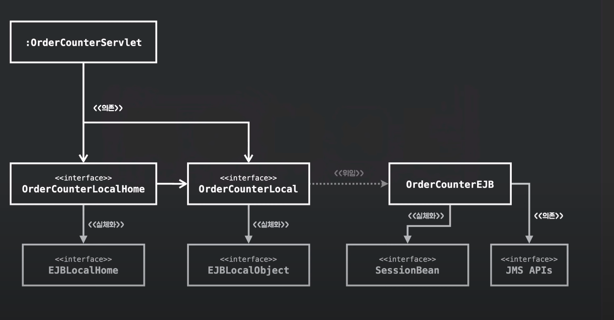

# POJO

 + 어플리케이션을 핵심 코드를 만들때 엔터프라이즈 빈즈 보다 자바 객체로 만드는게 
 + 많은 이점이 있다.
 + EJB 말고 일반 자바 객체로 개발하자.
 + 일반적이고 이해하기 쉬운 용어 덕분에 널리알리지기 쉽다.? (POJO)
 

## POJO 프로그래밍 법

 + 일반 자바객체에 에플리케이션 핵심 로직과 기능을 담아 설계 개발법
 + 유용한 객체지향설계 원칙 지키고 유지보수 확장성 증가 테스트 쉬움

## POJO 방식 개발?

 + POJO 방식으로 개발하면 
 + 트랜잭션처리 보안 / 엔터프라이즈 서비스를 직접 구현해야 됨.
 + 또다른 문제 야기..

## EJB

 + EJB가 짜둔 코드 바탕으로 코드를 개발하는 방식으로 개발함

## 로드 존슨 엔터프라이즈 아키텍쳐의 목표 

 + 객체지향 설계원칙을 이용해야 한다.
 + 유지보수 확장성
 + 재사용성 높이자
 + 테스트 용이성 확보

 + 태생적으로 복잡한 소프트웨어들  사실 어떤 방법을 쓰더라도 근본적인 복잡성은 못없앰
 + 하지만 객체지향 원칙 설계원칙을 지키면 복잡성을 다루는대 도움이 됨.
 + 객체지향 설계는 올바른 객체에게 올바른 책임을 할당하고
 + 낮은 결합도와 높은 응집도를 창조하는 활동 
 + 책임을 할당하는 작업이 응집도를 결합도와 같은 설계 품질과 깊이 연관 되있음.
 + 설계는 변경을위해 변경에는 어떤식이든지 비용이 발생
 + 훌륭한 설계는 합리적인 비용안에서 변경을 수용할수있는 구조를 만드는 것이다.
 + 객체지향 설계를 통해 유지보수 확장성 재사용을 써야 된다.
 + 테스트는 소프트웨어 생명주기 전반에 걸쳐져있는 필수적인 활동
 + 테스트 할 코드가 특정 환경만을 고려해 작성되있있따면 코드가 요구한 환경이 준비되있지않으면 코드를 테스트 할 수 없음
 + 테스트 용이성을 고려해 설계해야됨
  

## 스프링 개발

 + 스프링 프레임워크 1.0 출시 2004년
 + 경량 프레임워크를 이용해 간결하고 효과적인 방식으로 엔터프라이즈 애플리케이션 개발 
 + EJB 없이

## 왜 EJB 없이 개발해야되?

 + EJB는 기술적인 복잡함 덜어주려다 오히려 더 큰 복잡함을 초래함
 + 서버가 인식성이 떨어진다
 + 확장성 보장 약속 지키지 못함
 + 단순한 일도 어렵게 만듬.
 + EJB 틀 안에서 자바코드 작성하기 때문에 자바 장점 상쇄
 + EJB 규약이 침투 ? 변경 취약 테스트 어렵게 만듬.
 + EJB기바 대신 POJO기반 이 있음

## 침투적인 기술 / 비침투적인 기술

 + EJB 작성 코드? EJB 특정 클래스를 상속하고 서버에 종속적인 클래스 특정 인터페이스 구현 통해서만 작성하게 함.
 + 어떤 기술을 적용했을때 그기술과 관련된 코드나 규약등이 나타나는 것을  침투적인 기술이라함
 + 해당기술에 적용사실이 코드에 드러나지않음 
 + 물론 어딘가에 기술에 적용따라 필요한 작업을 해주기 도하지만
 + 코드 설계와 구현에 방식을 제한하지않는 비 침투적인 기술

## 스프링

 + EJB와 마찬가지로 애플리케이션의 핵심코드 와 분리한 스프링
 + 비침투적인 기술이라는 전략 사용 .

## POJO 로 다시 돌아옴

 + 애플리케이션 핵심 코드는 일반 객체로 작성하는 것을 의미
 + 단지 EJB를 사용하지 않으면 POJO일까?

 + POJO 프로그래밍은 자바의 객체지향적인
 + 특징을 잘살려서 비즈니스로직에 충실하게 코드를 작성함.

출처 : https://daehungwak.github.io/til/docs/spring/fastcampus/springrunner101/00/