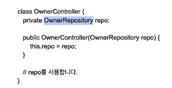
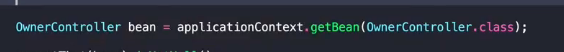
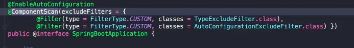

# 예제로 배우는 스프링 입문

## 제어의 역전 (IOC)

 + 제어 권이 역전 된다.
 + 의존성에 대한 제어권이 역전 됬다.
 + 보통 자기가 의존성을 만든다.

 + 사용은 하지만 만들진 않는다.
 + 의존성을 만드는 일은 누군가? 밖에서 해준다.
 + 스프링에 있는 IOC 컨테이너에서 (스프링은 bean관리) 구현체를 넣어줌.
 + 의존성을 관리한다? - > 필요한 의존성을 주입해준다.

## IOC 컨테이너

 + 애플리케이션컨텍스트는 빈 팩토리를 상속
 + 빈을 만들고 엮어주며 제공 해준다.
 + 빈 설정 : 이름 또는 ID , 타입 , 스코프
 + 허나 컨테이너를 쓸일을 많지 않다.
 + @controller 나 특정 인터페이스 / 직접 빈으로 등록하거나.. 그러면 IOC 컨테이너가 관리. (서로간의 의존성 주입을 해줌)
 + 의존성 은 빈끼리만 가능함..
 + IOC 컨테이너를 등록되어있는 bean을 사용하면 싱글톤 Scope를 사용 가능하다 (중요)

## 스프링 빈

  + @Controller / @Service / @Repository 등 으로 등록 가능함 + @Bean  @ ComponetScan (컴포넌트 스캔)

  + 이런식으로 등록되있는 빈을 가져 올  수 있다.

 + 어디부터 컴포넌트를 찾아보라고 컴포넌트 스캔이 알려 줌.
 + 스프링부트어플리케이션 어노테이션 위치부터 하위에 위치해있는 빈들을 찾아봐 그리고 등록해 
 + 그래서 제일 최상단에 위치 하는구나..
 + 래파지토리는 스프링 데이타JPA 를 통해서 빈으로 통해 됨. (특정한 애노테이션이 없고 특정한 인터페이스를 상속받은경우, 인터페이스를 상속받는 구현체를 찾아서 그 클래스에 그 인터페이스에 구현체를 내부에서 만듬 복잡함)
 + @Autowird 를 사용하면 IOC 컨테이너 에 등록되있는 빈을 자동 등록해줌
 

## 의존성 주입

 + 생성자 / 필드 / setter
 + 권장하는 방법은 생성자 주입.
 + 이유는 ? 필수적으로 사용하는 레퍼런스 없이는 인스턴스를 만들수 없도록 강제함.

## AOP 

 + Aspect Oriented Programing (흩어진 코드를 모아라 ?)

 
 
 + 예시 ..
 + @Tranjectional (앞뒤로 원래 여러가지 코드가 붙음 .)
 + 구현 방법 : 컴파일 / 바이트코드 조작 / 프록시 패턴
 + 컴파일 : A.java --(AOP) -- -> A.Class(AspectJ)
 + 바이트 코드 조작  : A.java -> A.class-- (AOP) -- > 메모리 (읽어오고 메모리에 올릴때 조작) (AspectJ가 조작)
 + 프록시 패턴 : 스프링 AOP가 사용하는 방법 

## 프록시 패턴

 + 스프링에선 자동으로 빈에  프록시클래스가 만들어짐 .

## AOP 실습

 + @Retention : 언제까지 어노테이션 유지할래.
 + @Target : 어디에 쓸래 
 + 타겟을 정해놓고 / Aspect 클래스로 나눠서 (자동으로)
 + 성능 측정을하면서 원래 코드를 실행.

## PSA

 + Portable Service Abstraction
 + @Tranjection(All of Nothing)