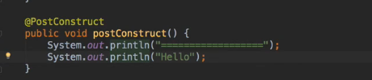
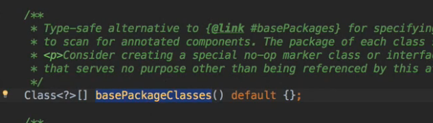
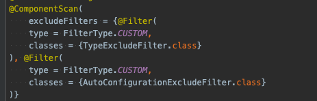
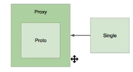
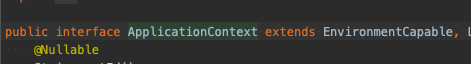
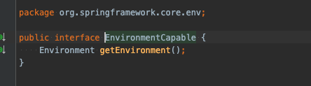
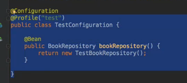
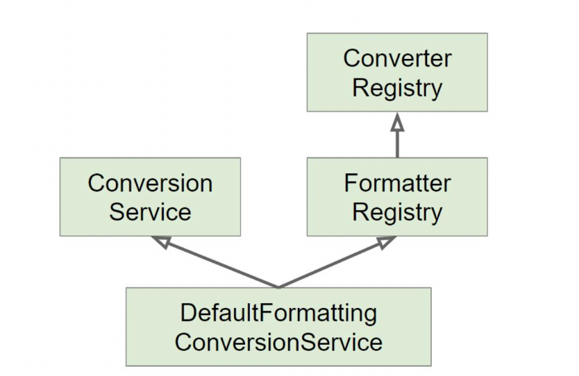
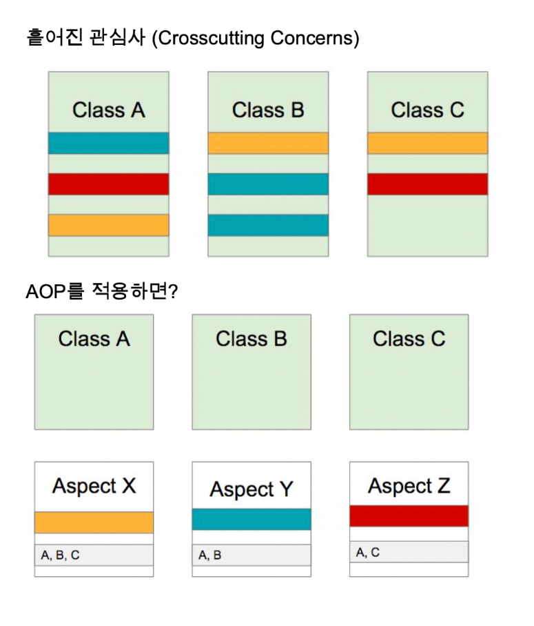
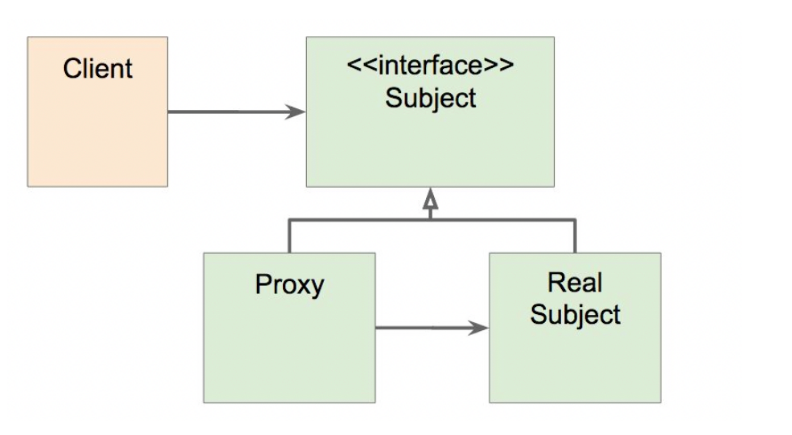

# 스프링 프레임워크 핵심 기술

 

## Ioc 컨테이너 1 부 : 스프링 Ioc 컨테이너와 빈

 + BeanFactory 가장 핵심정인 클래스.
 + ApplicationContext는 빈팩토리를 상속받아 기능을 구현함.
 

## bean

 + Bean이란 ? Ioc 컨테이너가 관리하는 객체
 + 라이프사이클 인터페이스 지원 

## 스코프

 + 싱클톤 : 하나
 + 프로토타입: 매번 다른 객체

## Ioc 컨테이너 2 부 : ApplicationContext와 다양한 빈 설정 방법

## ApplicationContext와 다양한 빈 설정 방법

 + xml / application Config등 스프링 빈으로 등록하는 여러가지 방법
 + 스프링 부트에선 @SpringBootApplication에 컴포턴트 스캔 어노테이션이 들어가있다
 + @SpringBootApplication 은 최상단에 위치한 클래스이므로 (항상?) 그 밑에 있는 패키지 클래스들은 전부
 + 스프링 빈으로 등록이 가능하다.

## Autowired

 + 의존성 주입에는 생성자 / 필드 / 세터 방식으로 주입이 가능하다.
 + 생성자인경우 1개인경우 autowird 생략이 가능함.
 + Lombok을 사용할경우 @RequiredArgsConstructor을 사용해
 + private final A a ; 이런식으로 생성자 주입이 가능하다.
 + 또한 @Primary/@Qualifier 통해 구헨쳐의 클래스명 지정 빈을 가져옴 (구현체가 여러개 일때)
 + 그리고 final이 선언 가능하다.
 + 반면 필드주입은 가장 편리하면서 @Autowired만 붙여주면 된다
 + 하지만 대부분 생성자 주입 방식 추천.
 + 순환참조 방지 / final 선언가능 / 테스트 코드 작성 용이
 + 순환 참조로 의존성을 주입하면 코드 실행시 서버가 죽음... 이걸 방지하기위해 생성자 주입 방식. 추천
 + 서버 자체가 구동되지않아서 바로 에러발생으로  순환참조 방지 가능.

 + 필드 주입과 수정자주입은 먼저 빈을 생성한후 주입하려는 빈을 찾아 주입하지만.
 + 생성자 주입 은 먼저 생성자의 인자에 사용되는 빈을 찾거나 빈 팩토리에서 만듬. 그 후에 찾은 인자 빈으로 주입하려는 빈생성자 호출
 + 즉 먼저 빈을 생성하지 않고 주입하려는 빈을 먼저 찾기 때문.

## 정리

 + 따라서 생성자 주입방식은 순환 참조가 발생하면 실행시 무제생김
 + 나머지 두가지는 객체 생성 시점에 빈을 주입하기 때문에 서로 참조하는 객체가 생성되지 않은 상태에서 그 빈을 참조하기 때문에 오류 발생.

## BeanPostProcessor 

 + 빈을 만든다음. 빈을 이니셜라이제이션한다음 .
 + 빈이니셜라이제이션 -> 빈인스스턴스 생성 -> 빈이니셜라이제이션 이후 이전 . 콜백.
 + 이니셜라이제이션 ? @PostConstruct 으로도 정의가능 .
 + @Autowired 를 처리해준다  

 ### 정리

 + 빈 후 처리기라고도 함, 빈의 생명주기와 빈 팩토리의 생명주기에 관여.
 + 빈의 초기화 되기 전 초기화 된 후 2개의 기회를 제공 .
 + 어떨 때 사용 ? -> 스프링이 빈 저장소에 등록할 목적으로 생성한 객체를 !
 + 빈 저장소에 등록하기 직전에 조작하고 싶을때 사용 하는 기능,
 + 객체를 조작하거나 / 완전히 다른객체로 교체하는 것 을 의미
 

 ### 빈 후처리기 과정
  
 + 스프링 빈 대상이 되는 객체 생성
 + 생성된 객체를 빈 저장소에 등록하기 직전 빈 후처리기에 전달
 + 빈 후처리기가 조작 혹은 다른객체로 교체
 + 전달된 빈을 그대로 반환해 해당 빈 등록, 교체하면 다른 객체가 빈 저장소에 등록

 ### 예제

      public interface BeanPostProcessor {
        @Nullable
        default Object postProcessBeforeInitialization(Object bean, String beanName) throws BeansException {
            return bean;
        }

        @Nullable
        default Object postProcessAfterInitialization(Object bean, String beanName) throws BeansException {
            return bean;
    
        }
    }

 + postProcessBeforeInitialization 메서드 -> 객체 생성이후 @PostConstruct 어노테이션과 같이
 + 초기화 발생하기 전에 호출되는 포스트 프로세서
 + postProcessAfterInitialization 메서드 ->: 객체 생성이후 @PostConstruct와 같이 초기화가 발생한 다음 호출되는 포스트 프로세

 출처 : https://jaimemin.tistory.com/2028

## Ioc 컨테이너 4부 @Component와 컴포넌트 스캔

 + 스프링 3.1부터 도입

 + 타입세이프한 방법으로 사용가능한 속성. 
 + 값이 전달된 클래스 기준으로 콤포넌트 스캔 시작!

 + filter를 통해 스캔에서 제외되는것도 설정.
 + 어디 부터 어디 스캔? 어떤걸 걸러낼것인가 이 설정이 있는게 중요.

### 펑션을 사용한 빈 등록

  + 리플렉션 , 프록시를 사용하지 않는 빈 등록 
  + 애플리케이션 구동 타입과 같은 성능 항샹 .

    public static void main(String[] args) {
        new SpringApplicationBuilder()
            .sources(Demospring51Application.class)
            .initializers((ApplicationContextInitializer<GenericApplicationContext>)
                    applicationContext -> {
                    applicationContext.registerBean(MyBean.class);
                    })
                    .run(args);
    }

 + 이니셜라이즈 같은 경우는 내가 원하는 애플리케이션컨텍스트 주입 가능(외부 빈 주입가능 다른 패키지 범위에있는..)

### 동작원리

 + 다른 모든 빈들을 만들기 등록하기 이전에 컴포넌트 스캔을 해서
 + 빈으로 등록해줌
 + 다른 빈이란? 우리가 직접 빈으로 등록하는것 / @Bean 에노테이션 사용해서 등록하는 것들도 포

## Ioc 컨테이너 5부 : 빈 스코프

 + default scop:singleton @controller @ service ..
 + 애플리케이션 전반에 걸쳐서 해당 빈 인스턴스가 1개 뿐이라는 말.
 + 경우에따라 Request , Session WebSocket등 프로토 타입도 있음
 + 프로토 타입은 매번 새로운 객체 생성 .
 + 복합해서 사용할 때 ? 프로토 타입이 싱글 톤 빈을 참조하면 괜찮음.
 + 반대의 경우는 ? 한번 싱글톤 빈이 만들어 질때 싱글톤 내 프로토타입 객체는 같은 객체만 나온다.
 + 해결 방식은? proxyMode = ScopedProxyMode.TAGET_CLASS  하면 다이나믹 프록시가 적용되서 해결됨 .
 + 싱글톤 -> 프록시 -> 프록시내 프로토 타입 

 
 + CGLIB 기반 프록시..

## IoC 컨테이너 6부: Environment 1부. 프로파일

### 프로파일 ?

 + 빈들의 그룹.
 + Environment의 역할은 프로파일 확인 설정 
 + 알파 베타 스테이징 등.. 각각의 환경에서 다른 빈을 써야될 경우..

    Environment environment = ctx.getEnvironment();

 + 예시 test profile에만 앱설정
 + @Profile("!prod") 이런식 설정도 가능 

## IoC 컨테이너 6부: Environment 2부. 프로퍼티

 + 프로퍼티는 여러가지 형태로 제공 (키:벨류 쌍 )
 + Environment 역할은 프로퍼티 소스 설정 및 프로퍼티 값을 가져오는 것 이다.
 + 우선 순위
 + Servliet Config 매개변수 -> ServletContext 매개변수 -> JNDI(java:comp/env/) -> JVM 시스템 프로퍼티 -> JVM 시스템 환경변수

## IoC 컨테이너 7부: MessageSource

 + 메세지를 다국화 하는 방법 
 + ApplicationContext에 이미 구현 되있다
 + 스프링 부트를 사용하면 Message.properties 사용 가능.

## IoC 컨테이너 8부: ApplicationEventPublisher

 + 이벤트 기반에 프로그래밍할때 유용함.
 + ApplicationEvent 상속 받아서 사용
 + 4.2 이후 부터 ApplicationEvnet 상속받을 이유 없다.

## IoC 컨테이너 9부: ResourceLoader
  
 + 리소스를 로딩해주는 인터페이스
 + ResourceLodaer  오토와이어드해서 받기.
 + 파일 시스템에서 읽어오기 / 클레스패스에서 읽어오기  / URL에서 읽어오기 / 상태,절대 경로로 읽어오기

## Resource 추상화 

 + java.net.URL을 추상화 한 것.

### 추상화 이유

 + 클래스 패스 기준으로 리소스 읽어오는 기능 부재.
 + ServletContext를 기준으로 상대 경로로 읽어오는 기능 부재
 + 새로운 핸들러 등록하여 특별한 URL 접미사를 만들어 사용할 수는 있찌만 구현이 복잡하고 편의성 메소드가 부족 

### Resource 인터페이스

 + 주요메서드들
 + getInputStream()
 + exists() (리소스가 항상 존재한다는 보장이 없어서 확인하는 메서드 정의)
 + isOpen() 등..

### 구현체

 + UrlResource  -> http,https,ftp ,file,jar 프로토콜 지원
 + ClassPathResource - > 접두어 classpath: 지원
 + FileSystemResource 
 + SerlvetContextResource : 읽어들이는 리소스타입이 애플리케이션 컨텍스트와 관련있어 자주사용 / 웹 애플리케이션 루트에서 상대 경로로 리소스 찾음

    @Autowired
    ResourceLoader resourceLoader;

    @Override
    public void run(ApplicationArguments args) throws Exception {
        // 클래스 패스 기준으로 문자열에 해당하는 리소스를 찾아서 빈 설정 파일로 활용한다.
        var ctx1 = new ClassPathXmlApplicationContext("config.xml");

        // 파일 시스템 기준으로 문자열에 해당하는 리소스를 찾아서 빈 설정 파일로 활용한다.
        var ctx2 = new FileSystemXmlApplicationContext("config.xml");

        // 애플리케이션 루트 기준으로 문자열에 해당하는 리소스를 찾아서 빈 설정 파일로 활용한다.
        var ctx3 = new WebApplicationContext("config.xml");
    }

 + Resource의 타입은 location 문자열과 ApplicationContext 타입에 따라 결정 됨.
 + 만약 FileSystemXmlApplicationContext로 불러왔다면, FileSystemResource로 리졸빙 한다.
 + FileSystemXmlApplicationContext -> FileSystemResource
 + ClassPathXmlApplicationContext -> ClassPathResource
 + WebApplicationContext -> ServletContextResource

### ApplicationContext에 상관없이 리소스 읽어오기

 + ApplicationContext의 타입에 상관없이 리소스 타입을 강제하려면 java.net.URL 접두어(+ classpath:)중 하나를 사용할 수 있다.
 + 명시적이어서 이방법을 더 추천.
 + classpath:me/whiteship/config.xml -> ClassPathResource / file:///some/resource/path/config.xml -> FileSystemResource

### 예제
    @Autowired
    ResourceLoader resourceLoader;

    @Override
    public void run(ApplicationArguments args) throws Exception {
        // 리소스 로더의 타입. 웹 애플리케이션 리소스로 나와야 한다.
        System.out.println(resourceLoader.getClass());

        Resource resource = resourceLoader.getResource("classpath:test.txt");
        // 리소스의 타입. 클래스 패스 리소스가 나와야 한다.
        System.out.println(resource.getClass());

        System.out.println(resource.exists());
        System.out.println(resource.getDescription());
        System.out.println(Files.readString(Path.of(resource.getURI())));

### 결과
    class org.springframework.boot.web.servlet.context.AnnotationConfigServletWebServerApplicationContext
    class org.springframework.core.io.ClassPathResource
    
    true
    class path resource [test.txt]
    hello spring

 + 스트링 부트 사용시 classpath 명시를 해줘야 된다.
 + 스프링 부트에서 톰캣은 컨텍스트 패스가 기본적으로 지정되 있지 않아서.

## validation 추상화

### 특징

 + 어떤 계층과도 관계가 없음 -> 웹 서비스 데이터 다양한 곳에서 사용 
 + Bean Validation 지원  / 자바 표준 스펙 = JAVA EE 표준 스펙
 + @NotEmpty ,@NotNull 등

### 구현

 + supports() / validate()

    public class EventValidator implements Validator {

        @Override
        public boolean supports(Class<?> clazz) {
            return Event.class.equals(clazz);
        }
    
        @Override
        public void validate(Object target, Errors errors) {
            ValidationUtils.rejectIfEmptyOfWhitespace(...);
        }
    }

    @Autowired
    Validator validator;

    @Override
    public void run(ApplicationArguments args) {
        Event event = new Event();
        event.title("");
        Errors errors = new BeanPropertyBindingResult(event, "event");

        // 검증한다.
        validator.validate(event, errors);
    }

    public class Event {
    
        @NotEmpty
        String title;
        
        ...
    }

## 데이터 바인딩 추상화

 + 프로퍼티의 값을 타겟 객체에 설정하는 것.
 + 입력값은 대부분 문자열임. 그 값으 ㄹ객체가 가지고 있는 Int,long ,Bollean, Book 같은 도메인 타입으로 변환해서 넣어주는 기능

### DataBinder

 + 데이터 바인딩에 사용되는 인터페이스

### PropertyEditor

 + 고전적 방식  thread-safe 하지 않음. / 상태정 보를 저장하고있어 싱글톤 빈으로 등록해 쓰면 큰일임
 + Object와 String 간의 변화만 할 수 있어 사용 범위 제한.

    public class EventPropertyEditor extends PropertyEditorSupport {

        @Override
        public String getAsText() {
            return ((Event) getValue()).getTitle();
        }
    
        @Override
        public void setAsText(String text) throws IllegalArgumentException {
        }
    }

 + 현재는 사용하지 않음

### Converter

 + S 타입에서 T 타입으로 변환하는 변환기
 + 상태정보 X 쓰레드에서 안전
 + ConverterRegistry에 등록해 사용

    public class StringToEventConverter implements Converter<String, Event> {

        @Override
        public Event convert(String source) {
            Event event = new Event();
            event.setId(Integer.parseInt(source));
            return event;
        }
    }

### Formatter

 + PropertyEditor 대체제
 + 웹에 최적화 된 인터페이스
 + Object String 간의 변환담당
 + 문자열을 Locale에 따라 다국화 기능 제공
 + FormatterRegistry에 등록해 사용

    public class EventFormatter implements Formatter<Event> {
        @Override
        public Event parse(String text, Locale locale) throws ParseException {
        Event event = new Event();
        int id = Integer.parseInt(text);
        event.setId(id);
        return event;
        }
    
        @Override
        public String print(Event object, Locale locale) {
            return object.getId().toString();
        }
    }

### ConversionService
 

 + 지금까지 쓴 Formatter등의 실제 변환 작업은 이 인터페이스를 통함
 + 쓰레드에 안전함
 + 스프링 MVC 빈 설정 spEl에서 사용

### 스프링 부트에서

 + 웹 애플리케이션인 경우 스프링 부트가 WebConversionService를 빈으로 등록해준다.
 + DefaultFormattingConversionSerivce를 상속하고 있어 더 많은 기능을 가진다.
 + Formatter와 Converter 빈을 찾아 자동으로 등록해 준다

## 스프링 AOP

### 개념소개

+ 흩어진 Aspect를 모듈화 할 수 있는 프로그래밍 기법.
+ 흩어져 있으면 유지보수가 어렵다.
+ 관심사별로 모은 뒤 적용할 곳 입력

### 주요 개념

 + Aspect : 각 모듈
 + Target : Aspect 적용 대상
 + Advice : 해야할 일
 + Joint point : 합류지점 , 끼워넣을 지점 ex) 메서드 실행시
 + Pointcut : 어디에 적용 되야됨?

### AOP 구현체

 + Java : AspectJ , 스프링 AOP

### 적용 방법

 + 컴파일 / 로드타임(클래스파일 로딩시점) / 런타임

### 프록시 기반 AOP

 + 프록시 기반에 AOP 구현체
 + 스프링 빈에만 AOP 적용 할 수 있다.
 + 스프링 IoC와 연동해 애플리케이션에서 가장 흔한 문제를 해결하는 목적
 + 모든 AOP기능을 제공하기 위함이 아님.

 + 기존 코드 변경 없이 접근 제어민 부가 기능 추가
 + 허나 매번 프록시 클래스 작성해야하고 / 여러 클래스에 여러 메서드에 적용하려면 어렵

### 스프링 AOP

 + 이런 문제를 해결하기 위해 등장
 + Ioc컨테이너가 제공하는 기반시설과 Dynamic 프록시를 사용해 복잡한 문제 해결
 + 스프링 IoC는 기존 빈을 대체하는 동적 프록시 빈을 만들어 등록함
 + 클라이언트 코드 변경은 없다.

### 동적 프록시

 + 동적으로 프록시 객체 생성하는 방법
 + 자바는 인터페이스 기반의 프록시 생성.
 + CGlib는 클래스 기반도 지원한다.