# MVC

 
## MVC?

 + Model / View / Controller

## Model

 + 평범한 자바 객체 POJO
 + 도메인 객체 또는 DTO로 화면에 전달 또는 화면에서 전달 받은 데이터를 담는 객체

## view

 + HTML , JSP 타임리프 등
 + 데이터를 보여주는 역할

## Controller

 + 스프링 @MVC
 + 사용자 입력을 받아 모델 객체 데이터 변경 또는 모델 객체 뷰에 전달
 + 입력값 검증 / 입력 데이터 모델 객체 변경 / 변경된 모댈 객체 뷰에 전달

## MVC 장점 

 + 동시 다발적 개발  :백엔드 개발자와 프론트 개발자가 독립적 개발 진행
 + 높은 결합도 : 논리적으로 관련있는 기능을 하나의 컨트롤러로 묶거나 특정 모델과 관련있는 뷰를 그룹 화 가능
 + 낮은 의존도: 뷰 모델 컨트롤러 독립적
 + 개발 용이성 : 책임이 구분되 어있어 코드 수정 편함

## 단점

 + 코드 네비게이션 복잡함
 + 코드 일관성 유지 노력 필요
 + 높은 학습 곡선

# Servlet

 + 자바 엔터프라이즈 에디션은 웹 애플리케이션 개발용 스팩과 API 제공
 + 요청 당 쓰레드 (만들거나 , 풀에서 가져와서) 사용
 + 그 중 가자 중요한 클래스중 하나 HttpServlet

## 장점

 + 빠르고 , 플랫폼 독립적
 + 보안 , 이식성

## 서블릿 컨테이너 (톰캣, 제티 언더토)

 + 세션 관리
 + 네트워크 기반 서비스
 + MIME 기반 메시지 인코딩 디코딩
 + 서블릿 생명 주기 관리

## 서블릿의 생명 주기
 
 + 서블릿 컨테이너가 서블릿 인서튼서의 init()메서드를 호출하여 초기화
 + -> 최초 요청을 받았을 때 한번만 초기화 하고나면 그 다음 요청 부턴 이과정 생략.
 + 초기화 -> 클라이언트 요청 처리  각 요청은 별도의 스레드로 처리하고 이 때 서블릿 인스턴스의 service()메서드 호출
 + -> 이안에서 Http 요청 받고 클라이언트로 보낼때 응답을 만듬 service() 보통 Http Method에 따라 doGet,doPost 등으로 처리 위임
 + 서블릿 컨테이너의 판단에 따라 해당 서블릿 메모리에서 내려와 할 시점에 destroy()를 호출함

## 서블릿 리스너

 + 웹 애플리케이션에서 발생하는 주요 이벤트 감지 각 이벤트에 특별한 작업이 필요한 경우 사용
 + 서블릿 컨텍스의 수준의 이벤트 - > 컨테긋트 라이프사이클 이벤트 , 컨텍스트 애트리뷰트 변경 이벤트
 + 세션 수준의 이벤트 -> 세션 라이프사이클 이벤트 세션 에트리뷰트 변경 이벤트

## 서블릿 필터

 + 들어온 요청을 서블릿으로 보내고 또 서블릿이 작성한 응답을 클라이언트로 보내기 전에 특별한 처리기가 필요할 경우 사용 / 체인형태임

# Dispatcherservlet

 + 스프링 Mvc는 프론트 컨트롤러 패턴 -> 프론터컨트롤러는 디스패처 서블릿임.
 + 디스패처 서블릿은 스프링 MVC 핵심
 + 디스패처 서블릿? HttpServlet 상속받아 사용  서블릿으로 동작
 + DispacherServlet을 서블릿으로 자동으로 등록 
 + 모든 경로 urlPatterns="/"에 대해 매핑 

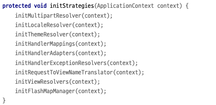

 + 전략 패턴을 사용하느 디스패처서블릿 

## 요청 흐름

 + 서블릿 호출 되면 HttpServlet 제공하는 service() 호출 
 + 디스패처서블릿의 부모 -> FrameworkServlet에서 super.service(HttpServlet.Service) 시작으로
 + 여러메서드가 실행되면서 DispacherSerlet.doDispatch()실행

# 스프링 MVC

 + 큰 강점은 DispatcherServlet 코드 변경 없이 원하는 기능을 변경 확장 가능. -> 나만의 컨트롤러만들수 있따.

## RequestMappingHandlerMapping

 + 핸들러 매핑 -> 핸들러 매핑에서 컨트롤러를 찾아야됨 -> 스프링 빈 이름으로 핸드러를 찾을 수있는 핸들러 매핑 필요.
 + 핸들러 어댑터 -> 핸들러를 실행할 수 있는 핸들러 어댑터 필요 
 + 이미 스프링에는 구현되 있는 기능들.

### HandlerMapping

 + RequestMappingHandlerMapping -> 애노테이션 기반의 컨트롤러인 @RequestMapping에서 사용
 + BeanNameUrlHandlerMapping : 스프링 빈 이름으로 핸들러 찾음
 + 순서대로 실행해서 핸들러를 찾음 0 , 1

### HandlerAdapter

 + RequestMappingHandlerAdapter : 애노테이션 기반 컨트롤러인 @RequestMapping에서 사용
 + HadlerAdapter의 Supports() 순선대로 호출..

# 스프링 MVC 구성 요소

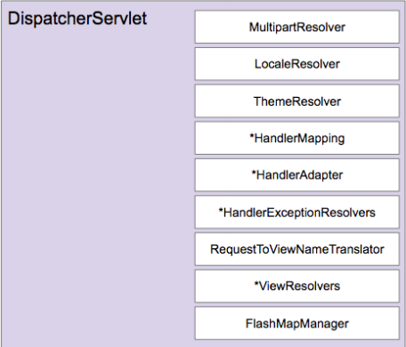

### MultipartResolver

 + 파일 업로드 요청 처리에 필요한 인터페이스 -> 바이너리 데이터를 조금씩 처리를 구현체에 위임함
 + HttpServletRequest - > MultipartHttpServletRequest로 변환 해줌

### LocaleResolver 

 + 클라이언트의 위치 정보 파악하는 인터페이스
 + 기본 
 + 은 요청의 accept-laguage 보고 판단한다.

### ThemeResolver 

 + 애플리케이션에 설정된 테마를 파악하고 변경하는 인터페이스.
 + css 변경 쿠키 , 세션, fiexed 등 구성  기본적으로 Fiexed 사용해서 거의 실질적으로 사용안함

### FlashMapManage

 + FlashMap 인스턴스를 가져오고 저장하는 인터페이스
 + FlashMap은 주로 리다이렉션을 사용할 대 요청 매개변수를 사용하지 않고 데이터 전달하고 정리할때 사용함.
 + Redirect:/events

# MVC 설정

## Formatter

    public class PersonFormatter  implements Formatter<Person> {

    @Override
    public Person parse(String name, Locale locale) {
        return new Person(name, name);
    }

    @Override
    public String print(Person person, Locale locale) {
        return person.toString();
        }
    }

    @Configuration
    public class WebConfig implements WebMvcConfigurer {

    @Override
    public void addFormatters(FormatterRegistry registry) {
        registry.addFormatter(new PersonFormatter());
        }
    }

    @RestController
    @RequestMapping("/sample")
    public class SampleApi {

    @GetMapping("/{name}")
    public Person sample(@PathVariable("name") Person person) {
        return person;
        }
    }

 + Formmatter를 등록하면 PathVariable 어노테이션으로 받을 수 있음
 + parse : 문자열을 객체로 변환
 + print : 객체를 문자열로 변환한다.
 + Spring Boot를 쓰게 되면 WebConfig에 addFormatters 설정은 필요하지 않음.
 + 스프링 부트가 알아서 빈 등록 시 관리해줌 .

# HandlerIntercepter

 + preHandler 을 통한 전처리
 + postHandler을 통한 후처리 가능
 + afterComplection 완전히 끝난 이후.

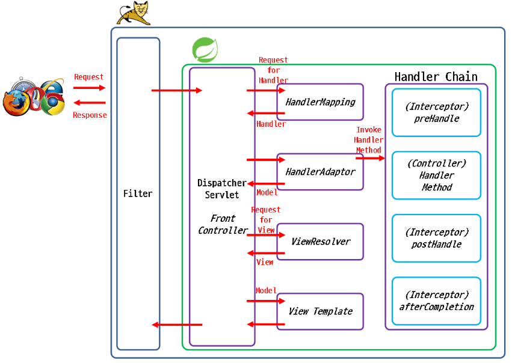
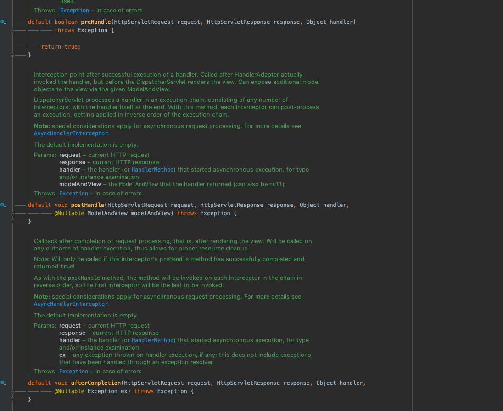

### preHandler

 + 어떤 handler method가 호 출 될 것을 알기 때문에. 요청에 대해 구체적이 ㄴ처리 가능.
 + return type은 boolean이다. true 반환시 다음 Interceptor preHandler처리 false 면 더이상 처리하지않고 멈춘다.

### postHandler

 + Handler Method 까지 실행하고 view 렌더링 하기전 실행
 + ModelAndView 타입의 객체를 매개 변수로 받음.
 + 그래서 모델객체에 추가 정보나 view를 변경하는 작업을 함.

### afterCompletion 

 + view 렌더링 마친 다음 모든 요청 처리 끝난 다음 호출
 + preHandler의 반환값이 true 인 경우 PostHandle 실행 상관없이 실행된다.

### 정리

  + 서블릿 필터에 비해 좀 더 구체적인 구현이 가능함 (핸들러에 대한 정보가 있기 때문)
  + 전후처리 내용이 Spring과 밀접한 관련이 있으면 당연히 사용하는게 좋지만 여전히 Servlet Filter사용이 좀더 자연스러움
  + ex) XSS 공격은 특정 Handler 공격이 아니고 Spring과 무관해서 filter가 더 낫다
  + 
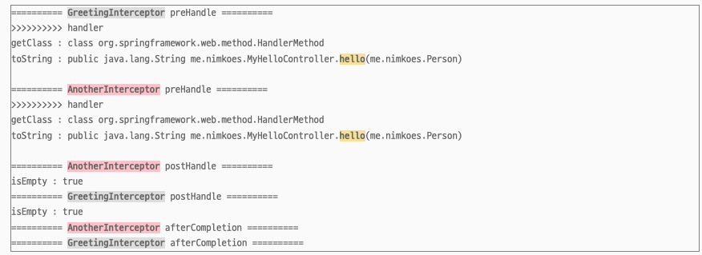
  
 + 특별한 순서가 없다면 등록 순으로
 + postHandle / afterCompletion은 역순으로 실행 됨. 
 + true를 반환하는 preHandler가 있으면 afterCompletion 까지는 실행함 해당 인터셉터는.
 + 그리고 하나라도 false를 반환하면 handler method는 실행 되지 않는다.
 + 특정 url 패턴을 적용해 인터셉터 가능하다.

출처 : https://xxxelppa.tistory.com/329

# ResourceHandler

 + HTML , CSS , Javascript , image 등 정적 자원 처리 핸들러
 + 정적 자원 : static resource , 동적 자원 dynamic resource 
 + -> HTTP 요청 에 따른 응답해주는 자원 형태가 바뀔 수 있는지 따라 구분해줌

## 정적인 자원과 동적인 자원 처리하는 서버를 구분하는 이유?

 + 서버는 정적인 자원을 처리하거나 동적인 자원 처리를 전담 한다.
 + 정작 자원과 동적인 자원을 처리하는 이유는?
 + 정적 자원 처리하는대 굳이 동적 자원처리하는 서버가 처리해서 사용중이라면 ?
 + 동적인 자원을 처리해야 할때 정적인 자원 처리 이유로 일을 못할 수 있음. -> 논리적 물리적으로 구분하여 구성하자.

## 동작

 + 클라로 부터 리소스 요청 받으면 정적자원 요청인지 확인
 + 맞으면? 서버에 요청하지않고 클라이언트에 리소스 전달
 + 만약 웹 서버가 처리할 수 없는 리소스 요청 받으면 웹 서버는 웹 애플리케이션 서버에 요청을 전달해 응답으로 전달할 리소스를 동적으로 생성하도록 함.
 + ex) 동적자원 쇼핑몰에 등록된 상품의 재고 수량이 몇개인지 확인.
 + 즉 같은 요청이라고해도 매번 결과가 달라질 수 있고 이 요청에 대해 처리는 서버에서 Servlet 데이터를 가공하여 클라에 반환해야 됨.

# 메시지 컨버터

 + HTTP request body OR HTTP response body에 담긴 데이터를 원하는 형태로 변환하여 사용하는 기술

    @GetMapping("/message")    
    @ResponseBody    public String message(@RequestBody Person person{        
    return "hello person"; 
        }

 + request Body data를 Person으로 변환하도록

## 기본적으로 제공해주는 메시지 컨버터

 + 바이트 배열 컨버터
 + 문자열 컨버터
 + 리소스 컨버터
 + Form 컨버터 (Html form data -> map으로 변환)
 
## 등록방법

  + configureMessageConverter / extendMessageConvertes 메소드  재정의
  + 그러나 보통 라이브러리를 추가하면 자동으로 등록되어 사용 함.
  + Spring boot 에선 별도의 메세지 컨버터를 등록하지 않아도 json 형태의 데이터를 위한 메시지 컨버터 사용가능
  + -> spring boot starter web 통해 spring boot stater json 의존성이 추가되니깐.

# 요청 매핑 (Handler method)

 

# 핸들러 메소드 : argument & return value (overview, 처리 구현체 자동 등록)

 + handler method 의 argument 와 Return type 활용 방법은 어떻게 되는걸 까?

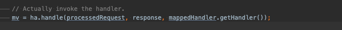

 + doDispather 에서 어댑터를 찾은후 요청처리하는 부분을 들어가 보자.

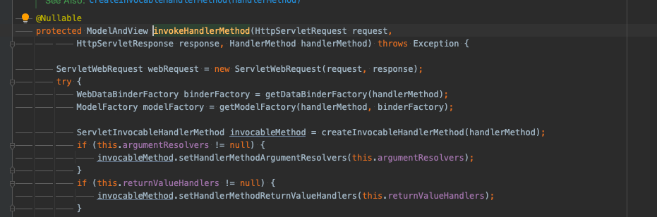

 + argument를 처리 하는 argumentResolver 
 + return value를 처리하는 returnValueHandlers를 등록해주는 부분이 있음

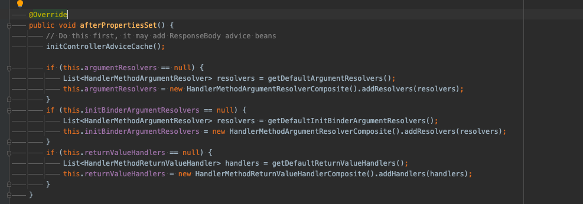

 + RequestMappingHandlerAdapter 클래스에서  getDefaultArgumentResolvers / getDefaultReturnValueHandlers 를 등록해줌

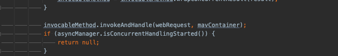

 + 실제로 Handler method를 실행하는 부분
 + 

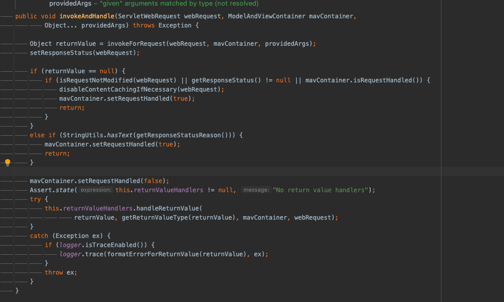

 + invokeAndHandle 은 요청을 처리한 다음 앞서 등록한 returnValueHandlers 로 return value 를 처리하도록 되어 있음 

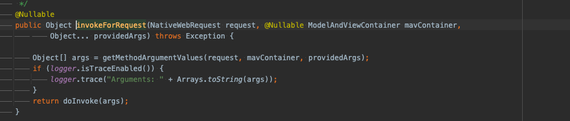
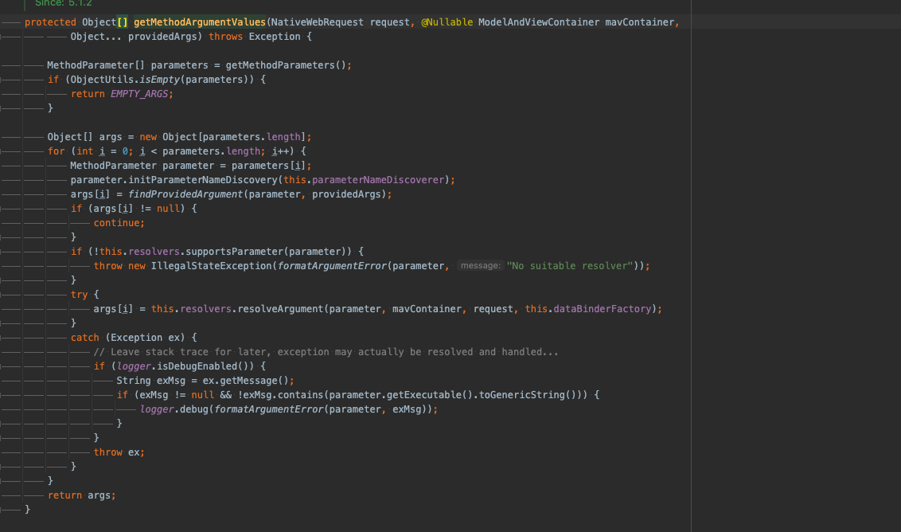

 + getMethodArgumentValues로 args 들을 추출해낸 다음 doInvoke 호출.
 + this.resolvers에는 앞서 default 자동 등록해준 argument를 처리하는 구현체 링크드리스트 이다.
