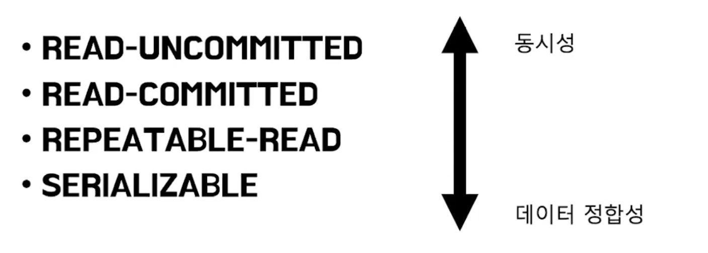
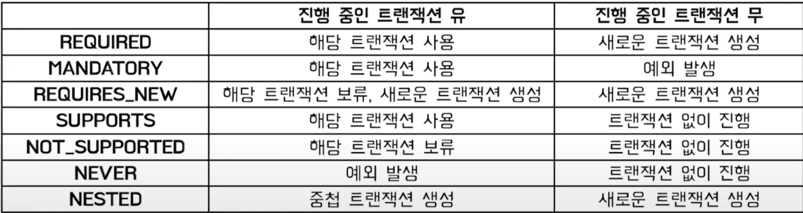
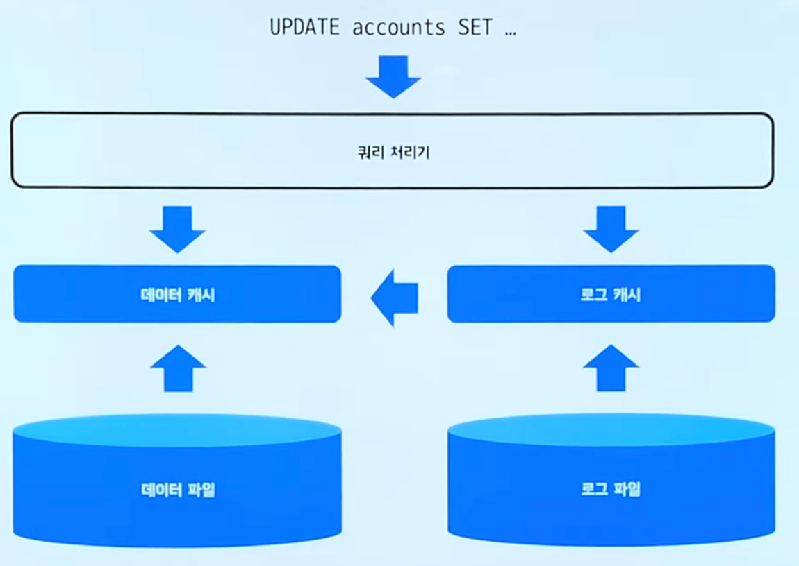

# Transaction

# 왜 필요 한가?

 + 없이 계좌 이체를 한다면?
 + ex) 계좌의 돈이 출금된다 .  / 돈이 출금 된다.
 + 도중에 오류가 발생하면??? 

 + 구매자에 출금됬는대 DB 에러 출금 되지 않았는데 입금이?
 + 둘다 안됀다.

 + 어떻게 처리 ? 어중간한 상태는 안됀다! 
 + 전부 없었떤 일로 해주자 트랜잭션의 역활

# 트랜잭션 이란?

 + 여러 쿼리를 논리적으로 하나의 작업으로 묶어 줌.
 + 하나의 트랜잭션은 커밋 OR 롤백이 됨.

# 트랜잭션의 성질

 + 트랜잭션이 안전하게 수행된다는 것을 보장하는 성질 ACID 
 + Atomicity(원자성) : 트랜잭션은 모든 DB에 반영되거나 전혀 반영되지 않아야됨 (완료되지않는거? 중간 어정쩡한건 없어!)
 + Consistency(일관성) : 트랜잭션 작업처리결과는 항상 일관성 있어야함. (마이너스 허락하지않는 조건? 이 조건이 문제될때 종료)
 + Isolation(독립성) : 둘 이상의 트랜잭션이 실행될때 다른 트랜잭션은 연산에 못끼어듬(LOCK)
 + Durability(지속성) : 트랜잭션 성공적이면 완료된 결과는 영구히 반영 .
 + 실제론 성능을 위해 성질이 완화 되기도 함

# 트랜잭션 격리 수준

 + 동시에 디비에 접근할때  접근을 어떻게 제어 할까?

## READ-UNCOMMITTED

 + 커밋 전 트랜잭션의 데이터 변경 내용을 다른 트랜잭션이 읽음  

### Dirty Read

 + 트랜잭션 A가 롤백되면? 
 + 트랜잭션 B는 무효한 값을 본다 

## READ-COMMITTED

 + 커밋이 완료된 트랜잭션의 변경사항만 다른 트랜잭션이 조회 가능
 + 커밋전 : 변경전 데이터 / 커밋후 : 변경 된 후

## Non-Repeatable READ

 + 한 트랜잭션이 조회한 데이터는 반복적으로 조회해도 같은 값을 반환함
 + 같은 트랜잭션 내에   같은 셀렉트를 조회했는대 데이터가 불일치..

## Repeatable-read

 + 커밋이 완료된 데이터를 조회한 내용이 동일성을 보장(한 트랜잭션 에서)

### Phantom Read

 + Non-Repeatable의 한 종류
 + 셀렉트 했을때 발생하는 문제
 + 조회를 했을때 새로 데이터가 생기거나 없애지는 행위 

## SERIALIZABLE

 + 한 트랜잭션에서 사용하는 데이터는 다른 트랜잭션에서 접근 불가
 + 성능은 가장 떨어짐..

 

# 트랜잭션 전파 타입

 + 트랜잭션 경계에세 어떻게 동작함 ?
 + 트랜잭션이 시작하거나 참여하는 방법 
 + 트랜잭션 처리되는 과정에서 또 다른 트랜잭션이 실행되면? (부모트랜잭션이 있냐없냐 경계설정 가능)

## 전파 타입

# 동작

 + Begin Tran ~ Commit Tran
 + 중간엔 쿼리.

 + 데이터파일 -> 데이터 캐시 로드 update 
 + 로그 캐시 기록 ReDo로그 : 변경 후 값을 기록 / UnDo: 변경전 값 기록

 + 데이터 캐시에 기록 !

 + 트랜잭션의 한 단위 !

 + 에러가나면 롤백 발생! UnDo 로그를 통해 복구를 한다.
 + 예상치 못한오류 다른 오류가발생하면? (예기치 못한오류)

 + ReDo 로그를 사용해 데이터를 일관성 있게만들고
 + UnDo 로그를 통해 다시 필요없는 것들 원상 복구

 + ex) 트랜잭션 start -> commit이 안돼있다? 해당 필한 데이터를 UnDo로그를 통해 복구해줌

 
# 트랜잭션 LOCK

 + 트랜잭션이 시작되면 이용하고있는 ROW TABLE은
 + 트랜잭션이 끝날 때 까지 점유 

출처 : 

 + youtube.com/watch?v=ImvYNlF_saE
 + 