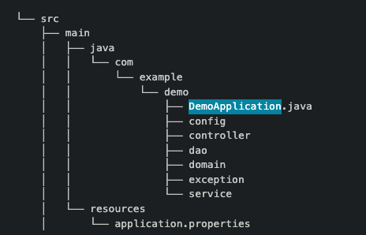
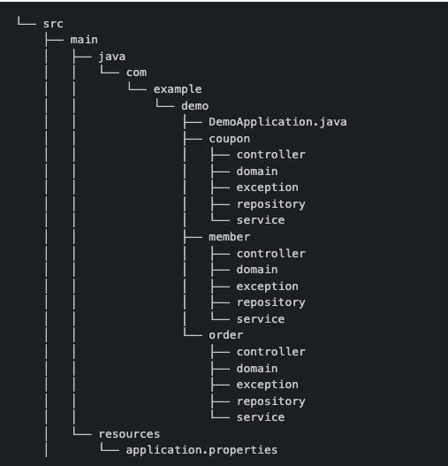

# diretory

## 계층형 

### 장점

 + 각 계층을 대표하는 디렉터리 기준 코드.
 + 프로젝트 이해가 낮아도 전체적인 구조를 빠르게 파악 가능
 + 도메인 모델 위주 개발 적합
 + 순환의존 발생이 적고 중복 제거 용이

### 단점 

 + 디렉터리에 클래스들이 너무 많이 모임
 + 추후 모듈 단위로 분리 어려움
 + 계층형은 Controller , Service등 너무 많은 클래스 밀집
 + 프로젝트가 커질수록 세부적인 구조를 파악하기 더 힘듬 -> 프로젝트를 장기적으로 가져갈경우 마이너스
 + 그리고 한곳에 너무 많은 클래스가 모여있다보니 네이밍에 대한 문제가 생길 수 있음 A라는 네이밍이있으면 비슷한 A" 네이밍으로 지어지고..

## 도메인형

### domain ?

 + 사용자가 사용하는 것 , 소프트웨어로 해결하고자 하는 문제영역 -> 비즈니스영역 

### 도메인 주도 설계 (DDD)

 + 도메인을 중심으로 하는 개발 상식 -> 도메인에 관련된 문제 해결
 + 복잡한 도메인을 해결하는 것을 높은 우선순위로 생각해 서비스를 만들기
 + 도메인의 복잡성을 조금 더 쉽게 다룰 수 있게 도와주는 도구

### 장점

 + 관련된 코드들이 응집해 있는 장점 
 + 개별자별로 기능 단위 개발 하는경우 주로 발생
 + 도메인 경우 관련 코드가 응집되있으니 코드 스타일 변수 클래스등 비슷한 패턴을 개발환경이 맞춰짐
 + 모듈 단위로 분리할 때 유리

### 단점

 + 프로젝트에 대한 이해도가 낮을경우 전체적인 구조파악 어려움
 + 각 모듈에 중복 코드 발생 가능성 높음
 + 도메인 간 관계뽀다 모듈별 구현이 높다.

## 뭐가 더 좋을까?

 + 정답은 없지만 그래도 비교를 해보면
 + 프로젝트가 너무 작고 단순하다. 그럼 하나의 패키지에 몰아넣는 계층형 이 더나을 겉 같다
 + 그러나 미래를 생각하면 기능이 추가된다던지, 유지보수, 그리고 각자 기능 단위로 개발하기 편한 도메인형이
 + 현 프로젝트에 적합 할 것이라 생각된다. 
 + 프로젝트를 완수하고도, 계속해서 기능을 추가할 때 용이하고 프로그램이 실행되다. 버그가일어났을경우 해당 도메인만 찾으면되니
 + 버그 추적도 좀 더 간편할거 같다.

# 추가 자료

 + https://johngrib.github.io/wiki/article/hierarchical-controller-package-structure/#fn:ddd-107
 + 위 사이트는 계층형 구조에 보완해서 만든 실험적인 프로젝트에 관한 내용인대 

 + 집합의 포함관계를 강력히 의식한 계층 구조로 패키지를 구성
 + 한 가지 용도를 암시하는 클래스 이름으로 행위와 책임 제한
 + 공개된 메소드를 한개만 갖는 서비스 / 컨트롤러 클래스를 작성

 + 등을 지켜 계층형 구조로 만들었는데 꽤나 흥미로웠다.
 + 물론 파일이 많아지고 복잡하지만 단일책임의 원칙을 준수해 클래스를 만들고
 + 명확한 계층명 / 명확한 클래스명을 지어주어서 파일이 많더라도 탐색에 용이하고
 + 단일책임 원칙을 준수해 클래스를 만드니. 책임을 제한하게되 한 클래스당 코드가 확줄어들어 가독성이 좋아졌다.

출처 :
 + https://cheese10yun.github.io/spring-guide-directory/
 + https://www.inflearn.com/questions/16046

[//]: # ( + https://jojoldu.tistory.com/603)
    