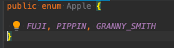

# Constant

 변하지 않는 변수를 뜻함.
 참조 메모리 주소가 변하지는 않지만 , 값(상태)는 변경 됨. 
 선언 할 땐 항상 final , static도 같이 사용하는대  전역적으로 쉽게 재사용 하면서 잘 변하지않는 변수나 매서드를 사용할때 사용.

 상수는 명시적으로 변수를 구분 함으로 3.1415926 같은 값을 PI로 명시가 가능함 .
 상수를 한번 정의 되면 프로그램 전체에서 여러번 참조가 가능하고 코드 유지 관리를 단순하 할수 있다.
(예: 3.1415926 대신 PI와 같이 값에 의미 있는 이름을 제공하여 자체 문서화할 수 있습니다.)

## Wiki

컴퓨터 프로그래밍에서 상수는 정상적인 실행 중에 프로그램에 의해 변경되어서는 안 되는 값입니다.
"상수"와 "명명된 상수"는 종종 같은 의미로 사용됩니다. 이것은 정상 실행 중에 변경할 수 있는 값이 있는 식별자인 변수(즉, 값이 변수)와 대조됩니다.
상수는 프로그래머와 컴파일러 모두에게 유용합니다.
프로그래머에게 상수는 자체 문서화 코드의 한 형태이며 정확성에 대한 추론을 허용하는 반면 컴파일러의 경우 상수 가정이 위반되지 않았는지 확인하고
허용하는 컴파일 시간 및 런타임 검사를 허용합니다. 또는 일부 컴파일러 최적화를 단순화합니다.

## 단점

* 타입이 안전하지 않다.

오렌지를 건네야 할 메서드에 사과를 보내 고 동등 연산자(==)로 비교하더라도 컴파일러는 아무런 경고 메시지를 출력하 지않는다.

 
* namespace가 없다
 접두어를 사용해 구분해야되는대 이름을 구분지어 정해줘야됨.. (ex EMLEMENT_MERCURY , PLANET_MERCURY)
* 
  

과일 APPLE 과 기업 APPLE을 나타내야 된다면..?

접두사를 통해 중복된 확률을 낮출 수 있다 이걸 네임스페이스 기법이라 함

* 프로그램이 깨지기 쉬움.
  상수값이 변하면 다시 컴파일 해야됨.

* 정수 상수는 문자열로 출력하기 까다로움 
 숫자로만 보여서 썩 도움이 되지 않음 (APPLE_FUJI나, ORANGE_NAVEL 같은 의미를 출력하기 어렵다는 의미)

* 문자열 열거 패턴은 더 나쁨

상수의 의미를 출력할 수 있어서 좋다, 그러나 문자열 상수의 이름 대신 문자열 값을 하드코딩해야됨
하드코딩 오타가 있어도 컴파일에서 확인할 방법이 없어 런타임 버그 발생 (문자열 비교에 따른 성능저하 역시 당연함 )

* 같은 정수 열거 그룹에 속한 모든 상수를 한 바퀴 순회하는 방법이 마땅치 않고, 그 안에 상수가 몇 개인지도 알 수가 없습니다.

## 대안 eunm Type (열거 타입)

### 특징

 열거 타입 자체가 클래스 임.
 
 상수 하나 당 자신의 인스턴스를 하나씩 만들고 , 인스턴스를 public static final 필드로 공개함.
 이런 인스턴스는 하나씩만 존재하고 , 통제됨 
 네임 스페이스가 존재해 이름이 같은 상수도 공존

예시 

다른 상수그룹과 비교해 컴파일 시점에서 차단 가능 (Ex  : COMPANY_APPLE == FRUIT_APPLE)

- > 코드가 단순해지고, 인스턴스 생성과 상속 방지, 키워드 enum을 이용함으로서 열겨임을 분명히 나타냄 
  > Enum은 생성자를 가질 수 있고 필드 숫자만큼 순회함.
  > 

 그리고 접근 제어자는 Private 만 허용함 .

참조 : https://opentutorials.org/course/1194/6091 , https://jaehun2841.github.io/2019/02/03/effective-java-item34/#Java%EC%9D%98-%EC%97%B4%EA%B1%B0-%ED%83%80%EC%9E%85

# Literal

 데이터 그 자체를 뜻함 변수에 넣은 변하지않는 데이터 (메모리 위치 안에 값)

 Ex) int a=1; 여기서는 1이 리터럴 데이터 .

