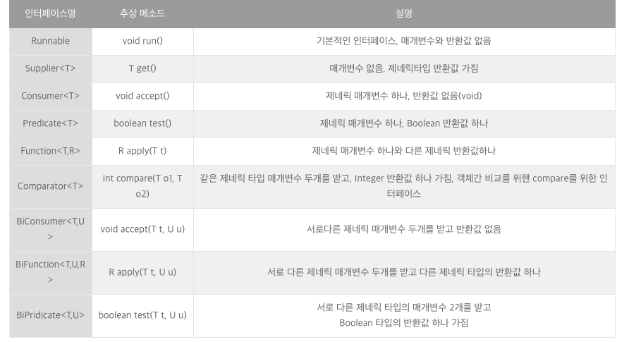
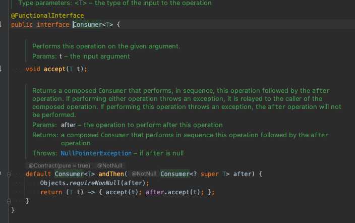
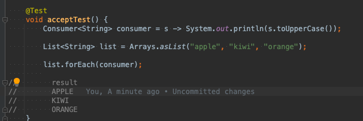
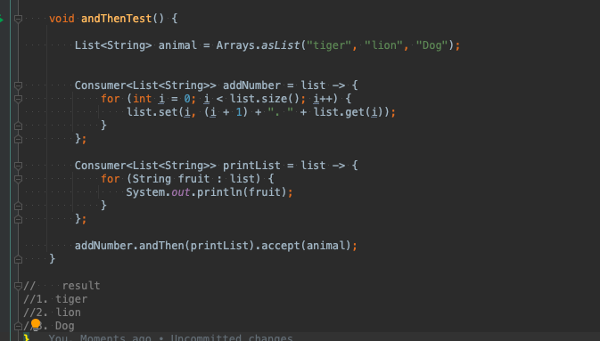
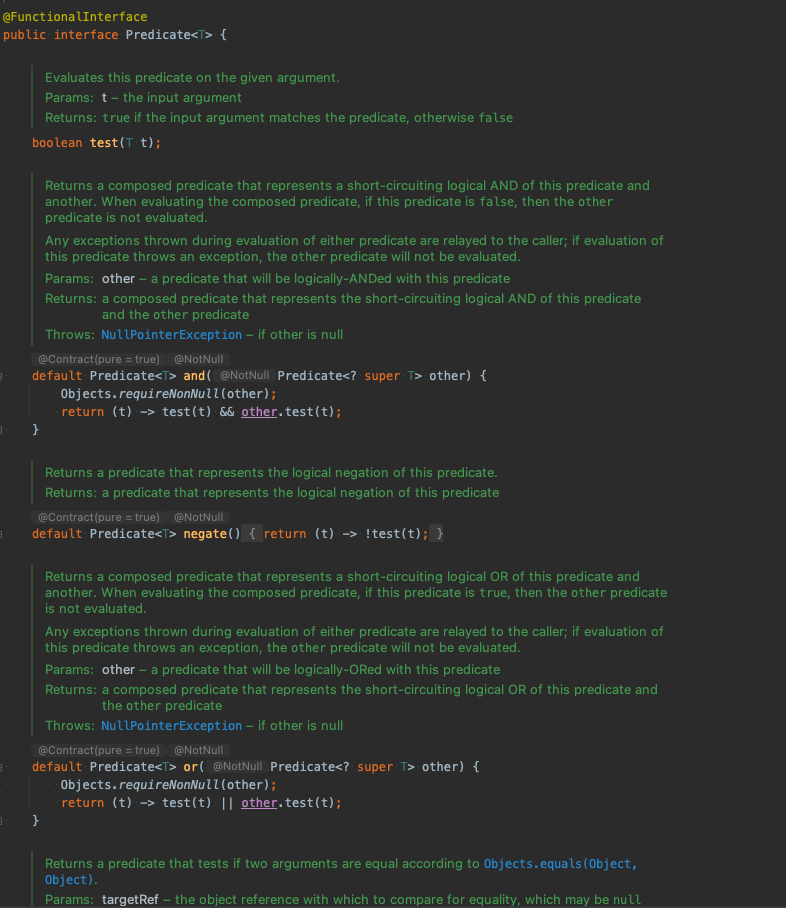
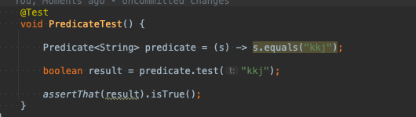
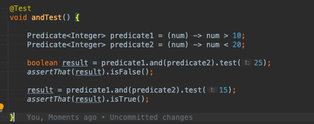
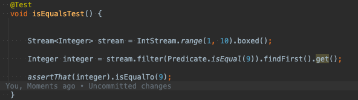
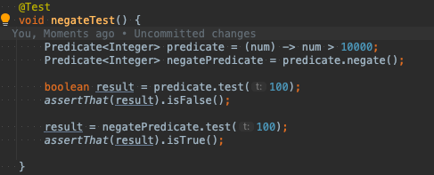
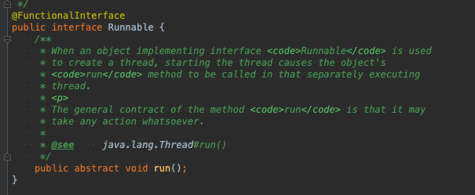

## FunctionalInterface

### 공식문서

인터페이스 유형 선언이 Java 언어 사양에 정의된 기능적 인터페이스임을 나타내는 데 사용되는 정보 제공 주석 유형입니다. 
개념적으로 FunctionalInterface에는 정확히 하나의 추상 메서드가 있습니다. 기본 메서드에는 구현이 있으므로 추상 메서드가 아닙니다.
인터페이스가 java.lang.Object의 공용 메소드 중 하나를 재정의하는 추상 메소드를 선언하면
인터페이스의 모든 구현이 java.lang.Object 또는 다른 곳에서 구현을 갖기 때문에 인터페이스의 추상 메소드 수에 포함되지 않습니다. (Object 클래스의 메서드를 제외하고)
FunctionalInterface의 인스턴스는 람다 식, 메서드 참조 또는 생성자 참조를 사용하여 만들 수 있습니다.

유형이 이 어노테이션 유형으로 어노테이션 처리된 경우 컴파일러는 다음을 제외하고 오류 메시지를 생성해야 합니다.

유형은 어노테이션 유형, 열거형 또는 클래스가 아닌 인터페이스 유형입니다.
어노테이션이 달린 유형은 FunctionalInterface의 요구 사항을 충족합니다.
그러나 컴파일러는 FunctionalInterface 어노테이션이 인터페이스 선언에 있는지 여부에 관계없이 
FunctionalInterface의 정의를 충족하는 모든 인터페이스를 FunctionalInterface로 취급합니다.

## 함수형 인터페이스 종류

### Consumer

#### accept

 Type 제네릭 T 인자를 받는다 .

 리턴값은 없다.

#### andThen()

### Predicate

#### test()

 Type T 인자를 받고 bollean을 리턴하는 함수형 인터페이스

 

#### and()

 Preidicate 연결하는 메소드  결과들을 AND 연산하고 그 결과를 리턴.

#### or()

 Predicate 연결 메소드 OR 두개의 Predicate을 OR 연산한다 .

#### isEqual

 인자로 전달된 객체와 같은지 확인 stream 에서 사용 될 수 있음
 

#### negate()

    predicate가 리턴하는 값과 반대되는 값을 리턴하는 Predicate 리턴 쉽게말하면 NOT 연산을 한다..

#### Stream

 isEqual 처럼 Stream 안에서 filter() 인자에 전달될 수 있따.

## 정리

### 함수형 프로그래밍은 자료 처리를 수학적 함수의 계산으로 취급하고 상태와 가변 데이터를 멀리하는 프로그래밍 패러다임의 하나이다.- 위키백과

1. 한개의 추상 메서드만 정의 되는 인터페이스 (구현해야 할 추상 메서드가 하나만 정의된 인터페이스) + Object Class 메소드는 제외
  + 하나의 추상메서드 외 나머지는 오브젝트 객체 메소드가 있더라도 함수형 인터페이스다.
  + 왜 ? 오브젝트 메소드는 제외를 하지 - > 자바의 사용되는 모든 객체들이 Object 객체를 상속받기 때문에 인터페이스 구현체들이 Object 메서드를 다 가지고 있기 때문..

-> Runnable 인터페이스는 함수형 인터페이스.

2. 람다식 , 메서드 참조 , 생성자 참조 사용해서 만들 수 있음  (코드가 간결해져서 좋다.)
3. java 8 에서는 @FunctionalInterface 어노테이션을 통해 해당 인터페이스가 함수형 인터페이스 인지 확인인지 아닌지 확실하 하기 원할때 사용
   FunctionalInterface라는걸 니타내기 위해 @FunctionalInterface을 선언하고 함수형 인터페이스 조건에 충족되지 않으면 예러를 발생시킨다.  
   그러나 @FunctionalInterface 가 선언 되지 않더라도 정의를 충족하는 인터페이스는 함수형 인터페이스로 컴파일러가 취급을 한다.
4. 디폴트 메서드 , static 메서드 또한 함수형 인터페이스에 추상메서드로 포함되지 않기 때문에 1개의 추상메서드 + 로 구성될 수 있다.

## 람다식

 함수형 인터페이스에 정의된 하나의 추상 메서드는 람다함수를 실행시킬 메서드 이다.
 추상메서드가 하나이기 때문에 람다식에서 정보가 추론이 가능! (전에썻던 전략패턴을 생각해보자.)
 

출처 : https://docs.oracle.com/javase/8/docs/api/index.html?java/lang/FunctionalInterface.html
      https://beomseok95.tistory.com/277
      https://alkhwa-113.tistory.com/entry/%EB%9E%8C%EB%8B%A4%EC%8B%9Dfeat-%EC%9D%B5%EB%AA%85-%EA%B5%AC%ED%98%84-%ED%81%B4%EB%9E%98%EC%8A%A4-vs-%EB%9E%8C%EB%8B%A4%EC%8B%9D
      https://codechacha.com/ko/java8-predicate-example/