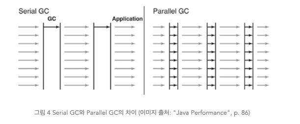
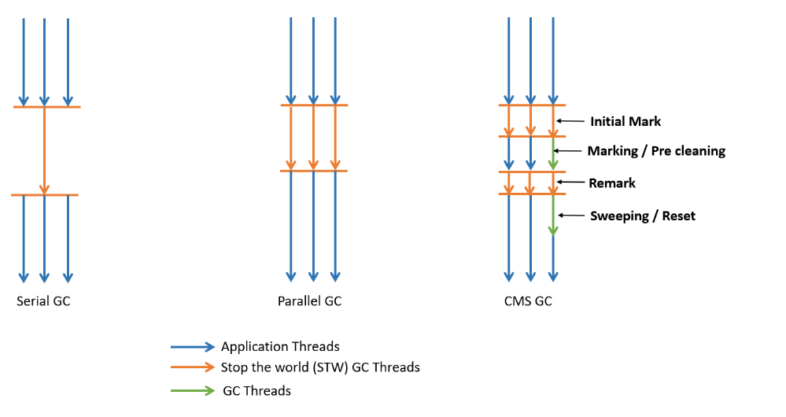
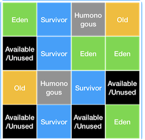

# Gabage collection Algorithm

 GC를 수행하기 위해 Stop the World에 의해 애플리케이션이 중지 되느 것에
 애플리케이션 지연현상이 나타난다. 이를 막기위해 여러 알리고리즘을 GC는 지원함

## Serial GC

 Mark Sweep으로 수행 됨. 
 Old영역에선 Mark Sweep Compact 알고리즘이 사용됨
 Compact 작업이 수행 되는데, Compact는 Heap 영역을 정리하기 위한 단계
 유효한 객체들이 연속되게 쌓이도록 힙의 가장 앞 부분부터 채워서 객체가 존재하는 부분과 객체가 존재하지 않는 부분으로 나누는 것

 -> Serial GC는 CPU 1개 코어 일때 사용되기 위해 개발 되서, 모든 가비지 컬렉션 일을 
    처리하기 위해 1개 쓰레드만 이용함 -> 그래서 CPU 코어가 여러 개인 운영 서버에 대해 Serial GC 사용 X
    적은 메모리와 CPU 코어가 적을때 적합함

 1. 살아있는 객체 식별 (mark)
 2. 살아있는 객체만 남기기 (sweep)
 3. 각 객체들이 연속되게 쌓이도록 힙의 가장 앞부분 부터 채워서 객체가 존재하는부분과 존제하지않는부분을 나눈다 (Compaction)

## Parallel(병렬) GC

 Throughput GC로 많이 알려져 있음 기본 처리 과정은 Serial GC랑 동일
 여러 개의 쓰레드를 Parallel GC를 수행함 GC 오버헤드를 상당히 줄여 줌.
 
 -> 멀티 쓰레드 머신에서 부터 대규모의 데이터를 처리하는 애플리케이션을 위해 고안 됨.
    옵션을 통해 애플리케이션 최대 지연시간 또는 GC 수행하 쓰레드 갯수 설정함.

 허나... Java8까지 기본 가비지 컬렉터로 사용 되었으나.. 그럼에도 불구하고
 애플리케이션이 멈추는 것은 피할 수 없었다.

## Paralle Old GC
 
 Parallel GC와 Old 영역 GC 알고리즘만 다름.
 Parallel Old GC 에서는 Mark Summary Compaction 사용 됨.
 Summary 단계에서는 앞서 GC를 수행한 영역에 대해 별도로 살아있는 객체를 색별한다는 점에서 조금 더 복잡함

## CMS(Concurrent Mark Sweep GC)

 여러개의 쓰레드를 이용함  Mark Sweep 알고리즘을 Concurrent하게 수행 됨.
 

 애플리케이션의 지연 시간을 최소화 하기위해 고안 됬다.

 애플리케이션이 구동중일 때 프로세서의 자원을 공유하여 이용가능해야 한다. 
 CMS GC가 수행될 때에는 자원이 GC를 위해서도 사용되므로 응답이 느려질 순 있지만 응답이 멈추지는 않게 된다.
 하지만 이러한 CMS GC는 다른 GC 방식보다 메모리와 CPU를 더 많이 필요로 하며, (하는일도 많고 복잡해서)
 Compaction 단계를 수행하지 않는다는 단점이 있다. 

 ++ 절반은 GC 절반은 어플리케이션을 돌림 (평상시는 100퍼 어플리케이션..)
    Old Generation 전용 GC 임 , 해당 GC를 사용하며 자동적으로 Young Generation 전용 ParNewGC를 사용한다.

### 장점 
 
 1. 어플리케이션 스레드가 오랫동안 멈추지 않음 ( 짧게 쪼개서 멈춤)

### 단점 

 이 때문에 시스템이 장기적으로 운영되다가
 Compaction 단계를 수행하지 않아서
 조각난 메모리들이 많아 Compaction 단계가 수행되면 오히려 Stop The World 시간이 길어지는 문제가 발생할 수 있다. (단편화 발생)
 

 -> 결국 java14에서는 사용 중지 됨.

## G1(Garbage First) GC

 CMS GC를 대체하기위해 java7부터 지원.
 물리적으로 메모리 공간을 나누지 않고 대신 Region(지역)  개념으로 
 Heap을 균등하게 여러 개의 지역으로 나눔. 각 지역을 역할과 함께 논리적으로 구분.(Eden 인지 ,survivor 인지..  ,Old 인지 )

 크기를 50%를 초과하는 객체를 저장하는 지역인 Humonguous(거대 객체를 저장하는 영역 Old Generation에 바로 할당)   / Availabe/Unused는 사용되지 않는 지역을 의미
 핵심은 Heap을 동일한 크기의 Region 나누고 가비지가 많은 지역에 대해 우선적 GC 수행함.

### 특징

 1. 수십 GB 이상의 힙에서도 짧은 STW 지향
 2. 객체 할당과 Old Generation 승진이 많은 경우에도 메모리 Compaction 하기 때문에 CMS처럼 Full GC  돌지 않음.
 3. 짧은 STW와 예측가능한 STW 시간
 4. Java10 부턴 Full GC 시에는 멀티 스레드로 동작함. CMS GC는 FULL GC 시 싱글 스레드로 동작?

### Why First GC

 G1 GC 는 살아있는 객체를 마킹 후 지역별로 얼만큼 살려둬야 하는지 알 수 있음
 모든 객체가 죽은 지역 부터 회수를 함.(Garbage만 있는 지역)
 메모리 회수하면서 빈 공간을 빠르게 확보하면서 할당률이 급격히 늘어나는 경우 방지 (Old Generation 한가해짐)

### G1 GC 는 어떻게 그렇게 빨리 대용량 힙을 GC가 가능 할까?

 1. GC 시에 전체 Heap에 대해서 GC를 수행해도 되지 않는다.
    GC 해야하는 지역에만 GC 하면 되기 때문 (특수한 기법을 써서 GC해야할 지역을 찾음)
    지역 별로 RSet(Remembered Set) 두고 RSet만 찾아서 추적하면 됨.
    RSet에는 외부에서 힙 영역 내부를 참조하는 레퍼런스를 관리하기 위한 정보들이 저장되있음.
 2. Old Generation Compaction을 하는데 전체 Old Generation 대해서 Compaction 하지 않아도 된다. 해당 지역에서만 하면됨.
 3. Garbage를 먼저 수집해 간다.
    빈 공간을 먼저 확보하기 때문에 메모리의 여유공간이 확보가 많이 됨, 여유 공간이 확보가 빨리 되니 그만큼 GC 빈도도 줄게 됨.

 ++ Compact : 살아있는 객체를 한곳에 모음.

### G1 GC  Minor GC 동작 방식

 한 지역에 객체 할당하다 지역이 꽉차면 다른 지역에 객체 할당하고 Minor GC 수행
 G1 GC는 가비지가 가장 많은 지역을 추적해서 알고 있기 때문에  가장 많은 가비지 영역을 찾아 Mark and Sweep 수행을 함!
 Eden 지역에서 GC 수행하면 복제되는 지역이 Available/Unused 지역이면 해당 지역은 -> Suvivor 영역
 Eden 영역은 Availabl/Unused 지역이 됨.

### G1 GC Full GC

 객체가 너무 많아 빠르게 메모리를 회수 할 수 없을때 Major GC 발생 !
 G1 GC는 어느 영역에 가비지가 많은지 알 수 있어서 GC 수행할 지역 조합해 해당 지역에 대해서만 GC 수행.
 이러한 작업은 Concurrent(동시적) 하게 수행되기 때문에 지연이 크지 않고 가비지가 많은 지역에 대해 정리를 해서 효율 적이다..

### 정리

 어떠한 GC 보다 처리 속도가 빠름 -> 큰 메모리 공간에서 멀티 프로세스 기반으로 운영되는 애플리케이션을 위해 고안 됨.
 처리속도가 가장 빠름 Java9 부터 기본 가비지 컬렉터로 사용하게 됨.

출처: https://mangkyu.tistory.com/118
     https://perfectacle.github.io/2019/05/11/jvm-gc-advanced/