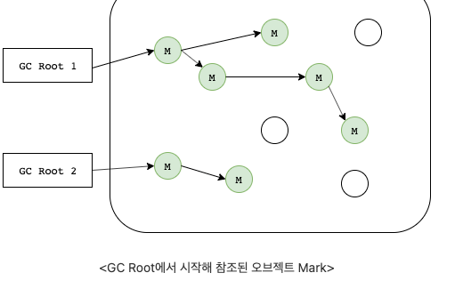

# Gabage Collection

## Gabage Collection 이란?

 java에서 Garbage(쓰레기는) 참조되지 않는 객체란 뜻임.
 Gabage Collection은 런타임에 사용하지 않은 메모리를 자동으로 회수하는 프로세스 
 사용하지 않는 오브젝트는 파괴한다!

 JVM은 실행될 대 프로그램 전용 메모리 부분인 **힙**에 객체가 생성됨.
 그러나 일부 객체는 더이상 쓸모없어! 이런 개체를 찾아 삭제하여 메모리를 확보.

## 장점

 1. 힙 메모리에서 참조되지 않는 개체를 제거하기 때문에 java 메모리를 효율적으로 만듬.
 2. 자동으로 수행 되기때문에 따로 신경을 쓰지 않아도 된다.

## 단점

 1. 메모리가 언제 헤제되는지 개발자는 알수 없다. (실시간 시스템에 부적합 ex: 미사일 발사시스템? 미사일발사도중 STW발생하면 헐..) 
 2. GC 동작동안 STW가 발생해 다른동작을 멈춰 오버헤드를 발생(알고리즘 마다 다름.)

## 객체가 참조가 되지 않을 경우?

  1. By nulling the reference (참조를 무효화 해서)
  2. By assigning a reference to another(다른 것에 참조를 할당을 하기 때문)
  3. By anonymous object etc. (익명 객체 등으로)

### 참조를 무효화하는 경우

     Member m = new Member();
     m = null; // 개체에 더이상 연결 불가능 

### 다른 것에 참조 할 경우

    Member m1 = new Member();
    Member m2 = new Member();
    m1 = m2 ;
     

### 익명 객체로 사용 할경우 

    new Member();

### 고립의 섬

 약간 이해하기 어려웠지만..

 t1 , t2 를 만들고
 t1 개체 i는 t2를 참조하게
 t2 개체 i는 t1를 참조하게
 
 t1,t2 아직 new Test()로 힙 메모리에 올라가 있고
 t1.i = t2 / t2.i = t1  각 객체안에 개체는 t2, t1을 참조하고 있다.
 그러나 객체 t1,t2 null 을 만들면 그림처럼 고립된 섬 모양처럼되고.
 안에 개체만 서로 참조되서 힙메모리에만 남게되고 t1,t2 객체는 고립된 섬처럼 아무것도 참조하지 않다 
 이것을 고립된 섬이라 하고 가바지 컬렉션 대상이되 메모리에서 삭제가 된다.

##  Types of Activities in Java Garbage Collection (자비에서 가비지 컬렉션 활동 유형)
 
 1. 마이너 / Incremental Gabage Collection :  Young Generation 힙 메모리에서(unreachable Object가) 개체가 제거될때 발생. (unreachable objects in the young generation) (eden 영역이 꽉찰 때)
 2. 메이저 / Full Garbage Collection : 마이너 가비지 컬렉션에서 살아남은 개체를 영구 세대 힙 메모리에 복사 할때 발생 (주로 Old 영역에서 발생)
    마이너 GC에비해 자주 일어나지 않는다. (old 영역 메모리가 부족해질시 발생) 번역이라 뭔가 좀 이상하다..

 JVM의 Heap영역은 처음 설계될 때 2가지 전제로 설계됨.

 1. 대부분의 객체는 금방 접근 불가능한 상태(Unreachble)가 된다.
 2. 오래된 객체에서 새로운 객체로의 참조는 아주적게 존재함.

 -> 객체는 대부분 일회성이며, 메모리에 오래 남는 경우가 드물다는 것이다. 
    그래서 객체의 생존 기간에 따라 물리적인 Heap영역을 나누게 된 것이다.!

  초기 Perm 영역은 java8 부터 제거 됨.

  위에 2개 전제를 weak generational hypothesis 라 함.

##  Minor GC와 Major GC

 1. Minor GC
    
    새롭게 생성된 객체가 할당 되는 곳! -> 대부분의 객체가 Unreachabe 상태가 되서 많은 객체가 생성되고 소멸된다.
    Young 영역에 대한 가비지 컬렉션을 Minor GC라 한다.

 2. Major GC
   
    Young영역에서 Reachable 상태를 유지한 객체가 복사되는 영역
    Young영역보다 크게 할당 된다. -> 영역에 크기가 크다? 가비지는 적게 발생
    
    크게 할당 되는 이유는 수명이 짧은 객체는 큰 공간이 필요하지않기 때문 (빠르게 처리 되니깐)
    큰 객체들은 Young 영역이아니라 바로 Old 영역에 할당 되기 때문.
 
    ++++ Old영역 객체가 Young 영역의 객체를 참조하는 경우가 존재하는데 
    이런경우를 대비해 Old 영역에는 512bytes 덩어리 (chunk)로 되어있는 카드 테이블이 존재 함.

### Card Table

  Old영역에 객체가 Young영역의 객체를 참조할때 마다 그에 대한 정보가 표 시됨.
  왜냐하면 Minor Gc가 실행 될때 Old 영역의 객체를 검사하여 참조되지 않는 Young영역의 객체를 식별하는 거보다
  카드 테이블만 조회해서 GC 대상인지 식별하는게 더 효율적이기 때문이다.
  write barrirer를 사용해 오버헤드는 발생하지만 전반적인 Gc를 줄여줌 

## Gabage Collection 동작 방식

 1. stack 모든 변수를 스캔 하면서 각각 어떤 객체를 참조하는지 찾아서 마킹 (mark)
 2. Reachable Object가 참조하고 있는 객체도 찾아서 마킹 (mark)
 3. 마킹되지않는 객체를 Heap에서 제거 (sweep)

### Stop The World

 Stop The World는 가비지 컬렉션을 실행하기 위해 JVM이 애플리케이션의 실행을 멈추는 작업이다.
 GC가 실행될 때는 GC를 실행하는 쓰레드를 제외한 모든 쓰레드들의 작업이 중단되고, GC가 완료되면 작업이 재개된다. 
 당연히 모든 쓰레드들의 작업이 중단되면 애플리케이션이 멈추기 때문에, GC의 성능 개선을 위해 튜닝을 한다고 하면 보통 stop-the-world의 시간을 줄이는 작업을 하는 것이다.
 또한 JVM에서도 이러한 문제를 해결하기 위해 다양한 실행 옵션을 제공하고 있다.

### Mark and Sweep
 
 Mark : 사용되는 메모리 / 사용되지 않는 메모리 식별
 Sweep : Mark 단계에서 사용되지않는 식별된 메모리 해제 작업
 
 -> Stop the Wolrd를 통해 모든 작업을 중단 -> GC는 스택의 모든 변수 또는 Reachable 객체를 스캔  
    각각 어떤 객체를 참고 하고 있나? 확인, 사용되고 있는 메모리를 식별 하는 과정을 Mark라고 함
    이후에 Mark가 되지않는 객체들을 메모리에서 제거하는걸 Sweep이라 함.

#### GC ROOT

 + 힙 외부에서 접근할 수 있는 **변수나 오브젝트** (stack 영역에 있는데이터들 heap을 참조하는)를 말함. (가비지 컬렉터의 ROOT라는 뜻)
 + Mark 작업은 GC root를 시작해 root가 참조하는 모든 오브젝트 , 또는 그 오브젝트가
 + 다른 오브젝트들이 참조하는 등 다른 오브젝트들을 탐색해 내려가며 마크함.

 + String str = new String("HELLO")
 + str 은 스택에 new String("HELLO")는 힙 영역에 저장 된다.
 + 여기서 GC 는 str 

##### 종류

 1. 실행중인 쓰레드
 2. 정적 변수
 3. 로컬 변수
 4. JNI 레퍼런스

### Minor GC 동작 방식

 + Eden : 새로 생긴 객체가 할당 되는 영역
 + survival 영역 : 최소 1번의 GC 이상 살아남은 객체가 존재하는 영역 (GC가 발생하고 살아남은객체가 계쏙 이동함)
 + 이동한 객체는 Age 값 증가.
 + suvival 0 , 과 1 을 계속 옴겨다니면서 반복하다 특정 Age 값이 되면 Old Generation 영역으로 옮겨진다
 + 이 과정을 Promotion 이라고 한다.

 새로운 객체 - > eden 영역할당 -> 꽉차면 ? 
 Minor GC 발생 -> Survivor 영역 (총 2개가 존재하고 반드시 1개 영역은 비어져있어야한다.)
 
 Minor GC 발생하면 -> 메모리 해제 OR Surivivor 영역 으로 이동 (살아남은 객체들)
 
 이런 과정 이후에는 -> Survivor 영역이 가득 차면? 다른 Survivor 이동 
 이래도 계속 살아남으면? Old 영역으로 이동 (Promotion)이 됨.

 객체의 생존 횟수를 카운트하기위해 Minor GC에서 객체가 살아남은 횟수를 의미하는
 age를 Object Header에 기록함, 이후 Minor GC 때 Object Header에 기록된 age를 보고 Promotion 여부를 결정

HotSpot JVM에서는 Eden 영역에 객체를 빠르게 할당하기 위해 2가지 기술을 사용

#### bump the pointer
 
 Eden영역에 마지막으로 할당된 객체의 주소를 캐싱 (Eden 영역 맨위(top)에 위치함)

 -> 새로운 객체를 위해 유효한 메모리 탐색을 마지막 주소의 다음주소를 사용하게함 -> 속도빠름
    (Eden 영역에 적합한지만 판별하면 됨..)

#### TLABs(Thread-Local Allocation Buffers)

 멀티쓰레드 환경에서 쓰레드마다 Eden 영역에 객체를 할당하기 위한 주소를 부여함으로서
 동기화 없이 빠르게 메모리를 할당하는 기술 
 
 -> 각각 쓰레드는 자신이 갖는 주소에만 객체를 할당함으로써 동기화 없이 bump the pointer를 통해 빠르게 객체 할당함.

## Major GC 동작 방식

 객체들이 계속 Promotion 되어 Old 영역에 메모리가 부족해지면
 Major GC 실행됨(stop the world)
  , Minor GC 보다 10배 이상 시간을 사용함

## finalize() 

 finalize 메서드는 가비지 컬렉터가 시작 되기도 전에 호출됨.
 clean up (정리처리를) 수행함. 그리고 가비지 컬렉터가 해당 개체들을 삭제함.

 protected void finalize(){}

### System.runFinalization();

 + 종료 보류 중인 개체의 종료 메서드를 실행합니다. 
 + 이 메소드를 호출하면 Java 가상 머신이 폐기된 것으로 확인되었지만
 + 아직 finalize 메소드가 실행되지 않은 객체의 finalize 메소드를 실행하기 위해 노력을 기울인다는 것을 의미합니다.
 + 메서드 호출에서 제어가 반환되면 가상 머신은 모든 미해결 완료를 완료하기 위해 최선을 다한 것입니다.
 + runFinalization 메서드가 명시적으로 호출되지 않은 경우 가상 머신은 필요에 따라 별도의 스레드에서 종료 프로세스를 자동으로 수행합니다.
 + System.runFinalization() 메서드는 이 메서드를 호출하는 기존의 편리한 수단입니다.

 - 보통 gc() 메서드를 호출하면 finalize 메서드를 자동 호출하는데 
   어떤 예제 코드를 보면 finalize는 실행됬는데. 막상 변수를 찍어보면 아직 반환이 안됀 상태가 나왔다.
   그래서 설명문을 읽어보니 종료 보류 중인? 상태인거 같다. 그래서 이메서드를 호출해주면 바로 적용되 정적 변수에 바로 적용이 되었다.

#### 참고: JVM의 Garbage 수집기는 new 키워드로 생성된 객체만 수집합니다.
#### 따라서 new 없이 객체를 생성한 경우 finalize 메서드를 사용하여 정리 처리(나머지 객체 삭제)를 수행할 수 있습니다.

## gc() method
 
 가비지 컬렉션을 호출하는대 사용하고 시스템 및 런타임 클래스 안에 있다.

 public static void gc(){}

  (런타임 클래스 안 GC 매서드)

 -> 해당 메소드를 호출하는 것은 시스템 성능에 매우 큰 영향을 미치게 된다. 절대 호출 직접적으로 하면 안됌!

### 해석

 가비지 수집기를 실행합니다.
 이 메소드를 호출하면 Java 가상 머신이 현재 사용하고 있는 메모리를 빠르게 재사용할 수 있도록 하기 위해 사용하지 않는 객체를 재활용하는 데 노력을 기울인다는 의미입니다. 
 메서드 호출에서 제어가 반환되면 가상 머신은 폐기된 모든 개체를 재활용하기 위해 최선을 다했습니다.
 gc라는 이름은 "가비지 수집기"를 의미합니다. 가상 머신은 gc 메서드가 명시적으로 호출되지 않더라도 필요에 따라 별도의 스레드에서 이 재활용 프로세스를 자동으로 수행합니다.
 System.gc() 메서드는 이 메서드를 호출하는 기존의 편리한 수단입니다.

#### 참고: 가비지 수집은 가비지 수집기(GC)라는 데몬 스레드에 의해 수행됩니다. 이 스레드는 객체가 가비지 수집되기 전에 finalize() 메서드를 호출합니다.

## Example

출처: https://www.javatpoint.com/Garbage-Collection
     https://www.geeksforgeeks.org/garbage-collection-java/
     https://data-flair.training/blogs/island-of-isolation-in-java/
     https://mangkyu.tistory.com/118
     https://d2.naver.com/helloworld/1329
     https://ko.wikipedia.org/wiki/%EC%93%B0%EB%A0%88%EA%B8%B0_%EC%88%98%EC%A7%91_(%EC%BB%B4%ED%93%A8%ED%84%B0_%EA%B3%BC%ED%95%99)
     https://imasoftwareengineer.tistory.com/103