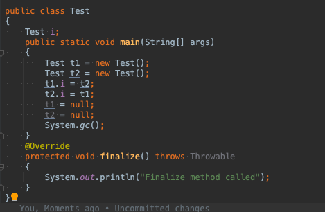
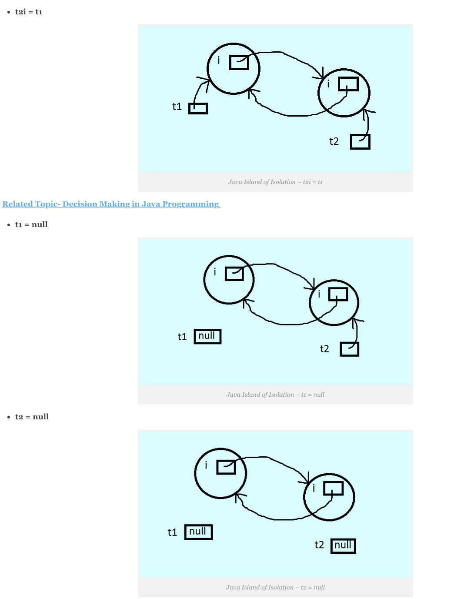
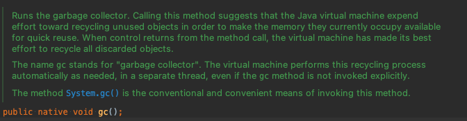
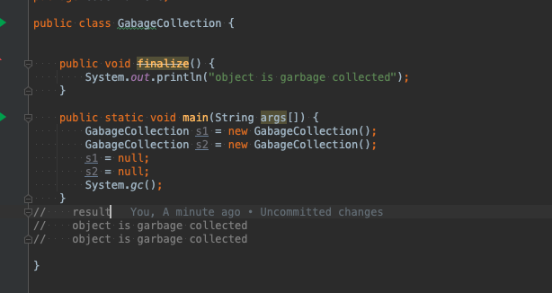

# Gabage Collection

## Gabage Collection 이란?

 java에서 Garbage(쓰레기는) 참조되지 않는 객체란 뜻임.
 Gabage Collection은 런타임에 사용하지 않은 메모리를 자동으로 회수하는 프로세스 
 사용하지 않는 오브젝트는 파괴한다!

 JVM은 실행될 대 프로그램 전용 메모리 부분인 **힙**에 객체가 생성됨.
 그러나 일부 객체는 더이상 쓸모없어! 이런 개체를 찾아 삭제하여 메모리를 확보.

## 장점

 1. 힙 메모리에서 참조되지 않는 개체를 제거하기 때문에 java 메모리를 효율적으로 만듬.
 2. 자동으로 수행 되기때문에 따로 신경을 쓰지 않아도 된다.

## 객체가 참조가 되지 않을 경우?

  1. By nulling the reference (참조를 무효화 해서)
  2. By assigning a reference to another(다른 것에 참조를 할당을 하기 때문)
  3. By anonymous object etc. (익명 객체 등으로)

### 참조를 무효화하는 경우

     Member m = new Member();
     m = null; // 개체에 더이상 연결 불가능 

### 다른 것에 참조 할 경우

    Member m1 = new Member();
    Member m2 = new Member();
    m1 = m2 ;
     

### 익명 객체로 사용 할경우 

    new Member();

### 고립의 섬

 약간 이해하기 어려웠지만..

 t1 , t2 를 만들고
 t1 개체 i는 t2를 참조하게
 t2 개체 i는 t1를 참조하게
 
 t1,t2 아직 new Test()로 힙 메모리에 올라가 있고
 t1.i = t2 / t2.i = t1  각 객체안에 개체는 t2, t1을 참조하고 있다.
 그러나 객체 t1,t2 null 을 만들면 그림처럼 고립된 섬 모양처럼되고.
 안에 개체만 서로 참조되서 힙메모리에만 남게되고 t1,t2 객체는 고립된 섬처럼 아무것도 참조하지 않다 
 이것을 고립된 섬이라 하고 가바지 컬렉션 대상이되 메모리에서 삭제가 된다.

##  Types of Activities in Java Garbage Collection (지비에서 가비지 컬렉션 활동 유형)
 
 1. 마이너 / Incremental Gabage Collection :  Young Generation 힙 메모리에서(unreachable Object가) 개체가 제거될때 발생. (unreachable objects in the young generation)
 2. 메이저 / Full Garbage Collection : 마이너 가비지 컬렉션에서 살아남은 개체를 영구 세대 힙 메모리에 복사 할때 발생 (주로 Old 영역에서 발생)
    마이너 GC에비해 자주 일어나지 않는다.

## finalize() 

 finalize 메서드는 가비지 컬렉터가 시작 되기도 전에 호출됨.
 clean up (정리처리를) 수행함. 그리고 가비지 컬렉터가 해당 개체들을 삭제함.

 protected void finalize(){}

### System.runFinalization();

종료 보류 중인 개체의 종료 메서드를 실행합니다. 
이 메소드를 호출하면 Java 가상 머신이 폐기된 것으로 확인되었지만
아직 finalize 메소드가 실행되지 않은 객체의 finalize 메소드를 실행하기 위해 노력을 기울인다는 것을 의미합니다.
메서드 호출에서 제어가 반환되면 가상 머신은 모든 미해결 완료를 완료하기 위해 최선을 다한 것입니다.
runFinalization 메서드가 명시적으로 호출되지 않은 경우 가상 머신은 필요에 따라 별도의 스레드에서 종료 프로세스를 자동으로 수행합니다.
System.runFinalization() 메서드는 이 메서드를 호출하는 기존의 편리한 수단입니다.

 - 보통 gc() 메서드를 호출하면 finalize 메서드를 자동 호출하는데 
   어떤 예제 코드를 보면 finalize는 실행됬는데. 막상 변수를 찍어보면 아직 반환이 안됀 상태가 나왔다.
   그래서 설명문을 읽어보니 종료 보류 중인? 상태인거 같다. 그래서 이메서드를 호출해주면 바로 적용되 정적 변수에 바로 적용이 되었다.

#### 참고: JVM의 Garbage 수집기는 new 키워드로 생성된 객체만 수집합니다.
#### 따라서 new 없이 객체를 생성한 경우 finalize 메서드를 사용하여 정리 처리(나머지 객체 삭제)를 수행할 수 있습니다.

## gc() method
 
 가비지 컬렉션을 호출하는대 사용하고 시스템 및 런타임 클래스 안에 있다.

 public static void gc(){}

  (런타임 클래스 안 GC 매서드)

### 해석

 가비지 수집기를 실행합니다.
 이 메소드를 호출하면 Java 가상 머신이 현재 사용하고 있는 메모리를 빠르게 재사용할 수 있도록 하기 위해 사용하지 않는 객체를 재활용하는 데 노력을 기울인다는 의미입니다. 
 메서드 호출에서 제어가 반환되면 가상 머신은 폐기된 모든 개체를 재활용하기 위해 최선을 다했습니다.
 gc라는 이름은 "가비지 수집기"를 의미합니다. 가상 머신은 gc 메서드가 명시적으로 호출되지 않더라도 필요에 따라 별도의 스레드에서 이 재활용 프로세스를 자동으로 수행합니다.
 System.gc() 메서드는 이 메서드를 호출하는 기존의 편리한 수단입니다.

#### 참고: 가비지 수집은 가비지 수집기(GC)라는 데몬 스레드에 의해 수행됩니다. 이 스레드는 객체가 가비지 수집되기 전에 finalize() 메서드를 호출합니다.

## Example

출처: https://www.javatpoint.com/Garbage-Collection
     https://www.geeksforgeeks.org/garbage-collection-java/
     https://data-flair.training/blogs/island-of-isolation-in-java/