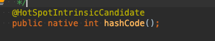

## hashcode /equals 차이점 .

테스트 클래스를 만들어 equals 랑 hashCode 오버라이드

 

## equals

 Object 클래스에선  **비교연산자인 ==  참조 값이 같은지 결과적으로 동일 객체인지 확인함.**
 자바에선 두 객체를 비교할 때의 equals는 논리적으로 동등할 때 true를 하는데 참조가 다르더라도 내부 value가 같다는걸 의미함 .
 (오버라이드해서 클래스내 equals를 재정의)

 객체를 생성시 euqals 메소드를 만들어 줘서 객체 비교시 내부 값만 비교하도록 정의해 준다.

 여기서 동일성 vs 동등성이 나온다.
  
 동일성 : ==  객체 인스턴스의 주소 값 비교 (Primitive data type 의경우 == 값 비교 가능) 왜냐하면 primitive data는 값이 같으면 같은 주소값을 가지기 때문에.. 주소값 비교됨
 동등성 : equals 객체 내부 값 비교

 ## hashCode

  객체를 식별하는 하나의 정수 값. - >  객체의 메모리 번지를 이용해 객체 고유의 해시코드를 만들어 리턴
  같은 객체임을 나타내기위해선 동일한 hashcode를 가져야 함

 사용이유 ? : 
   객체를 비교할 때 드는 비용이 낮음. 
 
 두 객체가 hashcode가 다르면 두 객체는 같지 않다.  그러나 hashcode가 같다고 두 객체가 같거나 다를 수 있다.
 
 보통 클래스 구현시 equals , hashcode 같이 오버라이딩 구현,  컬렉션 프레임워크에선 hashSet, HashMap, HashTable에서도 사용됨.

 + hashCode()가 다른 객체라고 해서 무조건 다르지 않음 
   equals() 메서드가 false를 리턴하면 hashCode값이 같을 수도 있음 hashTable의 특징이며 서로 다른 hashCode를 가지면 성능을 향상시키는데 도움 됨.
 
 ### 순서 -> hashcode  -> 해시코드 값이 같은가? 다르면 false  -> equals 다시 동등성 비교,  해시코드값이 다르면 엔트리끼리 비교도 안함.

 
## hashTable

 작동원리 : 
   Key,value 형 태로 데이터를 저장함 . 이 때 해시함수를 이용해 key값 기준으로 고유식별값 해시값을 만듬, 이 값을 버킷에 저장.
   그러나 크기가 한정적이라 다른 객체라도 같은 해시값을 가질 수 있음 ,  이걸 해시 충돌이라고 한다.
   이런 경우 버킷을 LinkedList 형태로 객체를 추가 함. -> (자바 8~9 부턴 링크드리스트 아이템 갯수가 8개가 넘어가면 TreeMap 자료구조로 저장 됨)
   같은 해시값의 버킷 안에 다른 객체가 있는경우 equals 매서드 사용

   ++ 해시 충돌 
    hashing 된 값의 인덱스가 서로 같은 경우 key값이 중복되는 경우.

    해결법 -> Open Addressing (개방 주소 방법 )   /  (Separate Chaining ) 분리 연결 방법

+ euqlas / hashcode 같이 오버라이드 해야 되는 이유.
 
 -> hash 값을 사용하는 Collection(HashSet, HashMap, HashTable)을 사용할 때 문제가 발생한다.

 hashcode를 재정의 하지  않으면  같은 값 객체라도 해시 값이 다를 수 있음,   HashTable에서 해당 객체가 저장된 버킷 못찾음.
 equlas를 재정의 하지 않으면 해시값을 이용한 객체가 저장된 버킷을 찾을수 있지만, 해당 객체와 자신과 같은 객체인지 값을 비교못해 Null 리턴 

 

 *출처 https://jisooo.tistory.com/entry/java-hashcode%EC%99%80-equals-%EB%A9%94%EC%84%9C%EB%93%9C%EB%8A%94-%EC%96%B8%EC%A0%9C-%EC%82%AC%EC%9A%A9%ED%95%98%EA%B3%A0-%EC%99%9C-%EC%82%AC%EC%9A%A9%ED%95%A0%EA%B9%8C
 

