# JavaMemory

## JVM

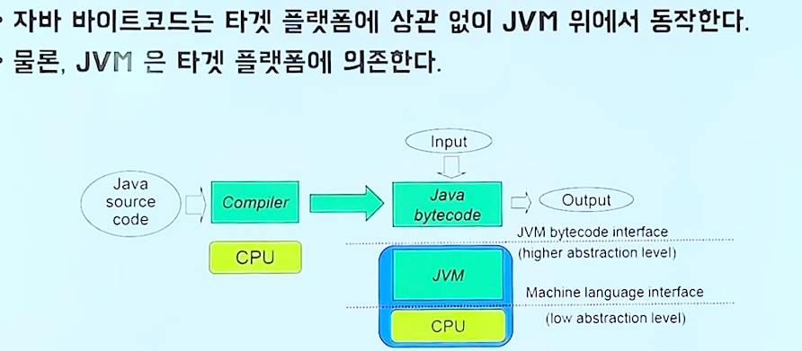

 자바소스코드 -> java C 컴파일 -> 자바 바이트코드
 JVM이 설치된 플랫폼이라면 어떤 곳이던지 잘 설치됨.
 JVM 플랫폼과 관련된 지정과 관련된 작업을 대신 해주기 때문.

 -> 니가 짠 자바 코드를 컴파일하면 어떤 플랫폼이든 다시 컴파일 없이 실행되!
    다만 그 플랫폼에 맞는 JVM이 설치되었을 때
 

## JVM 도입은 왜 됬을 까?

 자바가 나오던 시절에는 네트워크가 발달하던 시절이라 
 네트워크로 모든 것이 연결 다기종의 디바이스에서 실행하기위한 프로그램이 필요하다!
 C,C++ 는 플랫폼 마다 컴파일을 해줘야 되는대.. (핸드폰도 나오고,, 테블릿도나오고 여러가지 기종에 맞게 컴파일 못함)
 그래서 자바가 나옴.

 -> 디바이스마다 운영체제 하드웨어가 다다르기 때문에 자연스럽게 플랫폼 의존하지 않도록 언어 설계 
    그 결과가 Java Bytecode , JVM

## 자바의 야심 

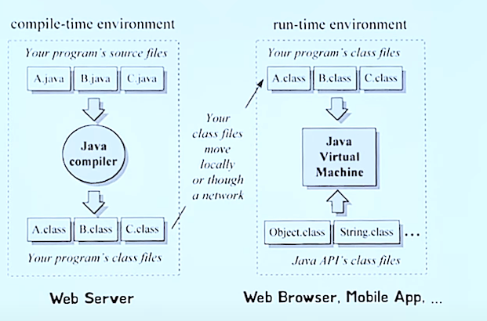

 웹서버 / 브라우저

 클래스파일(바이트코드를 담는 파일)만 
 네트워크를 통해 전달해주면 웹브라우저에 JVM이 설치되있어서 이걸 
 실행하기만 하면 되겠다 (javascript) . 자바는 아직 안됌.

## 자바 코드가 실행 되기까지.

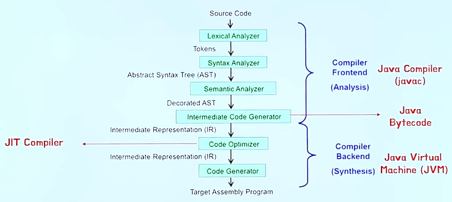

 컴파일에도 프론트엔드 백엔드가 있다.
 자바는 프론트엔드는 javac가 컴파일
 백엔드는 JVM이 해준다.
 
 

## JVM 내부구조

  모든 자바 프로그램은 자바 가상 머신을 통해 실행 됨.
  그리고 운영체제로부터 해당 프로그램을 수행할 수 있도록 필요한 메모리를 할당 받음

 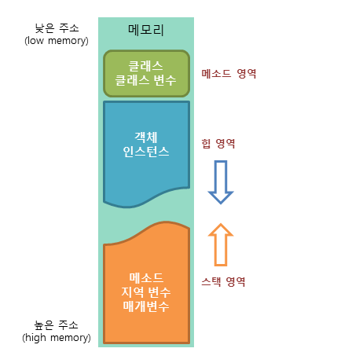

 메소드 영역
 
 클래스에 대한 정보 / 클래스 변수 (static variable) 저장되는 영역

 힙 영역

 인스턴스 변수가 저장되는 영역
 new 키워드 이용해 인스턴스 생성 -> 해당 인스턴스 정보 힙 영역에 저장.

 stack 영역
 
 메소드가 호출될 때 메소드의 스택 프레임(메소드의 호출정보)이 저장 되는 곳
 메소드 호출 -> 메소드 호출과 관계되는 지역 변수와 매개변수를 스택에 저장.
 (메소드 호출과 함께 할당 됨. 호출이 완료되면 소멸)
 후입 선출 방식임. 가장 늦게 저장된 데이터가 가장 먼저 인출 됨. push 동작으로 데이터 저장 , Pop 으로 인출

### Runtime Data Areas
 
 JVM이 자바 바이트 코드를 실행하는 가상의 기계
 그때 여러가지 메모리의 종류 메모리 공간이 필요한대 그때 쓰는게 Runtime Data Areas
 
### method area / heap

 

 method area / heap 모든 스레드가 공유하는 Area 
 
#### method area

 클래스 로더가 클래스 파일을 읽어오면 , 클래스 정보를 파싱해서
 Method Area에 저장을 하는 곳이다.
 변수가 어떤게 있는가 메소드가 어떤게있는가 등..

#### heap

 프로그램을 실행하면서 생성한.
 모든 객체의 인스턴스를 저장하는 곳.

### Per Thread

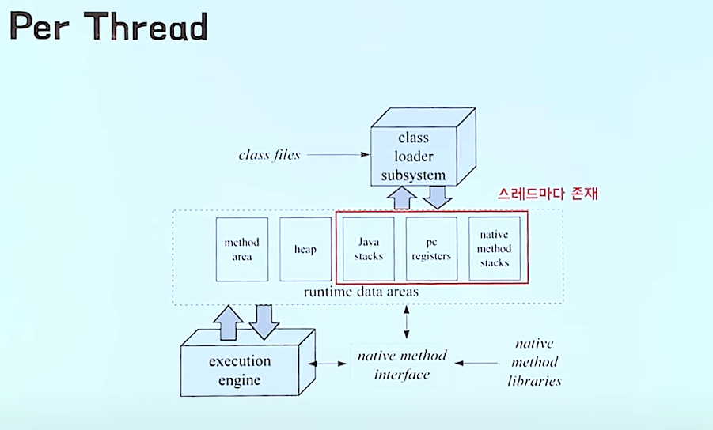

#### Program Count

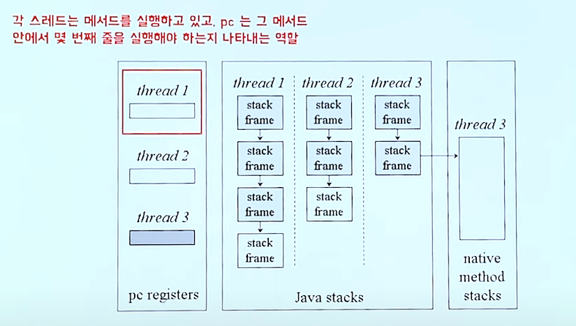

 각 스레드는 메서드를 실행하고 , pc는 그 메서드 안에서 바이트 코드 몇번째줄을 
 실행해야되는지 나타내는 역할 

##### Stack / StackFrame

 스택은 스레드 별로 1개만 존재 , 스택 프레임은 메서드가 호출될 때마다 생성 됨.
 메서드 실행이 끝나면 스택 프레임은 pop되어 스택에서 제거.

 스레드 한개의 스택 프레임들의 모임이 스택이고.
 맨위에 스택프레임은 메인 메소드 그다음은 메인메오스데어 호출된 메소드.. 단계적으로 아래로

###### StackFrame

 스택 프레임은 메서드가 호출 될때마다 새로 생겨 스택에 Push!
 지역 변수들의 배열, Operand stack , Frame Data를  가짐.
 Frame Date -> Constant Pool , 이전 스택 프레임에 대한 정보, 현재 메서드가 속한 클래스 / 객체에 대한 참조 등의 정보 가짐
 -> 쉽게 생각하면 바이트 코드를 사용하기위해 당연히 필요한 정보 내 메서드가 어떤 클래스에 속할까?

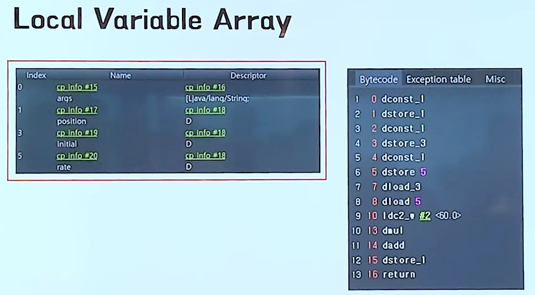

 지역변수 예제

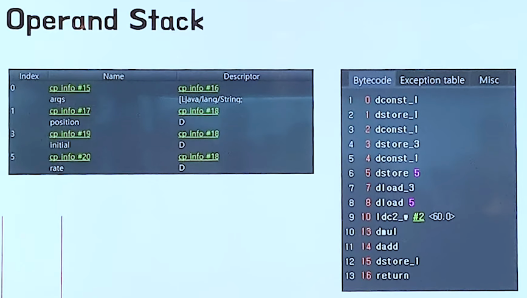

 Operand Stack

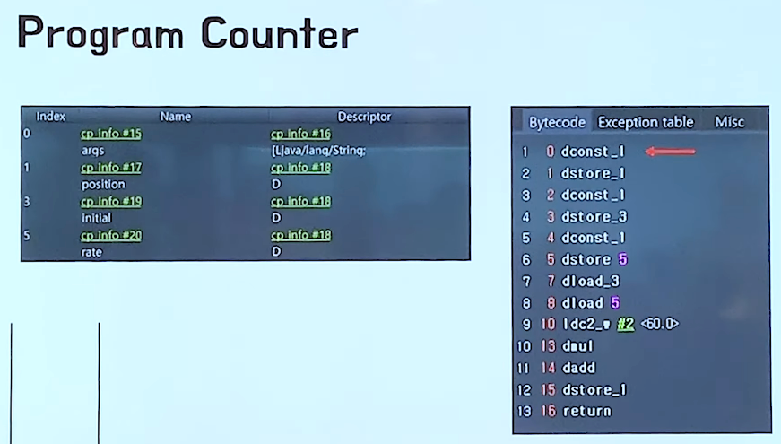

 Program Counter

 Operand Stack에 1.0을 push -> Operand(피연산자) Stack에서 pop 한 값을 지역변수배열 1번 인덱스에 저장
 1~6 번줄은 각 지역 변수 초기화
 Double constant , Double Store , Double Load -> 지역변수 배열에 있는값을 피연산자 스택에 push
 Load Constant Pool -> Constant Pool에서 2번째 값을 가져온다 (double 행 리터럴 60.0)
 자주쓰는 값들을 Constant Pool에 넣고 사용할때 가져온다고 한다.
 
 -> 피연산자 스택에서 두값(pop)을 곱하고 더하고 저장해서 다시 Push

###### 결과

 JVM은 바이트코드를 실행하기 위해 위에 것들을 사용한 것을 볼수 있다
 스택이 JVM에서 사용되는 용도 

 JVM은 왜 레지스터를 안쓰고 스택을 쓸까? 
 디바이스 마다 레지스터 갯수를 가정 할 수 없어서 하드웨어 스팩에 관여하는 결과가나온다.
 스택을 사용함으로서 계산은 복잡해지지만 하드웨어 스펙 관여가 적어진다.
 코드가 컴팩트에서 네트워크 전송도 용이하다.

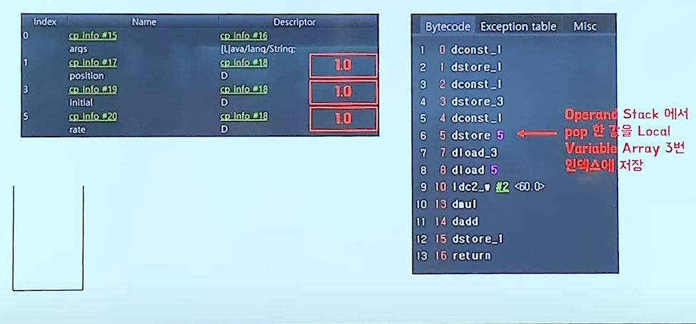

 결과

###### Native Method Stack

  자바 바이트코드가 아닌 C/C++ 소스를 컴파일을 해서사용하는 경우가 있는대
  (성능 향상을위해) 그 때 사용하는 메서드

 

## JVM 구조 좀 더 알아보기

 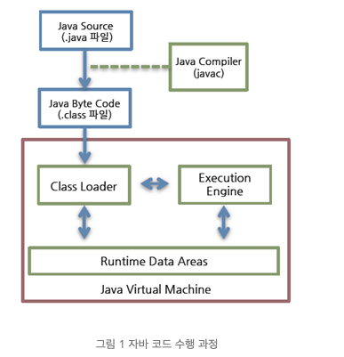

  클래스 로더가 컴파일된 자바 바이트코드를  
 -> 런타임 데이터 영역 에 로드 -> 실행 엔진이 자바 바이트 코드를 실행한다 .

### 클래스 로더 

 자바는 동적으로 로드를 한다.
 컴파일 타임이 아니라 ->  런타임에 클래스를 처음 참조 될때 클래스를 로드하고 링크함.
 이 동적 로드를 담당하는 부분이 클래스 로더!

#### 클래스 로더 특징
 
 계층구조: 클래스 로더끼리는 부모 - 자식 관계 걔층 구조. 최상위 클래스로더는 부트스트랩 클래스 로더라고 한다.
 위임모델: 클래스 로더끼리 로드를 위임하는 구조 -
         클래스를 로드 시 상위 클래스부터 확인해 해당 클래스 유무를 판단해 있으면 사용 없으면, 요청받은 클래스 로더가 클래스 로드
 
 가시성제한: 하위클래스는 상위클래스 로더의 클래스 찾을 수 있지만 반대는 안됨.
 언로드 불가:  클래스로더는 클래스를 로드하지만 언로드는 안됌 -> 대신 현재 클래스로더 삭제하고 새로운 클래스 로더 생성

#### 네임스페이스
 각 클래스 로더가 가지고 있는 로드된 클래들을 보관하는 곳
 클래스를 로드 할때 네임스페이스 안에 FQCN(Fully Qualified Class Name)을 기준으로 클래스 찾음.
 FQCN이 같더라도 같은 클래스 로더가 로드한 클래스가 아니면 다른 클래스로 간주된다.

 
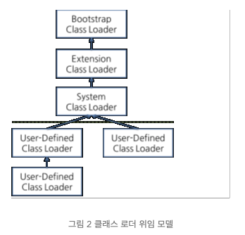
 

 
 

출처 : http://www.tcpschool.com/java/java_array_memory
      https://d2.naver.com/helloworld/1230
      https://www.youtube.com/watch?v=UzaGOXKVhwU