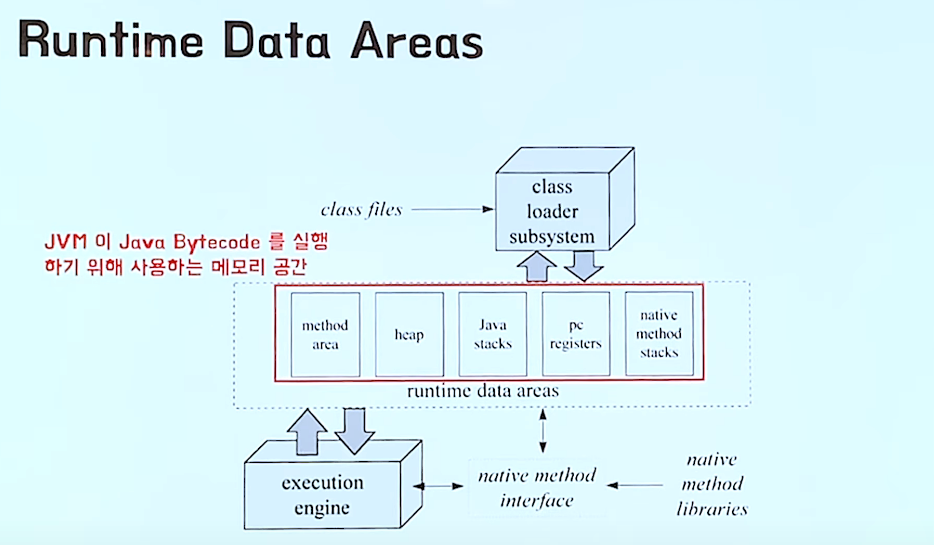
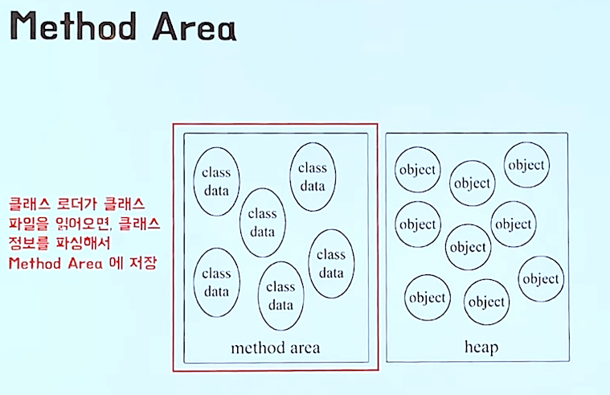
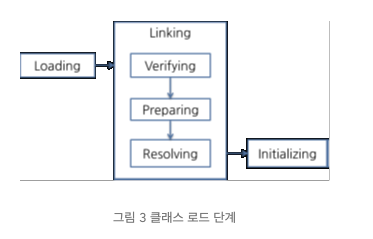

# JavaMemory

## JVM

 자바소스코드 -> java C 컴파일 -> 자바 바이트코드
 JVM이 설치된 플랫폼이라면 어떤 곳이던지 잘 설치됨.
 JVM 플랫폼과 관련된 지정과 관련된 작업을 대신 해주기 때문.

 -> 니가 짠 자바 코드를 컴파일하면 어떤 플랫폼이든 다시 컴파일 없이 실행되!
    다만 그 플랫폼에 맞는 JVM이 설치되었을 때
 

## JVM 도입은 왜 됬을 까?

 자바가 나오던 시절에는 네트워크가 발달하던 시절이라 
 네트워크로 모든 것이 연결 다기종의 디바이스에서 실행하기위한 프로그램이 필요하다!
 C,C++ 는 플랫폼 마다 컴파일을 해줘야 되는대.. (핸드폰도 나오고,, 테블릿도나오고 여러가지 기종에 맞게 컴파일 못함)
 그래서 자바가 나옴.

 -> 디바이스마다 운영체제 하드웨어가 다다르기 때문에 자연스럽게 플랫폼 의존하지 않도록 언어 설계 
    그 결과가 Java Bytecode , JVM

## 자바의 야심 

 웹서버 / 브라우저

 클래스파일(바이트코드를 담는 파일)만 
 네트워크를 통해 전달해주면 웹브라우저에 JVM이 설치되있어서 이걸 
 실행하기만 하면 되겠다 (javascript) . 자바는 아직 안됌.

## 자바 코드가 실행 되기까지.

 컴파일에도 프론트엔드 백엔드가 있다.
 자바는 프론트엔드는 javac가 컴파일
 백엔드는 JVM이 해준다.
 

### Runtime Data Areas

 

 JVM은 자바 바이트 코드를 실행하는 가상의 기계
 실행하기위해 사용하는 메모리 공간을 Runtime Data Areas
 그때 여러가지 메모리의 종류 메모리 공간이 필요한대 그때 쓰는게 Runtime Data Areas
 
### method area / heap

 

 method area / heap 모든 스레드가 공유하는 Area 
 
#### method area

 클래스 로더가 클래스 파일을 읽어오면 , 클래스 정보를 파싱해서
 Method Area에 저장을 하는 곳이다.
 변수가 어떤게 있는가 메소드가 어떤게있는가 등..

 
 + 클래스에 대한 정보 / 클래스 변수 (static variable) 저장되는 영역
 + JVM이 시작될 때 생성됨. 
 + JVM 읽어 들인 각각의 클래스와 인터페이스에 대한 런타임 상수 풀, 필드 와 메서드 정보, static 변수, 메서드의 바이트 코드등 보관

#### 런타임 상수 풀 

 + 클래스 파일 포맷에서 constant_pool 테이블에 해당 하는 영역
 + 메서드 영역에 포함되는 영역이지만 JVM 핵심 적인 역하 ㄹ수행.
 + 각 클래스마다 인터페이스의 상수 , 메서드 필드에 대한 모든 래퍼런스 담고있음.
 + JVM은 런타임 상수 풀을 통해 해당 메서드나 필드의 실제 메모리상 주소를 찾아서 참조함 .

#### heap

 프로그램을 실행하면서 생성한.
 모든 객체의 인스턴스를 저장하는 곳.

 + 인스턴스 변수가 저장되는 영역
 new 키워드 이용해 인스턴스 생성 -> 해당 인스턴스 정보 힙 영역에 저장.
 + 

### Per Thread

#### Program Count

 각 스레드는 메서드를 실행하고 , pc는 그 메서드 안에서 바이트 코드 몇번째줄을 
 실행해야되는지 나타내는 역할 

##### Stack / StackFrame

 스택은 스레드 별로 1개만 존재 , 스택 프레임은 메서드가 호출될 때마다 생성 됨.
 메서드 실행이 끝나면 스택 프레임은 pop되어 스택에서 제거.

 스레드 한개의 스택 프레임들의 모임이 스택이고.
 맨위에 스택프레임은 메인 메소드 그다음은 메인메오스데어 호출된 메소드.. 단계적으로 아래로

###### StackFrame

 + 스택 프레임은 메서드가 호출 될때마다 새로 생겨 스택에 Push!
 + 지역 변수들의 배열, Operand stack , Frame Data를  가짐.
 + Frame Date -> Constant Pool , 이전 스택 프레임에 대한 정보, 현재 메서드가 속한 클래스 / 객체에 대한 참조 등의 정보 가짐 
 + -> 쉽게 생각하면 바이트 코드를 사용하기위해 당연히 필요한 정보 내 메서드가 어떤 클래스에 속할까?

###### 지역 변수 배열

 + 지역변수 예제
 + 0은 매서드가 속한 클래스 인스턴스의 this 레퍼런스 
 + 1부터는 메서드에 전달된 파라미터가 저장되고 , 이후에는 메서드 지역변수 저장.

###### 피연산자 스택

 + Operand Stack
 + 스택 메서드의 실제 작업공간 
 + 각 메서드는 피연산자 스택과 지역 변수 배열 사이에 데이터를 교환하고
 + 다른 메서드 호출 결과를 추가 하거나 꺼냄.

 Program Counter

 Operand Stack에 1.0을 push -> Operand(피연산자) Stack에서 pop 한 값을 지역변수배열 1번 인덱스에 저장
 1~6 번줄은 각 지역 변수 초기화
 Double constant , Double Store , Double Load -> 지역변수 배열에 있는값을 피연산자 스택에 push
 Load Constant Pool -> Constant Pool에서 2번째 값을 가져온다 (double 행 리터럴 60.0)
 자주쓰는 값들을 Constant Pool에 넣고 사용할때 가져온다고 한다.
 
 -> 피연산자 스택에서 두값(pop)을 곱하고 더하고 저장해서 다시 Push

###### 결과

 JVM은 바이트코드를 실행하기 위해 위에 것들을 사용한 것을 볼수 있다
 스택이 JVM에서 사용되는 용도 

 JVM은 왜 레지스터를 안쓰고 스택을 쓸까? 
 디바이스 마다 레지스터 갯수를 가정 할 수 없어서 하드웨어 스팩에 관여하는 결과가나온다.
 스택을 사용함으로서 계산은 복잡해지지만 하드웨어 스펙 관여가 적어진다.
 코드가 컴팩트에서 네트워크 전송도 용이하다.

 결과

###### Native Method Stack

  자바 바이트코드가 아닌 C/C++ 소스를 컴파일을 해서사용하는 경우가 있는대
  (성능 향상을위해) 그 때 사용하는 메서드

## JVM 구조 좀 더 알아보기

 

  클래스 로더가 컴파일된 자바 바이트코드를  
 -> 런타임 데이터 영역 에 로드 -> 실행 엔진이 자바 바이트 코드를 실행한다 .

### 클래스 로더 

 자바는 동적으로 로드를 한다.
 컴파일 타임이 아니라 ->  런타임에 클래스를 처음 참조 될때 클래스를 로드하고 링크함.
 이 동적 로드를 담당하는 부분이 클래스 로더!

#### 클래스 로더 특징
 
 1. 계층구조: 클래스 로더끼리는 부모 - 자식 관계 계층 구조. 최상위 클래스로더는 부트스트랩 클래스 로더라고 한다.
 2. 위임모델: 클래스 로더끼리 로드를 위임하는 구조 -
         클래스를 로드 시 상위 클래스부터 확인해 해당 클래스 유무를 판단해 있으면 사용 없으면, 요청받은 클래스 로더가 클래스 로드
 
 3. 가시성제한: 하위클래스는 상위클래스 로더의 클래스 찾을 수 있지만 반대는 안됨.
 4. 언로드 불가:  클래스로더는 클래스를 로드하지만 언로드는 안됌 -> 대신 현재 클래스로더 삭제하고 새로운 클래스 로더 생성

#### 네임스페이스
 각 클래스 로더가 가지고 있는 로드된 클래들을 보관하는 곳
 클래스를 로드 할때 네임스페이스 안에 FQCN(Fully Qualified Class Name)을 기준으로 클래스 찾음.
 FQCN이 같더라도 같은 클래스 로더가 로드한 클래스가 아니면 다른 클래스로 간주된다.

 

#### 클래스 로더 동작

 1. 클래스 로더가 클래스 로드 요청을 받음
 2. 클래스 로더 캐시 -> 상위 클래스 로더 -> 자기자신 순서대로 해당 클래스 확인
 3. 확인해도 없으면 요청받은 클래스 로더가 파일 시스템에서 클래스를 찾는다.

#### 부트스트랩 클래스 로더

 JVM을 기동할 때 생성 / Object 클래스를 비롯하여 자바 API들을 업로드 함.!, 네이티브 코드로 구현 됨.

#### 익스텐션 클래스 로더

 기본 자바 API를 제외한 확장 클래스들을 로드 / 다양한 보안 확장 기능등을 여기서 로드함.

#### 시스템 클래스 로더

 + 위 2개가 JVM 자체의 구성 요소들을 로드한 것이면
 + 시스템 클래스 로더는 애플리케이션 클래스들을 로드 함. 사용자가 지정한 $CLASSPATH 내의 클래스들을 로드 (환경변수에 설정된?)

#### 사용자 정의 클래스 로더

 사용자가 직접 코드 상에서 생성해서 사용하는 클래스 로더

 + WAS같은 프레임 워크는 웹 애플리케이션 , 엔터프라이즈 애플리케이션등
 + 서로 독립적으로 동작하기 때문에 사용자 정의 클래스 로더를 사용함
 + 즉 클래스 로더의 위임 모델을 통해 애플리케이션 독립성 보장 

### 클래스 로드 단계

  + 클래스로더가 아직 로드되지않는 클래스를 찾을 때 그림과 같은 과정을 거치고,
  + 클래스 로드 - > 링크 -> 초기화
 

  + 로드 : 클래스 파일 가져와 JVM의 메모리에 로드
  + 검증 : 읽어 들인 클래스가 자바 언어 명세 및 JVM 명세에 명시된 대로 잘 구성 되어 있는지 검사.
  + 준비 : 클래스가 필요로 하는 메모리를 할당, 클래스에 정의된 필드 메서드 인터페이스들을 나타내는 구조 준비
  + 분석 : 클래스의 상수 풀 내 모든 심볼릭 래퍼런스를 다이렉트 레퍼런스로 변경 ?
  + 초기화: 클래스 변수들을 적절한 값으로 초기화.. -> static initializer들을 수행하고 , static 필드들을 설정된 값으로 초기화

### 런타임 데이터 영역

 + JVM이 OS 위에 실행 되면서 할당 받은 메모리 영역 (바이트 코드를 실행하기 위해)
 + PC,JVM STACK , Native Mehood Stack 스레드 마다 한개씩.. 나머지는 모든 스레드가 공유 (heap , Hethod Area, Runtime Constant Pool)
 + 

출처 : http://www.tcpschool.com/java/java_array_memory
      https://d2.naver.com/helloworld/1230
      https://www.youtube.com/watch?v=UzaGOXKVhwU