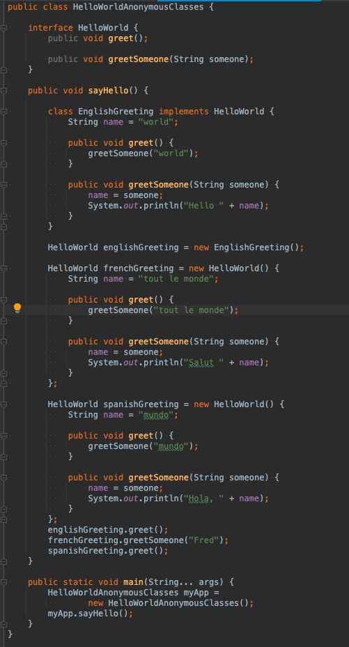
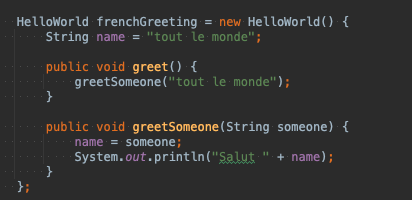

# AnonymousClass

## 익명 클래스 간단한 설명

익명 클래스를 사용하면 코드를 더 간결하게 만들 수 있습니다. 
클래스를 선언하고 동시에 인스턴스화할 수 있습니다.
이름이 없다는 점을 제외하고는 로컬 클래스와 같습니다. 
로컬 클래스를 한 번만 사용해야 하는 경우 사용하십시오.

## 익명 클래스 선언 Declaring Anonymous Classes
로컬 클래스는 클래스 선언이지만 익명 클래스는 표현식입니다. 즉,
다른 표현식에서 클래스를 정의해야 합니다. 
다음 예제인 HelloWorldAnonymousClasses는 지역 변수 FrenchGreeting 및 spanishGreeting의 초기화 문에서 익명 클래스를 사용하지만 변수 englishGreeting의 초기화를 위해 지역 클래스를 사용합니다.

## 
익명 클래스의 구문
앞에서 언급했듯이 익명 클래스는 표현식입니다. 
익명 클래스 표현식의 구문은 코드 블록에 클래스 정의가 포함되어 있다는 점을 제외하고 생성자의 호출과 유사합니다.

FrenchGreeting 객체의 인스턴스화를 고려하십시오.

익명 클래스 표현식은 다음으로 구성됩니다.

새로운 연산자 (The new operator)

구현할 인터페이스 또는 확장할 클래스의 이름입니다. 이 예에서 익명 클래스는 HelloWorld 인터페이스를 구현하고 있습니다.

일반 클래스 인스턴스 생성 표현식과 마찬가지로 생성자에 대한 인수를 포함하는 괄호입니다. 참고: 인터페이스를 구현할 때 생성자가 없으므로 이 예제와 같이 빈 괄호 쌍을 사용합니다.

클래스 선언 본문인 본문입니다. 보다 구체적으로, 본문에서 메소드 선언은 허용되지만 명령문은 허용되지 않습니다.

익명 클래스 정의는 표현식이므로 명령문의 일부여야 합니다. 이 예에서 익명 클래스 표현식은 FrenchGreeting 객체를 인스턴스화하는 문의 일부입니다. (이는 닫는 중괄호 뒤에 세미콜론이 있는 이유를 설명합니다.)

##엔클로징 스코프의 지역 변수 접근, 익명 클래스의 멤버 선언 및 접근
## Accessing Local Variables of the Enclosing Scope, and Declaring and Accessing Members of the Anonymous Class

로컬 클래스와 마찬가지로 익명 클래스는 변수를 캡처할 수 있습니다. 그들은 둘러싸는 범위의 지역 변수에 대해 동일한 액세스 권한을 갖습니다.

익명 클래스는 둘러싸는 클래스의 멤버에 액세스할 수 있습니다.

익명 클래스는 final 또는 사실상 final로 선언되지 않은 엔클로징 범위의 지역 변수에 액세스할 수 없습니다.

중첩 클래스와 마찬가지로 익명 클래스의 형식 선언(예: 변수)은 동일한 이름을 가진 바깥쪽 범위의 다른 선언을 숨깁니다. 자세한 내용은 섀도잉을 참조하세요.

Anonymous 클래스는 또한 해당 멤버와 관련하여 로컬 클래스와 동일한 제한이 있습니다.

익명 클래스에서 정적 이니셜라이저 또는 멤버 인터페이스를 선언할 수 없습니다.

익명 클래스는 상수 변수인 경우 정적 멤버를 가질 수 있습니다.

익명 클래스에서 다음을 선언할 수 있습니다.

* 필드

* 추가 메소드(상위 유형의 메소드를 구현하지 않더라도) (Extra methods (even if they do not implement any methods of the supertype))

* Instance initializers

* Local classes

그러나 익명 클래스에서는 생성자를 선언할 수 없습니다.

##익명 클래스의 예

익명 클래스는 GUI(그래픽 사용자 인터페이스) 응용 프로그램에서 자주 사용됩니다.

JavaFX 예제 HelloWorld.java를 고려하십시오(JavaFX 시작하기의 Hello World, JavaFX 스타일 섹션에서). 이 샘플은 'Hello World' 버튼이 포함된 프레임을 만듭니다. 익명 클래스 표현식이 강조 표시됩니다.

import javafx.event.ActionEvent;
import javafx.event.EventHandler;
import javafx.scene.Scene;
import javafx.scene.control.Button;
import javafx.scene.layout.StackPane;
import javafx.stage.Stage;

public class HelloWorld extends Application {
public static void main(String[] args) {
launch(args);
}

    @Override
    public void start(Stage primaryStage) {
        primaryStage.setTitle("Hello World!");
        Button btn = new Button();
        btn.setText("Say 'Hello World'");
        btn.setOnAction(new EventHandler<ActionEvent>() {
 
            @Override
            public void handle(ActionEvent event) {
                System.out.println("Hello World!");
            }
        });
        
        StackPane root = new StackPane();
        root.getChildren().add(btn);
        primaryStage.setScene(new Scene(root, 300, 250));
        primaryStage.show();
    }
}

이 예에서 메서드 호출 btn.setOnAction은 'Hello World' 버튼을 선택할 때 어떤 일이 발생하는지 지정합니다. 
이 메서드에는 EventHandler<ActionEvent> 유형의 개체가 필요합니다. EventHandler<ActionEvent> 인터페이스에는 하나의 메서드인 핸들만 포함됩니다.
이 메서드를 새 클래스로 구현하는 대신 예제에서는 익명 클래스 식을 사용합니다. 이 표현식은 btn.setOnAction 메소드에 전달된 인수입니다.

EventHandler<ActionEvent> 인터페이스에는 메서드가 하나만 포함되어 있으므로 익명 클래스 식 대신 람다 식을 사용할 수 있습니다. 자세한 내용은 Lambda 표현식 섹션을 참조하십시오.

익명 클래스는 두 개 이상의 메서드가 포함된 인터페이스를 구현하는 데 이상적입니다.
다음 JavaFX 예제는 UI 컨트롤의 사용자 정의 섹션에서 가져온 것입니다. 강조 표시된 코드는 숫자 값만 허용하는 텍스트 필드를 만듭니다.
TextInputControl 클래스에서 상속된 replaceText 및 replaceSelection 메서드를 재정의하여 익명 클래스로 TextField 클래스의 기본 구현을 재정의합니다.

public class CustomTextFieldSample extends Application {

    final static Label label = new Label();
 
    @Override
    public void start(Stage stage) {
        Group root = new Group();
        Scene scene = new Scene(root, 300, 150);
        stage.setScene(scene);
        stage.setTitle("Text Field Sample");
 
        GridPane grid = new GridPane();
        grid.setPadding(new Insets(10, 10, 10, 10));
        grid.setVgap(5);
        grid.setHgap(5);
 
        scene.setRoot(grid);
        final Label dollar = new Label("$");
        GridPane.setConstraints(dollar, 0, 0);
        grid.getChildren().add(dollar);
        
        final TextField sum = new TextField() {
            @Override
            public void replaceText(int start, int end, String text) {
                if (!text.matches("[a-z, A-Z]")) {
                    super.replaceText(start, end, text);                     
                }
                label.setText("Enter a numeric value");
            }
 
            @Override
            public void replaceSelection(String text) {
                if (!text.matches("[a-z, A-Z]")) {
                    super.replaceSelection(text);
                }
            }
        };
 
        sum.setPromptText("Enter the total");
        sum.setPrefColumnCount(10);
        GridPane.setConstraints(sum, 1, 0);
        grid.getChildren().add(sum);
        
        Button submit = new Button("Submit");
        GridPane.setConstraints(submit, 2, 0);
        grid.getChildren().add(submit);
        
        submit.setOnAction(new EventHandler<ActionEvent>() {
            @Override
            public void handle(ActionEvent e) {
                label.setText(null);
            }
        });
        
        GridPane.setConstraints(label, 0, 1);
        GridPane.setColumnSpan(label, 3);
        grid.getChildren().add(label);
        
        scene.setRoot(grid);
        stage.show();
    }
 
    public static void main(String[] args) {
        launch(args);
    }
}

출처: https://docs.oracle.com/javase/tutorial/java/javaOO/anonymousclasses.html
