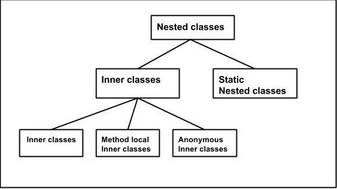

# nested Class

Java 프로그래밍 언어를 사용하면 다른 클래스 내에서 클래스를 정의할 수 있습니다. 

이러한 클래스를 중첩 클래스라고 하며 여기에 설명되어 있습니다.

-> 클래스 내에 또 하나의 클래스를 정의하는 nested Class 중첩클래스

class OuterClass {
...
class NestedClass {
...
}
}

용어: 중첩 클래스는 비정적 및 정적의 두 가지 범주로 나뉩니다.
비정적 중첩 클래스를 내부 클래스라고 합니다. 정적으로 선언된 중첩 클래스를 정적 중첩 클래스라고 합니다.

class OuterClass {
...
class InnerClass {
...
}
static class StaticNestedClass {
...
}
}

-> 중첩 클래스는 정적 이랑 비정적 두가지로 나뉜다.

중첩 클래스는 둘러싸는 클래스의 구성원입니다. 
비정적 중첩 클래스(내부 클래스)는 비공개로 선언된 경우에도 바깥쪽 클래스의 다른 멤버에 액세스할 수 있습니다.
정적 중첩 클래스는 둘러싸는 클래스의 다른 멤버에 액세스할 수 없습니다. OuterClass의 멤버로서 중첩 클래스는 private, public, protected 또는 package private로 선언될 수 있습니다. 
(외부 클래스는 공개 또는 패키지 비공개로만 선언할 수 있음을 기억하십시오.)

##중첩 클래스를 사용하는 이유

중첩 클래스를 사용해야 하는 이유는 다음과 같습니다.

한 곳에서만 사용되는 클래스를 논리적으로 그룹화하는 방법입니다.
클래스가 다른 하나의 클래스에만 유용하면 해당 클래스에 포함하고 두 클래스를 함께 유지하는 것이 논리적입니다. 
이러한 "도우미 클래스"를 중첩하면 패키지가 더 간소화됩니다.

캡슐화 증가: 두 개의 최상위 클래스 A와 B를 고려하십시오. 
여기서 B는 그렇지 않으면 private로 선언될 A의 멤버에 액세스해야 합니다. 클래스 A 내에 클래스 B를 숨김으로써 A의 멤버를 private로 선언하고 B가 액세스할 수 있습니다.
또한 B 자체는 외부 세계에서 숨길 수 있습니다.

더 읽기 쉽고 유지 관리하기 쉬운 코드로 이어질 수 있습니다. 최상위 클래스 내에 작은 클래스를 중첩하면 코드가 사용되는 위치에 더 가깝게 배치됩니다.

이너 클래스
인스턴스 메서드 및 변수와 마찬가지로 내부 클래스는 해당 클래스의 인스턴스와 연결되며 해당 개체의 메서드 및 필드에 직접 액세스할 수 있습니다.
또한 내부 클래스는 인스턴스와 연결되어 있기 때문에 정적 멤버 자체를 정의할 수 없습니다.

내부 클래스의 인스턴스인 객체는 외부 클래스의 인스턴스 내에 존재합니다. 다음 클래스를 고려하십시오.

class OuterClass {
...
class InnerClass {
...
}
}

InnerClass의 인스턴스는 OuterClass의 인스턴스 내에서만 존재할 수 있으며 둘러싸는 인스턴스의 메서드와 필드에 직접 액세스할 수 있습니다.

내부 클래스를 인스턴스화하려면 먼저 외부 클래스를 인스턴스화해야 합니다. 그런 다음 다음 구문을 사용하여 외부 객체 내에 내부 객체를 생성합니다.

OuterClass outerObject = new OuterClass();
OuterClass.InnerClass innerObject = outerObject.new InnerClass();
내부 클래스에는 두 가지 특별한 종류가 있습니다. 로컬 클래스와 익명 클래스입니다.

# 정적 중첩 클래스
클래스 메서드 및 변수와 마찬가지로 정적 중첩 클래스는 외부 클래스와 연결됩니다. 
그리고 정적 클래스 메서드와 마찬가지로 정적 중첩 클래스는 자신을 둘러싸는 클래스에 정의된 인스턴스 변수나 메서드를 직접 참조할 수 없습니다. 개체 참조를 통해서만 사용할 수 있습니다.
내부 클래스 및 중첩 정적 클래스 예제는 이를 보여줍니다.

참고: 정적 중첩 클래스는 다른 최상위 클래스와 마찬가지로 외부 클래스(및 기타 클래스)의 인스턴스 멤버와 상호 작용합니다. 실제로 정적 중첩 클래스는 패키징의 편의를 위해 다른 최상위 클래스에 중첩된 동작적으로 최상위 클래스입니다. 
내부 클래스 및 중첩 정적 클래스 예제에서도 이를 보여줍니다.
최상위 클래스와 동일한 방식으로 정적 중첩 클래스를 인스턴스화합니다.

StaticNestedClass staticNestedObject = new StaticNestedClass();
내부 클래스 및 중첩 정적 클래스 예제
다음 예제 OuterClass는 TopLevelClass와 함께 내부 클래스(InnerClass), 중첩 정적 클래스(StaticNestedClass) 및 최상위 클래스(TopLevelClass)가 액세스할 수 있는 OuterClass의 클래스 멤버를 보여줍니다.

##OuterClass.java

public class OuterClass {

    String outerField = "Outer field";
    static String staticOuterField = "Static outer field";

    class InnerClass {
        void accessMembers() {
            System.out.println(outerField);
            System.out.println(staticOuterField);
        }
    }

    static class StaticNestedClass {
        void accessMembers(OuterClass outer) {
            // Compiler error: Cannot make a static reference to the non-static
            //     field outerField
            // System.out.println(outerField);
            System.out.println(outer.outerField);
            System.out.println(staticOuterField);
        }
    }

    public static void main(String[] args) {
        System.out.println("Inner class:");
        System.out.println("------------");
        OuterClass outerObject = new OuterClass();
        OuterClass.InnerClass innerObject = outerObject.new InnerClass();
        innerObject.accessMembers();

        System.out.println("\nStatic nested class:");
        System.out.println("--------------------");
        StaticNestedClass staticNestedObject = new StaticNestedClass();        
        staticNestedObject.accessMembers(outerObject);
        
        System.out.println("\nTop-level class:");
        System.out.println("--------------------");
        TopLevelClass topLevelObject = new TopLevelClass();        
        topLevelObject.accessMembers(outerObject);                
    }
}
## TopLevelClass.java

public class TopLevelClass {

    void accessMembers(OuterClass outer) {     
        // Compiler error: Cannot make a static reference to the non-static
        //     field OuterClass.outerField
        // System.out.println(OuterClass.outerField);
        System.out.println(outer.outerField);
        System.out.println(OuterClass.staticOuterField);
    }  
}

## OutPut

Inner class:
------------
Outer field
Static outer field

Static nested class:
--------------------
Outer field
Static outer field

Top-level class:
--------------------
Outer field
Static outer field

정적 중첩 클래스는 다른 최상위 클래스와 마찬가지로 외부 클래스의 인스턴스 멤버와 상호 작용합니다. 
정적 중첩 클래스 StaticNestedClass는 외부 클래스인 OuterClass의 인스턴스 변수이기 때문에 외부 필드에 직접 액세스할 수 없습니다. 
Java 컴파일러는 강조 표시된 문에서 오류를 생성합니다.

static class StaticNestedClass {
void accessMembers(OuterClass outer) {
// Compiler error: Cannot make a static reference to the non-static
//     field outerField
System.out.println(outerField);
}
}

이 오류를 수정하려면 객체 참조를 통해 outerField에 액세스하십시오.

System.out.println(outer.outerField);
마찬가지로 최상위 클래스인 TopLevelClass도 외부 필드에 직접 액세스할 수 없습니다.

## Shadowing

특정 범위(예: 내부 클래스 또는 메서드 정의)의 형식 선언(예: 멤버 변수 또는 매개 변수 이름)이 바깥쪽 범위의 다른 선언과 동일한 이름을 갖는 경우 선언은 선언을 숨깁니다. 
둘러싸는 범위의. 이름만으로 숨겨진 선언을 참조할 수 없습니다. 다음 예인 ShadowTest는 이를 보여줍니다.

public class ShadowTest {

    public int x = 0;

    class FirstLevel {

        public int x = 1;

        void methodInFirstLevel(int x) {
            System.out.println("x = " + x);
            System.out.println("this.x = " + this.x);
            System.out.println("ShadowTest.this.x = " + ShadowTest.this.x);
        }
    }

    public static void main(String... args) {
        ShadowTest st = new ShadowTest();
        ShadowTest.FirstLevel fl = st.new FirstLevel();
        fl.methodInFirstLevel(23);
    }
}

다음은 이 예의 출력입니다.

x = 23
this.x = 1
ShadowTest.this.x = 0
이 예제는 x라는 세 개의 변수, 즉 ShadowTest 클래스의 멤버 변수, 내부 클래스 FirstLevel의 멤버 변수,
methodInFirstLevel 메서드의 매개변수를 정의합니다. methodInFirstLevel 메서드의 매개변수로 정의된 변수 x는 내부 클래스 FirstLevel의 변수를 숨깁니다.
따라서 methodInFirstLevel 메서드에서 변수 x를 사용하면 메서드 매개 변수를 참조합니다. 내부 클래스 FirstLevel의 멤버 변수를 참조하려면 this 키워드를 사용하여 둘러싸는 범위를 나타냅니다.

System.out.println("this.x = " + this.x);
더 큰 범위를 속한 클래스 이름으로 묶는 멤버 변수를 참조하십시오. 예를 들어 다음 문은 methodInFirstLevel 메서드에서 ShadowTest 클래스의 멤버 변수에 액세스합니다.

System.out.println("ShadowTest.this.x = " + ShadowTest.this.x);

## 직렬화

로컬 및 익명 클래스를 포함한 내부 클래스의 직렬화는 강력히 권장되지 않습니다. 
Java 컴파일러가 내부 클래스와 같은 특정 구성을 컴파일할 때 합성 구성을 생성합니다. 소스 코드에 해당 구문이 없는 클래스, 메서드, 필드 및 기타 구문이 있습니다. 
합성 구조를 사용하면 Java 컴파일러가 JVM을 변경하지 않고도 새로운 Java 언어 기능을 구현할 수 있습니다. 그러나 합성 구조는 Java 컴파일러 구현마다 다를 수 있습니다.
즉, .class 파일도 구현마다 다를 수 있습니다. 결과적으로 내부 클래스를 직렬화한 다음 다른 JRE 구현으로 역직렬화하면 호환성 문제가 발생할 수 있습니다.
내부 클래스가 컴파일될 때 생성되는 합성 구문에 대한 자세한 내용은 메서드 매개변수의 이름 가져오기 섹션에서 암시적 및 합성 매개변수 섹션을 참조하세요.

1. 중첩 클래스는 비정적 , 정적 두 가지 범위로 나뉨
2. 정적 중첩 클래스는 외부 클래스에서 사용할수 있지만 (static 이라 메모리에 바로올라가니깐!) OuterClass 인스턴스 변수에 바로접근은 할 수 없다
   개체를 통해서 접근 해야됨.  기존에 공부하던 내용이라 딱히 설명은 여기까지..
3. 내부 클래스는 외부클래스 자원을 사용 가능 하고 외부 클래스도 내부 클래스를 멤버 변수처럼 사용함
4. 내부 클래스의 직렬화는 직렬화를 권장 하지 않는다 합성구조? 라는 거이기때문인대 자바 컴파일러마다 구현이 다를 수 있어서 클래스 파일도 구현이 다르다
 결과적으로 다른 JRE 구현으로 역직렬화하면 호환성 문제가 발생 할 수 있다.
