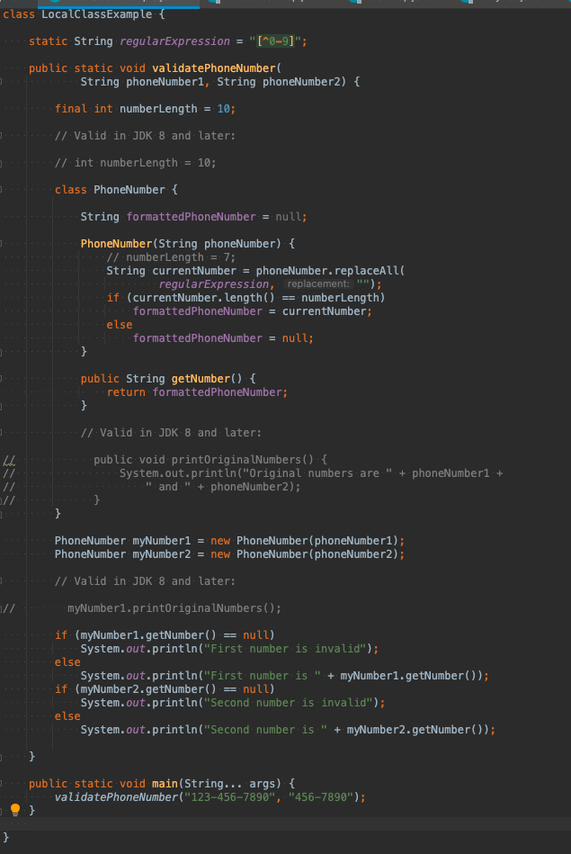
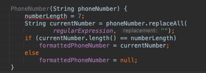

# local Class

로컬 클래스는 균형 잡힌 중괄호 사이의 0개 이상의 명령문 그룹인 블록에 정의된 클래스입니다.

일반적으로 메서드 본문에 정의된 로컬 클래스를 찾습니다.

이 섹션에서는 다음 항목을 다룹니다.

로컬 클래스 선언
둘러싸는 클래스의 멤버 액세스
섀도잉 및 로컬 클래스
로컬 클래스는 내부 클래스와 유사합니다.
로컬 클래스 선언
모든 블록 내부에 로컬 클래스를 정의할 수 있습니다(자세한 내용은 표현식, 문 및 블록 참조). 예를 들어 메서드 본문, for 루프 또는 if 절에 로컬 클래스를 정의할 수 있습니다.

다음 예제 LocalClassExample은 두 전화 번호의 유효성을 검사합니다. validatePhoneNumber 메서드에서 로컬 클래스 PhoneNumber를 정의합니다.

이 예제에서는 먼저 전화 번호에서 0에서 9까지의 숫자를 제외한 모든 문자를 제거하여 전화 번호의 유효성을 검사합니다.
그런 다음 전화 번호에 정확히 10자리(북미 전화 번호의 길이)가 포함되어 있는지 확인합니다. 이 예에서는 다음을 인쇄합니다.

첫 번째 숫자는 1234567890입니다.
두 번째 숫자가 잘못되었습니다.
둘러싸는 클래스의 멤버 액세스
로컬 클래스는 주변 클래스의 멤버에 액세스할 수 있습니다. 
이전 예제에서 PhoneNumber 생성자는 LocalClassExample.regularExpression 멤버에 액세스합니다.

또한 로컬 클래스는 로컬 변수에 액세스할 수 있습니다. 
그러나 로컬 클래스는 final로 선언된 로컬 변수에만 액세스할 수 있습니다. 로컬 클래스가 둘러싸는 블록의 로컬 변수 또는 매개변수에 액세스하면 해당 변수 또는 매개변수를 캡처합니다. 
예를 들어 PhoneNumber 생성자는 지역 변수 numberLength에 액세스할 수 있습니다. 왜냐하면 이것이 final로 선언되기 때문입니다. numberLength는 캡처된 변수입니다.

그러나 Java SE 8부터 로컬 클래스는 최종적이거나 사실상 최종적인 주변 블록의 로컬 변수 및 매개변수에 액세스할 수 있습니다. 
초기화된 후 값이 변경되지 않는 변수 또는 매개변수는 사실상 최종입니다. 
예를 들어 numberLength 변수가 final로 선언되지 않고 PhoneNumber 생성자에 강조 표시된 할당 문을 추가하여 유효한 전화 번호의 길이를 7자리로 변경한다고 가정합니다.

이 할당문으로 인해 numberLength 변수는 더 이상 사실상 최종적이지 않습니다. (final이 아니란 얘기)
결과적으로 Java 컴파일러는 내부 클래스 PhoneNumber가 numberLength 변수에 액세스하려고 시도하는 
"내부 클래스에서 참조하는 로컬 변수가 최종적이거나 사실상 최종적이어야 함"과 유사한 오류 메시지를 생성합니다.

if (currentNumber.length() == numberLength)

Java SE 8부터 메소드에서 로컬 클래스를 선언하면 메소드의 매개변수에 액세스할 수 있습니다. 
예를 들어 PhoneNumber 로컬 클래스에서 다음 메서드를 정의할 수 있습니다.

public void printOriginalNumbers() {
System.out.println("Original numbers are " + phoneNumber1 +
" and " + phoneNumber2);
}

printOriginalNumbers 메소드는 validatePhoneNumber 메소드의 phoneNumber1 및 phoneNumber2 매개변수에 액세스합니다.

##  지역 클래스는 내부 클래스와 유사하다.

지역 클래스는 정적 멤버를 정의하거나 선언할 수 없기 때문에 내부 클래스와 유사합니다. 
정적 메서드 validatePhoneNumber에 정의된 PhoneNumber 클래스와 같은 정적 메서드의 로컬 클래스는 둘러싸는 클래스의 정적 멤버만 참조할 수 있습니다.
예를 들어, regularExpression 멤버 변수를 정적으로 정의하지 않으면 Java 컴파일러에서 "비정적 변수 regularExpression을 정적 컨텍스트에서 참조할 수 없습니다."와 유사한 오류를 생성합니다.
로컬 클래스는 바깥쪽 블록의 인스턴스 멤버에 액세스할 수 있기 때문에 비정적입니다. 따라서 대부분의 정적 선언을 포함할 수 없습니다.

블록 내에서 인터페이스를 선언할 수 없습니다. 
인터페이스는 본질적으로 정적입니다. 
예를 들어 다음 코드 발췌는 HelloThe 인터페이스가 GreetingInEnglish 메서드의 본문 내부에 정의되어 있기 때문에 컴파일되지 않습니다

public void greetInEnglish() {
    interface HelloThere {
    public void greet();
    }
    class EnglishHelloThere implements HelloThere {
    public void greet() {
    System.out.println("Hello " + name);
    }
    }
    HelloThere myGreeting = new EnglishHelloThere();
    myGreeting.greet();
    }

로컬 클래스에서 정적 이니셜라이저 또는 멤버 인터페이스를 선언할 수 없습니다. 
다음 코드 발췌는 EnglishGoodbye.sayGoodbye 메서드가 정적으로 선언되었기 때문에 컴파일되지 않습니다. 
컴파일러는 다음 메서드 정의를 만나면 "수정자 '정적'은 상수 변수 선언에서만 허용됨"과 유사한 오류를 생성합니다.

    public void sayGoodbyeInEnglish() {
        class EnglishGoodbye {
            public static void sayGoodbye() {
                System.out.println("Bye bye");
            }
        }
        EnglishGoodbye.sayGoodbye();
    }

지역 클래스는 상수 변수인 경우 정적 멤버를 가질 수 있습니다.
(상수 변수는 final로 선언되고 컴파일 타임 상수 표현식으로 초기화되는 원시 유형 또는 유형 String의 변수입니다. 컴파일 타임 상수 표현식은 일반적으로 컴파일 타임에 평가될 수 있는 문자열 또는 산술 표현식입니다. 참조 자세한 내용은 클래스 멤버를 이해하십시오.) 
정적 멤버 EnglishGoodbye.farewell이 상수 변수이기 때문에 다음 코드 발췌가 컴파일됩니다.

    public void sayGoodbyeInEnglish() {
        class EnglishGoodbye {
            public static final String farewell = "Bye bye";
            public void sayGoodbye() {
                System.out.println(farewell);
            }
        }
        EnglishGoodbye myEnglishGoodbye = new EnglishGoodbye();
        myEnglishGoodbye.sayGoodbye();
    }

## 정리
1. 로컬 클래스는 메소드 내부의 정의하는 클래스 이다. 
2. 주변 클래스 멤버에 접근이 가능함 자바 8 부터는 **final**이 선언된 주변 블록의 로컬 변수 및 매개 변수만 접근 가능.
3. 지역 클래스와 무명 클래스의 경우 , 객체를 생성할 때에 지역 클래스와 무명 클래스에서 사용하는
   외곽 블럭의 지역 변수와 매개변수를 지역클래스와 무명 클래스의 멤버필드로 복사하는대 이를 변수 포획이라 함.

왜 Final 만 접근이 가능하지 ?

이해가 안돼서 두개 정도 찾아 봄
 
->  지역 클래스 인스턴스가 메서드가 반환된 후에도 메모리에 남아 있을 수 있기 때문입니다. 
    메서드가 지역 변수를 반환하면 범위를 벗어나므로 복사본이 필요합니다. 
    변수가 최종 변수가 아닌 경우 메서드의 변수 복사본은 변경될 수 있지만
    로컬 클래스의 복사본은 변경되지 않으므로 동기화되지 않습니다.

->  음 질문을 드릴부분?

4. 지역 클래스는 상수를 표현하기 위한 경우 예외적으로 static 멤버를 가질 수 있다. (예외적인경우에만..)

출처: https://epicdevsold.tistory.com/89
     https://docs.oracle.com/javase/tutorial/java/javaOO/localclasses.html
     https://blog.fupfin.com/?p=50