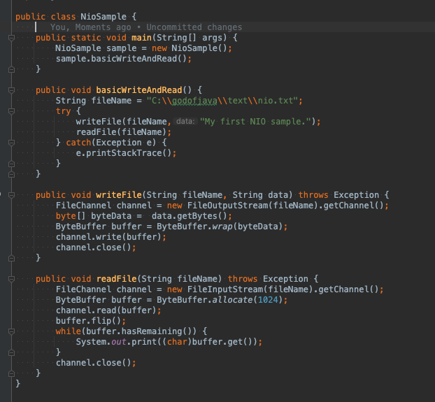

# SerializableAndNIO

 

## Serializable
 
 + 아무것도 없는 인터페이스.. 뭐지?
 + 객체를 파일로 저장하거나 저장한 객체를읽거나
 + 다른서버로 보내거나 받거나, 하려면 Serializable 구현해야됨.
 + JVM에서는 해당객체를 저장하거나 다른서버로 전송하게 함
 + serialVersionUID 지정 (구현할 뗴) 권장함 JVM에서 자동으로 만들어 주기도함
 + 객체를 전송 할때 버전을 명시하는 용도로 사용하고 같은 객체 인지 확인할때 사용을 한다.
 + 허나 같은 UID라도 두 서버 변수의 개수나 타입이 다르면 다른 객체로 인식하기도 함.

## 객체 저장 (간단한 예시)

 + DTO (Serializable Implement) 만들어주고.
 + fos = new FileOutputStream(경로) -- 경로에 객체를 생성
 + oos = new ObjectOutputStream(fos) -- 객체는 파일에 저장
 + oos.writeObject(dto) -- 매게변수 객체 듬장.

## 객체 읽기

 + fis = new FileInputStream(경로)
 + ois = new ObjectInputStream(fis);
 + SerialDto dto = (SerialDto)ois.readObject(); -- 오브젝트 타입이기 때문에 형변환 
 + 여기서 문제는 처음 설명한 serialVersionUID를 생성을 생성을 안해줬다
 + 그래서 변경시 같은 객체가 아니라는 예외 발생! 선언하고 객체를 변경해주면 제대로 읽힌다.

## transient

 + 변수명 앞에 transient 선언을 하면 Serializable 대상에서 제외가 된다
 + 그래서 객체를 읽을때 값이 0? (책의 예제) 나오지 않는다.
 + 주로 페스워드 등 보안상 중요한 변수나 굳이 저장할 필요가 없는 변수를 선언할때 좋은거 같다.

## java NIO

  + 기존 IO에비해 속도가 빠른 NIO
  + stream 대신 Channel / BUffer를 사용함.
  + 물간을 중간에 처리하는 도매상 소비자에게 물건을 파는 소매상이라 생각하자

## NIO Example

 + 기존 FileInputStream ,OutputStream 에서 getChannel 객체를 생성함
 + ByteData로 만들어 ByteBuffer형식으로 저장  channel 객체에 넣고 저장한다. 반대도 마찬가지

## NIO  BufferClass

 + 버퍼의 속성 및 상태를 확인하기위한 capacity() / limit () / position() 메서드 존재
 + Flip() 메소드는 되감기처럼 맨 앞으로 이동 limit을 현재 ㅗ지션으로 지정후 Postion을 0으로 만