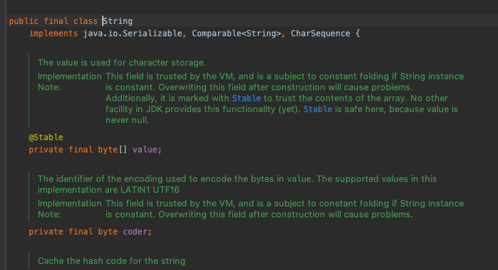

# String

## 공식문서

Java 프로그래밍에서 널리 사용되는 문자열은 일련의 문자입니다. Java 프로그래밍 언어에서 문자열은 객체입니다.

Java 플랫폼은 문자열을 생성하고 조작하기 위한 String 클래스를 제공합니다.

문자열을 만드는 가장 직접적인 방법은 다음과 같이 작성하는 것입니다.

String Greeting = "Hello world!";
이 경우 "Hello world!" 큰따옴표로 묶인 코드의 일련의 문자인 문자열 리터럴입니다.
코드에서 문자열 리터럴을 만날 때마다 컴파일러는 해당 값(이 경우 Hello world!)을 사용하여 String 개체를 만듭니다.

다른 개체와 마찬가지로 new 키워드와 생성자를 사용하여 String 개체를 만들 수 있습니다. String 클래스에는 문자 배열과 같은 다양한 소스를 사용하여 문자열의 초기 값을 제공할 수 있는 13개의 생성자가 있습니다.

String 클래스는 final로 선언되 있어서 확장이 불가!
구현부분은

Serializable
Comparable<String>
CharSequence
