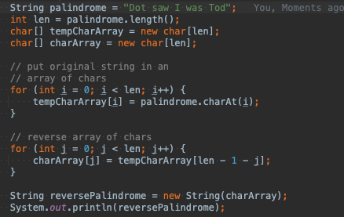

# String

## JAVA tutorial

Java 프로그래밍에서 널리 사용되는 문자열은 일련의 문자입니다. Java 프로그래밍 언어에서 문자열은 객체입니다.

Java 플랫폼은 문자열을 생성하고 조작하기 위한 String 클래스를 제공합니다.

문자열을 만드는 가장 직접적인 방법은 다음과 같이 작성하는 것입니다.

String Greeting = "Hello world!";
이 경우 "Hello world!" 큰따옴표로 묶인 코드의 일련의 문자인 문자열 리터럴입니다.
코드에서 문자열 리터럴을 만날 때마다 컴파일러는 해당 값(이 경우 Hello world!)을 사용하여 String 개체를 만듭니다.

다른 개체와 마찬가지로 new 키워드와 생성자를 사용하여 String 개체를 만들 수 있습니다. String 클래스에는 문자 배열과 같은 다양한 소스를 사용하여 문자열의 초기 값을 제공할 수 있는 13개의 생성자가 있습니다.

char[] helloArray = { 'h', 'e', 'l', 'l', 'o', '.' };
String helloString = new String(helloArray);
System.out.println(helloString);

이 코드 조각의 마지막 줄에는 hello가 표시됩니다.

참고: String 클래스는 변경할 수 없으므로 일단 생성되면 String 객체를 변경할 수 없습니다. 
String 클래스에는 문자열을 수정하는 것처럼 보이는 여러 메서드가 있으며 그 중 일부는 아래에서 설명합니다. 
문자열은 변경할 수 없으므로 이러한 메서드가 실제로 하는 일은 작업 결과를 포함하는 새 문자열을 만들고 반환하는 것입니다.

###형식 문자열 생성
형식이 지정된 숫자로 출력을 인쇄하기 위해 printf() 및 format() 메서드를 사용하는 것을 보았습니다. 
String 클래스에는 PrintStream 객체가 아닌 String 객체를 반환하는 동등한 클래스 메서드인 format()이 있습니다.

String의 정적 format() 메서드를 사용하면 일회성 인쇄 문과 달리 재사용할 수 있는 형식이 지정된 문자열을 만들 수 있습니다.

## 정리

1. String 생성하고 조작하는 가장 기본적인 String Class
2. String 클래스는 한번 생성되면 객체가 변경이 불가능 만약 수정을한다면 새로 할당받음(new String(수정한 String))
3. 문자열의 길이를 구하거나 , 합치는 메소드가 있다 .. 기본적으로 알고있는거라 패스
4. format() 매서드는 재사용 할 수 있다?
ex)
System.out.println(String.format("%s %<s %<s %<s", "hello"));
 <  이걸 쓰면 재사용 가능 .

아규먼트 인덱스(argument index)
인수 목록에서 인수의 위치를 나타내는 10진수 정수(해당 인수를 인덱스로 지정)
아라비아 숫자와 $ 문자로 구성(첫 번째 인수 1$, 두 번째 인수 2$, ...)
< 플래그를 사용하면 이전 형식 지정자에 대한 인수를 재사용 할 수 있다.

    boolean bool = true;
    int n = 1234;
    LocalDateTime now = LocalDateTime.now();

    String result = String.format("문자열 서식: %s, %S", str, str);
    System.out.println(result);
    
    result = String.format("boolean 서식 문자열: %B, %b", bool, bool);
    System.out.println(result);
    
    result = String.format("정수 서식: %d, %o, %x, %05d", n, n, n, n); 
    System.out.println(result);  // %05d → 5자리수, 공백을 0으로 채움
    
    result = String.format("부동 소수점 서식: %4$e, %3$f, %2$g, %1$a", 1234.01, 1234.02, 1234.03, 1234.04);
    System.out.println(result);  // %숫자$ 로 절대 인수 인덱스 지정
    
    result = String.format("날짜/시간 서식: %tY년 %<tm월 %<td일 %<tH시 %<tM분 %<tS초", now);
    System.out.println(result);  // $< 로 상대 인덱스 지정하여 직전의 인수와 같은 인덱스를 이용

#### 결과
문자열 서식: StringFormatExample, STRINGFORMATEXAMPLE
boolean 서식 문자열: TRUE, true
정수 서식: 1234, 2322, 4d2, 01234
부동 소수점 서식: 1.234040e+03, 1234.030000, 1234.02, 0x1.3480a3d70a3d7p10
날짜/시간 서식: 2021년 04월 09일 16시 21분 33초

String result = String.format("부동 소수점 서식: %4$d, %3$d, %2$d, %1$d", 1, 2, 3, 4);
System.out.println(result);  // %숫자$ 로 절대 인수 인덱스 지정
부동 소수점 서식: 4, 3, 2, 1

## JAVA8 api

클래스는 String문자열을 나타냅니다. 와 같은 Java 프로그램의 모든 문자열 리터럴 "abc"은 이 클래스의 인스턴스로 구현됩니다.
문자열은 일정합니다. 값을 만든 후에는 변경할 수 없습니다. 문자열 버퍼는 변경 가능한 문자열을 지원합니다. String 객체는 변경할 수 없으므로 공유할 수 있습니다. 예를 들어:

     String str = "abc";

는 다음과 같습니다.

     char data[] = {'a', 'b', 'c'};
     String str = new String(data);

다음은 문자열을 사용하는 방법에 대한 몇 가지 예입니다.

     System.out.println("abc");
     String cde = "cde";
     System.out.println("abc" + cde);
     String c = "abc".substring(2,3);
     String d = cde.substring(1, 2);

이 String 클래스 에는 시퀀스의 개별 문자를 검사하고, 문자열을 비교하고, 문자열을 검색하고, 하위 문자열을 추출하고, 모든 문자가 대문자 또는 소문자로 변환된 문자열의 복사본을 만드는 메서드가 포함되어 있습니다. 
케이스 매핑은 Character클래스에서 지정한 유니코드 표준 버전을 기반으로 합니다.

Java 언어는 문자열 연결 연산자( + )와 다른 개체를 문자열로 변환하는 데 특별한 지원을 제공합니다. 
문자열 연결은 StringBuilder(또는 StringBuffer) 클래스와 해당 append메서드를 통해 구현됩니다. 
문자열 변환은 Java의 모든 클래스에 의해 toString정의되고 상속되는 메소드를 통해 구현됩니다. Object문자열 연결 및 변환에 대한 추가 정보는 Gosling, Joy, Steele, The Java Language Specification 을 참조하십시오 .

달리 명시되지 않는 한 이 클래스의 생성자나 메서드에 nullNullPointerException 인수를 전달하면 throw됩니다.

A 는 보조 문자 가 서로게이트 쌍 으로 표현되는 StringUTF-16 형식의 문자열을 나타냅니다(자세한 내용 은 클래스 의 유니코드 문자 표현 섹션 참조 ). 인덱스 값은 코드 단위를 참조하므로 보조 문자는 에서 두 위치를 사용합니다 . CharactercharString

이 클래스는 유니코드 코드 단위(즉, 값) String를 처리하는 방법 외에 유니코드 코드 포인트(즉, 문자)를 처리하는 방법을 제공합니다 .

String 클래스에는 시퀀스의 개별 문자를 검사하고, 문자열을 비교하고, 문자열을 검색하고, 하위 문자열을 추출하고, 
모든 문자가 대문자 또는 소문자로 변환된 문자열의 복사본을 만드는 메서드가 포함되어 있습니다.
대소문자 매핑은 Character 클래스에서 지정한 유니코드 표준 버전을 기반으로 합니다.

-> 함수제공 관련은 위에 정리에 필기함

Java 언어는 문자열 연결 연산자( + )와 다른 개체를 문자열로 변환하는 데 특별한 지원을 제공합니다.
문자열 연결은 StringBuilder(또는 StringBuffer) 클래스와 해당 추가 메서드를 통해 구현됩니다. 
문자열 변환은 Object로 정의되고 Java의 모든 클래스에서 상속되는 toString 메서드를 통해 구현됩니다. 
문자열 연결 및 변환에 대한 추가 정보는 Gosling, Joy, Steele, The Java Language Specification을 참조하십시오.

달리 명시되지 않는 한 이 클래스의 생성자 또는 메서드에 null 인수를 전달하면 NullPointerException이 throw됩니다.

String은 보조 문자가 서로게이트 쌍으로 표현되는 UTF-16 형식의 문자열을 나타냅니다(자세한 내용은 Character 클래스의 유니코드 문자 표현 섹션 참조).
인덱스 값은 문자 코드 단위를 참조하므로 보조 문자는 문자열에서 두 위치를 사용합니다.

String 클래스는 유니코드 코드 단위(즉, char 값)를 처리하는 방법 외에 유니코드 코드 포인트(즉, 문자)를 처리하는 방법을 제공합니다.

## 정리

1. String Class는 확장 불가능한 final 이 선언된 클래스이며 불변 객체임.(기본적인 정보)

불변 객체 이유 ? why?

String에서 저장되는 문자열은 알고보면 char형태의 배열로 이루어 져있고 private final로 선언 되어 있다.
외부에서 접근을 허용하지않고 한번 초기값이 주어지면 값은 불변으로 바뀔수 없게 만든 것 이다.

4. String 을 "abc" 리터럴로 표현하면 스트링 클래스에 인스턴스로 구현됨.
5. 문자열은 변경이 안돼기 때문에(새로할당) 공유는 가능함 .
6. 문자열 비교(equals), 검색(indexOf), 추출(substrings) , 대소문자 변환 복사본 메서드(toUpperCase)가 존재한다.
7. 문자열은 + 연산자로 문자열로 형변환이 가능하고 StringBuilder나 StringBuffer로 문자열 연결이 이 클래스와 해당 추가 메서드를 통해 구현됨

## 스트링 연결 연산자

이제 까지 배워왔던 것에 따르면
문자열을 +를 하면 문자열을 붙일 수 있다 그러나 새로운 인스턴스로인해 메모리릭으로 이어져 문제가 발생하는지 알았다.
허나 JAVA1.5 부터 내부적(컴파일단계)으로 StringBuilder로 변환해 처리하기 때문에 StringBuilder와 동일 하다고 보면된다.
가독성도 더 좋으니 + 연산자써서 문자열을 붙이면 된다.

허나 단점으로 간단한 문자열 조합은 + 를 쓰면ㄷ 되지만 만들 때 마다 String Builder인스턴스를 생성하기때문에
반복문에서 문자열을 조합하는 것처럼 많은 양의 문자열을 계속해서 더해야 한다면
StringBuilder/StringBuffer를 쓰는게 더 좋다.

String 클래스는 final로 선언되 있어서 확장이 불가!
구현부분은

Serializable
Comparable<String>
CharSequence

# 부가적인 정보 영역 String 함수 설명 

## 이미 알고 있는 것들이지만 공식문서에 예제들이 있어서 따로 적어두기만 했다.

###String Length

개체에 대한 정보를 얻는 데 사용되는 메서드를 접근자 메서드라고 합니다.
문자열과 함께 사용할 수 있는 접근자 메서드 중 하나는 문자열 개체에 포함된 문자 수를 반환하는 length() 메서드입니다.
다음 두 줄의 코드가 실행된 후 len은 17과 같습니다.

String palindrome = "Dot saw I was Tod";
int len = palindrome.length();

회문은 대칭적인 단어 또는 문장입니다.
대소문자와 구두점을 무시하고 앞뒤로 같은 철자를 사용합니다.
다음은 회문 문자열을 뒤집는 짧고 비효율적인 프로그램입니다. 0부터 계산하여 문자열의 i번째 문자를 반환하는 String 메서드 charAt(i)를 호출합니다.

프로그램을 실행하면 다음과 같은 출력이 생성됩니다.

doT saw I was toD
문자열 반전을 수행하기 위해 프로그램은 문자열을 문자 배열로 변환하고(첫 번째 for 루프),
배열을 두 번째 배열로 반전(두 번째 for 루프)한 다음 다시 문자열로 변환해야 했습니다. String 클래스에는 문자열 또는 문자열의 일부를 문자 배열로 변환하는 getChars() 메서드가 포함되어 있으므로
위 프로그램의 첫 번째 for 루프를

palindrome.getChars(0, len, tempCharArray, 0);

###Concatenating Strings

String 클래스에는 두 문자열을 연결하는 메서드가 포함되어 있습니다.

string1.concat(String2);
이것은 끝에 string2가 추가된 string1인 새 String을 반환합니다.

다음과 같이 String 리터럴과 함께 concat() 메서드를 사용할 수도 있습니다.

"My name is ".concat("Rumplestiltskin");

String은 다음과 같이 + 연산자로 더 일반적으로 연결됩니다.

"Hello," + " world" + "!"
그 결과

"Hello, world!"
+ 연산자는 인쇄 문에서 널리 사용됩니다. 예를 들어:

String string1 = "saw I was ";
System.out.println("Dot " + string1 + "Tod");

어떤 인쇄

Dot saw I was Tod
이러한 연결은 모든 개체의 혼합일 수 있습니다. String이 아닌 각 객체에 대해 toString() 메서드가 호출되어 이를 String으로 변환합니다.

참고: Java 프로그래밍 언어는 리터럴 String이 소스 파일의 줄에 걸쳐 있는 것을 허용하지 않으므로 여러 줄 String의 각 줄 끝에 + 연결 연산자를 사용해야 합니다. 예를 들어:
String quote =
"Now is the time for all good " +
"men to come to the aid of their country.";
+ 연결 연산자를 사용하여 줄 사이에서 String을 끊는 것은 다시 한번 인쇄 문에서 매우 일반적입니다.

출처 : https://docs.oracle.com/javase/tutorial/java/data/strings.html ,
      https://velog.io/@yu-jin-song/JAVA-%EB%AC%B8%EC%9E%90%EC%97%B4-%ED%98%95%EC%8B%9D-%EC%A7%80%EC%A0%95 
      https://docs.oracle.com/javase/8/docs/api/java/lang/String.html
      https://novemberde.github.io/post/2017/04/15/String_0/
      https://futurecreator.github.io/2018/06/02/java-string-concatenation/
