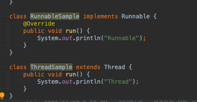

# Thread

## 자바의신 책정리

 + JVM이 시작되면서 프로세스가 시작되고 프로세스 하나에는 여러개의 쓰레드가 수행 됨.( main 메서드가 실행되면서)
 + WAS도 똑같이 main() 메소드에서 생성한 쓰레드들이 수행됨

## 쓰레드는 왜? 만들었지?
 
 + 쓰레드는 경량 프로세스라고 얘기함. (1MB 이내 메모리만 점유)
 + 하나의 작업을 동시에 수행 할때 여러개의 프로세스를 실행하면 각가 메모리를 할당해 주는데
 + 프로세스 하나당 메모리 가 32~64MB가 필요 그래서 쓰레드를 활용하는게 가성비가 좋다.

## 쓰레드 생성

 + Runnable OR Thread 클래스를 사용해서 만들어 보자.
 + Thread 클래스는 Runnable 인터페이스를 구현한 클래스임
 + 어떤것을 적용하느냐의 차이일뿐 둘다 java.lang 패키지에 있어서 별도 import X 

 + Runnable run() 메소드 하나. (쓰레드가 시작되면 수행되는 메소드)
 + Thread는 다양한 생성자와 메소드를 제공한다.

 + 간단하게 Runnable , Thread 코드
 + 여기서  사실은
 + 쓰레드가 수행되는 우리가 구현 메소드는 run 이고 시작하는 메소드는 start()다.

 + Runnable 과 Thread 클래스는 실행 방법이 다름 
 + Runnable 인터페이스 구현이나 Thread 확장일땐 run 메소드가 출발점!

## Runnable 실행과 Thread 클래스 왜 2가지 실행방법을 제공할 까?

 + 자바는 다중 상속이 안돼기 때문..
 + 쓰레드 클래스가 다른 클래스를 확장할 필요 있을 때? -> Runnable
 + 아니면 Thread Class  확장

## Thread 실행순서

 + 위 코드를 실행해보면 순차적으로 될때도 있지만 순서가 뒤 바뀔 때도 있다.
 + start() 메서드는 JVM에 쓰레드를 추가하여 실행한다는 뜻이다
 + start() 메서드는 시작하고 끝날때 까지 기다리지 않고 다음 줄에 있는 코드를 실행하기 때

## sleep

 + sleep(1000) 1초 동안 멈춤 
 + sleep을 쓸때는 try-catch로 묶어줘야한다 InterruptedException가 발생할 수있기 때문이다.

## Thread 주요 메서드

 + Priority  쓰레드 우선순위 확인 (우선순위: 대기하고있는 상황에서 더 먼저 수행할 수 있는 순위)
 + 왠만하면 변강하지 말고 냅두자 장애가 발생 할 가능성이 있다.
 + 기본값은 5 이며 API에서는 MAX_PRIORITY(10) / NORM_PRIORITY(5) / MIN_PRIORITY(1) 가 있다

## demonThread

 + JVM이 데몬 쓰레드가 실행 중이더라도 다른 쓰레드가 없으면 프로그램 종료함. (데몬 쓰레드가 돌던 말던 상관안하고..)
 + 쓰레드가 시작하기전 지정해줘야 됨.

## 왜 demonThread를 만들었지?

 + 모니터링을 하면서 쓰레드 별도로 띄어 모니터링하다
 + 주요 쓰레드가 종료되면 관련 된 모니터링 쓰레드도 종료되어야 프로세스가 종료됨.
 + 이때 데몬쓰레드로 만들어야 프로세스가 종료 됨.
 + 따라서 부가 작업을 수행하는 쓰레드를 선언할 대..

## synchronized
 
 + 동기화를 선언하면 Thread Safe 하다.
 + 동기화를 선언하면 한 개의 쓰레드만 수행하고 나머지는 대기해서 동시에 수행해서 값이 꼬이는걸 방지 할 수도 있고..

 + 사용 방법은 메소드 자체를 synchronized 선언하는 법
 + 메소드 내 특정 문장만 synchronized로 감싸기 가 있다.

## Method synchronized
 
 + ex) public sychronized void plus();
 + 동기화를 하지 않으면, 동시에 여러 쓰레드가 들어 올 때 동시에 작업하기 때문에 연산이 꼬일 수 있다.
 + 그래서 동기화를 사용하면 정상적으로 수행된다.
 + synchronized(this){} 블록을 사용할 수 있으며 해당 블록은 동기화를 사용한다는 의미다.

## Interrupt

 + 현재 실행중인 쓰레드를 종료함. (InterruptedException 발생시키면서)
 + Thread는 stop이란 메서드가 있지만, 안전상 이유로 사용되지 않아서 interrupt() 메소드를 사용해서 중지시킴
 + Interrupt 메소드는 sleep/join/wait 메소드가 호출된 상태에서 사용가능하다
 + 실행이 종료된 스레드에 interrupt 메소드를 사용하면 아무런 반응이없이 그냥 진행된다.

## object Class 선언된 Thread Method

 + notify() : object 객체의 모니터에 대기하고 있는 단일 쓰레드 깨움 / NotifyAll : 앞에거 + 모든 쓰레드 깨움
 + wait() : 다른 쓰레드가 object 객체에 대한 위 두개 메소드를 호출할 때까지 현재 쓰레드가 대기하고 있도록함
 + 대기 상태 on/off 인 메서드 이다 . 

 + 예제 코드, 
 + 쓰레드를 생성하고 , 시작! -> wait 상태에서 notifyAll() 해주면서 대기 상태를 깨워주고, 쓰레드가 정상적으로 종료된다.