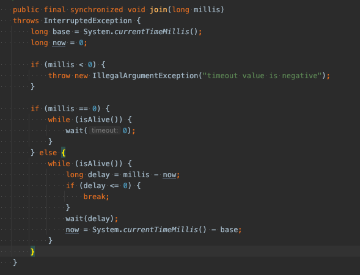

# Thread

## 공식문서 

 + 스레드 는 프로그램에서 실행되는 스레드입니다 . 
 + JVM(Java Virtual Machine)을 사용하면 애플리케이션이 동시에 실행되는 여러 스레드를 실행할 수 있습니다.
 + 모든 스레드에는 우선 순위가 있습니다. 우선 순위가 높은 스레드가 우선 순위가 낮은 스레드보다 우선적으로 실행됩니다.
 + 각 스레드는 데몬으로 표시되거나 표시되지 않을 수 있습니다. 
 + 일부 스레드에서 실행 중인 코드가 새 Thread객체를 생성할 때 새 스레드는 처음에 생성 스레드의 우선순위와 동일한 우선순위를 가지며 생성 스레드가 데몬인 경우에만 데몬 스레드입니다.

 + JVM(Java Virtual Machine)이 시작될 때 일반적으로 데몬이 아닌 단일 스레드(일반적으로 main지정된 클래스의 이름이 지정된 메서드를 호출함)가 있습니다. 
 + Java Virtual Machine은 다음 중 하나가 발생할 때까지 스레드를 계속 실행합니다.

 + 클래스 의 exit메소드 Runtime가 호출되었으며 보안 관리자가 종료 조작이 발생하도록 허용했습니다.
 + 데몬 스레드가 아닌 모든 스레드는 메서드에 대한 호출에서 반환 하거나 메서드를 넘어 전파되는 예외를 throw하여 죽습니다.
 + 새 실행 스레드를 만드는 방법에는 두 가지가 있습니다. 하나는 클래스를 의 하위 클래스로 선언하는 것입니다 Thread. 
 + 이 하위 클래스는 runclass 의 메서드를 재정의해야 합니다 Thread. 그런 다음 하위 클래스의 인스턴스를 할당하고 시작할 수 있습니다.
 + 예를 들어 명시된 값보다 큰 소수를 계산하는 스레드는 다음과 같이 작성할 수 있습니다.

    class PrimeThread extends Thread {
    long minPrime;
    PrimeThread(long minPrime) {
    this.minPrime = minPrime;
    }
    
             public void run() {
                 // compute primes larger than minPrime
                  . . .
             }
         }

 + 다음 코드는 스레드를 생성하고 실행을 시작합니다.
    
    + PrimeThread p = new PrimeThread(143);
    + p.start();

 + 스레드를 만드는 다른 방법은 Runnable인터페이스를 구현하는 클래스를 선언하는 것입니다. 
 + 그런 다음 해당 클래스는 메서드를 구현합니다 run. 그런 다음 클래스의 인스턴스를 할당하고 생성할 때 인수로 전달 Thread하고 시작할 수 있습니다. 이 다른 스타일의 동일한 예는 다음과 같습니다.

    class PrimeRun implements Runnable {
    long minPrime;
    PrimeRun(long minPrime) {
    this.minPrime = minPrime;
    }
    
             public void run() {
                 // compute primes larger than minPrime
                  . . .
             }
         }

 + 다음 코드는 스레드를 생성하고 실행을 시작합니다.

     PrimeRun p = new PrimeRun(143);
     new Thread(p).start();

 + 모든 스레드에는 식별을 위한 이름이 있습니다. 둘 이상의 스레드가 같은 이름을 가질 수 있습니다. 스레드가 생성될 때 이름이 지정되지 않으면 새 이름이 생성됩니다.

 + 달리 명시되지 않는 한 null이 클래스의 생성자나 메서드에 인수를 전달하면 NullPointerExceptionthrow됩니다.

## 공식문서 정리

 1. 메서드가 종료되거나 예외가 발생하면 스레드 종료
 2. 스레드는 기본적으로 5의 우선순위 할당 받음
 3. 모든 스레드에는 식별하는 이름이 있지만 같은 이름을 가질 수 있고 새 이름이 생성 되기도 한다.
 4. start() 함수는 매서드를 실행하면 Thread를 새로 생성하여 start -> run() 실행 (멀티쓰레드 동작)
 5. Run() 매서드는 함수만 실행시키지 Thread가 생성되지 않는다. (싱글쓰레드)

## 예제코드 

    public class RamenProgram {

    public static void main(String[] args) {
        int num;
        Scanner input = new Scanner(System.in);

        System.out.println("라면 몇 개 끓일까요?");

        num = input.nextInt();

        System.out.println(num + "개 주문 완료! 조리시작!");
        try {
            RamenCook ramenCook = new RamenCook(num);
            new Thread(ramenCook, "A").start();
            new Thread(ramenCook, "B").start();
            new Thread(ramenCook, "C").start();
            new Thread(ramenCook, "D").start();
        } catch (Exception e) {
            e.printStackTrace();
        }

    }

}

    interface Runnable {
    public void run();
    }
    
    
    class currentThread extends Thread {
    public RamenCook ramenCook;
    static String nam;

    currentThread() {
        this(new RamenCook(5), "");
    }

    currentThread(RamenCook ramenCook, String nam) {
        this.ramenCook = ramenCook;
        this.nam = nam;
    }
    }

    
    class RamenCook extends Thread implements Runnable {
    private int ramenCount;
    private String[] burners = {"_", "_", "_", "_"};

    public RamenCook(int count) {
        ramenCount = count;
    }

    @Override
    public void run() {
        while (ramenCount > 0) {
            synchronized (this) {
                ramenCount--;
                System.out.println(Thread.currentThread().getName() + " : " + ramenCount + "개 남았습니다");
            }

            for (int i = 0; i < burners.length; i++) {
                if (!burners[i].equals("_")) {
                    continue;
                }

                synchronized (this) {
                    burners[i] = Thread.currentThread().getName();
                    System.out.println("                 " + Thread.currentThread().getName() + " : [" + (i + 1) + "]번 버너 ON");
                    showBurners();
                }

                try {
                    Thread.sleep(2000);
                } catch (Exception e) {
                    e.printStackTrace();
                }

                synchronized (this) {
                    burners[i] = "_";
                    System.out.println("                                  " + Thread.currentThread().getName() + " : [" + (i + 1) + "]번 버너 OFF");
                    showBurners();
                }
                break;
            }

            try {
                Thread.sleep(Math.round(1000 * Math.random()));
            } catch (Exception e) {
                e.printStackTrace();
            }
        }
    }

    private void showBurners() {
        String stringToPrint = "                                                             ";
        for (int i = 0; i < burners.length; i++) {
            stringToPrint += (" " + burners[i]);
        }
        System.out.println(stringToPrint);
    }

 + 결과값
 + 한 객체에 여러개의 쓰레드를 실행시키면서 연산된 결과
 + 동기화 코드를 사용해 쓰레드가 실행될때 겹치지않게 안전장치를 해준다.
 + 

## 자바의신 책정리

 + JVM이 시작되면서 프로세스가 시작되고 프로세스 하나에는 여러개의 쓰레드가 수행 됨.( main 메서드가 실행되면서)
 + WAS도 똑같이 main() 메소드에서 생성한 쓰레드들이 수행됨
 + 스레드란 프로그램 제어 흐름 (실행 단위)을 말함
 + 한 프로세스내에도 여러 갈래의 작업들이 동시에 진행될 필요가 있는데 이걸 스레드라함.
 + 프로세스를 식당이라하면 모든 요리를 만들어내는게 스레드

## 쓰레드는 왜? 만들었지?
 
 + 쓰레드는 경량 프로세스라고 얘기함. (1MB 이내 메모리만 점유)
 + 하나의 작업을 동시에 수행 할때 여러개의 프로세스를 실행하면 각가 메모리를 할당해 주는데
 + 프로세스 하나당 메모리 가 32~64MB가 필요 그래서 쓰레드를 활용하는게 가성비가 좋다.

## 쓰레드 생성

 + Runnable OR Thread 클래스를 사용해서 만들어 보자.
 + Thread 클래스는 Runnable 인터페이스를 구현한 클래스임
 + 어떤것을 적용하느냐의 차이일뿐 둘다 java.lang 패키지에 있어서 별도 import X 

 + Runnable run() 메소드 하나. (쓰레드가 시작되면 수행되는 메소드)
 + Thread는 다양한 생성자와 메소드를 제공한다.

 + 간단하게 Runnable , Thread 코드
 + 여기서  사실은
 + 쓰레드가 수행되는 우리가 구현 메소드는 run 이고 시작하는 메소드는 start()다.

 + Runnable 과 Thread 클래스는 실행 방법이 다름 
 + Runnable 인터페이스 구현이나 Thread 확장일땐 run 메소드가 출발점!

## Runnable 실행과 Thread 클래스 왜 2가지 실행방법을 제공할 까?

 + 자바는 다중 상속이 안돼기 때문..
 + 쓰레드 클래스가 다른 클래스를 확장할 필요 있을 때? -> Runnable
 + 아니면 Thread Class  확장

## Thread 실행순서

 + 위 코드를 실행해보면 순차적으로 될때도 있지만 순서가 뒤 바뀔 때도 있다.
 + start() 메서드는 JVM에 쓰레드를 추가하여 실행한다는 뜻이다
 + start() 메서드는 시작하고 끝날때 까지 기다리지 않고 다음 줄에 있는 코드를 실행하기 때

## sleep

 + sleep(1000) 1초 동안 멈춤 
 + 스레드를 일시 정지 시킨다.
 + sleep을 쓸때는 try-catch로 묶어줘야한다 InterruptedException가 발생할 수있기 때문이다.
 + 스레드는 구현할때 무한루프를 돌며 주기적으로 문제가없는지확인한다 .
 + sleep 함수가 없으면 쉬지못하고 계속확인하기때문에 CPU발생률이 100% 증가해 문제 야기

## join

 + 실행중인 쓰레드가 종료할때까지 대기
 + 매게변수가 없으면 해당쓰레드가 종료 할 때까지 무기한 대기.
 + 기본적으론 join() == join(0)
 + 쓰레드가 종료될때까지 Join() 함수도 끝나지 않는다.

## Thread 주요 메서드

 + Priority  쓰레드 우선순위 확인 (우선순위: 대기하고있는 상황에서 더 먼저 수행할 수 있는 순위)
 + 왠만하면 변강하지 말고 냅두자 장애가 발생 할 가능성이 있다.
 + 기본값은 5 이며 API에서는 MAX_PRIORITY(10) / NORM_PRIORITY(5) / MIN_PRIORITY(1) 가 있다

## demonThread

 + JVM이 데몬 쓰레드가 실행 중이더라도 다른 쓰레드가 없으면 프로그램 종료함. (데몬 쓰레드가 돌던 말던 상관안하고..)
 + 쓰레드가 시작하기전 지정해줘야 됨.

## 왜 demonThread를 만들었지?

 + 모니터링을 하면서 쓰레드 별도로 띄어 모니터링하다
 + 주요 쓰레드가 종료되면 관련 된 모니터링 쓰레드도 종료되어야 프로세스가 종료됨.
 + 이때 데몬쓰레드로 만들어야 프로세스가 종료 됨.
 + 따라서 부가 작업을 수행하는 쓰레드를 선언할 대..

## synchronized
 
 + 동기화를 선언하면 Thread Safe 하다.
 + 동기화를 선언하면 한 개의 쓰레드만 수행하고 나머지는 대기해서 동시에 수행해서 값이 꼬이는걸 방지 할 수도 있고..

 + 사용 방법은 메소드 자체를 synchronized 선언하는 법
 + 메소드 내 특정 문장만 synchronized로 감싸기 가 있다.

## Method synchronized
 
 + ex) public sychronized void plus();
 + 동기화를 하지 않으면, 동시에 여러 쓰레드가 들어 올 때 동시에 작업하기 때문에 연산이 꼬일 수 있다.
 + 그래서 동기화를 사용하면 정상적으로 수행된다.
 + synchronized(this){} 블록을 사용할 수 있으며 해당 블록은 동기화를 사용한다는 의미다.

## Interrupt

 + 현재 실행중인 쓰레드를 종료함. (sleep: InterruptedException 발생시키면서 / 대기하고있지않을 땐 예외없이..)
 + Thread는 stop이란 메서드가 있지만, 안전상 이유로 사용되지 않아서 interrupt() 메소드를 사용해서 중지시킴
 + Interrupt 메소드는 sleep/join/wait 메소드가 호출된 상태에서 사용가능하다
 + 실행이 종료된 스레드에 interrupt 메소드를 사용하면 아무런 반응이없이 그냥 진행된다.

## object Class 선언된 Thread Method

 + notify() : object 객체의 모니터에 대기하고 있는 단일 쓰레드 깨움 / NotifyAll : 앞에거 + 모든 쓰레드 깨움
 + wait() : 다른 쓰레드가 object 객체에 대한 위 두개 메소드를 호출할 때까지 현재 쓰레드가 대기하고 있도록함
 + 대기 상태 on/off 인 메서드 이다 .
 + 위 메서드는 동기화 처리된 코드에서 사용가능 하다.

 + 예제 코드, 
 + 쓰레드를 생성하고 , 시작! -> wait 상태에서 notifyAll() 해주면서 대기 상태를 깨워주고, 쓰레드가 정상적으로 종료된다.

## wait Vs sleep

 + sleep : 잠시 일시 중지 했다가 다음 코드를 실행 호출해도 Lock이 풀리지 않음. (다른 스레드들이 동기화 블록에 접근을 하지 못함.)
 + wait : 
 + wait(m)인 경우 : m 밀리세컨드가 끝나면 자동적으로 Lock가 해지되고(동기화 블럭), 스레드 큐에 올라감. (thread0이 wait(1) 호출 1밀리세컨드 동안 대기 thread1이 )
 + wait()/whit(0)인 경우 : notify / notifyAll로 통지 될때까지 기다림. 결국 0초동안 대기하는게 아니라 앞에 함수가 호출될때까지 wait

출처 :

 + 자바의 신
 + https://docs.oracle.com/javase/8/docs/api/java/lang/Thread.html
 + https://www.youtube.com/watch?v=iks_Xb9DtTM
 + https://mozi.tistory.com/551
 + https://codingdog.tistory.com/entry/java-wait-vs-sleep-%EC%96%B4%EB%96%A4-%EC%B0%A8%EC%9D%B4%EA%B0%80-%EC%9E%88%EC%9D%84%EA%B9%8C%EC%9A%94?category=1058612