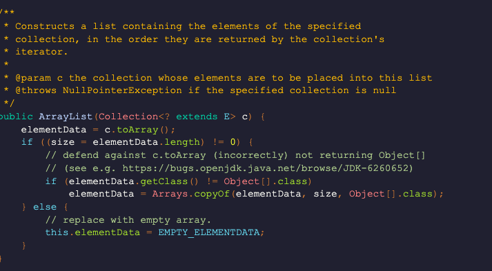

# 컬렉션

 

 ## 동기화된 컬렉션 vs 병렬 컬렉션

 동기화된 컬렉션 클래스는 내부 변수에 접근하는 통로를 일련화 Thread Safe But 동시사용시 상담 부분 손해 병렬 컬렉션은 이와 반대. (전체적인 성능 향상)
 이 클래스들은 모두 public으로 선언된 모든 메소드를 클래스 내부에 캡슐화해 내부의 값을 한 스레드만 사용하게함.

 병렬 컬렉션은 여러 스레드가 동시에 컬렉션에 접근 가능 

 ## 컬렉션 선택 기준

  * List : 중복을 허용하고 저장순서가 유지되는 컬렉션 구현 
  
 사용이유 ? : 

    * 배열의 단점 : 엘리먼트가 삭제되면 상제된 공간은 빈공간으로 남김 - > 메모리 낭비.
    * 배열 크기를 미리 정해야됨 , 컴파일 이후 배열의 크기를 변동 X

  List 는 ?  빈 엘리먼트 허용 X 
          , 인덱스 장점 버리고 빈틈없는 데이터 적재. (자바에서 허용하는 경우가 있음)
          , 리스트에서 인덱스는 데이터의 순서 정도의 의미
          , 순차성이 없어서 spacial locality 보장 X (cash hit) 어려움. (데이터 갯수가 정해지고 자주사용되면 배열이 더 효율적)
          , 불연속적 메모리 공간 차지 , 포인터로 접근.

  장점 : 포인트를 통해 데이터위치를 가르켜 삽입 , 삭제 용이, 
        동적이라 크기가 정해져 있지 않고 메모리의 재사용 편리.
        불연속적이므로 메모리 관리 편리.

  단점 : 검색 성능이 좋지 않다. / 포인터를 통해 다음 데이터를 카르키므로 추가적 메모리 공간 발생.
 
   2. ArrayList

  가장 많이 사용되는 컬렉션 Vector 클래스와 사용법 구조가 유사함. Thread Safe 하지 않음 (Vector는 Safe)
  배열과 마찬가지로 인덱스로 객체 관리, 하지만 동적으로 크기를 늘릴 수 있고 처음 저장 용량은 10 이다 -> 이후 더 많은 객체가 들어오면 1.5배 증가.
  객체 삭제가 일어나면 제거 객체부터 마지막 인덱스까지 모두 앞으로 쉬프트 일어남, 
  -> 따라서 잦은 삭제 이동이 발생할 경우 LinkedList 사용 ..하는게 더 효율적.
  

   1-1  LinkedList

  
   
   노드 간에 연결을 통해 리스트로 구현된 객체 . 순차접근만 가능. (탐색시 시간이 많이 소요된다.) randomAccess 불가능
   AbstractSequentialList를 상속함 .
 
   List 와 Queue 모두 구현한 구현체 데이터간의 연결관계 집중해서 저장. (ArrayList, Vector) 메모리관리 측면 유리
   여러 종류의 인터페이스를 구현하기 때문에 동일한 기능 제공하는 메소드들이 많다.

   삽입/ 삭제 시 다음 노드에대한 주소값만 변경됨 

 2.Set
 
 사용하는 이유 :? 컬렉션 순서가 중요하지 않는 데이터 저장할때  , 중복 검사, 원하는 값이 존재하는지만 검사 할 때

  2-1 : HashSet : 순서가 필요가없는 데이터 헤시 테이블 저장 ( 성능 가장 우수)
  2-2 : TreeSet: 저장된 데이터의 값에 따라 정렬 , (성능 보통 )
  2-3 : LinkedHashSet : 연결된 목록타입으로 구현된 헤쉬셋  저장 순서에 따라 값 정렬 ( 성능 가장 나쁨 )

 성능을 나누는 가장 중요한 기준은 정렬 여부 / 중요한 부분은 데이터의 중복 여부

 3. Map

 
 키 , 값 쌍으로 묶어서 컬렉션 구현.
  
  3-1 : HashMap 
   
   key 와 value를 하나의 entry로 저장. , 해시 알고리즘으로 검색속도 빠룸 (멀티스레드에서는 HashTable 사용) 
   -> 기존 코드와 호환성을 위해 남아 있음 HashMap 사용하는게 낫다.
  
  3-2 : TreeMap
  
   이진 검색 트리 형태 저장, 데이터 추가나 제거 기본동작이 빠름  Key의 오름차순으로 저장.

  3-2 : LinkedHashMap
  
   입력된 순서대로 데이터를 저장하는 

 

 4. Stack 

 

   List 인터페이스를 구현한 클래스 (ArrayList,LinekdList)
   LIFO 구현한 리스트인 stack!  또다른 방법으론 ArrayDeque도 있지만 (속도빠름) 스레드세이브 하지 않다.
   
 특징 : 시스템 해킹에서 버퍼플로우 취약점을 이용한 공격 할 때 스택 메모리의 영역에서 함.
       인터럽트처리, 수식의 계산 ,서브루틴의 복귀 번지 저장등 쓰임  , 우선 탐색에 사용 , 재귀적 함수 호출 사용

 + 자바에서 잘못설계된듯, LIFO 구조 인대 Vector 클래스를 확장하면 중간에서 데이터 삽입 삭제를 하기 때문 , 초기용량 설정 불가능 
   그래서 ArrayDeque 사용하는게 더났다. 
   
 + 4-1: ArrayDeque
 
 stack 클래스보다 빠르고 , Queue 보다 빠름.

 synchronized 장식해 만들수 있다.

 5. Queue 

  FIFO  

 
 6. Deque 

  양쪽 끝 추가 / 삭제 가능
 

