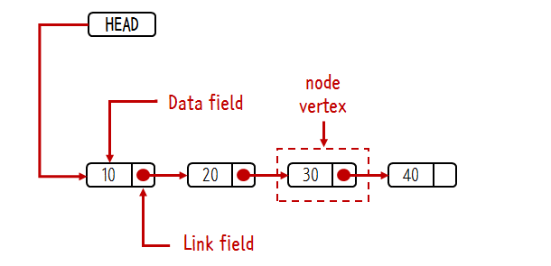

# 컬렉션

 ## 동기화된 컬렉션 vs 병렬 컬렉션

 동기화된 컬렉션 클래스는 내부 변수에 접근하는 통로를 일련화 Thread Safe But 동시사용시 상담 부분 손해 병렬 컬렉션은 이와 반대. (전체적인 성능 향상)
 이 클래스들은 모두 public으로 선언된 모든 메소드를 클래스 내부에 캡슐화해 내부의 값을 한 스레드만 사용하게함.

 병렬 컬렉션은 여러 스레드가 동시에 컬렉션에 접근 가능 

 ## 컬렉션 선택 기준

  * List : 중복을 허용하고 저장순서가 유지되는 컬렉션 구현 
  
 사용이유 ? : 

    * 배열의 단점 : 엘리먼트가 삭제되면 상제된 공간은 빈공간으로 남김 - > 메모리 낭비.
    * 배열 크기를 미리 정해야됨 , 컴파일 이후 배열의 크기를 변동 X

  List 는 ?  빈 엘리먼트 허용 X 
          , 인덱스 장점 버리고 빈틈없는 데이터 적재. (자바에서 허용하는 경우가 있음)
          , 리스트에서 인덱스는 데이터의 순서 정도의 의미
          , 순차성이 없어서 spacial locality 보장 X (cash hit) 어려움. (데이터 갯수가 정해지고 자주사용되면 배열이 더 효율적)
          , 불연속적 메모리 공간 차지 , 포인터로 접근.

  장점 : 포인트를 통해 데이터위치를 가르켜 삽입 , 삭제 용이, 
        동적이라 크기가 정해져 있지 않고 메모리의 재사용 편리.
        불연속적이므로 메모리 관리 편리.

  단점 : 검색 성능이 좋지 않다. / 포인터를 통해 다음 데이터를 카르키므로 추가적 메모리 공간 발생.
 
   2. ArrayList

  가장 많이 사용되는 컬렉션 Vector 클래스와 사용법 구조가 유사함.
  Thread Safe 하지 않음 (Vector는 Safe)
  배열과 마찬가지로 인덱스로 객체 관리, 하지만 동적으로 크기를 늘릴 수 있고 처음 저장 용량은 10 이다 -> 이후 더 많은 객체가 들어오면 1.5배 증가.
  객체 삭제가 일어나면 제거 객체부터 마지막 인덱스까지 모두 앞으로 쉬프트 일어남, 
  -> 따라서 잦은 삭제 이동이 발생할 경우 LinkedList 사용 ..하는게 더 효율적.
  -> 아이템수가 많아지면 grow가 여러차례 (1.5 만큼 크기증가) 복사가 누적됨으로 주의..

 ## 공식문서 ArrayList
   
   List 인터페이스의 크기 조정 가능 배열 구현.
   모든 선택적 목록작업 구현하고 Null을 포함한 모든 요소 허용
   List 인터페이스를 구현하는 것 외에도 이 클래스는 목록을 저장하기 위해 내부적으로 사용되는 매서드 제공 (비동기 화 되는 점) 위에 스레드 세이프관련
   
   size, isEmpty , get ,set ,iterator , listIterator 작업은 상수 시간에 실행됨.
   add는 amortized constant 시간에 실행 됨.
   즉 N개의 요소를 추가하려면 O(n) 시간이 필요.
   다른 모든 작업은 (대략) 선형 시간으로 실행 된다.
   상수 요인은 LinkedList 구현에 비해 낮다.

   용량은 목록의 요소를 저장하는데 사용 되는 배열의 크기 , 언제나 용량의 크기는 리스트의 크기보다 크거나 같다.
   ArrayList에 요소가 추가되면 용량은 자동으로 증가, 요소를 추가하면 상각된 시간비용 이 일정함

   응용 프로그램은 ensureCapacity 작업을 사용하여 많은 수의 요소를 추가하기 전에 ArrayList인스턴스의 용량을 늘릴 수 있따 , 이것은 증분 재할당의 양을 줄일 수 있다.

   ArrayList는 동기화 되지않는다.
   그래서 여러 스레드가 동시에 액세스하는 상황이나 하나 이상의 스레드가 리스트를 구조적으로 수정하는 경우.
   외부에서 동기화 처리를 해줘야 된다. ( 구조적 수정이란 하나 이상의 원소를 추가/삭제 하거나 명시적으로 백업 배열의 크기를 조정하는 작업 단순히 원소 값을 변경하는 것이 아님.)
   이런 동기화 작업은 리스트를 캡슐화하는 객체를 사용해 해결함.
   만약에 없으면 Collentions.synchronizedList 메서드를 이용해 목록을 래핑함.  동기화 되지 않는 엑세스가 일어나는 사고를 방지하는 가장 좋은 방법은 객체를 생성 할때
   List list = Collections.synchronizedList(new ArrayList(..));
  
   ArrayList는 iterator와 ListIterator 메소드가 리턴한 이터레이터들은 fial-fast 방식을 따름
   **이터레이터가 생성된 후 Collection이 구조적으로 수정되면 이터레이터가 자체적으로 갖고있는 Remove/add메소드를 사용하지 않는한** 
   이터네이터는 ConcurrentModificationException 발생함.
   그러므로 동시적으로 수정작업이 발생하면 이터레이터는 빠르고 깔끔하게 실패함, 이를 통해 비결정적 변경이라는 위험을 최대한 방지 하려 함.
   (즉 비동기적 상황에 대한 동시적인 변경을 보장하지 못하기 때문에 발생하는 것.)

  ++  예시.

복사본 제거시 오류가 발생하지 않지만, 컬렉션을 직접 제거하면 에러 발생

그래서 복사본을 조작하거나 , 동기화를 보장 또는 Enumeration으로 조회.

  
저번에 공부한 병렬식 컬렉션을 선언해 사용한 결과이다 예외가 일어나지 않는다.

 이터레이터의 이러한 동시적 수정에 대한 Fail-fast 동작은 보장된 것이 아니고.
 fail-fast 이터레이터는 최대한 ConcurrentModificationException을 던지려 할뿐 예외가 정확할 것이라 전제하고 예외를 의존하는 프로그램 작성하면 안됌.
 이터레이터의 fail-fast동작은 버그찾는데만 사용할 것, 이 클래스는 Java Collections FrameWrok의 멤버이다.

fail-fast 방식 보충

콜렉션 클랙스들은 저장된 객체에 순차적으로 접근을 제공 , 그러나 순차적 접근이 모두 끝나기전에 콜렉션 객체에

변경이 생긴다면 ?  순차적 접근이 실패하면서 ConcurrentModificationException을 예외 발생

출처 : https://lng1982.tistory.com/95

### 상수

 배열의 최대 사이즈는 8 그러나 더 큰값이 필요하면 hugeCapacity가 처리.
 hugeCapacity는 minCapacity가 음수이면 OutOfMemoryError 던지고,
 MAX_ARRAY_SIZE보다 큰 값이면 Interger.MaX_VALUE 사이즈로 사용함.

### 생성자

기본 생성자 초기 용량은 10.

### ArrayList(int initalCapacity)

초기 용량이 주어지면 그만큼 사이즈를 가진 배열 생성

### ArrayList(Collection< extend> c)

Collection 이 주어지면 같은 사이즈를 갖는 배열 생성하고 값을 복사함

출처 : https://johngrib.github.io/wiki/java/arraylist/#arraylistcollection-extends-e-c

   1-1  LinkedList

   
   노드 간에 연결을 통해 리스트로 구현된 객체 . 순차접근만 가능. (탐색시 시간이 많이 소요된다.) randomAccess 불가능 (순차적으로 찾아야 해서)
   AbstractSequentialList를 상속함 .
 
   List 와 Queue 모두 구현한 구현체 데이터간의 연결관계 집중해서 저장. (ArrayList, Vector) 메모리관리 측면 유리
   여러 종류의 인터페이스를 구현하기 때문에 동일한 기능 제공하는 메소드들이 많다.

   삽입/ 삭제 시 다음 노드에대한 주소값만 변경됨 
   인덱스를 순서대로 접근해서 검색 기능이 느린 것임.

## 공식 문서 

List 인터페이스의 링크 리스트의 구현입니다. 
리스트의 임의의 오퍼레이션을 모두 구현해, null을 포함해 모든 요소를 허용합니다. 
List 인터페이스를 구현하는 것 외에 LinkedList 클래스는 리스트의 첨단 및 종단에 있는 요소를 취득 및 삭제하거나 
첨단 및 종단에 요소를 삽입하거나 하는 메서드 (get, remove, insert)를 제공합니다. 이러한 오퍼레이션을 사용하면,
링크 리스트를 스택, 큐, 또는 쌍방향 큐 (데큐)로서 사용할 수 있게 됩니다. (Queue Deque 인터페이스도 구현 가능 앞 뒤 모두에서 값을 넣거나 빼는 작업이 자유로움)

이 클래스는 add, poll 등에 선입선출법을 제공하는 Queue 인터페이스를 구현합니다. 다른 스택 및 데큐오페레이션은 리스트의 표준 오퍼레이션에 의해 다시 간단하게 작성할 수 있습니다 .
이러한 오퍼레이션은 대응하는 List 오퍼레이션보다 다소 고속의 경우도 있습니다만, 주로 편의상의 이유로써 포함되어 있습니다.

모든 오퍼레이션은 이중 링크 리스트의 경우에 예기 되는 대로의 동작을 합니다. 리스트를 인덱스로 처리하는 오퍼레이션은 리스트의 첨단 또는 종단 가운데, 지정한 인덱스에 가까운 (분)편으로부터 리스트를 처리합니다.

동기화를 지원하지 않는다.  복수의 thread가 동시에 리스트에 접속해, 그러한 적어도 1개이 구조적으로 리스트를 변경했을 경우에는 외부에서 동기화 처리가 필요함 
구조적인 변경과는 1개 이상의 요소를 추가 또는 삭제하는 모든 처리입니다. 요소의 값만을 변경하는 처리는 구조적인 변경이 아닙니다. 보통, 리스트의 동기를 잡으려면, 
리스트를 자연스럽게 캡슐화하는 객체로 동기를 잡습니다. 그러한 객체가 없는 경우에는 Collections.synchronizedList 메서드를 사용해 「랩」합니다. 
이것은 리스트에의 우발적인 비동기 액세스를 막기 위해서 작성시에 실시하는 것이 최적입니다. to prevent accidental unsynchronized access to the list:

List list = Collections.synchronizedList(new LinkedList(...));

이 클래스의 iterator 및 listIterator 메서드에 의해 리턴된 반복자는 fail-fast입니다. 반복자의 작성 후에 반복자 자체의 remove 또는 add 메서드 이외 방법으로 리스트가 구조적으로 변경되면, 
반복자는 ConcurrentModificationException을 Throw 합니다. 따라서, 동시 변경을 하면, 반복자는 장래의 예측할 수 없는 시점에 있어 예측할 수 없는 동작이 발생하는 위험을 회피하기 위해서 
즉시 한편 솜씨 자주 예외를 Throw 합니다.

보통, 비동기의 동시 변경이 있는 경우, 확실한 보증을 실시하는 것은 불가능해서, 반복자의  fail-fast의 동작을 보증할 수 없습니다.
fail-fast 반복자는 최선 노력 원칙에 기반해 ConcurrentModificationException을 Throw 합니다. 따라서, 정확을 기하기 위해서 이 예외에 의존된 프로그램을 쓰는 것은 잘못입니다.
「반복자의 fail-fast의 동작은 버그를 검출하기 위해서 마셔 사용해야 합니다」

ArrayList랑 비슷하다.

예시 사진

직원이 늘어도 상관이없지만 3번째 사무실찾으려면 1번빼 에서 2번째 ㅇ런식으로 찾아가야 됨.. 몇 번째 엘리먼트에요? 느림..
엘리먼트들을 노드(마디 , 교점) , 버텍스(정점,꼭지점) 이라 명칭함.

링크드 리스트는 노드 들의 모임, 
노드는 최소한 두 가지 정보를 알고 있어야 한다. 노드 값과 다음 노드.
head는 출입문 개념.

새로운 노드 삽입 방법

중간에 새로운 노드 삽입 방법 

이전 이후 노드의 참조값만 변경하면 된다..

삭제 역시 연결을 새로해주며노딤

출처 : https://opentutorials.org/module/1335/8821

 2.Set
 
 사용하는 이유 :? 컬렉션 순서가 중요하지 않는 데이터 저장할때  , 중복 검사, 원하는 값이 존재하는지만 검사 할 때

  2-1 : HashSet : 순서가 필요가없는 데이터 헤시 테이블 저장 ( 성능 가장 우수)
  2-2 : TreeSet: 저장된 데이터의 값에 따라 정렬 , (성능 보통 )
  2-3 : LinkedHashSet : 연결된 목록타입으로 구현된 헤쉬셋  저장 순서에 따라 값 정렬 ( 성능 가장 나쁨 )

 성능을 나누는 가장 중요한 기준은 정렬 여부 / 중요한 부분은 데이터의 중복 여부

### 자바 공식 문서 

중복 요소가 없는 컬렉션입니다. 더 공식적으로, 집합에는 요소 쌍이 포함되지 않으며 최대 e1하나 의 null 요소가 포함됩니다.
이름에서 알 수 있듯이 이 인터페이스는 수학적 집합 추상화를 모델링합니다. e2e1.equals(e2)
Set 인터페이스 는 Collection 인터페이스 에서 상속된 것 외에 모든 생성자의 계약과 add , equals 및 hashCode 메서드의 계약에 대한 추가 규정을 적용합니다.
편의를 위해 다른 상속된 메서드에 대한 선언도 여기에 포함됩니다. (이 선언에 수반되는 사양은 Set 인터페이스에 맞게 조정되었지만 추가 조건은 포함하지 않습니다.)

생성자에 대한 추가 규정은 당연히 모든 생성자가 중복 요소를 포함하지 않는 집합을 생성해야 한다는 것입니다(위에 정의됨).

참고: 가변 개체를 집합 요소로 사용하는 경우 각별히 주의해야 합니다. 개체 가 집합의 요소인 동안 등가 비교 에 영향을 주는 방식으로 개체의 값이 변경된 경우 집합의 동작이 지정되지 않습니다 .
이 금지의 특별한 경우는 집합이 자신을 요소로 포함하는 것이 허용되지 않는다는 것입니다.

일부 집합 구현에는 포함할 수 있는 요소에 대한 제한이 있습니다. 예를 들어, 일부 구현에서는 null 요소를 금지하고 일부 구현에서는 해당 요소의 유형에 제한이 있습니다.
부적격 요소를 추가하려고 하면 확인되지 않은 예외(일반적으로 NullPointerException 또는 ClassCastException )가 발생합니다..
부적격 요소의 존재를 쿼리하려고 하면 예외가 발생하거나 단순히 false를 반환할 수 있습니다. 일부 구현은 전자의 동작을 나타내고 일부는 후자를 나타냅니다.
더 일반적으로, 완료로 인해 부적격 요소가 집합에 삽입되지 않는 부적격 요소에 대한 작업을 시도하면 구현 옵션에 따라 예외가 발생하거나 성공할 수 있습니다. 
이러한 예외는 이 인터페이스의 사양에서 "선택 사항"으로 표시됩니다.

 결론적으론..

 1. 중복 허용하지 않는다.
 2. 요소에는 Null도 들어감..
 3. 저장 순서는 유지하지 않는다.. 등

#### HashSet

1. hashMap과 유사 별도의 키값없이 값 자체를 해싱하여 카테고리화 하여 저장 
2. 해싱 기법을 사용하여 컬렉션 프레임워크중 가장 빠른 데이터 처리 속도가짐.

이 클래스는 해시 테이블(실제로는 HashMap 인스턴스)에 의해 지원되는 Set 인터페이스를 구현합니다. 
집합의 반복 순서를 보장하지 않습니다. 특히 주문이 시간이 지나도 일정하게 유지된다는 보장은 없습니다. 이 클래스는 null 요소를 허용합니다.
이 클래스는 해시 함수가 버킷 간에 요소를 적절하게 분산한다고 가정할 때 기본 작업(추가, 제거, 포함 및 크기 조정)에 대해 일정한 시간 성능을 제공합니다. 
이 집합을 반복하려면 HashSet 인스턴스의 크기(요소 수)와 지원 HashMap 인스턴스의 "용량"(버킷 수)의 합에 비례하는 시간이 필요합니다.
따라서 반복 성능이 중요한 경우 초기 용량을 너무 높게(또는 너무 낮게 로드 팩터) 설정하지 않는 것이 매우 중요합니다.

이 구현은 동기화되지 않습니다. 여러 스레드가 해시 세트에 동시에 액세스하고 스레드 중 적어도 하나가 세트를 수정하는 경우 외부에서 동기화되어야 합니다. 
이것은 일반적으로 집합을 자연스럽게 캡슐화하는 일부 개체에서 동기화하여 수행됩니다. 그러한 개체가 없으면 Collections.synchronizedSet 메서드를 사용하여 집합을 "래핑"해야 합니다. 
이는 세트에 대한 우발적인 동기화되지 않은 액세스를 방지하기 위해 생성 시 수행하는 것이 가장 좋습니다.

Set s = Collections.synchronizedSet(new HashSet(...));
이 클래스의 반복자 메서드에 의해 반환된 반복자는 페일패스트입니다. 반복자가 생성된 후 언제든지 집합이 수정되면 반복자의 자체 제거 메서드를 통하지 않고 
어떤 방식으로든 Iterator는 ConcurrentModificationException을 throw합니다.
따라서 동시 수정에 직면하여 반복자는 미래의 불확실한 시간에 임의적이고 비결정적인 동작의 위험을 감수하기보다는 빠르고 깔끔하게 실패합니다.

iterator의 fail-fast 동작은 일반적으로 동기화되지 않은 동시 수정이 있는 상태에서 확실한 보장을 하는 것이 불가능하기 때문에 보장할 수 없습니다. 
Fail-fast iterator는 최선을 다해 ConcurrentModificationException을 발생시킵니다. 따라서 정확성을 위해 이 예외에 의존하는 프로그램을 작성하는 것은 잘못된 것입니다.
반복기의 빠른 실패 동작은 버그를 감지하는 데만 사용해야 합니다.

HashMap을 이용하고 있다.
contains는 HashMapd에서 Key만 이용..

#### TreeSet

1. 이진트리를 구성하여 정렬하며 저장.
2. 이진트리를 통해 정렬된 값을 탐색하므로 속도 빠름(검색기능이 강화된 컬렉션 프레임워크)
3. 저장 순서를 유지하지 않다 보니 노드의 추가, 삭제에는 링크드 리스트보다는 시간이 걸린다.
4. TreeSet 클래스는 SortedSet 인터페이스를 구현합니다. 중복 요소는 허용되지 않습니다.
5. TreeSet 클래스가 동기화되지 않았습니다.
6. TreeSet은 삽입 순서를 유지하지 않지만 TreeSet의 요소는 자연 순서에 따라 정렬됩니다.
7. TreeSet 객체를 생성하는 동안 사용자 지정 비교기를 사용하여 TreeSet을 정렬 할 수 있습니다.
8. TreeSet은 일반적으로 자연스럽게 정렬되는 엄청난 양의 정보를 저장하는 데 사용됩니다. 이것은 쉽고 빠른 액세스를 돕습니다.

TreeMap에 기반한 NavigableSet구현입니다 . 
요소는 사용 되는 생성자에 따라 자연스러운 순서 지정 을 사용하거나 Comparator설정된 생성 시간에 제공된 순서대로 정렬됩니다.
add이 구현은 기본 작업( , remove및 ) 에 대해 보장된 log(n) 시간 비용을 제공합니다 contains.

인터페이스 를 올바르게 구현하려면 세트에 의해 유지되는 순서(명시적 비교기가 제공되는지 여부에 관계없이)는 equals와 일치 해야 합니다. 
( consistent with equals 의 정확한 정의는 또는 를 Set참조하십시오 .) 
인터페이스는 작업 측면에서 정의되지만 인스턴스는 (or ) 메서드 를 사용하여 모든 요소 비교를 수행 하므로 이에 의해 동일한 것으로 간주되는 두 요소 방법은 집합의 관점에서 동일합니다.
집합의 동작은 순서 가 equals와 일치하지 않더라도 잘 정의됩니다. 인터페이스 의 일반 계약을 따르지 않을 뿐입니다 .ComparableComparatorSetequalsTreeSetcompareTocompareSet

이 구현은 동기화되지 않습니다. 여러 스레드가 동시에 트리 세트에 액세스하고 스레드 중 적어도 하나가 세트를 수정하는 경우 외부에서 동기화 되어야 합니다 . 
이것은 일반적으로 집합을 자연스럽게 캡슐화하는 일부 개체에서 동기화하여 수행됩니다. Collections.synchronizedSortedSet 그러한 객체가 존재하지 않는 경우, 
이 메소드 를 사용하여 세트를 "래핑"해야 합니다 . 이는 세트에 대한 우발적인 동기화되지 않은 액세스를 방지하기 위해 생성 시 수행하는 것이 가장 좋습니다.
SortedSet s = Collections.synchronizedSortedSet(new TreeSet(...));
이 클래스의 iterator메서드에 의해 반환된 반복자는 fast-fast 입니다. 반복자가 생성된 후 언제든지 집합이 수정되면 반복자의 자체 remove 메서드를 통하지 않고 어떤 방식으로든 
반복자가 ConcurrentModificationException. 따라서 동시 수정에 직면하여 반복자는 미래의 불확실한 시간에 임의적이고 비결정적인 동작의 위험을 감수하기보다는 빠르고 깔끔하게 실패합니다.

iterator의 fail-fast 동작은 일반적으로 동기화되지 않은 동시 수정이 있는 경우 확실한 보장을 하는 것이 불가능하기 때문에 보장할 수 없습니다. 
Fail-fast iterator ConcurrentModificationException는 최선을 다해 던집니다. 따라서 정확성을 위해 이 예외에 의존하는 프로그램을 작성하는 것은 잘못된 것입니다. 
반복기의 빠른 실패 동작은 버그를 감지하는 데만 사용해야 합니다.

1. 값 추가 중복값은 무시
2. 객체의 경우 중복값을 피하기 위해 hashcode()와 equals() 메소드를 필히 오버라이딩 해줘야됨.

출처 : https://ko.myservername.com/comparable-comparator-interfaces-java

#### LinkedHashSet

반복 순서를 예측할 수 있는 Map 인터페이스의 해시 테이블 및 연결 목록 구현 이 구현은 모든 항목을 통해 실행되는 이중 연결 목록을 유지한다는 점에서 HashMap과 다릅니다. 
이 연결 목록은 일반적으로 키가 맵에 삽입된 순서(삽입 순서)인 반복 순서를 정의합니다. 키를 Map에 다시 삽입해도 삽입 순서는 영향을 받지 않습니다. 
(m.containsKey(k)가 호출 직전에 true를 반환할 때 m.put(k, v)가 호출되면 키 k가 맵 m에 다시 삽입됩니다.
이 구현은 TreeMap과 관련된 비용 증가 없이 HashMap(및 Hashtable)에서 제공하는 지정되지 않고 일반적으로 혼란스러운 순서에서 클라이언트를 보호합니다. 
원본 Map의 구현에 관계없이 원본과 동일한 순서의 Map 사본을 생성하는 데 사용할 수 있습니다.

void foo(Map m) {
Map copy = new LinkedHashMap(m);
...
}

이 기술은 모듈이 입력 시 맵을 가져와 복사한 다음 나중에 복사본의 순서에 따라 순서가 결정되는 결과를 반환하는 경우에 특히 유용합니다.
(고객은 일반적으로 제공된 것과 동일한 순서로 물건을 반품하는 것을 좋아합니다.)
가장 최근에 액세스한 항목에서 가장 최근에 액세스한 항목(액세스 순서)까지 항목이 마지막으로 액세스된 순서인 반복 순서를 사용하여 연결된 해시 맵을 만들기 위해 특수 생성자가 제공됩니다. 
이러한 종류의 맵은 LRU 캐시를 구축하는 데 적합합니다.
put, putIfAbsent, get, getOrDefault, compute, computeIfAbsent, computeIfPresent 또는 merge 메소드를 호출하면 해당 항목에 액세스할 수 있습니다(호출이 완료된 후 항목이 존재한다고 가정). 
값이 교체된 경우에만 replace 메서드를 사용하여 항목에 액세스할 수 있습니다. putAll 메소드는 지정된 맵의 항목 세트 반복자가 키-값 매핑을 제공하는 순서대로 지정된 맵의 각 매핑에 대해 하나의 항목 액세스를 생성합니다. 

다른 방법은 항목 액세스를 생성하지 않습니다. 특히 컬렉션 보기에 대한 작업은 지원 맵의 반복 순서에 영향을 주지 않습니다.

새 매핑이 Map에 추가될 때 오래된 매핑을 자동으로 제거하는 정책을 적용하기 위해 removeEldestEntry(Map.Entry) 메서드가 재정의될 수 있습니다.
이 클래스는 모든 선택적 Map 작업을 제공하고 null 요소를 허용합니다. HashMap과 마찬가지로 해시 함수가 버킷 간에 요소를 적절하게 
분산한다고 가정할 때 기본 작업(추가, 포함 및 제거)에 대해 일정한 시간 성능을 제공합니다. 성능은 연결 목록을 유지 관리하는 데 추가 비용으로 인해 HashMap보다 약간 낮을 수 있습니다. 
단 한 가지 예외가 있습니다. LinkedHashMap의 컬렉션 보기를 반복하려면 용량에 관계없이 Map 크기에 비례하는 시간이 필요합니다. . 
HashMap에 대한 반복 작업은 용량에 비례하는 시간이 필요하므로 비용이 더 많이 들 수 있습니다.
연결된 해시 맵에는 성능에 영향을 미치는 두 가지 매개변수, 즉 초기 용량과 부하 계수가 있습니다. HashMap과 같이 정확하게 정의됩니다. 
그러나 이 클래스의 반복 시간은 용량의 영향을 받지 않으므로 초기 용량에 대해 지나치게 높은 값을 선택하는 경우의 패널티는 HashMap보다 덜 심각합니다.

이 구현은 동기화되지 않습니다. 여러 스레드가 연결된 해시 맵에 동시에 액세스하고 스레드 중 하나 이상이 구조적으로 맵을 수정하는 경우 외부적으로 동기화되어야 합니다. 
이것은 일반적으로 Map를 자연스럽게 캡슐화하는 일부 개체에서 동기화하여 수행됩니다. 이러한 객체가 없으면 Collections.synchronizedMap 메소드를 사용하여 Map를 '래핑'해야 합니다. 
Map에 대한 우발적인 동기화되지 않은 액세스를 방지하려면 생성 시 수행하는 것이 가장 좋습니다.
맵 m = Collections.synchronizedMap(new LinkedHashMap(...));
구조적 수정은 하나 이상의 매핑을 추가 또는 삭제하거나 액세스 순서가 지정된 연결된 해시 맵의 경우 반복 순서에 영향을 미치는 모든 작업입니다.
삽입 순서 연결된 해시 맵에서 이미 맵에 포함된 키와 연결된 값을 변경하는 것은 구조적 수정이 아닙니다. 액세스 순서가 지정된 연결된 해시 맵에서 get을 사용하여 맵을 쿼리하는 것은 구조적 수정입니다. )
이 클래스의 모든 컬렉션 보기 메서드에서 반환된 컬렉션 중 iterator 메서드에 의해 반환된 반복자는 빠른 속도입니다. 
반복자가 생성된 후 언제든지 Map가 구조적으로 수정되는 경우 반복자의 자체 제거 메서드를 통하지 않는 방식으로, 반복자는 ConcurrentModificationException을 발생시킵니다. 
따라서 동시 수정에 직면하여 반복자는 미래의 불확실한 시간에 임의적이고 비결정적인 동작의 위험을 감수하기보다는 빠르고 깔끔하게 실패합니다.
iterator의 fail-fast 동작은 일반적으로 동기화되지 않은 동시 수정이 있는 상태에서 확실한 보장을 하는 것이 불가능하기 때문에 보장할 수 없습니다. 
Fail-fast iterator는 최선을 다해 ConcurrentModificationException을 발생시킵니다. 따라서 정확성을 위해 이 예외에 의존하는 프로그램을 작성하는 것은 잘못된 것입니다.
이 클래스의 모든 컬렉션 보기 메서드에서 반환된 컬렉션의 spliterator 메서드에서 반환된 분할자는 지연 바인딩, 장애 처리 및 추가로 Spliterator.ORDERED를 보고합니다.
이 클래스는 자바 컬렉션 프레임워크의 구성원입니다.
구현 참고 사항:
이 클래스의 모든 컬렉션 보기 메서드에서 반환된 컬렉션의 spliterator 메서드에서 반환된 분할자는 해당 컬렉션의 반복자에서 생성됩니다.

1. hashSet 상속 받음 (LinkedHashMap이용)
2. 해쉬 테이블과 연결 리스트가 결합된 형태로 원소들의 순서는 삽입되었던 순서와 같다.(저장순서 유지)
3. hash table 과 doubly linked list 로 구성된 Set
4. 

Map

 
 키 , 값 쌍으로 묶어서 컬렉션 구현.

#### 공식문서

키를 값에 매핑하는 개체입니다. 맵에는 중복 키가 포함될 수 없습니다. 각 키는 최대 하나의 값에 매핑할 수 있습니다.
이 인터페이스는 인터페이스가 아니라 완전히 추상적인 클래스인 Dictionary 클래스를 대신합니다.

Map 인터페이스는 Map의 콘텐츠를 키 집합, 값 모음 또는 키-값 매핑 집합으로 볼 수 있는 세 가지 컬렉션 보기를 제공 합니다.
Map 의 순서 는 Map의 컬렉션 보기에 있는 반복자가 요소를 반환하는 순서로 정의됩니다. 
TreeMap 클래스 와 같은 일부 Map 구현 은 순서를 구체적으로 보장합니다. HashMap 클래스 와 같은 다른 것들은 그렇지 않습니다.

**참고: 변경 가능한 객체를 맵 키로 사용하는 경우 각별히 주의해야 합니다.** 객체 가 Map의 키인 동안 등호 비교 에 영향을 주는 방식으로 객체의 값이 변경된 경우 Map의 동작이 지정되지 않습니다 . 
이 금지의 특별한 경우는 맵이 자신을 키로 포함하는 것이 허용되지 않는다는 것입니다. 맵이 값으로 자신을 포함하는 것은 허용되지만, equals 및 hashCode 메소드는 더 이상 그러한 맵에서 잘 정의되지 않습니다.

모든 범용 Map 구현 클래스는 두 개의 "표준" 생성자를 제공해야 합니다. 하나는 빈 Map를 생성하는 void(인수 없음) 생성자이고, 다른 하나 는 동일한 키-값으로 새 Map를 생성하는 Map 유형의 단일 인수가 있는 생성자입니다. 
매핑을 인수로 사용합니다. 실제로 후자의 생성자는 사용자가 원하는 클래스의 동등한 맵을 생성하여 모든 맵을 복사할 수 있도록 합니다. 이 권장 사항을 적용할 방법은 없지만(인터페이스는 생성자를 포함할 수 없기 때문에) JDK의 모든 범용 맵 구현은 준수합니다.

이 인터페이스에 포함된 "파괴적인" 메소드, 즉 작동하는 맵을 수정하는 메소드는 이 맵이 작업을 지원하지 않는 경우 UnsupportedOperationException 을 발생시키도록 지정 됩니다. 
이 경우 이러한 메서드는 호출이 Map에 영향을 미치지 않으면 UnsupportedOperationException 을 throw할 수 있지만 필수는 아닙니다. 
예를 들어, putAll(Map) 수정할 수 없는 Map에서 메서드를 호출하면 매핑이 "중첩"되어야 하는 Map가 비어 있는 경우 예외가 throw될 수 있지만 반드시 그래야 하는 것은 아닙니다.

일부 Map 구현에는 포함할 수 있는 키와 값에 대한 제한이 있습니다. 예를 들어, 일부 구현에서는 null 키와 값을 금지하고 일부 구현에서는 키 유형에 제한이 있습니다.
부적합한 키 또는 값을 삽입하려고 하면 확인되지 않은 예외(일반적으로 NullPointerException 또는 ClassCastException )가 발생합니다.. 
부적격한 키 또는 값의 존재를 쿼리하려고 하면 예외가 발생하거나 단순히 false를 반환할 수 있습니다. 일부 구현은 전자의 동작을 나타내고 일부는 후자를 나타냅니다. 보다 일반적으로, 
부적격한 요소가 Map에 삽입되지 않는 결과를 가져오지 않는 부적격한 키 또는 값에 대한 작업을 시도하면 구현 옵션에 따라 예외가 발생하거나 성공할 수 있습니다. 이러한 예외는 이 인터페이스의 사양에서 "선택 사항"으로 표시됩니다.

Collections Framework 인터페이스의 많은 메소드는 equals메소드 측면에서 정의됩니다.
예를 들어, containsKey(Object key)메소드 사양은 "이 맵이 (key==null ? k==null : key.equals(k)) 와 같은 키 k 에 대한 매핑을 포함하는 경우에만 true 를 반환합니다."라고 말합니다 . 
이 사양은 null이 아닌 인수 키 를 사용하여 Map.containsKey 를 호출하면 모든 키 k 에 대해 key.equals(k) 가 호출된다는 의미로 해석 되어서는 안 됩니다 . 구현은 다음과 같은 최적화를 자유롭게 구현할 수 있습니다 
.예를 들어 두 키의 해시 코드를 먼저 비교하여 호출을 피할 수 있습니다. ( Object.hashCode()명세는 해시 코드가 다른 두 객체가 같을 수 없음을 보장합니다.) 
보다 일반적으로 다양한 Collections Framework 인터페이스 Object의 구현은 구현자가 적절하다고 판단하는 경우 기본 메서드의 지정된 동작을 자유롭게 활용할 수 있습니다.

Map의 재귀 순회를 수행하는 일부 Map 작업은 Map가 직접 또는 간접적으로 포함되는 자체 참조 인스턴스를 제외하고 실패할 수 있습니다. 여기에는 clone(), 및 메서드 equals()가 포함됩니다. 
구현은 선택적으로 자체 참조 시나리오를 처리할 수 있지만 대부분의 현재 구현은 그렇게 하지 않습니다. hashCode()toString()

1. map?이라고 지칭한 이유? match랑 비슷 
2. 연관배열 , 키와 값을 쌍으로 저장하기 위한 구조.
3. Key는 고유한값 중복 X value는 중복가능 
4. 검색이 빠르다 , 인덱스가 없어 Iterator 사용 

  3-1 : HashMap 
   
   key 와 value를 하나의 entry로 저장. , 해시 알고리즘으로 검색속도 빠룸 (멀티스레드에서는 HashTable 사용) 
   -> 기존 코드와 호환성을 위해 남아 있음 HashMap 사용하는게 낫다.

Entry = 자바 공식 문서에서는 키와 값으로 구성되는 데이터 (Mapping 이라고 함)

Map 인터페이스 의 해시 테이블 기반 구현 . 이 구현은 모든 선택적 맵 작업을 제공하고 null 값과 null 키를 허용합니다. 
( HashMap 클래스는 동기화되지 않고 null을 허용한다는 점을 제외하면 Hashtable 과 거의 동일합니다 .) 
이 클래스는 맵의 순서를 보장하지 않습니다. 특히 주문이 시간이 지나도 일정하게 유지된다는 보장은 없습니다.
이 구현은 해시 함수가 버킷 간에 요소를 적절하게 분산한다고 가정할 때 기본 작업( get 및 put )에 대해 일정한 시간 성능을 제공합니다 . 
컬렉션 보기를 반복하려면 HashMap 인스턴스의 "용량"(버킷 수)과 크기(키-값 매핑 수)에 비례하는 시간이 필요합니다. 따라서 반복 성능이 중요한 경우 초기 용량을 너무 높게(또는 너무 낮게 로드 팩터) 설정하지 않는 것이 매우 중요합니다.

HashMap 의 인스턴스에는 성능에 영향을 미치는 두 가지 매개변수가 있습니다. 초기 용량 과 로드 팩터 입니다. 용량 은 해시 테이블에 있는 버킷 의 수이며 초기 용량은 단순히 해시 테이블이 생성된 시점의 용량입니다. 
로드 팩터 는 해시 테이블의 용량이 자동으로 증가하기 전에 해시 테이블이 얼마나 가득 차도록 허용되는지를 측정한 것입니다 . 해시 테이블의 항목 수가 로드 팩터와 현재 용량의 곱을 초과하면 해시 테이블을 다시 해시하여 
(즉, 내부 데이터 구조를 재 구축) 해시 테이블의 버킷 수가 약 2배가 되도록 합니다.

일반적으로 기본 부하 계수(0.75)는 시간과 공간 비용 간에 적절한 균형을 제공합니다. 값이 높을수록 공간 오버헤드가 줄어들지만 조회 비용이 증가합니다( get 및 put 을 포함한 HashMap 클래스 의 대부분의 작업에 반영됨 ). 
맵의 예상 항목 수와 로드 계수는 초기 용량을 설정할 때 고려하여 재해시 작업 수를 최소화해야 합니다. 초기 용량이 최대 항목 수를 로드 팩터로 나눈 것보다 크면 재해시 작업이 발생하지 않습니다.

HashMap 인스턴스 에 많은 매핑을 저장 해야 하는 경우 충분히 큰 용량으로 매핑을 생성하면 테이블을 확장하는 데 필요한 자동 재해싱을 수행하는 것보다 매핑을 더 효율적으로 저장할 수 있습니다. 
동일한 키를 여러 개 사용 hashCode()하는 것은 해시 테이블의 성능을 저하시키는 확실한 방법입니다. 영향을 개선하기 위해 키가 Comparable인 경우 이 클래스는 키 간의 비교 순서를 사용하여 연결을 끊을 수 있습니다.

이 구현은 동기화되지 않습니다. 여러 스레드가 해시 맵에 동시에 액세스하고 스레드 중 하나 이상이 구조적으로 맵을 수정하는 경우 외부에서 동기화 해야 합니다 . (구조적 수정은 하나 이상의 매핑을 추가하거나 삭제하는 모든 작업입니다.
인스턴스에 이미 포함된 키와 연결된 값을 변경하는 것만으로는 구조적 수정이 아닙니다.) 이는 일반적으로 맵을 자연스럽게 캡슐화하는 일부 객체를 동기화하여 수행됩니다. . 그러한 객체가 존재하지 않는 경우 이 방법을 사용하여 맵을 "래핑"해야 합니다
Collections.synchronizedMap . Map에 대한 우발적인 동기화되지 않은 액세스를 방지하려면 생성 시 수행하는 것이 가장 좋습니다.

맵 m = Collections.synchronizedMap(new HashMap(...));
이 클래스의 모든 "컬렉션 뷰 메소드"에 의해 반환된 반복자는 페일패스트( fail-fast )입니다. 반복자가 생성된 후 언제든지 맵이 구조적으로 수정되면 반복자의 자체 제거 메소드를 통하지 않고 
어떤 방식으로든 반복자가 ConcurrentModificationException. 따라서 동시 수정에 직면하여 반복자는 미래의 불확실한 시간에 임의적이고 비결정적인 동작의 위험을 감수하기보다는 빠르고 깔끔하게 실패합니다.

iterator의 fail-fast 동작은 일반적으로 동기화되지 않은 동시 수정이 있는 상태에서 확실한 보장을 하는 것이 불가능하기 때문에 보장할 수 없습니다. 
Fail-fast iterator 는 최선을 다해 ConcurrentModificationException 을 발생시킵니다. 따라서 정확성을 위해 이 예외에 의존하는 프로그램을 작성하는 것은 잘못된 것입니다. 
반복기의 빠른 실패 동작은 버그를 감지하는 데만 사용해야 합니다.

1. List를 사용하지않고 HashMap 사용 이유는 성능 때문 임. (시간복잡도 O(1) 리스트는 O(n))
2. 만약 사이즈 10 짜리 리스트 끝에 홍길동을 찾는다면 10번 순회, 하지만 해쉬맵은 키값으로만.. 허나 리스트 1번에 있다면 리스트가 더빠르겠지 사실 비교하기 애매함.
3. 그리고 해쉬맵은 일정이상 버킷을 가지고 있기 때문에 리소스를 많이 사용하는 단점. 버킷 크기가 10이라도 3개만 사용하더라도 크기 10이 존재함.
4. 키와 해시값을 매핑해 놓은 것을 해쉬 맵
5. Key를 올바르게 사용하기 위해 equals , hashcode 오버라이딩 해서 사용해야함 (Key를 가지고 버킷을 찾아가고 충돌이 난다면 다른지 비교하는 과정이 있어서다.)
6. key는 불변이다 만약 변경을 한다면 Null 값을 가리킬 것이다.
7. 해시충돌 -> 동일한 키는 같은 해시 값을 가져야 하지만 다른 키도 같은 해시 값을 가질 수 있다. 같은 버킷에 채워지게 된다, 이 때 버킷 내부는 리스트로 원소 관리, (반복문때문에 O(n))의 시간이 걸림
8. 해시충돌은 하나의 버킷에 여러 개의 값을 가지고 있는 상태, 서로 다른 객체임에도 같은 해시코드 값을 가질 수 있기 때문에 발생 버킷 의 수가 적을수록 자주 발생 
9. 버킷이 8개 이상의 값이 포함되어 있으면 버킷 내부의 값이 저장 된 데이터 구조가 목록에서 균형 트리로 변경 되고 버킷에 6개 값만 남아 있으면 목록으로 변경 됨. 성능이 O(log n) 해시로 향상
10. 기본 생성자는  기본 용량 : 16 , 사용률 0.75 (75퍼가 차면 버킷의 용량을 2배로 늘림 )
11. 용량이 어느정도인지 예측가능하면 미리 크게 만들어주면 자동으로 재해싱해서 용량을 2배를 늘리는 것 보다 효과적이다.
12. HashTable과 제공하는 기능은 같지만 HashMap은 보조 해시함수를 사용해 해시충돌이 덜 발생한다. 그리고 지속적으로 개선된다.
13. 키에 대한  해시 값을 사용하여 값을 저장하고 조회, 키-값 쌍의 개수에 따라 동적으로 크기가 증가하는 associate array (Map,Dictionary,Symbol Table)
14. 동일하지 않는 X,Y 객 체가 있을시 X.equals(Y) = false , X.hashCode != Y.hashCode()가 같지 않다면 이때 사용하는 해시함수는 완전한 해시 함수 라고 함 
15. (허나 완전한 해시 함수 제작은 불가능  String , POJO에 대해) 완전한 해시 함수 제작 불가능 (ex : Boolean , Integer,Long,Double , Number객체) 값 자체를 해시값으로 사용할 수 있기때문에 완전한 해시 함수 대상으로 삼을 수 있다.
16. 순회를 할때 순서가 보장되어 있지 않기 때문에 무작위로 출력된다.

  

출처 :https://d2.naver.com/helloworld/831311 , https://850530.tistory.com/74 , https://devlog-wjdrbs96.tistory.com/241

  3-2 : TreeMap
  
   이진 검색 트리 형태 저장, 데이터 추가나 제거 기본동작이 빠름  Key의 오름차순으로 저장.

  3-2 : LinkedHashMap
  
   입력된 순서대로 데이터를 저장하는 

#### 공식문서

Red-Black 트리 기반 NavigableMap구현. Map는 사용되는 생성자에 따라 키 의 자연스러운 순서Comparator 에 따라 또는 Map 생성 시 제공된 에 따라 정렬 됩니다.
containsKey이 구현은 , 및 작업 get에 대해 보장된 log(n) 시간 비용을 제공합니다 . 알고리즘은 Cormen, Leiserson 및 Rivest의 Introduction to Algorithms 에 있는 알고리즘을 적용한 것입니다 . putremove

정렬된 맵과 마찬가지로 트리 맵에 의해 유지되는 순서와 명시적 비교기가 제공되는지 여부는 이 정렬된 맵이 인터페이스 를 올바르게 구현하는 경우 와 일치 해야 합니다.
equals( consistent with equals 의 정확한 정의는 또는 를 Map참조하십시오 .) 인터페이스는 작업 측면에서 정의 되지만 정렬된 맵은 (또는 ) 메서드 를 사용하여 
모든 키 비교를 수행 하므로 다음과 같이 동일한 것으로 간주되는 두 개의 키가 있습니다. 이 방법은 정렬된 맵의 관점에서 동일합니다. 정렬된 맵의 동작은 순서 가 다음과 일치하지 않더라도 잘 정의되어 있습니다.
ComparableComparatorMapequalscompareTocompareequals; 
Map인터페이스 의 일반 계약을 따르지 않을 뿐입니다 .

이 구현은 동기화되지 않습니다. 여러 스레드가 동시에 맵에 액세스하고 스레드 중 하나 이상이 구조적으로 맵을 수정하는 경우 외부에서 동기화 되어야 합니다 . 
(구조적 수정은 하나 이상의 매핑을 추가하거나 삭제하는 모든 작업입니다. 단순히 기존 키와 연결된 값을 변경하는 것은 구조적 수정이 아닙니다.) 
이는 일반적으로 맵을 자연스럽게 캡슐화하는 일부 객체를 동기화하여 수행됩니다. 그러한 객체가 존재하지 않는 경우 이 방법을 사용하여 맵을 "래핑"해야 합니다 Collections.synchronizedSortedMap .
Map에 대한 우발적인 동기화되지 않은 액세스를 방지하려면 생성 시 수행하는 것이 가장 좋습니다.

SortedMap m = Collections.synchronizedSortedMap(new TreeMap(...));
iterator이 클래스의 모든 "컬렉션 보기 메소드"에 의해 리턴된 콜렉션 의 메소드에 의해 리턴된 반복자는 고속 입니다.
반복자가 생성된 후 언제든지 반복자의 자체 remove메소드를 통하지 않고 어떤 방식으로든 맵이 구조적으로 수정되면, 
반복자는 ConcurrentModificationException. 따라서 동시 수정에 직면하여 반복자는 미래의 불확실한 시간에 임의적이고 비결정적인 동작의 위험을 감수하기보다는 빠르고 깔끔하게 실패합니다.
iterator의 fail-fast 동작은 일반적으로 동기화되지 않은 동시 수정이 있는 상태에서 확실한 보장을 하는 것이 불가능하기 때문에 보장할 수 없습니다.
Fail-fast iterator ConcurrentModificationException는 최선을 다해 던집니다. 따라서 정확성을 위해 이 예외에 의존하는 프로그램을 작성하는 것은 잘못된 것입니다. 
반복기의 빠른 실패 동작은 버그를 감지하는 데만 사용해야 합니다.
이 클래스의 메서드에서 반환된 모든 Map.Entry쌍과 해당 뷰는 매핑이 생성된 시점의 스냅샷을 나타냅니다. 그들은 방법을 지원 하지 않습니다
Entry.setValue . (그러나 put를 사용하여 연결된 맵의 매핑을 변경할 수 있습니다 .)

1. 요소는 기본적으로 오름 차순
2. 동기화 되지 않았다.
3. 중복 허용 X null 값은 허용 Null키는 허용 X
4. NavigableMap 인터페이스 및 추상맵 클래스 구현하는데 사용되고 , 디렉터리 구조 , 트리계층 구조등 저장 가능
5. 동기화를 지원하지 않아 스레드로부터 불안전함.

출처 : https://ko.myservername.com/

#### LinkedHashMap

반복 순서를 예측할 수 있는 Map 인터페이스 의 해시 테이블 및 연결 목록 구현 . 
이 구현은 모든 항목을 통해 실행되는 이중 연결 목록을 유지 관리한다는 점에서 HashMap 과 다릅니다. 이 연결 목록은 일반적으로 키가 맵에 삽입된 순서인 반복 순서를 정의합니다( 삽입 순서 ).
키를 Map에 다시 삽입 해도 삽입 순서는 영향을 받지 않습니다 . (m.containsKey(k)가 호출 직전에 true 를 반환 할 때 m.put( k, v) 가 호출되면 키 k 가 맵 m 에 다시 삽입 됩니다.)

이 구현 은 관련 비용을 증가시키지 않으면서 HashMap(및 )에서 제공하는 지정되지 않은 일반적으로 혼란스러운 순서에서 클라이언트를 보호합니다 . 
원본 Map의 구현에 관계없이 원본과 동일한 순서의 Map 사본을 생성하는 데 사용할 수 있습니다. HashtableTreeMap

     무효 foo(맵 m) {
         맵 복사 = new LinkedHashMap(m);
         ...
     }

이 기술은 모듈이 입력 시 맵을 가져와 복사한 다음 나중에 복사본의 순서에 따라 순서가 결정되는 결과를 반환하는 경우에 특히 유용합니다. (고객은 일반적으로 제공된 것과 동일한 순서로 물건을 반품하는 것을 좋아합니다.)
constructor가장 최근에 액세스한 항목에서 가장 최근에 액세스한 항목( access-order ) 순으로 항목이 마지막으로 액세스된 순서인 반복 순서를 갖는 연결된 해시 맵을 생성하기 위해 특수 가 제공됩니다 .
이러한 종류의 맵은 LRU 캐시를 구축하는 데 적합합니다. put, putIfAbsent, get, getOrDefault, compute, computeIfAbsent, computeIfPresent또는 메소드를 호출 merge하면 해당 항목에 대한 액세스가 발생합니다
(호출이 완료된 후 항목이 존재한다고 가정). 메소드 는 replace값이 대체되는 경우에만 항목에 액세스합니다.
이 putAll메서드는 지정된 맵의 항목 집합 반복자가 키-값 매핑을 제공하는 순서대로 지정된 맵의 각 매핑에 대해 하나의 항목 액세스를 생성합니다. 다른 방법은 항목 액세스를 생성하지 않습니다. 
특히 컬렉션 뷰에 대한 작업 은 지원 맵의 반복 순서에 영향을 주지 않습니다 .
새 매핑 이 removeEldestEntry(Map.Entry)맵에 추가될 때 오래된 매핑을 자동으로 제거하는 정책을 적용하도록 메서드를 재정의할 수 있습니다.

이 클래스는 모든 선택적 Map 작업을 제공하고 null 요소를 허용합니다. HashMap 과 마찬가지로 해시 함수가 버킷 간에 요소를 적절하게 분산한다고 가정하면 
기본 작업( add , contains 및 remove )에 대해 일정한 시간 성능을 제공합니다 . 성능은 연결 목록을 유지 관리하는 추가 비용으로 인해 HashMap 의 성능보다 약간 낮을 수 있습니다 .
한 가지 예외가 있습니다. LinkedHashMap 의 컬렉션 보기를 반복하려면 용량에 관계없이 맵 크기 에 비례하는 시간이 필요합니다. . HashMap 에 대한 반복용량 에 비례하는 시간이 필요하므로 비용이 더 많이 들 수 있습니다 .

연결된 해시 맵에는 성능에 영향을 미치는 두 가지 매개변수가 있습니다. 초기 용량 및 로드 계수 . 그것들은 HashMap 처럼 정확하게 정의됩니다 . 
그러나 이 클래스 의 반복 시간은 용량의 영향을 받지 않기 때문에 초기 용량에 대해 지나치게 높은 값을 선택하는 데 따른 패널티는 HashMap 보다 이 클래스에서 덜 심각합니다 .

이 구현은 동기화되지 않습니다. 여러 스레드가 연결된 해시 맵에 동시에 액세스하고 스레드 중 하나 이상이 구조적으로 맵을 수정하는 경우 외부적으로 동기화 되어야 합니다 .
이것은 일반적으로 Map를 자연스럽게 캡슐화하는 일부 개체에서 동기화하여 수행됩니다. 그러한 객체가 존재하지 않는 경우 이 방법을 사용하여 맵을 "래핑"해야 합니다 Collections.synchronizedMap . 
Map에 대한 우발적인 동기화되지 않은 액세스를 방지하려면 생성 시 수행하는 것이 가장 좋습니다.

맵 m = Collections.synchronizedMap(new LinkedHashMap(...));
구조적 수정은 하나 이상의 매핑을 추가 또는 삭제하거나 액세스 순서가 지정된 연결된 해시 맵의 경우 반복 순서에 영향을 주는 모든 작업입니다. 삽입 순서로 연결된 해시 맵에서 이미 맵에 포함된 키와 연결된 값을 변경하는 것은 구조적 수정이 아닙니다.
액세스 순서 연결된 해시 맵에서 get 으로 맵을 쿼리하는 것은 구조적 수정입니다. )
이 클래스의 모든 컬렉션 보기 메서드에서 반환된 컬렉션 의 반복기 메서드에서 반환된 반복기는 고속 입니다. 반복기가 생성된 후 
언제든지 반복자의 자체 제거 메서드를 통하지 않고 맵이 구조적으로 수정되면, 반복자는 ConcurrentModificationException. 따라서 동시 수정에 직면하여 반복자는 
미래의 불확실한 시간에 임의적이고 비결정적인 동작의 위험을 감수하기보다는 빠르고 깔끔하게 실패합니다.
iterator의 fail-fast 동작은 일반적으로 동기화되지 않은 동시 수정이 있는 상태에서 확실한 보장을 하는 것이 불가능하기 때문에 보장할 수 없습니다. 
Fail-fast iterator 는 최선을 다해 ConcurrentModificationException 을 발생시킵니다. 따라서 정확성을 위해 이 예외에 의존하는 프로그램을 작성하는 것은 잘못된 것입니다. 
반복기의 빠른 실패 동작은 버그를 감지하는 데만 사용해야 합니다.
이 클래스의 모든 컬렉션 보기 메서드에서 반환된 컬렉션의 spliterator 메서드에서 반환된 분할자는 late-binding , fail-fast 및 추가로 report Spliterator.ORDERED입니다.

1. 삽입한 순서대로 데이터 저장 (Hash Map 보완) 
2. doubley-linked-List로 삽입한 값들을 관리, 
3. 키 - 값 쌍이필요하다 (사진을 찍은 시간과 같은) , 전체 크기를 알지못함( 실시간 동영상을 찍으므로 전체 프레임 크기가 변할 가능성 잇다) , 순서를 알아야한다 (사진을 찍은 순서대로 동영상을 변환)
4. 내부 구현된 access-order false(Insertion-order 입력순으로 key저장) 로 기본 값 / true : 최근에 접근하 element를 가장 마지막의 표기 .
5. loadFactor : 0.75  accessOrder : true 시 순서모드로 넘김 

출처 : https://sabarada.tistory.com/120?category=826240 , https://medium.com/@igniter.yoo/java-linkedhashmap-%EC%88%9C%EC%84%9C%EB%A5%BC-%EC%9C%A0%EC%A7%80%ED%95%98%EB%8A%94-%ED%95%B4%EC%8B%9C%EB%A7%B5-11a7846d8893
https://duooo-story.tistory.com/20

### Doble Linked List

노드와 노드가 서로 양방향 연결로 되있다.

1. 양방향 탐색이 가능해 (Ex  )

2. 단점으로는 이전 노드를 지정하기 위해 변수를 더사용해 메모리를 더많이 사용하고 구현이 더 복잡해 진다.
   허나 장점이 더많아 이중 연결리스트를 자주 사용 함.
이런식으로 가능

Stack 

   LIFO 구현한 리스트인 stack!  또다른 방법으론 ArrayDeque도 있지만 (속도빠름) 스레드세이브 하지 않다.
   
 특징 : 시스템 해킹에서 버퍼플로우 취약점을 이용한 공격 할 때 스택 메모리의 영역에서 함.
       인터럽트처리, 수식의 계산 ,서브루틴의 복귀 번지 저장등 쓰임  , 우선 탐색에 사용 , 재귀적 함수 호출 사용

 + 자바에서 잘못설계된듯, LIFO 구조 인대 Vector 클래스를 확장하면 중간에서 데이터 삽입 삭제를 하기 때문 , 초기용량 설정 불가능 
   그래서 ArrayDeque 사용하는게 더났다. 

#### 공식 문서

클래스 는 Stack객체의 LIFO(후입 선출) 스택을 나타냅니다. 
벡터를 스택으로 처리할 수 있는 5가지 작업으로 Vector 클래스를 확장 합니다. 
일반적인 푸시 및 팝 작업은 물론 스택의 맨 위 항목을 엿보는 방법, 스택이 비어 있는지 테스트하는 방법 , 스택에서 항목을 검색 하고 얼마나 멀리 있는지 검색하는 방법이 제공됩니다. 위에서부터입니다.
스택이 처음 생성되면 항목이 포함되지 않습니다.

보다 완전하고 일관된 LIFO 스택 작업 세트는 Deque이 클래스보다 우선적으로 사용해야 하는 인터페이스 및 해당 구현에 의해 제공됩니다. 예를 들어:

Deque<Integer> stack = new ArrayDeque<Integer>();

사용 되는 곳?

마지막 등록된 것을 먼저 사용하던가,
웹브라우저 방문기록 ,뒤로가기
실행 취소
역순 출력
수식의 괄호 검사 (연산자 우선순위 표현)
후위표기법 계산,
OS , 시스템 스택 : 프로그램 호출 순서와 복귀 순서는 반댕기 때문에  가장 나중에 호출된 함수가 제일 먼저 실행 됨.
Compiler , JVM

1. stack은 추상 자료형이라 ArrayList 와 LinkedList 를 구현 방법이 있다.
2. stack은 후입 선출이어야 하며 중간에 Index를 가져와서 제거하거나 추가하면 안돼는데 ArrayList를 상속 받아 사용 하기 때문에
   stack객체를 만들어도 ArrayList 메소드를 사용 할수 있다. 그래서 구조적 결함이 있다.
3. 그래서 보완을 하려면 완전한 LIFO stack 을 사용하기 위해 Deque<Integer> stack = new ArrayDeque(Integer>();  Deque  인터페이스와 ArrayDeque 활용하는것이 바람직하다.

출처 : https://iamheesoo.github.io/blog/java-stack01

   
 + 4-1: ArrayDeque
 
 stack 클래스보다 빠르고 , Queue 보다 빠름.

Deque인터페이스 의 크기 조정 가능한 배열 구현입니다 . 
ArrayDeque에는 용량 제한이 없습니다. 그들은 사용을 지원하기 위해 필요에 따라 성장합니다. 스레드로부터 안전하지 않습니다.
외부 동기화가 없는 경우 여러 스레드에 의한 동시 액세스를 지원하지 않습니다. Null 요소는 금지됩니다. 이 클래스는 Stack스택으로 사용할 때보다 빠르며 LinkedList 대기열로 사용할 때보다 빠릅니다.
대부분의 ArrayDeque작업은 상각된 일정 시간에 실행됩니다. 예외는 remove, removeFirstOccurrence, removeLastOccurrence, contains, iterator.remove(), 및 대량 작업을 포함하며 모두 선형 시간으로 실행됩니다.

이 클래스의 iterator메서드에 의해 반환된 반복자는 fail-fast 입니다. 
반복자가 생성된 후 언제든지 deque가 수정되면 반복자의 자체 remove 메서드를 통하지 않고 
어떤 방식으로든 반복자는 일반적으로 ConcurrentModificationException. 따라서 동시 수정에 직면하여 반복자는 미래의 결정되지 않은 시간에 임의적이고 비결정적인 동작의 위험을 감수하기보다는 빠르고 깔끔하게 실패합니다.

iterator의 fail-fast 동작은 일반적으로 동기화되지 않은 동시 수정이 있을 때 확실한 보장을 하는 것이 불가능하기 때문에 보장할 수 없습니다.
Fail-fast iterator ConcurrentModificationException는 최선을 다해 던집니다. 따라서 정확성을 위해 이 예외에 의존하는 프로그램을 작성하는 것은 잘못된 것입니다.
반복기의 빠른 실패 동작은 버그를 감지하는 데만 사용해야 합니다.
이 클래스와 반복자 는 및 인터페이스 의 모든 선택적 메서드를 구현합니다.CollectionIterator

1. Stack 클래스보다 빠르고 큐 구조로 사용하면 Queue보다 빠름.
2. 

 synchronized 장식해 만들수 있다. 멀티 스레드 환경에서 위험하기 때문
3. 용량 제한이 없다.

기본 용량이 16
크기가 늘어나면 배열의 길이를 2배 늘린다.

 5. Queue 

  FIFO  

처리하기 전에 요소를 보유하도록 설계된 컬렉션입니다. 기본 Collection작업 외에도 대기열은 추가 삽입, 추출 및 검사 작업을 제공합니다. 
이러한 각 메서드는 두 가지 형식으로 존재합니다. 하나는 작업이 실패하면 예외를 발생시키고 다른 하나는 특수 값( 작업에 따라 null또는 )을 반환합니다.
삽입 작업의 후자 형식은 용량이 제한된 구현 false과 함께 사용하도록 특별히 설계되었습니다 . Queue대부분의 구현에서 삽입 작업은 실패할 수 없습니다.

 

일반적으로 대기열은 FIFO(선입선출) 방식으로 요소를 정렬하지만 반드시 그런 것은 아닙니다. 
예외 중에는 제공된 비교기 또는 요소의 자연스러운 순서에 따라 요소를 정렬하는 우선 순위 대기열과 LIFO(후입선출) 요소를 정렬하는 LIFO 대기열(또는 스택)이 있습니다.
사용된 순서가 무엇이든 큐의 헤드remove() 는 또는 호출에 의해 제거되는 요소입니다 poll(). FIFO 대기열에서 모든 새 요소는 대기열의 맨 끝에 삽입 됩니다 . 
다른 종류의 대기열은 다른 배치 규칙을 사용할 수 있습니다. 모든 Queue구현은 순서 속성을 지정해야 합니다.

이 offer메서드는 가능한 경우 요소를 삽입하고 그렇지 않으면 를 반환 false합니다. Collection.add이는 확인되지 않은 예외를 throw해야만 요소 추가에 실패할 수 있는 방법과 다릅니다 .
이 offer방법은 예를 들어 고정 용량(또는 "제한된") 대기열에서 오류가 예외적인 것이 아니라 정상적인 경우에 사용하도록 설계되었습니다.

remove()및 메서드 는 poll()큐의 헤드를 제거하고 반환합니다. 큐에서 정확히 제거되는 요소는 구현마다 다른 큐의 순서 지정 정책 기능입니다. remove()및 poll()메서드는 큐가 비어 있을 때만 동작이 다릅니다. 
메서드 remove()는 예외를 throw하고 poll()메서드는 를 반환합니다 null.

element()및 메서드 는 peek()큐의 헤드를 반환하지만 제거하지는 않습니다.

인터페이스 는 동시 프로그래밍에서 일반적인 블로킹 큐 메서드Queue 를 정의하지 않습니다 .
요소가 나타나거나 공간이 사용 가능해질 때까지 기다리는 이러한 메서드는 이 인터페이스를 확장하는 인터페이스에 정의되어 있습니다. BlockingQueue

Queue구현에서는 일반적으로 null요소 삽입을 허용하지 않지만 와 같은 일부 구현 LinkedList에서는 의 삽입을 금지하지 않습니다 null. 
허용하는 구현에서도 에 null삽입해서는 안 됩니다 . 이는 큐에 요소가 없음을 나타내기 위해 메서드에서 특수 반환 값으로도 사용되기 Queue때문 입니다.nullpoll

Queue구현은 일반적으로 요소 기반 버전의 메서드를 정의하지 않고 equals대신 hashCodeclass 에서 ID 기반 버전을 상속합니다. Object요소 기반 평등은 요소가 같지만 순서 속성이 다른 큐에 대해 항상 잘 정의되지 않기 때문입니다.

1. 선입 선출 방식. 대기열이라 생각하자. (롤에서 솔로큐 다인큐.. 은행 번호표 ,BFS (너비우선탐색))
2. 큐는 인터페이스에 불과하고 실질적으로 PriorityQueue , ArrayDeque , LinkedList처럼 배열에의해 구현됨  
3. 그림의 매서드처럼 예외를 발생시키거나 Null false를 반환함. 비교적 스페셜 벨류를 리턴하는 매서드를 사용한다.
4. null요소 삽입을 허용하지 않지만(왠만해선 허용하지 않는다) 일부 LinkedList 에서는 금지하지 않는다.

### ArrayQueue

배열을 이용한 큐 구현.

선형으로 구현하면 .  abcd 배열이 있을때 a를 삭제하면 0인덱스가비고 삽입을하면 맨뒷자리 3에인덱스가 추가되서
결국 원소가 뒤로 치우치게 됨. 쏠림현상 발생 그래서 원으로 만들어서 front , rear가 필요 하다. (마지막원소의 위치)

rear 에따라 원소를 추가하고 front에 따라 원소를 삭제한다.

### LinkedListQueue

두 변수 만으로 큐가 차있는지 알수 없다 (원형으로 생각하자 )

6. Deque 

  양쪽 끝 추가 / 삭제 가능
 

fgdfdsdf