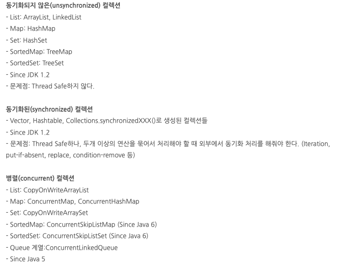
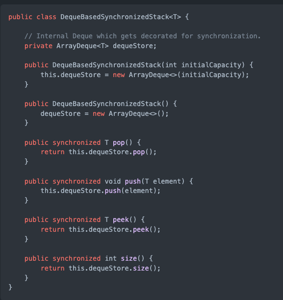

# 컬렉션

 ## 동기화된 컬렉션 vs 병렬 컬렉션

 동기화된 컬렉션 클래스는 내부 변수에 접근하는 통로를 일련화 Thread Safe But 동시사용시 상담 부분 손해 병렬 컬렉션은 이와 반대. (전체적인 성능 향상)
 이 클래스들은 모두 public으로 선언된 모든 메소드를 클래스 내부에 캡슐화해 내부의 값을 한 스레드만 사용하게함.

 병렬 컬렉션은 여러 스레드가 동시에 컬렉션에 접근 가능 

 ## 컬렉션 선택 기준

  * List : 중복을 허용하고 저장순서가 유지되는 컬렉션 구현 
  
 사용이유 ? : 

    * 배열의 단점 : 엘리먼트가 삭제되면 상제된 공간은 빈공간으로 남김 - > 메모리 낭비.
    * 배열 크기를 미리 정해야됨 , 컴파일 이후 배열의 크기를 변동 X

  List 는 ?  빈 엘리먼트 허용 X 
          , 인덱스 장점 버리고 빈틈없는 데이터 적재. (자바에서 허용하는 경우가 있음)
          , 리스트에서 인덱스는 데이터의 순서 정도의 의미
          , 순차성이 없어서 spacial locality 보장 X (cash hit) 어려움. (데이터 갯수가 정해지고 자주사용되면 배열이 더 효율적)
          , 불연속적 메모리 공간 차지 , 포인터로 접근.

  장점 : 포인트를 통해 데이터위치를 가르켜 삽입 , 삭제 용이, 
        동적이라 크기가 정해져 있지 않고 메모리의 재사용 편리.
        불연속적이므로 메모리 관리 편리.

  단점 : 검색 성능이 좋지 않다. / 포인터를 통해 다음 데이터를 카르키므로 추가적 메모리 공간 발생.
 
   2. ArrayList

  가장 많이 사용되는 컬렉션 Vector 클래스와 사용법 구조가 유사함.
  Thread Safe 하지 않음 (Vector는 Safe)
  배열과 마찬가지로 인덱스로 객체 관리, 하지만 동적으로 크기를 늘릴 수 있고 처음 저장 용량은 10 이다 -> 이후 더 많은 객체가 들어오면 1.5배 증가.
  객체 삭제가 일어나면 제거 객체부터 마지막 인덱스까지 모두 앞으로 쉬프트 일어남, 
  -> 따라서 잦은 삭제 이동이 발생할 경우 LinkedList 사용 ..하는게 더 효율적.
  -> 아이템수가 많아지면 grow가 여러차례 (1.5 만큼 크기증가) 복사가 누적됨으로 주의..

 ## 공식문서 ArrayList
   
   List 인터페이스의 크기 조정 가능 배열 구현.
   모든 선택적 목록작업 구현하고 Null을 포함한 모든 요소 허용
   List 인터페이스를 구현하는 것 외에도 이 클래스는 목록을 저장하기 위해 내부적으로 사용되는 매서드 제공 (비동기 화 되는 점) 위에 스레드 세이프관련
   
   size, isEmpty , get ,set ,iterator , listIterator 작업은 상수 시간에 실행됨.
   add는 amortized constant 시간에 실행 됨.
   즉 N개의 요소를 추가하려면 O(n) 시간이 필요.
   다른 모든 작업은 (대략) 선형 시간으로 실행 된다.
   상수 요인은 LinkedList 구현에 비해 낮다.

   용량은 목록의 요소를 저장하는데 사용 되는 배열의 크기 , 언제나 용량의 크기는 리스트의 크기보다 크거나 같다.
   ArrayList에 요소가 추가되면 용량은 자동으로 증가, 요소를 추가하면 상각된 시간비용 이 일정함

   응용 프로그램은 ensureCapacity 작업을 사용하여 많은 수의 요소를 추가하기 전에 ArrayList인스턴스의 용량을 늘릴 수 있따 , 이것은 증분 재할당의 양을 줄일 수 있다.

   ArrayList는 동기화 되지않는다.
   그래서 여러 스레드가 동시에 액세스하는 상황이나 하나 이상의 스레드가 리스트를 구조적으로 수정하는 경우.
   외부에서 동기화 처리를 해줘야 된다. ( 구조적 수정이란 하나 이상의 원소를 추가/삭제 하거나 명시적으로 백업 배열의 크기를 조정하는 작업 단순히 원소 값을 변경하는 것이 아님.)
   이런 동기화 작업은 리스트를 캡슐화하는 객체를 사용해 해결함.
   만약에 없으면 Collentions.synchronizedList 메서드를 이용해 목록을 래핑함.  동기화 되지 않는 엑세스가 일어나는 사고를 방지하는 가장 좋은 방법은 객체를 생성 할때
   List list = Collections.synchronizedList(new ArrayList(..));
  
   ArrayList는 iterator와 ListIterator 메소드가 리턴한 이터레이터들은 fial-fast 방식을 따름
   **이터레이터가 생성된 후 Collection이 구조적으로 수정되면 이터레이터가 자체적으로 갖고있는 Remove/add메소드를 사용하지 않는한** 
   이터네이터는 ConcurrentModificationException 발생함.
   그러므로 동시적으로 수정작업이 발생하면 이터레이터는 빠르고 깔끔하게 실패함, 이를 통해 비결정적 변경이라는 위험을 최대한 방지 하려 함.
   (즉 비동기적 상황에 대한 동시적인 변경을 보장하지 못하기 때문에 발생하는 것.)

  ++  예시.

복사본 제거시 오류가 발생하지 않지만, 컬렉션을 직접 제거하면 에러 발생

그래서 복사본을 조작하거나 , 동기화를 보장 또는 Enumeration으로 조회.

  
저번에 공부한 병렬식 컬렉션을 선언해 사용한 결과이다 예외가 일어나지 않는다.

 이터레이터의 이러한 동시적 수정에 대한 Fail-fast 동작은 보장된 것이 아니고.
 fail-fast 이터레이터는 최대한 ConcurrentModificationException을 던지려 할뿐 예외가 정확할 것이라 전제하고 예외를 의존하는 프로그램 작성하면 안됌.
 이터레이터의 fail-fast동작은 버그찾는데만 사용할 것, 이 클래스는 Java Collections FrameWrok의 멤버이다.

### 상수

 배열의 최대 사이즈는 8 그러나 더 큰값이 필요하면 hugeCapacity가 처리.
 hugeCapacity는 minCapacity가 음수이면 OutOfMemoryError 던지고,
 MAX_ARRAY_SIZE보다 큰 값이면 Interger.MaX_VALUE 사이즈로 사용함.

### 생성자

기본 생성자 초기 용량은 10.

### ArrayList(int initalCapacity)

초기 용량이 주어지면 그만큼 사이즈를 가진 배열 생성

### ArrayList(Collection< extend> c)

Collection 이 주어지면 같은 사이즈를 갖는 배열 생성하고 값을 복사함

출처 : https://johngrib.github.io/wiki/java/arraylist/#arraylistcollection-extends-e-c

   1-1  LinkedList

   
   노드 간에 연결을 통해 리스트로 구현된 객체 . 순차접근만 가능. (탐색시 시간이 많이 소요된다.) randomAccess 불가능
   AbstractSequentialList를 상속함 .
 
   List 와 Queue 모두 구현한 구현체 데이터간의 연결관계 집중해서 저장. (ArrayList, Vector) 메모리관리 측면 유리
   여러 종류의 인터페이스를 구현하기 때문에 동일한 기능 제공하는 메소드들이 많다.

   삽입/ 삭제 시 다음 노드에대한 주소값만 변경됨 

 2.Set
 
 사용하는 이유 :? 컬렉션 순서가 중요하지 않는 데이터 저장할때  , 중복 검사, 원하는 값이 존재하는지만 검사 할 때

  2-1 : HashSet : 순서가 필요가없는 데이터 헤시 테이블 저장 ( 성능 가장 우수)
  2-2 : TreeSet: 저장된 데이터의 값에 따라 정렬 , (성능 보통 )
  2-3 : LinkedHashSet : 연결된 목록타입으로 구현된 헤쉬셋  저장 순서에 따라 값 정렬 ( 성능 가장 나쁨 )

 성능을 나누는 가장 중요한 기준은 정렬 여부 / 중요한 부분은 데이터의 중복 여부

 3. Map

 
 키 , 값 쌍으로 묶어서 컬렉션 구현.
  
  3-1 : HashMap 
   
   key 와 value를 하나의 entry로 저장. , 해시 알고리즘으로 검색속도 빠룸 (멀티스레드에서는 HashTable 사용) 
   -> 기존 코드와 호환성을 위해 남아 있음 HashMap 사용하는게 낫다.
  
  3-2 : TreeMap
  
   이진 검색 트리 형태 저장, 데이터 추가나 제거 기본동작이 빠름  Key의 오름차순으로 저장.

  3-2 : LinkedHashMap
  
   입력된 순서대로 데이터를 저장하는 

 

 4. Stack 

   List 인터페이스를 구현한 클래스 (ArrayList,LinekdList)
   LIFO 구현한 리스트인 stack!  또다른 방법으론 ArrayDeque도 있지만 (속도빠름) 스레드세이브 하지 않다.
   
 특징 : 시스템 해킹에서 버퍼플로우 취약점을 이용한 공격 할 때 스택 메모리의 영역에서 함.
       인터럽트처리, 수식의 계산 ,서브루틴의 복귀 번지 저장등 쓰임  , 우선 탐색에 사용 , 재귀적 함수 호출 사용

 + 자바에서 잘못설계된듯, LIFO 구조 인대 Vector 클래스를 확장하면 중간에서 데이터 삽입 삭제를 하기 때문 , 초기용량 설정 불가능 
   그래서 ArrayDeque 사용하는게 더났다. 
   
 + 4-1: ArrayDeque
 
 stack 클래스보다 빠르고 , Queue 보다 빠름.

 synchronized 장식해 만들수 있다.

 5. Queue 

  FIFO  

 
 6. Deque 

  양쪽 끝 추가 / 삭제 가능
 

