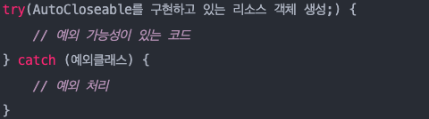
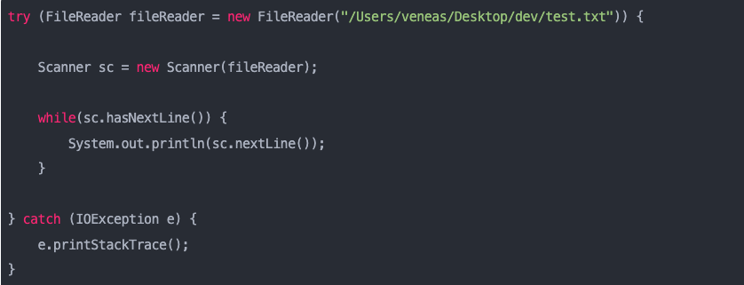
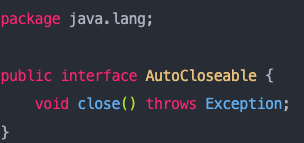

## Exception

### 공식문서
Exception 클래스와 그 하위 클래스는 합리적인 응용 프로그램이 잡을 수 있는 조건을 나타내는 Throwable 형식입니다.
Exception 클래스와 RuntimeException의 하위 클래스가 아닌 모든 하위 클래스는 검사 예외입니다.
확인된 예외는 메서드 또는 생성자의 실행에 의해 throw될 수 있고 메서드 또는 생성자 경계 외부로 전파될 수 있는 경우 메서드 또는 생성자의 throw 절에서 선언해야 합니다.

### 추가 설명 
프로그램중에 발생하는 가벼운 에러 상태 이며 예외 처리는 
예외가 발생한 상황에서 프로그램을 종료하지 않고 , 예외를 핸들링 하여 프로그램의 흐름을 복구하고.
초기에 의도하던 방향으로 프로그램을 수행할 수 있게 하는 것.
굳이 프로그램을 끝낼 것 까지는 필요없는 오류

* 오직 예외 상황에서만 써야 한다. 절대로 일상적인 제어 흐름용으로 쓰면X

### 예외 란?

사전적 의미 : 규칙이나 약속에 벗어남
오류가 시스템 레벨에서 발생하면 예외는 개발자가 구현한 로직에서 발생.
즉  예외는 발생할 상황을 미리 예측하고 처리 가능함
즉  예외는 개발자가 처리할 수 있기 때문에 예외를 구분하고 처리방법을 적용하는게 중요

### 목적

보다 안정적이고 오류에 강한 프로그램을 만드는 것
자바 프로그램은 인터넷과 연계하여 프로그램을 수행하는데, 인터넷은 물리적으로나 
거리, 보안 ,위치 ,접근 등 수많은 예외가 존재, 따라서 많은 예외 상황에 대한 대처 및 고려가 필수적이라.

### 

exception 은 모두 Throwable 상속받음 

Exception -> Checked Exception (RuntimeException)을 제외한 Exception을 상속하는 예외 

**미리미리 준비하자 사고가 날수 있으니**
**체스나 장기판 경우 장기판 혹은 체스판 밖에는 말을 둘 수가 없다.** *

1. Compiler Time Exception이라고 도 부름
2. 컴파일 시점에서 Exception 확인함. 컴파일 시점에서 예외 처리(Try/Catch) 수행하지 않을 경우 에러 발생
3. 예외가 발생하는 메서드에는 throws 예약어를 호출해 메서드에게 넘겨 줘야함.
4. 메서드 마지막엔 Throws 예외처리명 붙여 줘야됨 .
5. roll-back 안함
ex) IOException ,SQLException 

-> 굉장히 빡빡하고 안전 , 컴파일 단계서부터 모든 에러와 예외를 대비함.(예외 발생하면 책임은 개발자한테 있어.)
  단점 : 방어코드가 포함되어 있음을 알려줌 동시에 내부 구현에 대한 힌트 제공.(Exception 종류에 따른 유추)

ReuntimeException -> Unchecked Exception  (RuntimeException을 상속하는 예외 )   

**괜찮아 사고 난 후에 구급차 불러도 안늦음**

1. Runtime Exception 이라 함.
2. 컴파일 시점에서 예외를 잡는지 확인하지 않음, 컴파일 시점에서 예외가 발생할 것인지 여부 판단을 못함.
3. 예외가 발생하는 메서드에 throws 예약어를 활용해 예외를 처리할 필요는 없지만 해도 됨.
4. roll-back 함

-> 널널 한편 , 예외 발생시 책임은 사용자 한테 있음 

ex) NullPointer , IllegalArgument , IndexOutOfBoundException , SystemException

### 두 방법 중 어느걸 선택?

호출 메서드가 예외를 사용해 의미있는 작업가능 ? Checked Exception 
명확하지 않거나 예외 상을 해결하거나 문제를 해결 할수 없으면 ..? Unchecked Exception 

### 예외처리 방법

#### 예외 복구

재시도를 통해 예외를 복구하는 코드
네트워크가 환경이 좋지 않아 서버ㅈㅂ속이 잘 안될때 사용하면 효율 적.
일정 시간만큼 대기하다 재시도 반복 

#### 예외처리 회피

해당 메소드에서 이 예외를 던지는 것이 최선의 방법이라는 확신이 들거나
*호출한 쪽*에서 다시 예외를 받아 처리하도록 할 때 ,, 신중해야되는 로직임.

#### 예외 전환

예외를 잡아서 다른 예외로.
좀 더 명확하게 인지 할 수 있도록 돕는다 (어떤 예외인지 알아야 처리가 수월하니깐)

#### 일반적인 예외 동작.

try-catch 문에서 예외가 발생시.
해당 문을 빠져나간후 다음 해당 구분 다음 문장부터 수행. (catch 블럭에 발생한 예외가 일치하는경우)

발생한 예외와 일치하는 catch블럭이 없는경우  예외처리되지 못하고 종료

finally 사용하면 예외 발생여부와 상관없이 무조건 수행 되어야 할 로직이 있을 경우 사용하는 블럭이다.

ex) 커넥션 풀 종료 , 임시파일 삭제 , 소켓 종료 등등..

출처 : https://mungto.tistory.com/315 , https://www.nextree.co.kr/p3239/

##  try-with-resource

예외 발생 여부 상관없이 리소스 객체(데이터를 읽고 쓰는 객체)의 Close()메소드를 호출해 안전하게 리소스 닫아줌
리소스 객체는 AutoCloseable 인터페이스를 구현해야됨. (자바 7 부터 지원)

기존에는 finally 블럭까지 추가해 null체크를 하고 다시 닫아주고 예외 코드를 추가해줬는데

try-with-resource 코드로 작성하면서 좀더 간결해지고 close() 메소드를 작성하지 않는 실수를 예방 할 수 있음.

만약 close를 깜빡했다면 메모리를 과부하 시켜 서버에 무리를 줄 수 있는 등 문제가 야기 될 수 있다.

## AutoCloseAble

닫힐 때까지 리소스(예: 파일 또는 소켓 핸들)를 보유할 수 있는 개체입니다. 
AutoCloseable 객체의 close() 메서드는 리소스 사양 헤더에 객체가 선언된 try-with-resources 블록을 종료할 때 자동으로 호출됩니다. 
이 구성은 리소스 소진 예외 및 발생할 수 있는 오류를 방지하여 신속한 릴리스를 보장합니다.

1. AutoCloseable 에는 close()메소드가 정의 되어있어 try-with-resource는 AutoCloseable 구현체의 close 메소드를 자동으로 호출

출처 : https://veneas.tistory.com/entry/Java-try-with-resource-AutoCloseable

## effective java

### 일상적인 제어 흐름용으론 사용하면 안됌. (예외는 예외 상황에서 사용될 의도로 설계됨)

예외는 반드시 예외 상황에서만 사용해야 됨. Try-catch블록 안에 들어가면 JVM이 적용할 수 있는 범위가 제한됨 .

이를 위해 상태검사 메서드를 제공하거나 옵셔널 또는 특정값을 반환하도록.

Ex) 상태검사 메서드 hasNext , 상태 의존적 메서드는 Next (iterable)

-> 외부 동기화 없이 여러 스레드가 동시 접근하면 옵셔널이나 특정값 사용 왜냐하면
상태검사 메서드와 상태 의존적 메서드의 호출사이에 객체가 변할 수 있어서.

-> 상태 검사 메서드가 상태 의존적 메서드 작업 일부를 중복 수행하면 옵셔널이나 특정 값을 사용

-> 그 외의 경우는 상태검사 메서드 방식이 좀 낫다.

### 복구 가능 한 상황에는 검사 예외를 , 프로그래밍 오류에는 런타임 예외

### 표준 예외를 사용

본인이 만든 코드 다른사람이 익히고 쉬워짐 (음 이부분으 익숙해진 규약때문에!)
가독성이 좋아 진다. 예외 클래스가 줄어드니 메모리 사용량도 줄고 클래스 적재 시간도 적게 걸림.

### 매서드가 던지는 모든 예외를 문서화하라

@throws 태그를 사용하여 정확히 문서화 하자 다른 사람이 클래스나 인터페이스를 효과적으로 사용하기위해

