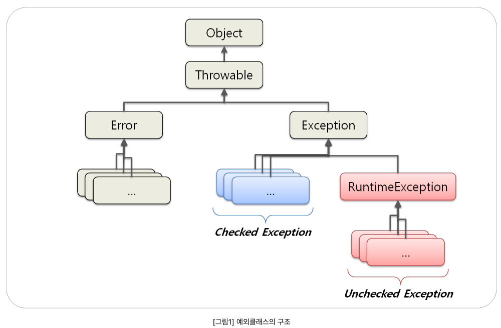
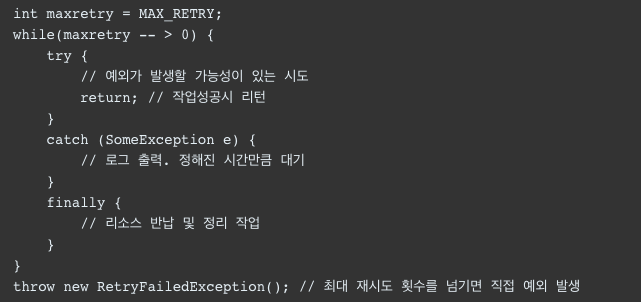
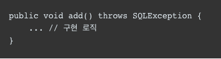
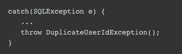

## Exception

### 공식문서
Exception 클래스와 그 하위 클래스는 합리적인 응용 프로그램이 잡을 수 있는 조건을 나타내는 Throwable 형식입니다.
Exception 클래스와 RuntimeException의 하위 클래스가 아닌 모든 하위 클래스는 검사 예외입니다.
확인된 예외는 메서드 또는 생성자의 실행에 의해 throw될 수 있고 메서드 또는 생성자 경계 외부로 전파될 수 있는 경우 메서드 또는 생성자의 throw 절에서 선언해야 합니다.

### 추가 설명 
프로그램중에 발생하는 가벼운 에러 상태 이며 예외 처리는 
예외가 발생한 상황에서 프로그램을 종료하지 않고 , 예외를 핸들링 하여 프로그램의 흐름을 복구하고.
초기에 의도하던 방향으로 프로그램을 수행할 수 있게 하는 것.
굳이 프로그램을 끝낼 것 까지는 필요없는 오류

* 오직 예외 상황에서만 써야 한다. 절대로 일상적인 제어 흐름용으로 쓰면X

### 예외 란?

사전적 의미 : 규칙이나 약속에 벗어남
오류가 시스템 레벨에서 발생하면 예외는 개발자가 구현한 로직에서 발생.
즉  예외는 발생할 상황을 미리 예측하고 처리 가능함
즉  예외는 개발자가 처리할 수 있기 때문에 예외를 구분하고 처리방법을 적용하는게 중요

### 목적

보다 안정적이고 오류에 강한 프로그램을 만드는 것
자바 프로그램은 인터넷과 연계하여 프로그램을 수행하는데, 인터넷은 물리적으로나 
거리, 보안 ,위치 ,접근 등 수많은 예외가 존재, 따라서 많은 예외 상황에 대한 대처 및 고려가 필수적이라.

### 

exception 은 모두 Throwable 상속받음 

Exception -> Checked Exception (RuntimeException)을 제외한 Exception을 상속하는 예외 

**미리미리 준비하자 사고가 날수 있으니**
**체스나 장기판 경우 장기판 혹은 체스판 밖에는 말을 둘 수가 없다.** *

1. Compiler Time Exception이라고 도 부름
2. 컴파일 시점에서 Exception 확인함. 컴파일 시점에서 예외 처리(Try/Catch) 수행하지 않을 경우 에러 발생
3. 예외가 발생하는 메서드에는 throws 예약어를 호출해 메서드에게 넘겨 줘야함.
4. 메서드 마지막엔 Throws 예외처리명 붙여 줘야됨 .
5. roll-back 안함
ex) IOException ,SQLException 

-> 굉장히 빡빡하고 안전 , 컴파일 단계서부터 모든 에러와 예외를 대비함.(예외 발생하면 책임은 개발자한테 있어.)
  단점 : 방어코드가 포함되어 있음을 알려줌 동시에 내부 구현에 대한 힌트 제공.(Exception 종류에 따른 유추)

ReuntimeException -> Unchecked Exception  (RuntimeException을 상속하는 예외 )   

**괜찮아 사고 난 후에 구급차 불러도 안늦음**

1. Runtime Exception 이라 함.
2. 컴파일 시점에서 예외를 잡는지 확인하지 않음, 컴파일 시점에서 예외가 발생할 것인지 여부 판단을 못함.
3. 예외가 발생하는 메서드에 throws 예약어를 활용해 예외를 처리할 필요는 없지만 해도 됨.
4. roll-back 함

-> 널널 한편 , 예외 발생시 책임은 사용자 한테 있음 

ex) NullPointer , IllegalArgument , IndexOutOfBoundException , SystemException

### 두 방법 중 어느걸 선택?

호출 메서드가 예외를 사용해 의미있는 작업가능 ? Checked Exception 
명확하지 않거나 예외 상을 해결하거나 문제를 해결 할수 없으면 ..? Unchecked Exception 

### 예외처리 방법

#### 예외 복구

재시도를 통해 예외를 복구하는 코드
네트워크가 환경이 좋지 않아 서버ㅈㅂ속이 잘 안될때 사용하면 효율 적.
일정 시간만큼 대기하다 재시도 반복 

#### 예외처리 회피

해당 메소드에서 이 예외를 던지는 것이 최선의 방법이라는 확신이 들거나
*호출한 쪽*에서 다시 예외를 받아 처리하도록 할 때 ,, 신중해야되는 로직임.

#### 예외 전환

예외를 잡아서 다른 예외로.
좀 더 명확하게 인지 할 수 있도록 돕는다 (어떤 예외인지 알아야 처리가 수월하니깐)

출처 : https://mungto.tistory.com/315 , https://www.nextree.co.kr/p3239/

