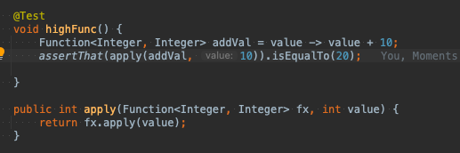
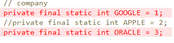

ㅂ
# final vs Immutable (final 클래스,변수,함수 등에 선언하는  키워드고  , Immutable은 패턴? 상태이다(변경불가능한))
## final 

### 위키피디아 final

Java 프로그래밍 언어에서 final 키워드는 한 번만 할당할 수 있는 (주소에)
엔터티를 정의하기 위해 여러 컨텍스트에서 사용됩니다.
최종 변수가 할당되면 항상 동일한 값을 가진다.
Final로 지정된 변수나 객체는  객체 상태는 변경될 수 있지만 주소는 변경되지 않음 (non-transitivity)
배열 같은 경우 안에 값(상태)는 바꿀 수 있지만 배열의 참조주소는 변경이 불가능 하다

### final Class
final Class는 하위 분류할 수 없다.
이렇게 하면 보안 및 효율의 이점을 얻을 수 있고 String Class같은 예가 있다

이렇게 하면 보안 및 효율성 이점을 얻을 수 있으므로 java.lang.System 및 java.lang.String과 같은 
많은 Java 표준 라이브러리 클래스는 최종 버전입니다.

 1. 메서드 및 변수에 사용되는 수정자. final 키워드 사용시 본질적으로 상수가 됨으로 수정이 안됀다.
 2. 변수의 참조주소는 변경될 수 없다
 3. 하지만 상태는 변경 할 수 있다 (setter)

## immutable
 1. 객체의 실제 값을 변경할 수 없지만, 참조주소는 변경 가능.  
 + 풀어서 얘기하면 heap 영역에서 그 객체가 가리키고있는 데이터 자체는 변화 불가 그러나 stack에 있는 주소값을 다른 주소값으로 가르키도록 변경하는건 가능하다 .

int , bollean) 원시타입은 Stack 영역에 그대로 올라가지만, 참조 변수를 가지고 있는 타입 들은 heap영역에 저장하고 그 주소값을 Stack영역에 가지고 있음

 2. 대표적을 String , Integer , Boolean

++ 지식 String 자료를 찾아보면서.. 

String + 를 하면 새로운 주소로 할당됨 .
그리고 String은 참조 주소값이기 때문에 == 보단 equlas로 비교하는게 맞다.

결론 : String 을 예시로 들면 값이 변경되는 것 처럼보이지만 참조 주소 변경이 된 것 
 
 장점 : 생성자 ,접근 메소드에 방어적 복사가 필요 없음 , 멀티 스레드 환경이라면 동기화 처리 없이 객체 공유, 객체 신뢰
 단점 : 객체가 가지는 값마다 새로운 인스턴스 생성 

*출처 https://aljjabaegi.tistory.com/465

