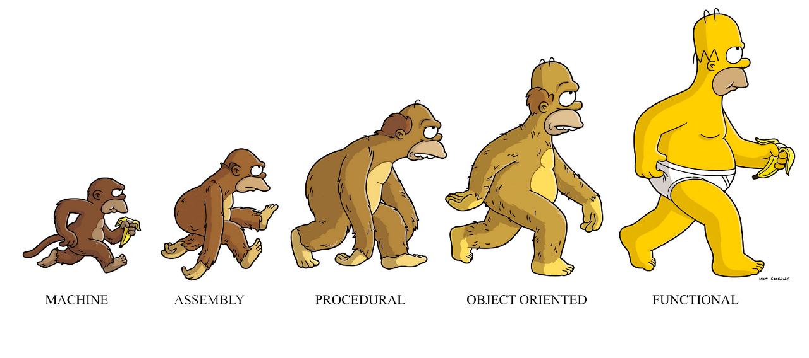
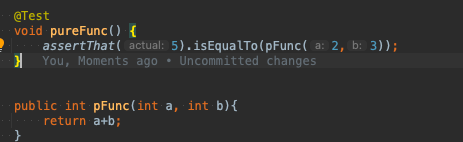
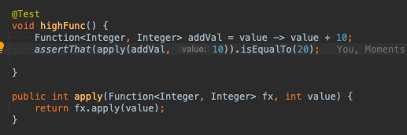
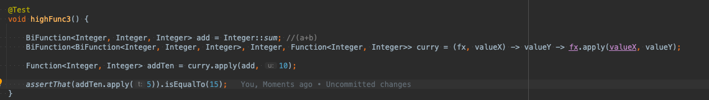
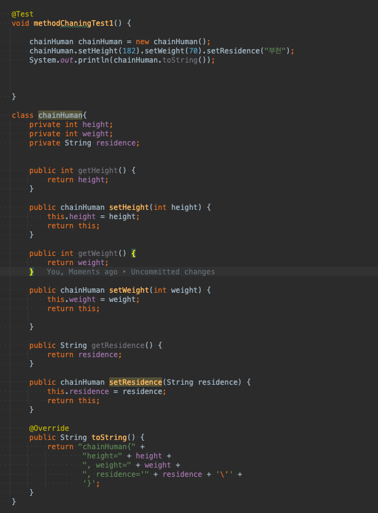

# functional Programming

 

# 설명

 - 자료 처리를 수학적 함수의 계산으로 취급하고 상태와 가변 데이터를 멀리하는 프로그래밍 패러다임의 하나이다. 
 - 함수형 프로그래밍은 동작하는 부분을 최소화해 코드 이해를 돕는다 ?
 - 부수 효과를 제거할 경우 프로그램의 동작을 이해하고 예측이 쉬워져 부수 효과가 없는 순수함수들로만 작성 된다 (조건)
 - 선언적 프로그래밍 이다. -> 데이터가 입력으로 주어지고 데이터가 처리되는 과정(흐름)을 정의하는 것으로 동작

# 조건
- 순수 함수
- 고차 함수
- 익명 함수

# 특징 

- 불변성 (함수 외부에서 데이터 수정하지 않고 함수의 계산 수행동안 변수에 할당된 값들은 변하지 않는다)
- 참조 투명성 (동일한 인자에 대해 동일한 값을 반환해야 된다 : 순수 함수)
- 일급함수(일급 객체)
- 게으른 평가 (코드 실행 즉시 값을 평가하는게 아니라 값이 필요한 시점에서 평가를 한다)

# 일급 함수(일급 객체)

    Appear in an expression (표현식으로 나타낼수 있고)
    Be assigned to a variable (변수에 할당될 수 있다)
    Be used as an argument ( 인자로서 사용되어질수 있어야 한다)
    Be returned by a function call (함수의 결과로서 리턴될 수 있다.)

 예시는 고차함수 부분을 참고

# 순수 함수

 - 같은 입력 시 같은 출력을 보장한다. 부수 효과가 없다.(외부의 상태를 변경하는 것이나, 함수로 들어온 인자의 상태를 직접 변경하는 것(객체에 해당되 는듯??))
 - 외부의 상태를 변경하지 않아야 한다.

 pFunc 함수는 순수하다. 

 수백번을 실행시켜도 입력값이 2,3이면 출력은 5로 동일하다. 이 함수는 외부의 값에 영향을 주거나 받지도 X

 + 만약 객체를 인자값으로 받을 땐 값만 참조하고 주소는 참조하지않게 리턴해주면 이것도 순수 함수다.

# 고차 함수

- 일급 함수의 특징을 만족 해야 한다.
- 함수의 인자로 함수를 전달할 수 있다
- 함수의 리턴값으로 함수를 사용할 수 없다.

## 조건 

 1. 함수를 파라미터로 받는 함수 
 2. 함수를 리턴하는 함수.

## 함수를 인자로 하여 호출할 수 있는 함수

ex) map 함수

## 함수를 결과로 반환하는 함수

## 함수를 인자로 하여 호출할 수 있고 결과로 함수를 반환하는 함수

# 익명 함수

* [LambdaExpressions](https://github.com/superkkj/TIL/blob/main/java/Lambda/LambdaExpressions.md)

 - 이름없는 함수로 자바에서는 람다식을 말한다.
 - 람다 표현식은 구현해야될 추상 메서드가 1개인 인터페이스를 구현한 것이다.
 - 함수와 메서드의 차이는 메서드는 객체에 종속적이다. 함수는 인풋에 의해 아웃풋도 달라져야되는데 메서드는 인풋이 달라지지 않아도 객체의 상태에 따라 결과값이 다를 수 있다.
 - 그러므로 람다표현식은 구현할때 객체는 상태를 가질 수 없다 (순수함수의 내용)

## 특징

 직관적이고 간결하게 '묻지 않고 시키기'? 이해가 잘 안돼네..
 함수형 프로그래밍 스타일을 자바에 적용하기 위해서 탄생했다고 한다.
 자바는 객체지향 언어지만 람다는 함수 지향 언어에 가까워 객체지향언어에 함수형 프로그래밍 스타일을 적용시킬 표현력을 추가했다고 보면 될거 같다.
 대용량처리에도 유용 하다 객체를 생성한후 처리한 것 보단. 데이터를 바로바로 처리해주기 때문에 속도에서 유리함.
 병렬처리에서도 객체보다는 함수가 더 유리하다.

###  행위 파라미터화(Behavior Parameterize)

## 장점

 코드의 간결성 - 효율적인 람다 함수의 사용을 통해 불필요한 루프문은 제거 가능 , 동일한 함수를 재활용 할 수 있는 여지가 커짐 ?
 필요한 정보만을 사용하는 방식을 통해 퍼포먼스 향상 -> 지연연산을 지원하느 방식을 통함, 효율적인 퍼포먼스기대

## 단점

 불필요하게 사용시 오히려 가독성을 떨어뜨림
 stream 사용시 for문 while 보단 성능이 떨어짐.

# 합성 함수

새로운 함수를 만들거나 둘 이상의 함수를 조합해서 말하는 것으로
데이터가 흐르도록 하는 파이프 라인 형성 개념.
작은 단위의 함수들을 연속적으로 호출해 더큰 함수로 만드는 과정

자바에선 메서드 체이닝 방식으로 함수들을 연결해서 사용

## 메서드 체이닝

 말 그대로 고리마냥 줄줄이 엵어서 메소드를 계속해서 사용할 수 있는 방법

 
 
 코드를 보면 연속해서 set함수를 사용하고 객체를 출력해보면
 해당 값들이 들어가 있는걸 확인 할 수 있다.
  
 람다식에선 steam() 함수를 써서  메서드 체이닝을 하는 것 같다.

출처 : https://alkhwa-113.tistory.com/entry/%EB%9E%8C%EB%8B%A4%EC%8B%9Dfeat-%EC%9D%B5%EB%AA%85-%EA%B5%AC%ED%98%84-%ED%81%B4%EB%9E%98%EC%8A%A4-vs-%EB%9E%8C%EB%8B%A4%EC%8B%9D
      https://velog.io/@recordboy
      https://namu.wiki/w/%EA%B3%A0%EC%B0%A8%20%ED%95%A8%EC%88%98?from=%EA%B3%A0%EC%B0%A8%ED%95%A8%EC%88%98
      https://joomn11.tistory.com/21
      https://dinfree.com/blog/2019/03/27/javafp-1.html
      https://dreamcoding.tistory.com/60