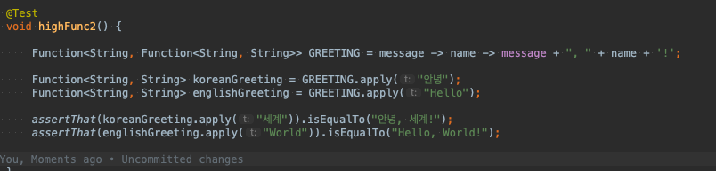

# functional Programming

 

# 설명

 - 자료 처리를 수학적 함수의 계산으로 취급하고 상태와 가변 데이터를 멀리하는 프로그래밍 패러다임의 하나이다. 
 - 함수형 프로그래밍은 동작하는 부분을 최소화해 코드 이해를 돕는다 ?
 - 부수 효과를 제거할 경우 프로그램의 동작을 이해하고 예측이 쉬워져 부수 효과가 없는 순수함수들로만 작성 된다 (조건)
 - 선언적 프로그래밍 이다. -> 데이터가 입력으로 주어지고 데이터가 처리되는 과정(흐름)을 정의하는 것으로 동작

# 조건
- 순수 함수
- 고차 함수
- 익명 함수

# 특징 

- 불변성
- 참조 투명성
- 일급함수(일급 객체)
- 게으른 평가

# 순수 함수

 - 같은 입력 시 같은 출력을 보장한다. 부수 효과가 없다.(외부의 상태를 변경하는 것이나, 함수로 들어온 인자의 상태를 직접 변경하는 것(객체에 해당되 는듯??))
 - 외부의 상태를 변경하지 않아야 한다.

 pFunc 함수는 순수하다. 

 수백번을 실행시켜도 입력값이 2,3이면 출력은 5로 동일하다. 이 함수는 외부의 값에 영향을 주거나 받지도 X

 + 만약 객체를 인자값으로 받을 땐 값만 참조하고 주소는 참조하지않게 리턴해주면 이것도 순수 함수다.

# 고차 함수

- 일급 함수의 특징을 만족 해야 한다.
- 함수의 인자로 함수를 전달할 수 있다
- 함수의 리턴값으로 함수를 사용할 수 없다.

## 조건 
 1. 함수를 파라미터로 받는 함수 
 2. 함수를 리턴하는 함수.

## 함수를 인자로 하여 호출할 수 있는 함수

ex) map 함수

## 함수를 결과로 반환하는 함수

## 함수를 인자로 하여 호출할 수 있고 결과로 함수를 반환하는 함수

출처 : https://alkhwa-113.tistory.com/entry/%EB%9E%8C%EB%8B%A4%EC%8B%9Dfeat-%EC%9D%B5%EB%AA%85-%EA%B5%AC%ED%98%84-%ED%81%B4%EB%9E%98%EC%8A%A4-vs-%EB%9E%8C%EB%8B%A4%EC%8B%9D
      https://velog.io/@recordboy
      https://namu.wiki/w/%EA%B3%A0%EC%B0%A8%20%ED%95%A8%EC%88%98?from=%EA%B3%A0%EC%B0%A8%ED%95%A8%EC%88%98