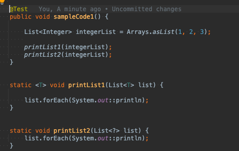
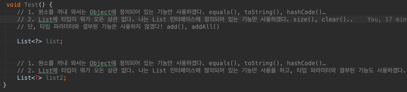

# generic

## 개요 

 + 자바는 여러 타입이 존재하기때문에 형변환에서 많은 예외가 발생 할 수 있다.
 + object로 모든 타입을 받을 수 있지만 특정 타입을 확인하려면 번거로움이 있다
 + 그래서 java5 부턴 제네릭이란 것을 사용한다.

## generic?

 + 형 변환에서 발생할 문제점을 사전에 없애기 위해 만듬.
 + 명시적으로 타입을 지정할 때 사용하는 것이 제네릭 

## 제레닉 타입 이름

 + E: 요소(Element , 자바 컬렉션 주로 사용)
 + K: 키
 + N: 숫자
 + T: 타입
 + V: 값
 + S,U,V: 두 번째, 세 번째, 네 번째 선언된 타입.
 + 여러사람이 쉽게 이해할 수있도록 규칙에 따르는 것이 좋다.

## 제레닉 ?

 + T 나 E 등 으로 지정한게 아니라 ? 로 지정 타입에 구애받지않는다
 + 와일드카드타입이라고 부른다.
 + 와일드카드 객체를 선언 하고 값은 가져 올 수 있지만, 특정 타입으로 값을 지정하는 것은 불가능.
 + ex) WildcardGeneric<?> wildcard = new WildCardGeneric(<String>;
 + whildcard.setWildcard("A")

## 제레닉 선언에 사용하는 타입의 지정 범위

 + 와일드 카드 사용시 ? 범위를 제한할 수 있따.
 + ex) public void boundeWildcardMethod(widcardGeneric<? extends Car> c)
 + 이런식으로 car를 포함한 자식클래스들만 올 수 있다.. 이렇게 명시 할 수 있다.

## T vs wildCard

### 제네릭 메소드 T

 + 제네릭 : 타입은 모른다, 하지만 타입이 정해진다면 그 타입의 특성에 맞게 사용함.
 + 클래스 전체가아니라 하나의 메소드에 대해서만 제네릭을 선언하고 싶을때 사용 빈도가 높다. 

### wildCard

 + ?(wildCard) : 무슨 타입인지 모르고 신경을 쓰지않는다, 타입을 확정 안하고 가능성을 열어둠

### 비교 전 개념 다시 숙지

 + 결과가 같은 둘 무슨 차이가 있을까?

    public class GenericClass<T> {
            public static void method1(T t) {
              doSomething...
          
            }
          
          }
          public class GeneralClass {
          
            public static void <T> method2(T t) {
              doSomething...
            }
          }

 + 제네릭 클래스와, 일반 클레스 내부에 선언된 method 1 ,2
 + 차이는 ?
 + method1은 에러가 난다  제네릭 타입은 인스턴스가 생성될 때 결정 되는데.
 + static으로 선언된 이상 메모리에 바로 올라가게 되는데 타입이 형성되있지 않은채
 + 메모리에 올라가기 때문에 에러가 발생
 + 허나 method2는 함수 호출시 메모리에 올라가기 때문에 에러가 발생하지 않는다.

      public static void peekBox(Box<Object> box) {
          System.out.println(box);
      }
      
      ## 2. Generic Method
      public static <T> void peekBox(Box<T> box) {
          System.out.println(box);
      }

 + 일반 메서드오 제네릭 메서드 차이 점이다.
 + 둘다 비슷한 기능에 어떤 타입이 전달되건 잘 돌아 갈 것 같지만
 + 상속 개념으로 보면  Box<Object> 와 Box<String> 간의 상속관계가 성립하지 않기 때문
 + Box<String> 은 Box의 하위 타입 이지만. Box<Object>의 하위 타입이 아니다.
 + 상속은  클래스 상속관계가 있어야되고 파라미터 타입이 일치해야 된다.
 + 그래서 제네릭 클래스 간에 상속관계가 형성된다 이런식으로 이해하자.

### 그래서 둘 차이는?

          public static <T> void peekBox(Box<T> box) {
              System.out.println(box);
          }
        
          public static void peekBox(Box<?> box) {
          
              System.out.println(box);
          }
 

 + Box<?> 제네릭 메소드처럼 String , Interger 파라미터화 넘길 수 있다 .
 + 근대 왜 나눠 놓은꺼지?
 + 제네릭 : 지금은 이 타입을 모르지만 타입이 정에지만 그 특성에 맞게 사용할게!
 + 와일드 카드: 타입에 대해 관심없어 앞으로도 쭉!

 + 기능면에서는 완전히 같다, 이왕이면 간결한 와일드카드 사용을 좀 더 추천한다. 

출처 :
 + 자바의 신.
 + https://docs.oracle.com/javase/tutorial/java/generics/types.html    
 + https://nauni.tistory.com/143
 + https://vvshinevv.tistory.com/55?category=692309