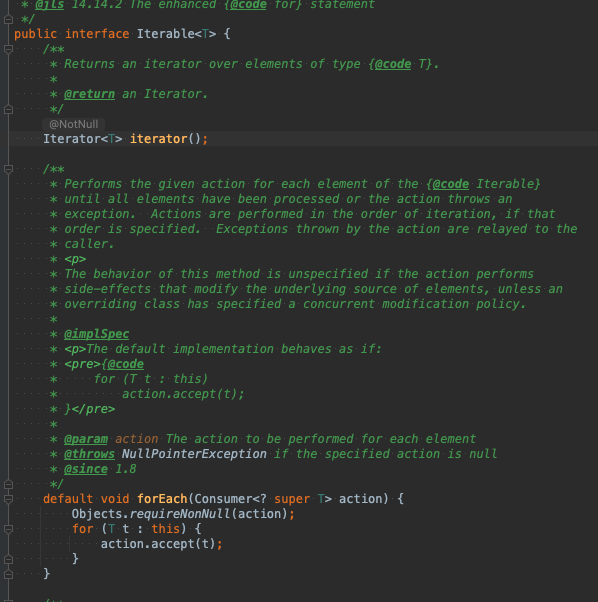
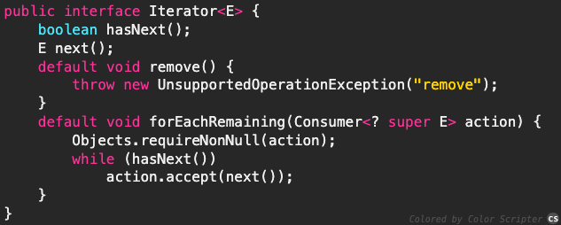

# iterable

계층 구조 

 iterable 구조 
 

 iterable > collection > List , set , Queue 상속 하고있다.
 
 멘토링에서 상속에대한 부분에 대해 생각하면 iterable에서 규격? 계약이된 메소드 등은 하위 클래스에서 무조건 구현해야됨.
 iterable 내부를보면 iterator 메소드가 추상메소드로 선언되었다. 그래서 하위 클래스들은 전부 iterator 메소드를 가지고 있음
 결론적으로 Iterable 인터페이스의 역할은 Iterator() 메소드를 하위 클래스에서 무조건 구현하게 만들기 위한 역할
 
  foreach문이 디폴트 메소드로 들어가 있음.

 ## Iterator

 내부에는 hasNext , next  , remove 등 컬렉션 클래스의 데이터 하나씩 읽어올때 사용 .
 이런 공통 인터페이스(Iterator)를 정의해서 구현하도록 표준을 정하면서 코드의 일관성 유지및 재사용성 극대.

## ListIterrator

 Iterrator 상송받아서 기능을 추가 함 , 양방향으로 이동가능 - > ArrayList나 LinkedList와 같이 List인터페이스를 구현한 컬렉션에서만 사용 가능.

 