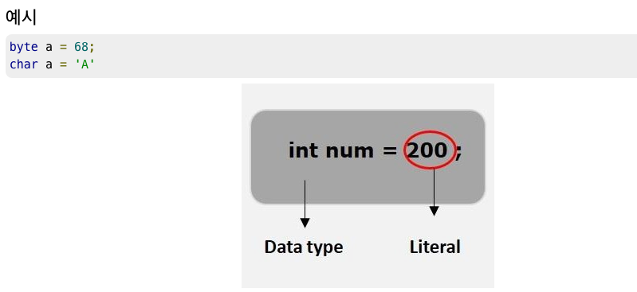

# 리터럴 

리터럴은 고정 값의 소스 코드 표현입니다. 계산 없이 코드에 직접 표시됩니다.

리터럴은 모든 기본 유형 변수에 할당할 수 있습니다.

ex) String a = "Example";
상수 : 변하지 않는 변수 == 위 예시의 a 의미
리터럴 : 변하지 않는 데이터 == 위 예시의 "Example" 의미

byte, int, long, short는 십진수(base 10), 16진수(base 16) 또는 8진수(base 8) 숫자 체계로도 표현할 수 있습니다.

접두사 0은 8진수를 나타내는 데 사용되며 접두사 0x는 이러한 숫자 체계를 리터럴에 사용할 때 16진수를 나타냅니다. 

int decimal = 100;
int octal = 0144;
int hexa = 0x64;

Java의 문자열 리터럴은 대부분의 다른 언어에서와 같이 일련의 문자를 큰따옴표로 묶어서 지정됩니다. 

"Hello World"
"two\nlines"
"\"This is in quotes\""

리터럴에는 문자열, 숫자, 부울 및 열거의 네 가지 종류가 있습니다.

문자열 리터럴 : 문자열 리터럴은 작은따옴표로 묶입니다.

'Duke'
문자열 리터럴에 작은 따옴표가 포함된 경우 두 개의 작은 따옴표를 사용하여 따옴표를 나타냅니다. " '' '"

'Duke''s'

Java와 마찬가지로 String쿼리 언어의 문자열 리터럴은 유니코드 문자 인코딩을 사용합니다.

숫자 리터럴 : 숫자 리터럴에는 정확 및 근사의 두 가지 유형이 있습니다.

정확한 숫자 리터럴은 65, -233 및 +12와 같이 소수점이 없는 숫자 값입니다. Java 정수 구문을 사용하여 정확한 숫자 리터럴은 Java long 범위의 숫자를 지원합니다 .

대략적인 숫자 리터럴은 57., -85.7 및 +2.1과 같은 과학적 표기법의 숫자 값입니다. Java 부동 소수점 리터럴의 구문을 사용하여 근사 숫자 리터럴은 Java double 범위의 숫자를 지원합니다 .

부울 리터럴 : 부울 리터럴은 TRUE 또는 FALSE 입니다. 이러한 키워드는 대소문자를 구분하지 않습니다.

열거형 리터럴 : Java Persistence 쿼리 언어는 Java 열거형 리터럴 구문을 사용하여 열거형 리터럴 사용을 지원합니다. 열거형 클래스 이름은 정규화된 클래스 이름으로 지정해야 합니다.

1. 문자열 , 숫자 부울 및 열거..
2. 유니코드 문자 인코딩을 사용한다 (String)
3. 숫자 리터럴은 Java long 범위의 숫자 (정수) , 정수 외 나머지 실수 나 소수는 double 숫자 범위

출처 : https://docs.oracle.com/cd/E19798-01/821-1841/bnbuv/index.html

