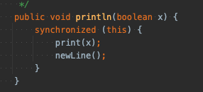
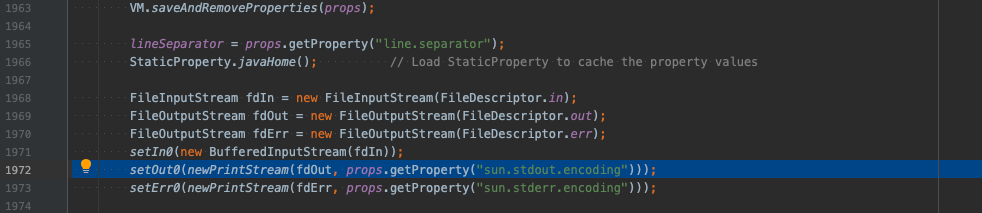
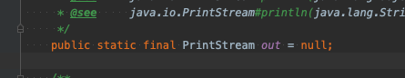

# println

 + public void println(String x)
 + Prints a String and then terminate the line. This method behaves as though it invokes print(String) and then println().
 + 문자배열을  인쇄한 다음 다음 행을 종료 한다.

## system.out.printLn을 왜 사용하며 안됄까?

 + System.out.println 시스템 로그를 많이 사용함
 + 따라서 커널의 CPU의 사용량이 높아 성능에 영향을 미침
 + 파일이나 콘솔에 로그를 남길때 완전히 프린트 되거나 저장이 될떄까지 프린트 하려는 부분이 대기가 되어지기 때문

 

 내부 코드를 보면 동기화 코드가 작성 되있다  (한개 스레드를 제외하고 나머지 스레드는 접근 불가.)
 System.out.println 작업을 시행하면 해당 작업을 수행하는 스레드만 수행하고
 나머지 스레드는 대기상태 -> 소요시간 메모리 소요 증가.

 1. 디버그 정보를 출력하면 인자값만 출력해줌 
 + 최소한의 로그 정보가 없음, 로깅을 사용하면 날짜 / 시간 로그 등 함 께 출력하는데 
 + system.out.println은 그러지 않음. 장애가 발생할때 추적이 어렵다.

 2. 로그정보를 가져오기 어려움 
 + 콘솔에 로그를 출력하는 API 이다. 파일로 가져오거나 서버로 전송하기 어렵다.

 3. 성능에 영향을 미침 
 + CPU리소스를 점유하게 됨, 로깅 라이브러리는 DEBUG 였다가 INFO 레벨로 바꾸면 되지만.
 + System.out.println은 개발시 실수라도 남겨두면 운영시 작동하여 서버나 프로그램 성능에 영향을 미침 

## 정리

 
 
 + System.java 에서 newPrintStream으로 printStream 객체를 생성
 + out이란 이름으로 객체를 생성해 준다.
 + printStream 객체 생성이 정적으로 되어서 println을 임포트 없이 사용할 수 있음.

출처 : https://jong99.tistory.com/109
      https://hashcode.co.kr/questions/6514/systemoutprintln-%EC%A7%88%EB%AC%B8%EC%9E%88%EC%8A%B5%EB%8B%88%EB%8B%A4
      https://okky.kr/article/149762