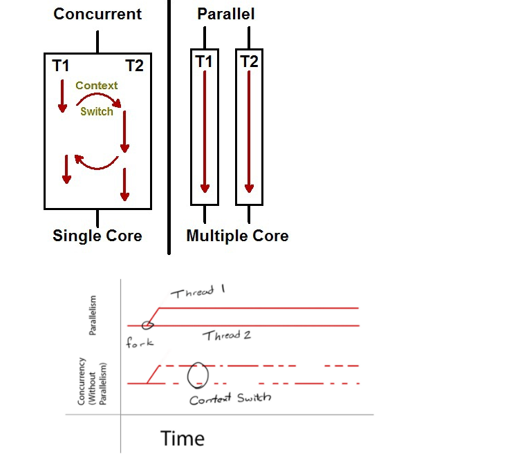

# 동시성vs병렬성.

## 비동기 프로그래밍

 + 프로그램의 주 실행 흐름에 멈추어서 기다리는부분이 없다.
 + 바로 다음작업을 실행.
 + 실행처리결과를 별도의 저장공간에 맡겨두고 다음 코드를 실행하는 병렬처리

## 동시성 

 + 동시에 실행되는 것 처럼 보임 (문맥 교환)
 + 싱글코어 (멀티코어도 가능) 에서 멀티 스레드를 동작시키기 위한 방식.
 + 여러 개의 스레드를 번갈아 가면서 실행
 + 많은 것을 처리
 + 논리적 개념 

 + 네트워크 통신 및 파일 저장 로드등 I/O 작업은 CPU가 일을 하지 않기 때문에 대기 상태가 된다.
 + 이때 CPU가 대기하는동안 다른 작업을 하면 효율적이기에 동시성이 좋다.

## 병렬성

 + 물리적으로 동시에 정확히 실행 됨.
 + 많은 일을 처리
 + 물리적 개념 
 + 멀티 코어에서 멀티 스레드를 동작시키는 방식,
 + 데이터 병렬성: 전체 데이터 나눠서 서브 데이터로 나눈뒤 , 서브 데이터를 병렬 처리해 빠르게 수행
 + 작업 병렬성 :  서로 다른 작업을 병렬 처

## 동시성 vs 병렬성

 + 동시성 : 싱글코어 , 멀티코어 모두 구현 가능 
 + 하나의 커피머신에 커피를 받기 위한 N개의 대기열 > 서로 번갈아 가며 커피
 + 병렬성: 멀티 코어에서만 구현 가능
 + N대 커피머신에 커피를 받기위한 N개 대기열.

출처 :

 + https://devsrkim.tistory.com/entry/%EB%8F%99%EC%8B%9C%EC%84%B1%EA%B3%BC-%EB%B3%91%EB%A0%AC%EC%84%B1%EC%9D%98-%EC%B0%A8%EC%9D%B4?category=873361
 + https://mentha2.tistory.com/245