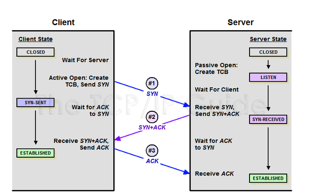
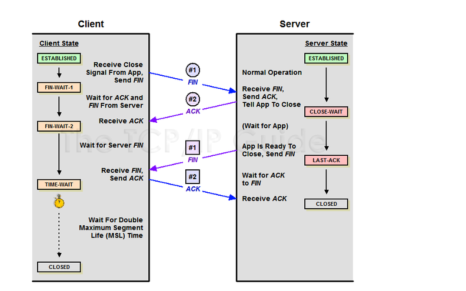

# 3Or4HandShake (TCP 연결 초기화)

 + TCP 장치들 사이에 논리적인 접속을 성립하기 위한 것
 + 양쪽 모두 데이터를 전송할 준비가 되었다는걸 보장 
 + 실제로 데이터 전달이 시작하기전 한쪽이 준비되었다는걸 알수 있음.
 + syn(syn_sent 상태) -> syn+ack(요청수락) (syn_RECEIVED)상태 -> ack 동작

## 4HandShake (세션 종료)

 + 클라이언트가 연결종료 FIN 플래그 전송
 + 서버는 확인메세지 ACK 보냄 TIME_WAIT 상태 (자신의 통신이 끝날때까지..)
 + 서버통신이 끝나면 FIN 플래그를  클라이언트에게 보냄
 + 클라이언트는 확인 메세지를 보냄..
 + 클라이언트는 FIN 수신하더라도 일정시간 (디폴트 240) 세션을 남겨놓고 잉여패킷 기다리는 과정을 TIME_WAIT라 함