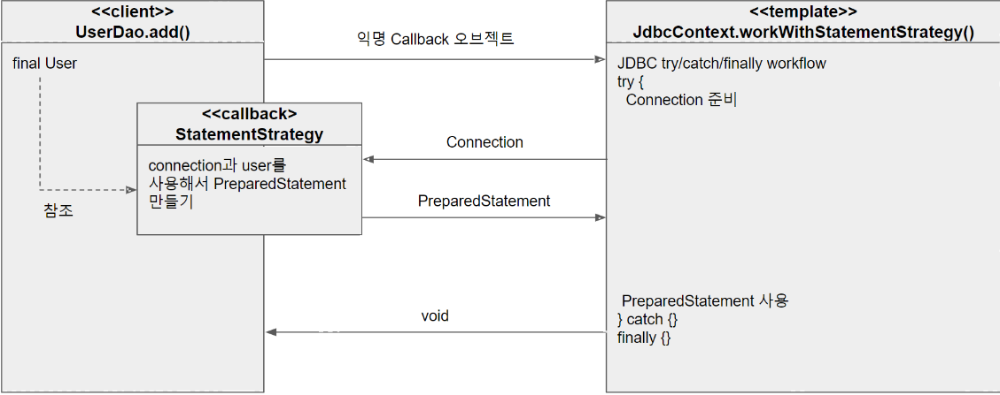

# 템플릿

 + 개방 폐쇄의 원칙은 : 변화의 특성이 다른 부분을 구분하고, 
 + 각각 다른 목적과 다른 이유에 의해 다른 시점에 독립적으로 변경될 효율적인 구조를 만들어 주는 것

## 템플릿

 + 성질이 다른 코드 중 변경이 거의 일어나지 않으며
 + 일정한 패턴으로 유지되는 특성을 가진 부분을
 + 자유롭게 변경되는 성질을 가진 부분으로 부터 독립 시켜서 효과적으로 활용하는 방법 

# 예외 처리

 + try-catch-final 예외를 잡기위한 구문
 + 디비 연결이나 리소스를 사용할때 사용한다.
 + 하지만 수많은 트라이 캐치 파이널문 한순간에 오타라도있으면? 코드자체적으로도 불안하고.
 + 가독성도 떨이지고 위험 요소가 많다.

## 분리와 재사용을 위한 디자인 패턴 적용

    Connection c = null; // 변하지않는부분
    PreparedStatement ps = null; // 변하지않는부분
    try

    {
        c = dataSource.getConnection(); // 변하지않는부분
        ps = c.prepareStatement("delete from users"); // 변하는 부분 

    // 아래부분 변하지않는부분
        pS.executeUpdate();} catch(
    SQLException e)

    {
        throw e;
    } finally

    {
        if (ps != null) {
            try {
                ps.close();
            } catch (SQLException e) {
            }
        }
        if (c != null) {
            try {
                c.c듯ose();
            } catch (SQLException e) {
            }
        }
    } 

## 템플릿 메서드 패턴 적용

 + 변하지 않는 부분은 슈퍼클래스에 변하는 부분은 추상메서드로 정의
 + 서브클래스에서 오버라이드해서 새롭게 정의해서 쓰자 
 + 허나 이방식은 DAO 로직마다 새로운 클래스를 만들어야되서... 문제가 많다.
 + 관계에 대한 유연성도 떨어진다 <- 확장구조가 이미 클래스 설계 시점에서 고정 됨.

    public class UserDaoDeleteAll extends UserDao (
    
            protected PreparedStatement makeStatement(Connection c) throws SQLException (PreparedStatement ps=c.prepareStatement("delete from users");
            return ps;
    
    
            }
    }

## 전략 패턴!

 + OCP를 지키면서 템플릿 메서드 패턴보다 유연하고 확장성을 뛰어나게 해보자
 + 전략 패턴을 사용해 Ps 를 리턴하는 인터페이스를 만들고
 + add , get delete 구현 클래스를 만들어 변하하는 부분에 적용 해 준다.

 + 그러나 클래스내에 구현이 되있어서 전략패턴이라 보기어려움
 + DI를 사용해 전략 패턴의 장점을 활용하자

    StatementStrategy st = new DeleteAllStatement(); -을 선정한 전략 클래스의 오브젝트 생성
    
    jdbcContextWithStatementStrategy(st);~ 컨텍스트 호출 전략 오브젝트 전달

 + 이렇게 제 3자에게 책임을 넘겨.
 

## 문제점

 + 전략 패턴은 필요에 따라 컨텍스트는 유지 하면서 (OCP) 전략을 바꿔 쓸 수 있는대
 + 이미 구체적인 전략 클래스 DeleteAllstatement가 고정 되있어 이상함.
 + 앞장에서 와 똑같이 의존관계 주입 ObjectFactory로 책임을 분리시키는 것도 소개를 한다.

    public void jdbcContextWithStatementStrategy(StatementStrategy stmt) throws SQLException {
        Connection c = null;
        PreparedStatement ps = null;
    
        try {
            c = dataSource.getConnection();
            ps = stmt.makePreparedStatement(c);
    
            ps.executeUpdate();
        } catch (SQLException e) {
            throw e;
        } finally {
            if(ps != null) { try { ps.close(); } catch (SQLException e) { } }
            if(c != null) { try { c.close(); } catch (SQLException e) { } }
        }
    }

    public void deleteAll() throws SQLException {
        StatementStrategy strategy = new DeleteAllStatement(); // 선정한 전략 클래스의 오브젝트 생성
        jdbcContextWithStatementStrategy(strategy); // 컨텍스트 호출, 전략 오브젝트 전달
    }

## 기존까지 컨텍스트 전략

 + 자주 변하는 부분 / 변하지 않는 부분을 이용해 두 부분을 전략 패턴을 이용해 분리함.
 + 컨텍스트 : PreparedStatement 실행하는 JDBC 작업 흐름
 + 전략 : PreparedStatement 생성

## 전략과 클라이언트 의 동거

 + DAO 메소드 마다 새로운 StatementStrategty 구현 클래스 만들어 줘야 함.. -> 클래스파일 갯수가 너무많아
 + 그래서 로컬 클래스 OR 익명 클래스로를 활용해서 만들기도 함.

    public class JdbcContext {
        private DataSource dataSource;
    
        public void setDataSource(DataSource dataSource) {
            this.dataSource = dataSource;
        }
    
        public void workWithStatementStrategy(StatementStrategy stmt) throws SQLException {
            Connection c = null;
            PreparedStatement ps = null;
    
            try {
                c = dataSource.getConnection();
                ps = stmt.makePreparedStatement(c);
    
                ps.executeUpdate();
            } catch (SQLException e) {
                throw e;
            } finally {
                if(ps != null) { try { ps.close(); } catch (SQLException e) { } }
                if(c != null) { try { c.close(); } catch (SQLException e) { } }
            }
        }
    }

    public class UserDao {
        ...
        JdbcContext jdbcContext;
    
        public void setJdbcContext(JdbcContext jdbcContext) {
            this.jdbcContext = jdbcContext;
        }
        ...
        
        public void add(User user) throws SQLException {
          StatementStrategy stmt = c -> {
              PreparedStatement ps = c.prepareStatement(
                      "insert into users(id, name, password) values (?, ?, ?)"
              );
    
              ps.setString(1, user.getId());
              ps.setString(2, user.getName());
              ps.setString(3, user.getPassword());
    
              return ps;
          };
    
          jdbcContext.workWithStatementStrategy(stmt);
        }
        
        public void deleteAll() throws SQLException {
            StatementStrategy strategy = c -> c.prepareStatement("delete from users"); 
            jdbcContext.workWithStatementStrategy(strategy); 
    }

## 빈 의존관계 변경

 + UserDao 는 JdbcContext에 의존
 + JdbcContext는 인터페이스인 DataSource와 달리 구체 클래스.
 + 보통 DI는 인터페이스를 사이를 두고 의존 클래스를 바꿔가면서 하지만?
 + JdbcContext는 그 자체로 독립적인 JDBC 컨텍스트를 제공해주는 서비스 오브젝트로 의미 가 있고 바뀔 가능성 X

## 인터페이스 없이 스프링 빈으로 DI하면 문제가 있을까?

 + 앞서 구현은 인터페이스 없이 DI 구현 -> 런타임시 DI 방식으로 외부에서 주입하지만 의존 오브젝트의 구현 클래스 변경할 수 없다.
 + 온전한 DI라 볼수 없지만 넓께보면 객체의 생성과 관계설정에 대한 제어권한을 오브젝트에서 제거하고 외부로 위임하는 IOC 개념을 포괄함 

## 위에 코드의 DI 구조로 만든 이유는?

 + 싱글톤 레지스트리에 등록된 싱글톤 빈으로 만든다는 것에 의미.
 + 많은 DAO 사용 - > JdbcContext는 1개의 빈으로 관리 가능 -> 변경되는 상태정보가 없어 서비스 오브젝트로 의미가 있고, 여러 오브젝트 공유 사용 가능
 + JdbcContext가 dataSource라는 다른 빈에 의존하기 때문 -> DI를 위해서 주입되는 오브젝트와 주입받는 오브젝트 양쪽 모두 스프링 빈으로 등록되어야 함.
 + 다른빈을 주입받기 위해 스프링 빈에 등록되어야 함.

 + 결론 적으로 인터페이스 없이 구현한거라 UserDao랑 JdbcContext 클래스와 강한 결합을 갖고 있는 의미. OOP 설계 원칙위배?
 + Jdbc는 테스트에서도 다른 구현으로 대체해서 사용할 이유 없다. 이런 경우 굳이 인터페이스를...
 + But 이런 클래스 사용은 가장 마지막 단계에서 고려해볼 사항이다.

## 수동 DI

 + UserDao 내부에 직접 JdbcContext를 DI 하자
 + 어짜피 Dao는 싱글톤 빈으로 등록되있기 때문에 JdbcContext를 굳이 빈으로 등록안해도 Dao 와 1:1 매칭이 된다.
 + 장점은 빈으로 따로 분리하지않고 내부에서 직접 만들어 사용하면서도 다른 오브젝트에 대해 DI를 적용 할 수 있다.

    public class UserDao {
        DataSource dataSource;
        JdbcContext jdbcContext;
    
        public UserDao() {
        }
    
        public UserDao(DataSource dataSource) {
            this.dataSource = dataSource;
        }
    
        public void setDataSource(DataSource dataSource) {
            this.dataSource = dataSource;
    
            this.jdbcContext = new JdbcContext();
            jdbcContext.setDataSource(dataSource);
        }

## 정리

### 빈 등록 방법

 + 의존관계가 설정파일에 명확히 드러나고
 + 싱글톤 레지스트리의 등록 가능
 + But DI의 근본적 원칙에 부합하지 않는 구체적인 클래스와의 관계가 설정에 직접 노출됨 

### 수동 DI

 + 관계를 외부에 드러내지 않음
 + But 싱글톤 불가능 
 + DI작업을 위한 부가적인 코드 필요 

### 결론

 + 상황에 따라 적절한 방법을 선택하면서 왜 그렇게 선택햇는지 대한 근거가 있어야함
 + 분명하게 설명할 자신이 없으면 평범하게 인터페이스를 만들어 평범한 DI구조가 가장 낫다.

## 템플릿  / 콜백 (람다랑 대입시켜 생각하면 편할 )

 + 전략 패턴의 컨텍스트 : 템플릿 -> 고정된 작업 흐름을 가진 코드를 재사용
 + 익명 내부 클래스 : 콜백  -> 템플릿 안에서 호출되는 것을 목적으로 만들어진 오브젝트 ->메소드 자체를 파라미터로 전달할수 없어서 사용함 (java8에선 다르지..)
 + 익명 내부 클래스 활용 방식 -> 복잡하지만 바뀌지 않은 일정한 패턴을 갖는 작업의 흐름이 존재하고
 + 그중 일부만 자주 바꿔서사용하는 경우 적합.
 + 단일 메소드 인터페이스를 사용한다.

## 템플릿?

 + 어떤 목적을 위해 미리 만들어 모양이 있는 틀
 + 고정 된 틀안에서 바꿀수 있는 부분을 넣어서 사용하는 경우 템플릿이라 한다!
 + 템플릿메소드패턴 -> 고정된 틀의 로직을 가진 슈퍼클래스에 템플릿 메소드를 두고/ 서브클래스 부분에 바뀌는 부분을 메소드에 두는 구조

## 콜백 

 + 실행되는 것을 목적으로 다른 오브젝트의 메소드에 전달되는 오브젝트를 말함
 + 파라미터로 전달되지만 -> 값을 참조 X 특정 로직을 담은 메소드를 실행시키기 위해. (1.8부턴 람다로 가능)
 + 자바에선 메소드 자체를 파라미터로 전달할 방법이 없어서 메소드가 담긴 오브젝트를 전달
 + 그래서 펑셔널 오브젝트라 함.

## 동작 원리

 + 보통 단일 메소드 인터페이스 사용  
 + 템플릿의 작업 흐름은 특정기능을 위해 한번만 호출되는 경우가 일반적
 + 탬플릿/콜백 방식에서는 매번 메소드 단위로 사용할 오브젝트 새롭게 전달 받음 .

## 편리한 콜백의 재활용

 + 기존 방식은 템플리셍 담긴 코드를 여기저기 반복 사용하는 단점
 + 템플릿/콜백 방식은 이걸 해결함.
 + JdbcContext만 이용하면 기존의 커넥션을 맺고 끊는 템플릿코드를 매번 재작성할 필요 없어지고
 + 비즈니스 로직에만 집중 가능함. 
 + But 익명 내부 클래스를 사용해 익숙하지않는 스타일에 가독성이 떨어짐 .

## 콜백의 분리와 재활용

    public void deleteAll() throws SQLException {
        executeSql("delete from users");
    }

    public void executeSql(String sql) throws SQLException {
        StatementStrategy strategy = c -> c.prepareStatement(sql); // 선정한 전략 클래스의 오브젝트 생성
        jdbcContext.workWithStatementStrategy(strategy); // 컨텍스트 호출, 전략 오브젝트 전달
    }

    // executeSql JdbcContext로 옮기면 ? 

    public class JdbcContext {
    private DataSource dataSource;

    public void executeSql(String sql) throws SQLException {
        StatementStrategy strategy = c -> c.prepareStatement(sql); // 선정한 전략 클래스의 오브젝트 생성
        this.workWithStatementStrategy(strategy); // 컨텍스트 호출, 전략 오브젝트 전달
    }

    //UserDao
    public void deleteAll() throws SQLException { 
    this.jdbcContext.executeSql("delete from users");
    }
 + 변화할수 있는부분을 변경해서..

## 정리 

### 전략 패턴과 템플릿 메소드 패턴 차이?

 + 흡사하나 인터페이스를 익명 내부 클래스로 구현했다는 차이.
 + 또한 익명 내부 클래스로 구현되어야 해서 전략패턴의 전략 내부에 메소드가 1개만 있을 때
 + 말그대로 콜백 함수와 같은 개념으로 사용된다고 봄.

