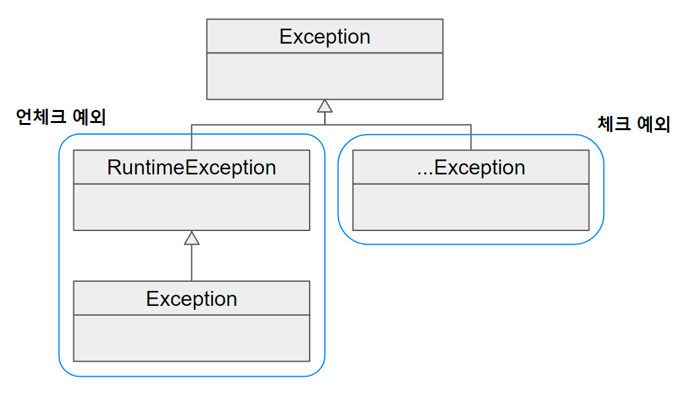

# 예외

## 예외 처리 

 + catch 블록을 써서 잡는 것 까진 좋은대 아무것도 하지않으면 문제!
 + 예외를 처리할때 단순히 로그만 남기는 것이 아니라. 모든 예외는 복구 되던지. 작업을 중단시키고 개발자에 통보해야 함
 + 예외를 던져서 메소드 밖으로 던지고 자신을 호출한 클라이언트에 예외처리 책임을 전가하자.
 + 무책임한 예외코드도 지양하자.. ex) 그냥 단순히 에러 프린트만하는..

    catch (Exception e) {
    System.out.println(e);
    }
    

## 예외 종류

### Error

 + java.lang.Error 클래스의 서브 클래스들,
 + 시스템적으로 뭔가 비정상적인 상황 발생 주로 VM에서 발생시킴. 
 + 대응방법이 없어서 신경쓰지말자

### Exception 과 체크 예외

 + 개발자들이 만들 애플리케이션코드 작업중 예외 발생할 경우
 + Exception Class는  체크 예외 / 언체크 예외로 구분 됨.
 + RuntimeException 상속햇냐 안했냐 차이
 + 체크 예외가 발생할 메소드 사용할 경우 반드시 예외처리 코드 작성 아니면 컴파일 에러발생.

### 체크 예외

 + Exception 클래스의 서브 클래스 RuntimeException 클래스를 상속하지않는것.
 + IDE에서 예외 처리 강요

### 언체크 예외

 + RuntimeException 상속한 클래스들
 + IDE에서 강요하지 않음

## RuntimeException과 언체크 런타임 예외

 + 명시적인 예외처리를 강제하지 않기 때문에 언체크 예외라 한다. 
 + 예상치 못했던 상황에 발생하는게 아니라 굳이 catch/ throws 사용 안해도됨
 + NullPointerException  / IlegalArgumentException

## 예외 처리

### 예외 복구

 + 예외 발생시 정상으로 복구
 + ex) 디비 접속하다 실패하면 일정 시간두고 재시도.

    int maxRetry = MAX_RETRY;
    
        while(maxRetry --> 0) {
        try {
        ... // 예외가 발생할 수 있는 시도
        return; // 작업 성공
        }
        catch(SomeException e) {
        // 로그 출력, 정해진 시간만큼 대기
        }
        finally {
        // 리소스 반납, 정리 작업
        }
    }
    throw new RetryFailedException(); // 최대 재시도 횟수를 넘기면 직접 예외 발생

### 예외처리 회피

  + 자신을 호출한 쪽으로 예외처리 던지기.
  + 콜백과 템플릿처럼 긴밀한 역할분담 관계가 아니라면 무책임한 책임회피이다.
  + 의도가 분명해야됨..

    private void mayThrowExceptionLogic() throws ???Exception {
    // 비즈니스 로직
    }

### 예외전환

 + 예외를 메소드 밖으로 던지고 적절한 예외로 전환해서 던짐
 + 내부에서 발생한 예외를 던지는 것이 예외상황에 대해 적절한 의미로 부여해주지 못함 -> 의미를 분명하게 해줄 수 있는 예외로 바꿔줌
 + ex) 새로운사용자 추가할때 이미있는아이디? - > SQLException -> DuplicateUserIdException 같은 예외로 처리

    public void add(User user) throws DuplicateUserIdException, SQLException {
        try {
        // JDBC를 이용해 user 정보를 DB에 추가하는 코드 또는
        // 그런 기능을 가진 다른 SQLException을 던지는 메소드를 호출하는 코드
        }
        catch(SQLException e) {
            // ErrorCode가 MySQL의 "Duplicate Entry(1062)"이면 예외 전환
            if (e.getERrorCode() == MysqlErrorNumbers.ER_DUP_ENTRY)
            throw DuplicateUserException();
            else
            throw e; // 그 외의 경우는 SQLException 그대로
        }
    }

 + 두번째 목적은 : 예외를 처리하고 쉽고 단순하게 만들기 위한 포장이다.

    try {
    ...
    } catch (NamingException ne) {
    throw new EJBException(ne);
    } catch (SQLException se) {
    throw new EJBException(se);
    } catch (RemoteException re) {
    throw new EJBException(re);
    }

 + 런타임 예외라 잡아도 복구방법이 없지만
 + 반대로 애플리케이션 로직상에서 예외 조건이 발견되거나 예외 상황이 발생할 수 있다.
 + 비즈니스적인 의미가 있는 예외는 적절한 대응이나 복구잡업이 필요하기  때

 + 대부분 서버 환경은 애플리케이션 코드에서 처리하지않고 전달된 예외들을 일괄적으로 다루는 기능제공
 + 복구하지 못할 예외는 런타임 예외로 포장해서 던지고 , 예외처리 서비스등을 이용해 자세하게 로그를 남기고
 + 관리자에게는 메일 등으로 통보 , 사용자에게는 친절한 안내 메세지를 보여주는 식으로 처리하는 것이 바람직함.

# 예외 처리 전략

## 런타임 예외의 보편화(낙관적 예외) 시스템이 알아서 처리하거나 / 꼭 필요하면 복구나 대응..

 + 서버로 이전되면서 쳬크 예외 활용도 가치가 점점 없어짐
 + 서버도 대응불가능한 체크예외면 빠르게 런타임 전환해서 던지는게 나음
 + 최근에는 언체크 예외를 좀더 많이씀  

    public class DuplicateUserIdException extends RuntimeException{
        public DuplicateUserIdException(Throwable cause) {
            super(cause);
            }
        }
        
        public void add() throws DuplicateUserIdException {
            try {
            // JDBC를 이용해 user 정보를 DB에 추가하는 코드 또는
            // 그런 기능이 있는 다른 SQLException을 던지는 메소드를 호출하는 코드
            }
            catch (SQLException e) {
            if (e.getErrorCode() == MysqlErrorNumbers.ER_DUP_ENTRY)
            throw new DuplicateUserIdException(e); // 예외 전환
            else
            throw new RuntimeException(e); // 예외 포장
        }
    }

  + 런타임 예외를 일반화하면 단점이 IDE가 강요하지 않기 때문에 신경쓰지않으면
  + 고려하지 않을 수 있음, 런타임 예외를 사용하려면 공식 레퍼런스문서등을 통해
  + 메서드를 사용할 때 발생하는 예외의 종류와 원인 활용방법을 설명해두자

## 애플리케이션 예외(체크예외)

 + 애플리케이션 자체의 로직에 의해 의도적으로 발생시키고 반드시 catch해야하는 예외도 필요
 + 상대적으로 안전하다.

    try {
        BigDecimal balance = account.withdraw(amount);
        ...
        // 정상적인 처리 결과를 출력하도록 진행
        }
        catch(InsufficientBalanceException e) { // 체크 예외
        // InsufficientBalanceException에 담긴 인출 가능한 잔고 금액 정보를 가져옴
        BigDecimal availFunds = e.getAvailFunds();
        ...
        // 잔고 부족 안내 메세지를 준비하고 이를 출력하도록 진행
    }

# 정리

 + 복구방법이 없다면 왠만하면 언체크 예외를 던지는편이 낫다.
 + 만약 의미를 줄 수 있따면 중첩 예외로 처리하자.
 + 괜히 복구불가능한걸 체크예외로 만들면 더 좋지 않다.
 + SQLException은 연결 말고 대부분 복구 불가능한 예외이다.
 + 그래서 언체크/런타임 예외로 전환해주자.
 + 그래서 SQLException 은 사라진 이유는 JdbcTemplate은 런타임 예외의 보편화 전략을 따르고 있어서다.
 + 그 밖에도 스프링 API 메소드에 정의되어있는 대부분의 예외는 런타임 예외임. 

# 예외 전환의 의미와 DataAcessException

 + 말 그대로 다른 예외로 바꿔서 던짐.
 + 쳬크 예외를 런타임 예외로 포장하여 불필요한 catch/throws를 줄여줌.
 + 로우레벨의 예외를 좀 더 의미있고 추상화된 예외로 바꿔서 던저주는 것
 + DataAccessException은 런타임 예외로 SQLEXCEPTION을 포장해주는 역할임.
 + 이로 인해 SQLException에 대해 개발자는 Catch/throws를 할 필요가 없다.

## JDBC의 한계 

 + 여러 DB 를 사용할경우 문법 호환 예외 등 여러가지 문제가발생
 + 스프링 JdbcTemplate는 DB별 에러코드를 참고해서 발생원인을 DB에러코드 매핑으로 해결함

## DAO 인터페이스와 구현 분리

 + 엑세스 로직을 담은 코드를 성격이 다른 코드에 분리해놓기 위해 (레이어 분리)
 + 분리된 Dao는 전략패턴을 적용해서 구현 방법을 변경해서 사용하기 위해 (객체지향 원칙)

### 결과

 + Dao가 내부에서 어떤 데이터 엑세스 기술 사용하는 지 신경 안씀
 + User와 같이 자바 빈으로 만들어진 특정 기술에 독립적인 단순한 오브젝트를 주고받으며 데이터 엑세스 기능만 사용하면 됨.

    public interface UserDao {
        public void add(User user); // JdbcTemplate에서 런타임 예외로 감싸준 덕에 throws가 없다.
    }

## 데이터 엑세스 예외 추상화와 DataAcessException 계층구조

 + 스프링은 자바의 다양한 엑세스 기술을 사용할 때 발생하는 예외들을 추상화해
 + DataAcessException 계층 구조안에 정리해 놓음

 

## DataAccessException 활용시 주의사항

 + JPA나 하이버네이트 JDO등은 각 기술이 재정의한 예외를 가져와 스프링은 최종적으로 DataAccess Exception 발생
 + 이런 예외들은 세분화가 되어있지않음 (DuplicateKeyException)

# 정리

 + 의미없는 Throw 보단 예외전환 / 예외 감싸기를 활용해 의미있는 RuntimeException으로 바꿔주면 더 좋은 소프트웨어가 될 수 있다.
 + 스프링은 데이터 액세스 기술에서 SQLException을 의미있는 런타임 예외로 바꾸는 방식으로 해당 단점을 해결하고 있었다. 

