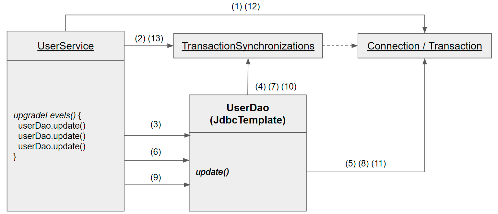

# 서비스 추상화

 + 스프링이 어떻게 성격이 비슷한 여러 종류의 기술을 추상화하고
 + 이를 일관된 방법으로 사용할 수 있는지 알아보자

## 각자의 책임을 갖는 클래스

 + 객체지향적인 코드는 다른 오브젝트의 데이터를 가져와 작업하는 대신
 + 데이터를 갖고 있는 다른 오브젝트에게 작업을 해달라고 요청
 + 오브젝트에게 데이터를 요구하지말고 작업을 요청하라는 것이 핵심

## 정리

 + 이번 챕터에서는 단일책임원칙에 의한 객체지향적인 코드 작성이 주를 이루고있다
 + Level 책임은 Enum에게 레벨 확인 작업 등 은 User에게등 .
 + 데이터를 요구하지 않고 메시지를 보내 작업만하는 객체지향 코드등
 + 리팩토링 과정에서 의미없는상수는 -> 명확하게 의미있는상수로 변환등을 다루고 있다.

# 트랜잭션 서비스 추상화

 + 1개 조회후 1개씩 업데이트 -> 1000개중 237개까지만되고 238때 전기가 나가면??

## 트랜잭션의 경계 설정

 + 애플리케이션 내에서 트랜잭션이 시작되고 끝나는 위치를 말함
 + 시작은 한곳 끝 지점은 두곳

    Connection c = dataSource.getConnection();
    
        c.setAutoCommit(false); // 트랜잭션 경계 시작
            try {
            PreparedStatement st1 =
            c.prepareStatement("update users ...");
            st1.executeUpdate();
            
            PreparedStatement st2 =
            c.prepareStatement("delete users ...");
            st2.executeUpdate();
            
            c.commit(); // 트랜잭션 경계 끝지점 (커밋)
            } catch(Exception e) {
            c.rollback(); // 트랜잭션 경계 끝지점 (롤백)
        }
    
    c.close();

## 트랜잭션 동기화

 + UserSevice에서 트랜잭션을 시작하기 위해 만든 CONNECtion 오브젝트를
 + 특별한 장소에 보관해두고 호출되는 Dao 의 메소드에서는 저장된 CONNECTION 을 사용하는것 
 + 영속성이랑 비슷한성질? 커밋은 되지않고 쿼리만날리고 한꺼번에 처리한다.
 + 예외가발생하면 모두 롤백시킨
 + 트랜잭션 동기화 저장소는 작업 스레드마다 독립적으로 Connection 오브젝트를 저장하고 관리해서
 + 다중 사용자  처리하는 서버의 멀티스레드환경에서도 충돌날 염려없음

    public void upgradeLevels() throws SQLException{
        // 트랜잭션 동기화 관리자를 이용해 동기화 작업을 초기화
        TransactionSynchronizationManager.initSynchronization();
        // DB 커넥션을 생성하고 트랜잭션을 시작한다.
        // 이후의 DAO 작업은 모두 여기서 시작한 트랜잭션 안에서 진행된다.
        // 아래 두 줄이 DB 커넥션 생성과 동기화를 함께 해준다.
        Connection c = DataSourceUtils.getConnection(dataSource);
        c.setAutoCommit(false);

        try {
            List<User> users = userDao.getAll();
            for (User user : users) {
                if (canUpgradeLevel(user)) {
                    upgradeLevel(user);
                }
            }

            c.commit();
        }catch(Exception e) {
            c.rollback();
            throw e;
        } finally {
            // 스프링 DataSourceUtils 유틸리티 메소드를 통해 커넥션을 안전하게 닫는다.
            DataSourceUtils.releaseConnection(c, dataSource);
            // 동기화 작업 종료 및 정리
            TransactionSynchronizationManager.unbindResource(this.dataSource);
            TransactionSynchronizationManager.clearSynchronization();
        }
    }

## 스프링의 트랜잭션 서비스 추상화

    public void upgradeLevels() {
    // 트랜잭션 시작
    TransactionStatus status =
    transactionManager.getTransaction(new DefaultTransactionDefinition());

        try {
            List<User> users = userDao.getAll();
            for (User user : users) {
                if (canUpgradeLevel(user)) {
                    upgradeLevel(user);
                }
            }

            transactionManager.commit(status);
        }catch(Exception e) {
            transactionManager.rollback(status);
            throw e;
        }
    }

 + 더 이상 jdbc란 특정 기수에 의존하지 않음 
 + DB연결 기술 , 데이터 액세스기술 , 트랜잭션 기술을 자유롭게 바꿀 수 있다.
 

