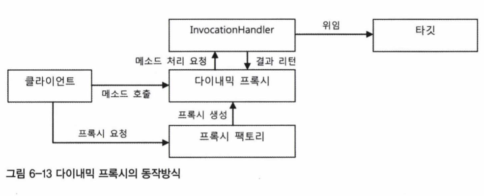
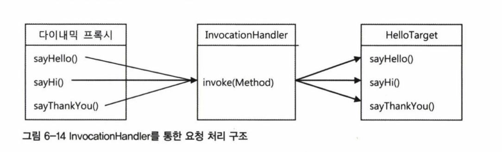

# AOP

 + 가장 대표적인 적용대상은 선언적 트랜잭션 기능
 + 트랜잭션 경계설정 기능을 좀 더 깔끔하게. 바꾼다

## 트랜잭션 코드의 분리 

    public void upgradeLevels() throws Exception {
        TransactionStatus status = this.transactionManager
        getTransaction(new DefaultTransactionDefinition());
        try {
            upgradeLevelsInternal(); // 메소드로 따로빼준다.
            this.transactionManager.commit(status);
        } catch (Exception e) {
            this.transactionManager.rollback(status);
            throw e;

            private void upgradeLevelslnternal () (
            List < User > users = userDao.getAll(); for (User user users) 
            {
                if (canUpgradeLevel(user)){
                (upgradeLevel(user);
        }
    }

 + 메소드 분리.
 

### DI를 이용한분리

 + Client 와 service가 너무강하게 결합되잇음
 + 트랜잭션 코드를 클래스 밖으로 일단 빼버리자! 
 + Service를 인터페이스를 두고 구현체를 두개를 두었다
 + 하나는 트랜잭션 경계기능 , 다른하나는 비즈니스로직 구현
 + 트랜잭션 경계설정 구현체에 비즈니스로직을 담은 구현체 하나 트랜잭션 매니저 2개를 주입받아
 + 코드를 완성시킴.

    public class UserServiceTx implements UserService {
    UserService userService;
    PlatformTransactionManager transactionManager;

    public void setTransactionManager(PlatformTransactionManager transactionManager) {
        this.transactionManager = transactionManager;
        public void setUserService (UserService userService){
            this.userService = userService;
            public void add (User user){
                t his.userService.add(user);
                public void upgradeLevels () {
                    TransactionStatus status = this.transactionManager
                            .getTransaction(new DefaultTransactionDefinition());
                    try {
                        userServiκce.upgradeLevels();
                        this.transactionManager.commit(status);
                    } catch (RuntimeException e) {
                        this.transactionManager.rollback(status);
                        throw e;

                    }
                }
            }

## DI 빈을 찾을 때

 + 보통 타입으로 찾지만 같은 타입이 2개?
 + 이름을 찾는다 
 + ex) userService;

## 트랜잭션 경계설정 코드 분리의 장점

  + 비즈니스 로직은 트랜잭션 기술 신경 안써도됨.
  + 테스트 만들기 쉬워짐.

## 테스트 대상 오브젝트 고립시키기

  + 현재 userService test는 DB,mailServer,PlatformTransactionManager등
  + 많은 것에 종속되어 테스트가 진행됨
  + 그래서 다른 외부에 것들에 의존하지않고 고립된 테스트를 만들자 (불필요한 시간, 어디서문제가 발생하는지 어려우니까..)
  + 우선 디비에 저장학고 상태가 변경되는 지확인하는 목오브젝트를 만들자

## 목 프레임 워크

 + 단위 테스트를 만들기 위한 필수적 존재.
 + 하지만 목 오브젝트 만드는건 번거로운 일.

### Mockito 프레임 워크

 + 구현없이 특정 인터페이스를 구현 가능함
 + UserDao mockUserDao =mock(UserDao.class); 
 + mock() Org.mockito.Matchers 클래스에 정의된 메서드, 로컬 메서드처럼 호출 ( 이해가되지않는 부분 ?)
 + when(mockUserDao.getAll()) .thenReturn(this .users); 
 + 호출 됫을때 users 리스트를 리턴하라는 선언

### 사용법

 + 인터페이스를 통해 목 오브젝트를 만들고.
 + 리턴값이 있으면 지정해 준다, 메서드가 호출되면 예외도 던지게 가능
 + 테스트 대상 오브젝트에 DI해서 목 오브젝트가 테스트 중 사용되도록 만듬
 + 테스트 대상 오브젝트를 사용 후에 목 오브젝트의 특정 메소드가 호출됬는지 어떤값을 가지고 몇 번 호출 됫는지 검증

### 예시코드

    @Test
    public void upgradeLevels() throws Exception {
    UserServiceImpl userServiceImpl = new UserServiceImpl();
    
    UserLevelUpgradePolicy userLevelUpgradePolicy = new UserLevelUpgradePolicyImpl();
    UserDao mockUserDao = mock(UserDao.class);
    when(mockUserDao.getAll()).thenReturn(this.users);
    
    userServiceImpl.setUserDao(mockUserDao);
    userServiceImpl.setUserLevelUpgradePolicy(userLevelUpgradePolicy);
    
    userServiceImpl.upgradeLevels();
    
    verify(mockUserDao, times(2)).update(any((User.class)));
    verify(mockUserDao).update(users.get(1));
    assertThat(users.get(1).getLevel(), is(Level.SILVER));
    verify(mockUserDao).update(users.get(3));
    assertThat(users.get(3).getLevel(), is(Level.GOLD));
    }

 

# 다이내믹 프록시와 팩토리 빈

## 프록시 프록시 패턴 , 데코레이터 패턴

 + 앞서 코드를 분리할때 UserServiceTx 만들었다
 + 부가기능 + 핵심기능으로 구현체 분리
 + 하지만 핵심 기능 클래스를 직접사용하면? 부가기능이 적용이 될수 없다.
 + 프록시패턴을 이용해보자 . 
 + 타깃과 같은 인터페이스를 구현했다는 것과 프록시가 타깃을 제어 할 수 있는 위치에 있는게 특징

### 프록시 패턴 목적

 + 클라이언트가 타깃에 접근하는 방법 제어
 + 타깃에 부가적인 기능을 부여해주기 위해 . 

### 데코레이터 패턴

 + 타깃에 부가적인 기능을 런타임 시 다이나믹하게 부여해주기 프록시를 사용하는  패턴
 + 동적으로 기능을 부가한다? 컴파일 시점 에서 코드상에는 어던 방법과 순서로
 + 프록시와 타깃이 연결되어 사용되는지 정해져 있지 않다는 뜻.
 + 데코레이터 패턴에서는 같은 인터페이스를 구현한 타겟과 여러 개의 프록시를 사용 가능함.
 + 여러개인 만큼 순서정하고 단계적으로 위임하는 구조가 생성됨 .

### 예시

 + InputStream / OutputStream 구현 클래스
 + UserServiceTx (UserService 타입 오브젝트를 DI받아 기능을 위임하지만 , 트랜잭션 경계설정 기능 부여)
 + 타깃의 코드를 손대지 않고, 클라이언트가 호출하는 방법도 변경하지 않은채 새로운 기능을 추가 할때 좋다.

## 프록시 패턴

 + 타깃에 대한 접근방법을 제한 하려는 목적
 + 기능이나 확장하거나 추가하지않지만 접근방식을 변경해 줌.
 + 타깃오브젝트는 당장 필요하지않거나 꼭 필요한 시점까지 오브젝트를 생성하지 않는 편이 좋다.

### 다이내믹 프록시 (++ 리플렉트)

 + 기존 프록시를 직접만들면 .. 
 + 타깃 인터페이스를 구현하고 위임 코드 작성하기 번거로움. 일일이 다 만들어 줘야되니..
 + 부가기능 코드가 중복될 가능성도 많다.

### 리플렉션

 + 리플렉션 기능을 이용하며 다이내믹 프록시 만들어 줌.
 + 자바의 코드자체를 추상화해서 접근하도록 만듬

    public void invokeMethod() throws Exception {
        String name = "Spring";
        Method lengthMethod = String.class.getMethod("length");
        System.out.println(lengthMethod.invoke(name));

    }

### 프록시 클래스

 + 다이내믹 프록시를 이용한 프록시 만들기.

    Hello proxiedHello =new HelloUppercase(new HelloTarget());--

 + 문제점 : 인터페이스 모든 메서드 구현 및 , 부가기능인 리턴값을 대문자로 바꾸는 기능이 모든 메소드에 중복..

### 다이내믹 프록시 적용

 + HelloUppercase를 다이내믹 프록시로 만들자 
 + 프록시 팩토리에 의해 런타임시 다이내믹하게 만들어지는 오브젝트

 + 타깃의 인터페이스와 같은 타입으로 만들어 짐
 + 부가기능은 따로 만들어 줘야함! -> 부가기능은 InvocationHandler를 구현한 오브젝트에 담음
 + public Object invoke(Object proxy, Method method, Object[] args '
 + 다이나믹 프록시 오브젝트는 클라이언트의 모든 요청을 리플렉션 정보로 변환해 InvocationHandler 구현 오브젝트의 invoke() 메소드에 넘김
 + InvocationHandler 구현 오브젝트가 타깃 오브젝트 레퍼런스를 가지고 있으면 리플렉션을 통해 간단한 위임코드 가능.
 + 

 + Hello 인터페이스를 제공하면서 프록시 팩토리에게 다이내믹 프록시를 만들어달라고 요청하면 Hello 인터페이스의 모든 메소드를 구현한 오브젝트를 생성해준다.
 + InvocationHandler 인터페이스를 구현한 오브젝트를 제공해주면 다이내믹 프록시가받는 모든 요청을 InvocationHandler의 invoke() 메소드로 보내준다. 
 + Hello 인터페이스의 메소드가 아무리 많더라도 invoke() 메소드 하나로 처리할 수 있다.

    public class UppercaseHandler implements InvocationHandler {

        private final Hello target;
    
        public UppercaseHandler(Hello target) {
            this.target = target;
        }
    
        @Override
        public Object invoke(Object proxy, Method method, Object[] args) throws Throwable {
            Object result =  method.invoke(target, args);
            if (result instanceof String) {
                return ((String) result).toUpperCase();
            }
            return result;
        }
    }

 + InvocationHandler를 사용하고 Hello 인터페이스를 구현하는 프록시

    Hello proxiedHello = (Hello) Proxy.newProxyInstance(getClass().getClassLoader(),
    new Class[]{Hello.class},
    new UppercaseHandler(new HelloTarget()));

 + 구현 

### 다이내믹 프록시 확장

 + 타깃의 종류에 상관없이 적용이 가능함
 + 위 Hello - >     private final Object target;

## 다이내믹 프록시를 위한 팩토리 빈

 + 동적 프록시 오브젝트는 스프링 빈 등록 방법 X
 + 문제제는 DI의 대상이 되는 다이내믹 프록시 오브젝트는 일반적인 스프링의 빈으로는 등록할 방법이 없다는 점이다. 
 + 스프링은 지정된 클래스 이름을 가지고 리플렉션을 이용해 해당 클래스의 오브젝트 만듬
 + 스프링은 내부적으로 리플렉션 API를 이용해 빈 정의에 나오는 클래스 이름을 가지고 빈 오브젝트 생성.
 + 클래스 자체를 내부적으로 동적으로 새로 정의해서 사용하기 때문에 동적 프록시 오브젝트는 생성 되지 안흥ㅁ 빈으로.
 + 오로지 Proxy 클래스의 newProxyInstance()라는 스태틱 팩토리 메소드를 통해 만듬

### 팩토리 빈

  + 스프링을 대신해서 오브젝트의 생성로직을 담당하도록 맏늘어진 특별한 빈
  + 스프링은 클래스 정보가지고 디폴트 생성자를 통해 오브젝트를 만드는 법이외에 다양한 방법 제공 
  + 대표적으론 팩토리 빈을 이용한 빈 생성 

    public interface FactoryBean<T> {
        @Nullable
        T getObject() throws Exception;
        @Nullable
        Class<?> getObjectType();
        default boolean isSingleton() {
        return true;
        }
    }

 + 스프링은 FactoryBean 인터페이스를 구현한 클래스가 빈의 클래스로 지정되면, 팩토리 빈 클래스의
 + getObject() 메소드를 이용해 오브젝트를 가져오고 , 이를 빈 오브젝트로 활용
 + 빈 오브젝트를 생성하는 과정에만 사용됨

### 다이내믹 프록시를 만들어 주는 팩토리 빈

 + 팩토리 빈을 사용해 동적 프록시 오브젝트를 스프링 빈으로 만들어 줄수 있따

## 프록시 팩토리 빈 방식 장점 한계

### 프록시 팩토리 빈의 재사용

 + 하나 이상의 팩토리 빈을 동시에 여러개 등록해도 상관 X -> 팩토리 빈이기 때문에 각 빈의 타입은 타깃 인터페이스와 일치한다.
 + 프록시 팩토리 빈을 이용하면 프록시 기법을 아주 빠르고 효과적으로 적용할 수 있다.

### 프록시 팩토리 빈 방식 장점

 + 다이내믹 프록시를 이용하면 타깃 인터페이스를 구현하는 클래스를 일일이 만드는 번거로움을 제거할 수 있다.
 + 하나의 핸들러 메소드를 구현하는 것만으로도 수많은 메소드에 부가기능을 부여 해줄 수 있으니 부가기능 코드의 중복 문제도 사라진다.

### 한계

 + 프록시를 통해 타깃에 부가기능을 제공하는 것은 메소드 단위로 일어나는 일이다. 하나의 클래스 안에 존재하는 여러개의 메소드에 부가기능을 한 번에 제공하는 건 어렵지 않게 가능했다.
 + 하지만 한 번에 여러 개의 클래스에 공통적인 부가기능을 제공하는 일은 지금까지 살펴본 방법으로는 불가능하다.

 + 하나의 타깃 오브젝트에만 부여되는 부가기능이라면 상관없겠지만, 트랜잭션과 같이 비즈니스 로직을 담은 많은 클래스의 메소드에 적용할 필요가 있다면
 + 거의 비슷한 프록시 팩토리 빈의 설정이 중복되는 것을 막을 수 없다.

## 스프링의 프록시 팩토리 빈

 + 스프링은 트랜잭션 기술과 메일 발송 기술에 적용했던 서비스 추상화를 프록시 기술에도 동일하게 적용하고 있다.
 + 스프링에선 일관된 방법으로 프록시를 만들어주는 추상 레이어를 제공하는데
 + 프록시 오브젝트를 생성해주는 기술을 추상화한 팩토리 빈 제공
 + ProxyFactoryBean 프록시를 생성해 빈 오브젝트로 등록해줌
 + 순수하게 프록시만 생성 작업 담당 , 프록시를 통해 제공해줄 부가기능은 별도의 빈에 둠.
 + ProxyFactoryBean이 생성하는 프록시에서 사용할 부가기능은 Methodlnterceptor 인터페이스를 구현해서 만든다. 
 + Methodlnterceptor는 InvocationHandler와 비슷하지만 한 가지 다른 점이 있다.
 + InvocationHandler의 invoke() 메소드는 타깃 오브젝트에 대한 정보를 제공하지 않는다. 따라서 타깃은 InvocationHandler를 구현한 클래스가 직접 알고 있어야 한다.
 + Methodlnterceptor의 invoke() 메소드는 ProxyFactoryBean으로부터 타깃 오브젝트에 대한 정보까지도 함께 제공받는다.
 + Methodlnterceptor는 타깃 오브젝트에 상관없이 독립적으로 만들어질 수 있다.

    @Test
    public void proxyFactoryBean() {
        ProxyFactoryBean pfBean =new ProxyFactoryBean();
        pfBean.setTarget(new HelloTarget());
        pfBean.addAdvice(new UpperCaseAdvice());
        
            Hello proxiedHello = (Hello) pfBean.getObject();
            assertThat(proxiedHello.sayHi("gunju"), is("HI GUNJU"));
    }

    private class UpperCaseAdvice implements MethodInterceptor {
                @Override
                public Object invoke(MethodInvocation invocation) throws Throwable {
                Object result = invocation.proceed();
                if (result instanceof String) {
                return ((String) result).toUpperCase();
                }
            return result;
        }
    }

## 어드바이스 : 타깃이 필요 없는 순수한 부가기능

 + Methodlnterceptor를 구현한 UppercaseAdvice에는 타깃 오브젝트가 등장하지 않는다. 
 + Methodlnterceptor로는 메 소드 정보와 함께 타깃 오브젝트가 담긴 Methodlnvocation 오브젝트가 전달된다.
 + 타깃 오브젝트에 적용하는 부가기능을 담은 오브젝트를 스프링에서는 어드바이스라고 부름
 + ProxyFactoryBean은 인터페이스 타입을 제공받지도 않는다. 
 + ProxyFactoryBean에 있는 인터페이스 자동검출 기능을 사용해 타깃 오브젝트가 구현하고 있는 인터페이스 정보를 알아낸다. 
 + 그리고 알아낸 인터페이스를 모두 구현하는 프록시를 만들어준다.

### 포인트 컷

    @Test
    public void proxyFactoryBean() {
    ProxyFactoryBean pfBean = new ProxyFactoryBean();
    pfBean.setTarget(new HelloTarget());
    
          NameMatchMethodPointcut pointcut = new NameMatchMethodPointcut();
          pointcut.setMappedName("sayH*");
    
          pfBean.addAdvisor(new DefaultPointcutAdvisor(pointcut, new UppercaseAdvice()));
    
          Hello proxiedHello = (Hello) pfBean.getObject();
          assertEquals(proxiedHello.sayHello("Toby"), "HELLO TOBY");
          assertEquals(proxiedHello.sayHi("Toby"), "HI TOBY");
          assertEquals(proxiedHello.sayThankYou("Toby"), "Thank You Toby");
    }

 + 스프링의 ProxyFactoryBean 방식은 두 가지 확장 기능인 부가기능과 메소드 선정 알고리즘을 활용하는 유연한 구조를 제공한다.
 + 어드바이스 : 부가기능 제공
 + 포인트 컷 : 메소드 선정 알고리즘 , Pointcut 인터페이스를 구현해서 만듬
 + 어드바이저 = 포인트컷(메소드 선정 알고리즘)  + 어드바이스 (부가 기능)

### 어드바이스와 포인트컷의 재사용

 + ProxyFactoryBean은 스프링의 DI와 템플릿/콜백 패턴, 서비스 추상화 등의 기법이 모두 적용된 것이다. 
 + 그 덕분에 독립적이며 여러 프록시가 공유할 수 있는 어드바이스와 포인트컷으로 확장 기능을 분리할 수 있었다.

## 스프링 AOP

 + 부가기능의 적용이 필요한 타깃 오브젝트마다 거의 비슷한 내용의 ProxyFactoryBean 빈 설정 정보를 추가해주어야 함..

## 중복 문제의 접근 방법

 + : JDBC API  -> 템플릿 콜백 패턴 으로 해결
 + 프록시 클래스 코드 : 다이내믹 프록시라는 런타임 코드 자동 생성 기법을 이용
 + ProxyFactoryBean 설정 문제는 설정 자동 등록 기법으로 해결할 수 없을까?

## 빈 후처리기를 이용한 자동 프록시 생성기

 + 위에 단점을 해결하기위해 빈후처리기 사용!
 + DefaultAdvisorAutoProxyCreator 빈 후처리기를 등록하면, 스프링은 빈 오브젝트를 만들 때마다 후처리기에게 빈을 보낸다.
 + DefaultAdvisorAutoProxyCreator 는 빈으로 등록된 모든 어드바이저 내의 포인트컷을 이용해 전달받은 빈이 프록시 적용대상인지 확인한다.

 + 포인트컷 두가지 기능이 있음
 + MethodMatcher : 어드바이스를 적용할 메소드인지 확인
 + ClassFilter : 프록시를 적용할 클래스인지 확인

    public interface Pointcut {
    
        ClassFilter getClassFilter(); / 프록시를 적용할 클래스인지 확인해준다.
    
        MethodMatcher getMethodMatcher(); / 어드바이스를 적용할 메소드인지 확인해준다.
    
        Pointcut TRUE = TruePointcut.INSTANCE;
    
    }

### 포인트컷 테스트 

    public class DynamicProxyTest {
    
        @Test
        public void classNamePointcutAdvisor() {
            NameMatchMethodPointcut classMethodPointcut = new NameMatchMethodPointcut() {
                public ClassFilter getClassFilter() {
                    return new ClassFilter() {
                        @Override
                        public boolean matches(Class<?> clazz) {
                            return clazz.getSimpleName().startsWith("HelloT");
                        }
                    };
                }
            };
    
            classMethodPointcut.setMappedName("sayH*");
            checkAdviced(new HelloTarget(), classMethodPointcut, true);
    
            class HelloWorld extends HelloTarget {};
            checkAdviced(new HelloWorld(), classMethodPointcut, false);
    
            class HelloToby extends HelloTarget {};
            checkAdviced(new HelloToby(), classMethodPointcut, true);
        }
    
        private void checkAdviced(Object target, Pointcut pointcut, boolean adviced) {
            ProxyFactoryBean pfBean = new ProxyFactoryBean();
            pfBean.setTarget(target);
            pfBean.addAdvisor(new DefaultPointcutAdvisor(pointcut, new UppercaseAdvice()));
            Hello proxiedHello = (Hello) pfBean.getObject();
    
            if (adviced) {
                assertEquals(proxiedHello.sayHello("Toby"), "HELLO TOBY");
                assertEquals(proxiedHello.sayHi("Toby"), "HI TOBY");
                assertEquals(proxiedHello.sayThankYou("Toby"), "Thank You Toby");
            } else {
                assertEquals(proxiedHello.sayHello("Toby"), "Hello Toby");
                assertEquals(proxiedHello.sayHi("Toby"), "Hi Toby");
                assertEquals(proxiedHello.sayThankYou("Toby"), "Thank You Toby");
            }
        }
    }

### DefaultAdvisorAutoProxyCreator 적용

    public class NameMatchClassMethodPointcut extends NameMatchMethodPointcut {
    
        public void setMappedClassName(String mappedClassName) {
            this.setClassFilter(new SimpleClassFilter(mappedClassName));
        }
    
        static class SimpleClassFilter implements ClassFilter {
            private String mappedName;
    
            public SimpleClassFilter(String mappedName) {
                this.mappedName = mappedName;
            }
    
            @Override
            public boolean matches(Class<?> clazz) {
                return PatternMatchUtils.simpleMatch(mappedName, clazz.getSimpleName());
            }
        }
    }

    @Configuration
    public class WebConfiguration {
    ...
    
        @Bean
        public DefaultAdvisorAutoProxyCreator defaultAdvisorAutoProxyCreator() {
            return new DefaultAdvisorAutoProxyCreator();
        }
    
        @Bean
        public Pointcut nameMatchClassMethodPointcut() {
            NameMatchClassMethodPointcut pointcut = new NameMatchClassMethodPointcut();
            pointcut.setMappedName("upgrade*");
            pointcut.setMappedClassName("*ServiceImpl");
            return pointcut;
        }
    
        @Bean
        public DefaultPointcutAdvisor testTransactionAdvisor() {
            return new DefaultPointcutAdvisor(this.nameMatchClassMethodPointcut(), new TransactionAdvice(new DataSourceTransactionManager(this.dataSource())));
        }
    
        ...
    }

 + 이렇게 하면 DefaultAdvisorAutoProxyCreator 친구가 Advisor 인터페이스를 구현한 것을 모두 찾아
 + 생성되는 빈에 어드바이저의 포인트컷을 적용해보면서 프록시 적용 대상을 선정한다.
 + 하지만 특정 상황에 exception 을 발생하는 테스트를 만들기가 어려워져서, TestUserService 를 구현했다.

    public class TestUserLevelUpgradePolicy extends UserLevelUpgradePolicyDefault {
    
        private String id;
    
        public TestUserLevelUpgradePolicy(UserDao userDao) {
            super(userDao);
            this.id = "id4";
        }
    
        @Override
        public void upgradeLevel(User user) {
            if (user.getId().equals(this.id)) {
                throw new TestUserServiceException();
            }
    
            super.upgradeLevel(user);
        }
    }

    @Configuration
        public class WebConfiguration {
        @Bean
        public UserService testUserService() {
        return new UserServiceImpl(this.userDao(), new TestUserLevelUpgradePolicy(this.userDao()));
        }
    }

    @SpringBootTest(classes = Application.class)
    class UserServiceTest {
    
        ...
    
        @Autowired
        private UserService testUserService;
        
        ...
    
        @Test
        public void upgradeAllOrNothing() {
            for (User user : users) {
                userDao.add(user);
            }
    
            Assertions.assertThrows(TestUserServiceException.class, testUserService::upgradeLevels);
            checkLevelUpgraded(users.get(1), false);
        }
    }

## 포인트컷 표현식을 이용한 포인트 컷 

 + 포인트컷 지시자중 가장 대표적으로 사용된 것은 execution()
 + excution([접근제한자 패턴] 리턴값타입패턴 [클래스타입패턴.]메소드이름패턴 (파라미터타입패턴 | "..", ...)) [throws 예외 패턴])

    public class PointcutTest {
    
          @Test
          public void methodSignaturePointcut() throws SecurityException, NoSuchMethodException {
              AspectJExpressionPointcut pointcut = new AspectJExpressionPointcut();
              System.out.println(Target.class.getMethod("minus", int.class, int.class));
              pointcut.setExpression("execution(public int "
                      + "learningtest.pointcut.Target.minus(int,int) "
                      + "throws java.lang.RuntimeException)");
    
              assertTrue(pointcut.getClassFilter().matches(Target.class)
                      && pointcut.getMethodMatcher().matches(Target.class.getMethod("minus", int.class, int.class), null));
    
              assertFalse(pointcut.getMethodMatcher().matches(Target.class.getMethod("plus", int.class, int.class), null));
    
              assertFalse(pointcut.getClassFilter().matches(TestBean.class));
    
          }
    }

### 적용해보기

    @Configuration
    public class WebConfiguration {
    ...
    
        @Bean
        public Pointcut pointcut() {
            AspectJExpressionPointcut pointcut = new AspectJExpressionPointcut();
            pointcut.setExpression("execution(* *..*ServiceImpl.upgrade*(..))");
            return pointcut;
        }
    
        ...
    }

 + 포인트컷 표현식을 사용하면 코드 설정 단순해짐 -> 문자열로 표현되기에 런타임 시점까지 검증 어려움
 + 다양한 테스트 활용해 거증 필요
 + 포인트컷 클래스 타입 패턴은 상속 클래스 / 구현 인터페이스 모두 바라보고 선정

# AOP 란 무엇인가?

 + 관점 지향 프로그래밍.
 + 관점 이란 ? 부가 기능 모듈
 + 그 자체로 애플리케이션 핵심 기능은 담고있지만, 중요한 한가지 요소 핵심 기능에 부가되어 의미를 갖는 특별한 모듈
 + 부가기능을 정의한 어드바이스와 어드바이스를 어디에 적용할 지 결정하는 포인트컷을 함께 갖고 있다.
 + 어드바이저는 단순한 형태의 관점.

## AOP 적용 기술

 + 프록시를 이용한 AOP
 + 스프링 AOP 는 프록시 AOP 방식을 사용한다고 볼 수 있다.

 + 바이트 코드 생성과 조작을 통한 AOP
 + 타겟 오브젝트를 뜯어 고쳐서 부가 기능을 직접 넣어줌 -> 컴파일된 타깃의 클래스 파일 자체를 수정하고나 JVM 로딩시점을 가로채서 바이트코드를 조작

## AOP 용어

 + 타깃 : 부가기능을 부여할 대상
 + 어드바이스: 부가기능을 담은 모듈
 + 조인 포인트 : 어드바이스가 적용될 수 있는 위치 , 스프링 프록시 AOP에서는 메소드 실행 단계
 + 포인트컷: 어드바이스를 적용할 조인 포인트를 선별하는 작업 또는 기능을 정의한 모듈
 + 프록시 : 클라이언트와 타깃 사이에 투명하게 존재하면서 부가기능을 제공하는 오브젝트
 + 어드바이저 : 포인트컷과 어드바이스를 가지고 있는 오브젝트
 + 스프링 AOP에서만 사용되는 용어
 + 에스펙트 : AOP의 기본 모듈 / 한개 또는 그 이상의 포인트컷과 어드바이스의 조합

## 트랜잭션 속성

 + progation , isolation , level, timeout ... readOnly ..

### 트랜잭션 전파

 + 이미 진행 중인 트랜잭션이 있을 때 또는 없을 때 동작 결정 방식

 + PROPAGATION_REQUIRED : 진행 중인 트랜션이 없으면 새로 시작하고 , 이미 시작된 트랜잭션은 참여함 / default
 + PROPAGATION_REQURES_NEW : 항상 새로운 ㅡ랜잭션을 시작
 + PROPAGATION_NOT_SUPPORTED: 트랜잭션 없이 동작, 진행 중인 트랜잭션이 있어도 무시

### 격리 수준

 + 기본적으로 DB에 설정 되어있지만, JDBC 드라이버나 DataSource등에서 재설정 가능
 + 필요하다면 트랜잭션 단위로도 가능
 + Default는 ISOLATION_DEFAULT : 이는 DataSource에 설정되어있는 디폴트 격리수준을 따름 

### 포인트컷과 트랜잭션 속성의 적용 전략

 + 트랜잭션 포인트컷 표현식은 타입 패턴이나 빈 이름 허용
 + 공통된 메소드 이름 규칙을 이용해 최소한의 트랜잭션 어드바이스와 속성 정의
 + 프록시 방식 AOP는 같은 타깃 오브젝트 내의 메소드 호출할 때는 적용되지 않는다.

## 애노테이션 트랜잭션 속성과 포인트 컷

 + 스프링은 @Transactional을 적용할 때 4 단꼐의 대체(Fallback)정책으 ㄹ이용함.
 + 메소드 속성을 확인할 때 타깃 메소드 ,타깃 클래스 ,선언 메소드 , 선언타입의 순서에 따라서
 + @Transactional이 적용 됐는지 차례로 확인하고 가장 먼저 발견되는 속성 정보를 사용하게 하는 방법
 + ex)  가장 먼저 타깃의 메소드에 @Transactional이 있는지 확인하고, 있으면 이를 사용하고 없으면 다음 대체 후보인 타깃 클래스에 부여된 @Transaction 애노테이션을 찾는다.
 + 끝가지 발견 안돼면? 트랜잭션 적용대상이 아님

## 트랜잭션 지원 테스트

 + AOP를 이용해 코드 외부에서 트랜잭션의 기능을 부여해주고 속성을 지정할 수 있게 하는 방법은 선언적 트랜잭션이라고 함.
 + 반대로, TransactionTemplate 나 개별 데이터 기술의 트랜잭션 API를 사용해 직접 코드안에서 사용하는 방법은 프로그램에 의한 트랜잭션 programmatic transaction 이라고 한다.
 + 특별한 경우가 아니면 선언적 트랜잭션. 

### 트랜잭션 동기화 테스트

    @Test
    public void transactionSync() {
    userService.deleteAll();
    
        userService.add(users.get(0));
        userService.add(users.get(1));
    }

    
    @Test
    public void transactionSync() {
    
        DefaultTransactionDefinition defaultTransactionDefinition = new DefaultTransactionDefinition();
        TransactionStatus txStatus = transactionManager.getTransaction(defaultTransactionDefinition);
    
        userService.deleteAll();
        userService.add(users.get(0));
        userService.add(users.get(1));
    
        transactionManager.commit(txStatus);
    }

 + 위 코드 와 같으면 3개의 트랜잭션이 만들어졌을걸 : 전파속성이 Required 이므로
 + 세 개의 메소드 속성이 REQUIRED 므로 미리 시작된 트랜잭션이 있다면 하나의 트랜잭션에서 수행될 것이다.

### 트랜잭션 동기화/롤백 검증 테스트

    @Test
    public void transactionSync() {
    userDao.deleteAll();
    assertEquals(userDao.getCount(), 0);
    
        DefaultTransactionDefinition defaultTransactionDefinition = new DefaultTransactionDefinition();
        TransactionStatus txStatus = transactionManager.getTransaction(defaultTransactionDefinition);
    
        userService.deleteAll();
        userService.add(users.get(0));
        userService.add(users.get(1));
    
        assertEquals(userDao.getCount(), 2);
    
        transactionManager.rollback(txStatus);
    
        assertEquals(userDao.getCount(), 0);
    }

 + 롤백테스트는 DB 작업이 포함된 테스트가 수행돼도 DB에 영향을 주지 않기 때문에 장점이 많다.
 + 테스트코드의 @Transactional 은 디폴트 속성이 동일하나, 테스트가 끝나면 자동으로 롤백된다.
 + 강제롤백을 원하지 않을 경우 @Rollback 이라는 어노테이션을 사용해야 한다.

 + @TransactionalConfiguration 을 사용하면 롤백에 대한 공통 속성을 지정할 수 있다.
 + 클래스레벨에서 디폴트 롤백 속성을 false 로 해두고, 테스트 메소드 중 일부 롤백을 적용하고 싶을 때 @Rollback 을 부여해줘도 된다.
 + @NotTransactional 을 테스트 메소드에 부여하면 클래스 레벨의 @Transactional 설정이 있어도 트랜잭션을 시작하지 않는다.
 + deprecated 되어서 이제는 전파속성을 사용한다.
 + @Transaction(propagation=Propagation.NEVER)+ 

 + 테스트 내에서 트랜잭션을 제어할 수 있는 애노테이션을 잘 활용하면 DB가 사용되는 통합테스트를 만들 때 매우 편리하다.

